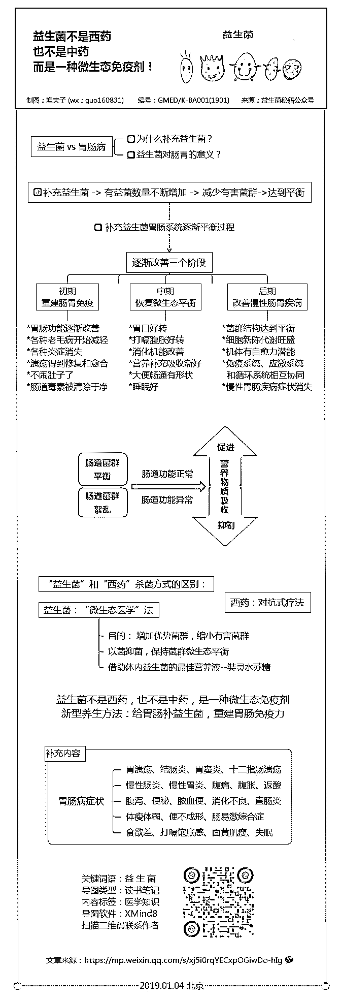
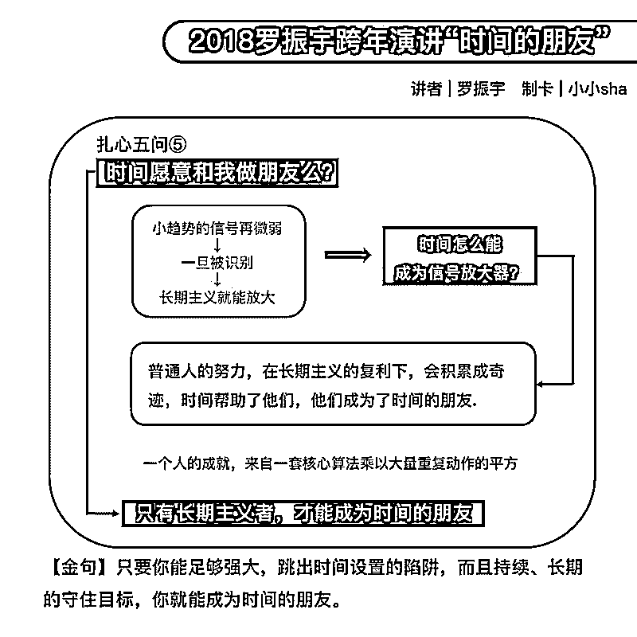
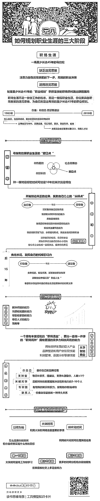
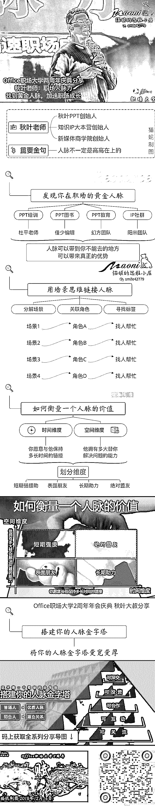
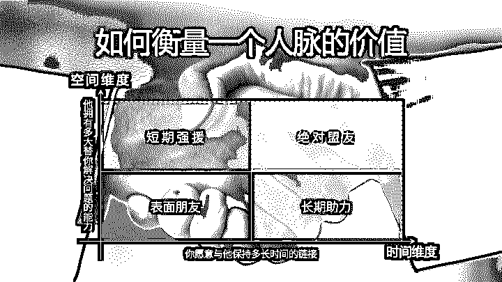
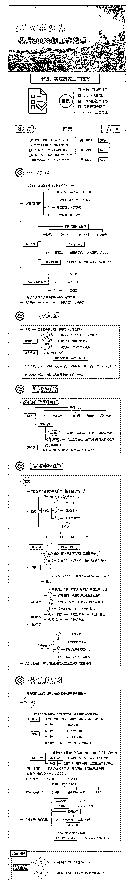

# 思维导图妙思屋知识星球整理 2019 第二部分

# 197\. 今天刚刚加入，第 1

今天刚刚加入，第 1 天，我要打卡的内容是制图要求，祝大家新年快乐，猪年大吉，诸事顺利

评论：

小猫妮 | 探索自我* : 我之前在千聊分享的笔记呀，用心啦！

# 198\. 情绪可调节，情绪不

情绪可调节，情绪不分好坏

评论：

# 199\. 年前一弹：如何辞职

年前一弹：如何辞职？

这应该是很多正着手跳槽的职场人都关注的吧。

具体到辞职这件事来说：

一个内心强悍的人如果决定了要辞职，那就一定能辞得掉。

一个努力的人则会努力做辞职前的各种准备。

一个关系达人则会尽量维护好和即将分手的东家之间的关系。

态度坚决、准备充分和言语和气，这就是辞职这件事要把住的三个原则。

评论：

# 200\. 🌾 刚在悟

🌾 刚在悟空答完《有哪些高效的学习方法》，接着做了一份思维导图可视化。

🌾 越来越喜欢导图的结构思维，其实这也是一种很好的学习方式。

评论：

# 201\. 分

分享猫妮在摩西老师脑图公会的一版自我介绍

明线：自我介绍

暗线：价值思维

提醒：考虑事情不能只考虑一步

评论：

做最好的自己 : 我也要做一个[呲牙]

小猫妮 | 探索自我* : 建议不同的群，用不同的自我介绍。

洛羽｜对标系统 : 这也是 xmind 做的吗

小猫妮 | 探索自我* : 对的，XMind ZEN，8 也可以

郑小佳 : 标签一栏，上下的括弧是概要吗？我尝试了下加不上。用联系线又做的不太好看

小猫妮 | 探索自我* : 是概要，隐藏了一些主题线条

# 202\. 自动化思维

自动化思维的误区。

评论：

小猫妮 | 探索自我* : 可以考虑根据这篇图文，做一个自己整理情绪的模型哦

杨不是羊咩 : 嗯嗯，谢谢猫妮的建议

# 203\.

30 分钟极速制图系列

摩西老师：集体心流的分享

结构化笔记↓

190125-摩西老师：集体心流的分享-小猫妮

[190125-摩西老师：集体心流的分享-小猫妮](https://mubu.com/doc/3S57ry7Iog)

评论：

# 204\. 学习储君老师的 E 站

学习储君老师的 E 站到底课程快要进入尾声，为自己的坚持记下一笔[愉快]

评论：

# 205\. “越是不懂目标管理

“越是不懂目标管理的人，越会去关注时长目标、越会考虑自己的月周日目标执行情况。”直戳要害!

评论：

# 206\.

评论：

蚂蚁牙黑 2016 : 哇好喜欢这个排版

# 207\. 猫妮的闭关将于 1 月

猫妮的闭关将于 1 月 31 日结束

破而后立，打碎重组的我

会和你一起交流自己新的收获和行动[爱心]

评论：

张辉 : 不容易啊

蚂蚁牙黑 2016 : 期待全新的猫妮～

# 208\. 陪儿子复习完成的思

陪儿子复习完成的思维导图

评论：

Miya 茶 : 宝妈一枚，加个好友交流吧 vx:miyacha

# 209\. 化繁为简<

化繁为简

知识整合

评论：

蚂蚁牙黑 2016 : 表情包好可爱

杨不是羊咩 : 谢谢老乡喜欢[玫瑰]

# 210\. 目标的作用从来不是

目标的作用从来不是单纯的实现，高级的目标具有指导激励作用，顶级目标是验证假设，并完善个人认知体系。

评论：

# 211\. 将《加速》

将《加速》里的知识共享知识和费曼学习法，RIA 便签读书法做了一个整合。

评论：

# 212\. 无论是投资，学习

无论是投资，学习 ，建立自己 IP 其实 步骤都差不多 ，所以也是为什么 ，会有 通才的说法 ，当找到那门路 ，其实你能通向很多不同的地方

这一套投资思维的分享是我的富朋友教我的 ，也是他多年来实操经验所得

心理学大师 罗哲斯 （ Carl Rogers ）曾说过 “你想改变自己，那你先要面对自己，接受自己”。

哲学家 苏格拉底也曾说 ： 我只知道一件事 ： 那就是我什么都不知道

从内出发 先了解了自己 才能看清外面

评论：

# 213\. 张萌《加速

张萌《加速》第二章认知管理读书笔记

评论：

# 214\. 生意不好肯

生意不好肯定是价格问题，价格问题不一定只能降价：不同的人有不同的购买能力，低价可以刺激更多的人购买，高价可以更好地提高利润。

评论：

# 215\. 与其乱学，

与其乱学，不如好好学习下目标管理，找到自己真正需要的。

评论：

# 216\. 叶小鱼新书

叶小鱼新书《文案变现》思维导图分享

评论：

# 217\. 孙瑞雪老师的《爱和

孙瑞雪老师的《爱和自由》，用导图的方式，读书果真记忆深刻。

评论：

小猫妮 | 探索自我* : 可以试着把图挡住，一步步还原哦。

# 218\. 为电视台公号制作的

为电视台公号制作的导图 《家庭教育的 4 个法则》

评论：

Lantis : 感觉配图会更佳，特别最后性格类型

Miya 茶 : 怎么配图？我不会。汗汗

Miya 茶 : 谢谢真挚的建议

# 219\. 2018 年 10 月 2

2018 年 10 月 24 日加入了小猫妮的知识星球。

2018 年的最后几天，给了自己一个新目标：连续 100 天，每天画一张图。

（不仅限于严格意义上的思维导图。）

第一步的要求：

【1】第一天做图就给每一张图做了编号，以便日后存档查询方便（数据库管理）。

【2】做图内容基于有据可查的真实的图书和文章，分为很多系列。（每张图的内容都有原文出处链接或者书名）

【3】不同系列会相互交错发圈。

【4】遵循原则：忠于原文，内容和结构为首要考虑，其次才是美观和排版。

【5】最终目的：一张图学到至少一个知识点。

【6】除少数的几张图是之前做的，现在稍加修改编入系列发圈，基本上所有图片是当天早上或者前一天做的。（每天早上 5:00-6:00 微信朋友圈发图）

【7】接下来努力的方向：内容较简单的图尽量在 30 分钟内完成。

现在每天抽出 1.5-2 个小时画一张图。

很高兴可以得到大家的建议。

（抱歉，没有经验，还没编辑完，一不小心就发出去了两次。）

评论：

# 220\. 选择困难症

选择困难症患者的良药-六顶思考帽。

评论：

南思嘉木 L. : 非常清晰，已收藏

杨不是羊咩 : 谢谢[玫瑰]

# 221\. #学习笔记#

#学习笔记#

评论：

温志坚 : 通俗易懂，有自己的见解，赞

# 222\. 今日分享赞

今日分享赞美模型以及批评模型，赞美模型尤其实用[嘿哈]

评论：

# 223\. Excel 使用技巧

Excel 使用技巧之排序筛选及查找替换

评论：

做最好的自己 : 其实，这种软件操作的可以不用做成导图的，太费时间。

蚂蚁牙黑 2016 : 我做这个图的除了自己巩固以外，还有发出去链接更多人的目的

# 224\. 笔记侠华东区年会知

笔记侠华东区年会知识分享思维导图分享给大家。[呲牙][呲牙][呲牙]

评论：

小猫妮 | 探索自我* : 倩姐一言不合就出去现场圈粉啦~~

许倩 : [调皮][调皮][偷笑]向猫妮靠拢

# 225\. #学习笔记

#学习笔记

错误思维模式和思维误区，你中了几招?

评论：

# 226\. 睡前来点模

睡前来点模型卡片吧～

评论：

蚂蚁牙黑 2016 : 好棒，请问这是用什么工具做的呢？谢谢

猫小呆 : ppt 哈哈

蚂蚁牙黑 2016 : 哈哈看来下一步我也要学学 ppt 啦

Miya 茶 : 这是什么做的呀

猫小呆 : ppt 啊

氧元素。 : 我猜应该是竖版的 PPT 做的吧

# 227\. 认识 excel

认识 excel

评论：

小猫妮 | 探索自我* : 可以带上 excel 的标签哦~

蚂蚁牙黑 2016 : 修改好啦，谢谢猫妮提醒[愉快]

# 228\. 📚 《麦肯锡教

📚 《麦肯锡教我的写作武器》-高杉尚孝

从金字塔原理到 SCQOR 故事展开法，书里有干货，但写得略繁琐，读起来比较吃力。

评论：

# 229\. 费曼技巧说

费曼技巧

说人话，才是学霸的最高境界

把学到的东西用自己的话，不用任何行话和术语，讲给 80 岁的老人听或 8 岁的小孩子听，如果他们能听明白，证明你就真的学到了，学懂了。

评论：

# 230\. 我的第一张竖屏导图

我的第一张竖屏导图，传上来记录自己的进步！

评论：

小猫妮 | 探索自我* : 踏出第一步，是一切的开始[强]

# 231\.

评论：

# 232\. 避免空白和枯燥文字

避免空白和枯燥文字的小技巧，加上可爱的表情包吧。

有趣又有干货[嘿哈]

评论：

Miya 茶 : 可不可以交交我插入小图标的方法[害羞]

# 233\. 19011

190110 猫妮的笔记工具协作（待更新解释+成文）

评论：

Miya 茶 : 工具达人[微笑]厉害👍

玉麒麟 Kylin : xmind zen 与 xmind 8 一起使用是什么原因？可否仅使用其中一个？

小猫妮 | 探索自我* : 可以只使用一个，体验之后选择自己更适应的就好

猫小呆 : Markdown 的用处是什么呀 好像里面的功能 Xmind 自身都带了

小猫妮 | 探索自我* : 串联很多工具的底层编程语言，很容易上手，应用程度很广。

# 234\. 新的尝试:将莎莎小

新的尝试:将莎莎小姐姐的晶体结构模型和思维导图结合起来制图。

5Q 思维训练法分享给大家[嘿哈]

评论：

# 235\. 推荐个工具

推荐个工具，亲测有用，屏幕实时显示按键操作：carnac；Windows 系统。

官网：[Carnac](http://code52.org/carnac/)

评论：

# 236\. 我也推荐几款常用工

我也推荐几款常用工具吧

截图贴图 snipaste

搜索神器 Everything

搜索黑马 火莹酱

剪贴板 ditto

卸载神器 geek

远程协助 TeamViewer

都是官方免费的，大家需要可以自行百度下载，全部支持 windows，mac 版未测试。

#工具推荐#

评论：

# 237\. 天若 ocr ，wi

天若 ocr ，win 一键截图-ocr 软件

上视频课，做笔记，超级好用啊

[天若 OCR 更新网盘 _ 免费高速下载|百度网盘-分享无限制](https://pan.baidu.com/s/1P2xb9kBwX1gj8j2_APivZw#list/path=%2F)

评论：

# 238\. 2

2018 年万人罗友跨年导图协作精选作品

偶尔试着挑战极限，可以突破原来以为的舒适区。

蔡垒磊老师：资本寒冬，我们能做些什么

Scalers 老师：「持续行动&新年计划」

方军老师：如何认识区块链技术的过去、现在和未来

Spenser 老师：写作是最好的自我投资

火火老师：新媒体行业的整体趋势及个人成长

赵周老师：这样读书就够了，升级你的学习力

评论：

# 239\. 2

2018 年万人罗友跨年导图协作精选作品

Peter 老师：如何利用个人 ip 成功的玩转职场

摩西老师：如何用最简单的图讲清楚最复杂的道理

李忠秋老师：思考力，决定你的人生上限

徐志斌老师：小程序和社交社群的下一步 @宁馨

评论：

# 240\. 2019NO03.

2019NO03.制图时间一小时

评论：

# 241\. 复盘 《人人都需要

复盘 《人人都需要的管理术》时间管理||学会借力 每天多出 3 小时

评论：

小猫妮 | 探索自我* : 赞，miya 越来越能找到自己的风格了，注意是 管理术哦，标题一定要注意~ 可以选择修改

Miya 茶 : 嗯嗯，发的太快了没看到，马上改。

日后必需认真仔细！[愉快][愉快]

# 242\. “时间的朋友”系列

“时间的朋友”系列思维导图

评论：

# 243\. Kindle 十个

Kindle 十个最实用的功能

评论：

# 244\. 思维导图工作台的搭

思维导图工作台的搭建也是思维导图一种应用。

评论：

小猫妮 | 探索自我* : 可以考虑带上杨咩导图的标签哦：）

杨不是羊咩 : 好的，谢谢猫妮建议

# 245\. 头脑风暴法＆创意法

头脑风暴法＆创意法

评论：

# 246\. 汤君健老师的得到精

汤君健老师的得到精品课《有效提升你的职场价值》分享~

评论：

# 247\. 又完成了一件大作品

又完成了一件大作品，这结构组合的还可以吗？一张图让你了解 XMind

评论：

# 248\. 厉玲老师零售 35 讲

厉玲老师零售 35 讲，零售管理的最高级别在于培养店长。

加入好久都没有晒作品，实在是觉得大家都太棒了，自己不好意思上图[害羞]，欢迎大家多多指教！

评论：

# 249\. RCA 模型，PDC

RCA 模型，PDCA 模型和 F&O 模型。

听内部人士说:思维训练课程的难度高老师削减了 2/3，原来版本该有多难?

评论：

# 250\.

评论：

# 251\. 《复盘：把经验转化

《复盘：把经验转化为能力》…

评论：

蛋蛋 : 最后不完整嘛

晶 : 已经修改了[呲牙]

# 252\. 价值思维，

价值思维，个人成长必备模型。

[【学习笔记】个人成长必备模型:价值思维](https://mubu.com/doc/explore/18284)

评论：

# 253\. 🍃刻意练习，日更导

🍃刻意练习，日更导图

评论：

淡然 : 好棒的图！有种想要自已做一张图的冲动！我要学起来！

# 254\. 导图＋卡片

导图＋卡片

时间的朋友 大工程终于结束

来伸个懒腰

用还原思维作图

别看图三复杂

逻辑是图四

做完图，思维简直是来了个大拉伸

图 5.6.7.8.9 知识卡片

评论：

做最好的自己 : 图 2 图 3 是用 XMind 做的？感觉做起来很复杂啊，流程图软件可能会方便些吧。

小小 sha : 用最熟悉的软件。不复杂

# 255\.

评论：

# 256\. 小能熊思维训练课程

小能熊思维训练课程第一和第二课导图更新。

评论：

# 257\. 【每日一图】

【每日一图】

评论：

# 258\.

评论：

# 259\. 昨天的导图的践行清

昨天的导图的践行清单，用起来才是读书的目的。

配色方面还需要增强，结构很简单，用时 30 分钟完成。

评论：

# 260\. 个人技能树 思

个人技能树 思维导图

PPT 排版 8 大神奇法则，让年终总结大放异彩。

上一次的内容讲了年终总结的写作技巧，如何将一份好的年终总结在年终总结大会上呈现的更加完美。就需要汇报 PPT 的完美呈现。

这次就为你到来 PPT 排版不可被忽视的 8 大神奇法则。

除了 PPT 的排版技巧还为你准备了一份大大的彩蛋！！往下看👀

彩蛋 1

彩蛋 2 [ppt 插件库.rar_ 免费高速下载|百度网盘-分享无限制](https://pan.baidu.com/s/187-IlMUIRDKKKTeq0CwjGQ) [9999 套 PPT 模板 _ 免费高速下载|百度网盘-分享无限制](https://pan.baidu.com/s/1q-7HUGoI1ujqxHPc9DvlRQ)

评论：

# 261\. 有一段时间没做思维

有一段时间没做思维导图了，19 年第一张思维导图——《抖音运营全攻略》分享

内容来源于：策神笔记

评论：

壬水 : 欢迎群殴

# 262\. 新年第一张导图完成

新年第一张导图完成啦！开启第一本书的阅读。

电脑导出图片失败，用手机导出的，再用电脑调整了格式，发现手机和电脑有色差诶。

评论：

# 263\. 耗时 12 小时终于完

耗时 12 小时终于完成了【2018 时间的朋友罗友万人跨年趴演讲】的完整版导图

评论：

ACE : 华丽是你的座右铭啊[呲牙]

Miya 茶 : 标题中，连接线们，由粗变细怎么做到滴[害羞]

【素味平生】 : 我明天截图发您看

【素味平生】 : 谢谢鼓励

Miya 茶 : 嗯嗯，谢谢

# 264\. 鸽派的进阶修炼

鸽派的进阶修炼

如何拯救一个害羞者的灵魂？

「分享这一张也和我曾经的经历有关，希望能给你带来思考」

害羞者在怕什么？害羞者一般都会被挫败感、担忧和孤独所困扰，他没法冷静地思考，也难以和别人进行交流。

这种最侵蚀和折磨我们内心的情感，说起来又特别简单，害羞不需要什么复杂科学定义，害羞就是特别怕人，有人在场就会特别不自在。

害羞者最担心的其实是三种人：

陌生人（想象中的观众）；

手握权力的人（评委）；

异性（对手戏）。

很像一个奥斯卡颁奖现场对不对，我们经常说人生在世全凭演技，这是有道理的。

评论：

# 265\. 新年第一图

新年第一图：时间的朋友 2018 年罗振宇跨年演讲思维导图。

评论：

Miya 茶 : 插入的贴画是自己下载的吗？怎么插入呀[害羞][害羞]

# 266\. 新年第一张

新年第一张图图，赋能你的年终汇报。

年终总结怎么写？才能实现加薪和升迁！

评论：

# 267\. 新年第一天一张导图

新年第一天一张导图，一碗满满的鸡汤开启新的一年。2019 都要加油啊💪！

评论：

# 268\. 学习笔记 元旦快

学习笔记 元旦快乐~新年彩蛋！

价值千元的【营销增长之道】思维导图分享给大家~

评论：

# 269\. 🌾20181229

🌾20181229 猫妮 XMind 线上分享会【如何制作自我介绍】学习笔记

评论：

# 270\. 晚上听了樊

晚上听了樊登读书会的访谈，花 20 分钟做的极简版思维导图，带上一个可爱表情让自己开心点[耶]

明天上最后一天班了，加油💪

评论：

# 271\. 导图配卡片🏠

导图配卡片🏠

最近一直觉得一个人的职业生涯仅仅只有短暂的 20 来年，因为 35 岁之后，好像就不知道在职场该如何爬坡，但是如果一开始拥有远见的思维，把工作建立在热爱的生活上，自己的职业生涯就可以长达至少 45 年的呢。

评论：

【素味平生】 : 太完美了

# 272\. 猫妮分享“如何用竖

猫妮分享“如何用竖屏思维导图做好自我介绍”

结构化笔记：

[005-如何用竖屏思维导图做好自我介绍](https://mubu.com/doc/3EiKrFcCzg)

评论：

# 273\. 知识卡片分享👉

知识卡片分享👉

上篇：知识管理信息流

下篇：构建知识创造系统

评论：

慕哲 : 非常棒的内容和设计

# 274\. 一张图教会大家如何

一张图教会大家如何使用幕布

评论：

# 275\. 🗣 👏 🎁 🎄 🌱

🗣 👏 🎁 🎄 🌱 ✨ 💑 ✌ 👊

🍀 再晚我也会兑现我的承诺，【晨间日志】模板制作完成，2019 我们一起打卡如何？

🌾惊喜总是在不经意的时候出现，2019 我们彼此赋能#思维导图模板设计

评论：

ACE : 这个水印加的太大了

【素味平生】 : 对对对，下次注意，谢谢提醒

# 276\. 2018.12.2

2018.12.28

睿爸分享“思维导图学习实践经历与线下分享复盘总结”

结构化笔记：

[002-思维导图学习实践经历与线下分享复盘总结](https://mubu.com/doc/1g-_C_HMFg)

评论：

【素味平生】 : 紫色好看

蚂蚁牙黑 2016 : 我也是看了之前星球的小伙伴用了这个风格，觉得很好看

# 277\. 【知识卡片模板】

【知识卡片模板】

评论：

# 278\. 猫叔分享<

猫叔分享

制图 1.5 小时

对排版方面倦怠了

最近在思考我作图到底要实现什么目标

评论：

小猫妮 | 探索自我* : 想清楚自己想要的是什么很重要，会在行动中找到答案，我也经历过这个过程。

南思嘉木 L. : 谢谢猫妮！答案已经有了，有时间和猫妮好好聊聊

# 279\. #商业分析# #学

#商业分析# #学习笔记#

来自 L 先生说的最新公众号推文，写的超级好👍

更新版更改，不断迭代💪

评论：

# 280\. 🌴2 小时就为了创新

🌴2 小时就为了创新个排版，值得吗？

评论：

许倩 : 很赞哦

分类清晰，引人注目，有启发

小猫妮 | 探索自我* : 想知道一张图的质量，分享给不同的人来看。另外不管如何都不要熬夜制图，我也这样做过，现在不会再这样做了。

【素味平生】 : 谢谢鼓励

【素味平生】 : 好的

# 281\. 信息图结构参考

信息图结构参考

评论：

Miya 茶 : 这些都是思维导图做的？

小猫妮 | 探索自我* : 这个是人民日报官方的版本，工具应该不是思维导图，但是我们可以参考。

# 282\. 昨天读完上瘾这本书

昨天读完上瘾这本书，真的是受益匪浅。

我用一张图简述《上瘾》分享给大家

评论：

# 283\. 知识星球内容修改方

知识星球内容修改方法：

第一步：打开知识星球，点击「我」，并找到「足迹」

第二步：在足迹中找到需要修改的内容，点击右上角的下拉符号并在弹出的选项中选择「修改」

第三步：修改完成后点击「发送」

评论：

# 284\. 鸽派的进阶

鸽派的进阶修炼

合理情绪疗法

由阿尔伯特·艾利斯 （Albert Ellis）发明的，它能够帮助很多备受折磨、渴望自己的完美的老好人，通过调整自己的认知走出内心戏的折磨。

评论：

# 285\. 🍀策划法多维模板【

🍀策划法多维模板【5W2H 分析法】制作完成

评论：

# 286\. 策划通用模板设计完

策划通用模板设计完成，需要的朋友可以私信我

评论：

# 287\.

评论：

# 288\. 携程新版服

携程新版服务质量分规则解读

评论：

# 289\. 每日反思模板制作

每日反思模板制作 链接：

提取码：3v7r

复制这段内容后打开百度网盘手机 App，操作更方便哦[百度网盘 请输入提取码](https://pan.baidu.com/s/1wC2cgmNFkssSQp1GA96O4g)

评论：

# 290\. 我用一张图缅怀伟大

我用一张图缅怀伟大领袖毛主席诞辰 125 周年

评论：

# 291\. 你是鹰派还是鸽派?

你是鹰派还是鸽派? 别着急下判断，最典型的“鹰”和“鸽”都是很罕见的，很多人都是复杂的混合体，有鹰偏鸽、鸽偏鹰、外鹰内鸽和外鸽内鹰。

现代心理学各流派普遍认可的人格理论，是“大五( Big Five)人格”。这五个维度是开放性、责任心、外倾性、宜人性和神经质。

用这五个维度来衡量人际关系上的鹰派和鸽派，可以发现：

这两派人并没有什么优劣和高下之分，事实上，那些伟大的事业都是两派人携手完成的。

我们要的不是纠正对方，不是“你变成我这样才好”，我们要的是理解自己，也能理解对方，克服自己的缺点，学习对方的所长。

评论：

# 292\. 为了更好的学习，自

为了更好的学习，自己创建了一个思维导图知识星球，这是我的第一个作品。思维导图的核心意义。

评论：

# 293\. 超级搜索术

超级搜索术：第十二课

最后一课完结篇啦

关于系统思维的搭建

有兴趣可以看看哦😊😊

评论：

Lantis : 优秀

钟海标 : 谢谢大哥夸奖，我会继续加油的💪

# 294\. 践

践行清单+思维导图

评论：

# 295\. 系

系统思维之常用框架

评论：

# 296\. 超级搜索术

超级搜索术：第十一课

关于高效解决问题的思路

有兴趣可以看看哦😊😊

评论：

【素味平生】 : 做这张图耗时多久呀？好精致

钟海标 : 作图两个小时左右，思考也将近两个小时。强迫自己思考哈哈哈😂😂

钟海标 : 哎呀，急着提交，又忘记署名了😣

小猫妮 | 探索自我* : 制图思考变成自己的，然后多次回顾，另外，星球内容都可以修改之后重新上传哦

钟海标 : 嗯嗯，好的。老师

# 297\. ＃刻意练习

＃刻意练习

阅读时间：2h

制图时间：2h

阅读过程：听过剽悍一只猫，但是第一次阅读他的文章，读完后花了点时间查阅相关资料。在制图的时候，对于二三级的点也都进行了保留，这张图主要是留给自己看的。

制图过程：尽可能提高制图效率，尽可能多的使用提供的样式，在调整字体颜色的时候，有些犹豫，感觉有点单一，后期又调了回来，还是以简洁为主。

评论：

蚂蚁牙黑 2016 : 是剽悍一只猫哦～

ls : 😁

Lantis : 真棒

ls : 向你学习，多指导[握手]

# 298\. 第一次交作业

第一次交作业

评论：

小猫妮 | 探索自我* : 可以在正文部分带上主题内容哦。比如说明这是猫叔的分享内容。方便自己和他人未来查看判断~

蚂蚁牙黑 2016 : 可以把字体稍微调大一点，比如 20 号字体。更方便在手机上查看～

做最好的自己 : 可以把左边的线隐藏掉

# 299\. 梳理内容：

梳理内容：2h

导图制作：2h

制图思路：因为这次练习的内容觉得对自己很有意义，所以花了很多时间用在梳理和制图上，制作的图也是打算以后继续内化吸收的，所以内容比较详细。

制图收获：

1.这次作图基本上没有使用自由主题，调整起来非常快。

2.这次作图过程中突然发现还有「选中同级主题」的功能，在调整格式的时候很方便。

3.利用外框的可以快速做好标题和分割线。

内容收获

1.最近发现自己和「聚焦」杠上了，多次听到或者被人提醒要专注和聚焦，毕竟自己的时间和精力都是有限的。

2.在学习方法上收获很多，发现好的方法都是相通的，比如对标学习法就和洛羽老师提出的方法一致，也获得了可以让自己更有动力的学习方法。

3.自己一直以来就不善于表达，在这次练习中知道了自己接下来应该怎么样去锻炼自己的表达能力。

4.最后一点就是利他思维，要刻意践行，不论是作图还是在工作学习和生活中的其他场合下，都要刻意践行，做一个持续利他的人。

评论：

蚂蚁牙黑 2016 : 导图真棒👍紫色系很好看，而且结构清晰明了，内容提炼也很棒。很喜欢你这张图！

# 300\.

作业

作业

这是尝试做的第三张导图

关于自己的思考：1.内容比形式重要。感觉自己花了很多的时间去设计导图格式

2.自己的总结能力还需要加强，提取关键词还不太好

3.多多练习，多输出

评论：

蚂蚁牙黑 2016 : 减少自由主题的使用可以节约时间哦；总结能力可以通过不断提问并寻找答案来提高[调皮]

# 301\. 还需努力💪

还需努力💪

评论：

蚂蚁牙黑 2016 : 结构清晰，还找到了不同要素之间的逻辑联系，很棒。一点小建议：可以在左右画两条参照线，排版上会美观～

杨不是羊咩 : 好的，谢谢

# 302\.

评论：

做最好的自己 : 进步好快啊，10 个分主题对齐下会更美观。[强]

蚂蚁牙黑 2016 : 从一开始的生涩到做成这样的图，很棒！一个小建议，背景网格可以再透明一点～

# 303\. 2018 猫叔年度分

2018 猫叔年度分享——个人爆发式成长破局战略

梳理内容时间：2 小时

制图时间：1.5 小时

制图思路：猫叔的分享干货很多，每一个破局战略都非常重要，打算把图做详细些，以便以后回顾。为了提高导图阅读质量，不让图片太长，这次作业分为上下两张图。

在梳理内容，内化过程中最大的 3 点收获:

1、卖是最好的学

之前我认为教是最好的学，猫叔的分享给了我启发：教是免费的教，而卖是收费的教。收了费压力和动力都会更大，进步也一定会更大，以后的学习都要以最终卖给别人为最终导向。

2、社群运营要给更多人舞台

我自己的社群我自己分享得较多，其他小伙伴由于各种原因不愿意站出来分享，要想办法让更多人愿意出来分享。

3、利他就是最好的利己

牢记这条规则，利他就是利己。

评论：

小猫妮 | 探索自我* : 棒，分成两张图的时候，可以利用外框，在目录上框住这张图的内容范围哦

蚂蚁牙黑 2016 : 哇，猫妮一眼就看出我想解决的问题。我当时也想区分，想了半天就在右上角的序号下面标注了小小的序号，不够明显。谢谢猫妮，我回去就试一下[嘿哈][嘿哈]

# 304\. 超级搜索术

超级搜索术课程：第十课

新鲜出炉——关于生活的搜索

觉得有用可以收藏哟😁😁

评论：

Lantis : 做的挺好的。

感觉第一部分

选医院 和 搜索观察 那两个主题框，前边用个空白透明主题垫一下呼吸感大概会更好。

字号也可以稍微大一点，与里边的主题相等。

Lantis : 后边看你配合自由主题方案解决这个问题，挺好的[呲牙] ↖(^ω^)↗加油

钟海标 : 嗯嗯，好的，收到。谢谢😁😁

Lantis : 美食推荐部分 ，竖时间主题是有时不是那么易用。可以试试，二级子主题 延伸横向时间轴三级标题模式 。如果感觉单薄，把内容拖成二级主题配图 三级双行增加长度，或者应该可以做到 大致对齐而又填充空间感。[呲牙] (此段是第二部分)

钟海标 : 好的，大哥。不过不知道为什么我 2 级主题已经固定格式了，换不了其他主题，不然我就选择向下逻辑导图了。关于你说的 2 级主题配图，我觉得这个可以，得好好找找图才行😂😂

Lantis : 抱歉，是我的问题，我忘了格式固定。记得当初也给我搞的晕头转向的。后来配合自由主题搞定的。

钟海标 : 哈哈哈，没事没事，大哥。一起进步哈哈😄

# 305\. 作业打卡

作业打卡

评论：

蚂蚁牙黑 2016 : 小伙伴打卡的地方没对哦，这是上次的作业。你要在最新的置顶作业要求那里提交才可以～

【素味平生】 : 我还没弄明白，实在抱歉

# 306\.

Office 职场大学两周年庆典分享

秋叶老师：职场人脉力，找到黄金人脉，加速职场成长

评论：

# 307\. 关于宁老师讲学习力

关于宁老师讲学习力个人思考。

1.学习力不管在过去还是现在还是未来，无疑是帮助个人进步的核心原力。

2.德国式职业教育，给我的感觉是授人以鱼，而改善后的偏向于授人以渔。教你学习的技巧而不是赚钱的能力。

3.我认为拥有学习力的人或者说学习力快速的人在这个时代是占优势的，因为这个世界在连接互联网以后进入了飞速发展的时期，在这个不确定的时代拥有一种快速适应并学习的能力是很强的。

如何培养呢？

1.接触新鲜事物，不要被固化。

2.不断地接受新的信息，保证信息流通畅。

3.回头看驻足回看反思总结。

评论：

# 308\. 幕布整理

幕布整理资料:一个半小时

xmind 做图:两个小时，时间长。

做图的过程中套用先前的模板，但是自由主题过多，但又不想要再换，因为沉没成本让自己受限，使得后面花的时间还是比较多。

需要跳出原先局限的思维，应该用不同的方式完成，后面会继续迭代。[呲牙]

评论：

Lantis : 蛮好滴。很好奇的问下，开头的最后一级三位数序列号比如 001 是习惯么？还是转换自带的呀。前边 ACE 的貌似也是

许倩 : 导图里可以设置，这个是我自己加的~

谢谢[玫瑰]

蚂蚁牙黑 2016 : 因为作业资料原文就是这样的

Lantis : 哦，好吧。当初应该是自己给无意识过滤了😂谢啦

Lantis : 😳嗯，估计我看时候就自动忽略了。

小猫妮 | 探索自我* : 放下沉没成本，是一件非常有挑战，但是值得做的事情。

# 309\. 制图思路，

制图思路，直接用 xmind 对照 word 文档提炼关键词。

制图用时，80 分钟

感想:

很多说法直击痛点，其中多做践行笔记是最近立马要实施的。

评论：

【素味平生】 : 越看越清爽了

小猫妮 | 探索自我* : 制图效率高，完成质量好。剽悍，名字记得更正一下哦[调皮]

做最好的自己 : 惭愧啊，这么重要信息错了，默默把做导图的清单内容放进 OF 里。

蚂蚁牙黑 2016 : 结构很好看～

# 310\. 《剽悍一只猫 201

《剽悍一只猫 2018 年度分享》学习

评论：

Lantis : 竖状时间轴用过一次就放弃了🙈用好感觉有难度。

【素味平生】 : 多加练习[微笑]

# 311\.

得到:

得到:

1.阅读时直接用幕布分析结构更快捷

2.用幕布导出的 mm 文件，可以用 xmind 打开两次，以防操作失误，也可以直接在两个窗口中粘贴

3.后续的版面调整很容易浪费时间，一定要守护[微笑]时间

评论：

小猫妮 | 探索自我* : 尝试用不同的方式整理，可以有新的体验，水印建议简单点哦

ACE :

结构笔记

个人感觉也是，时间太长，继续调节[个人爆发式成长破局战略](https://mubu.com/doc/6YZLtFOigg)

Lantis : 幕布导过来内容一多，有点难控制。我也遇到过类似的问题。 我后来是把幕布上文档复制一份，在幕布上先根据竖屏构图大致修改下，然后再转 mm 文件的

ACE : 很好的方法，收到

# 312\. 30 个制图时可参考

30 个制图时可参考借鉴的晶体结构设计。

可用于思维导图、知识卡片、PPT 表达设计等多种图示化表达场景，在实践中运用模型也能让思维不断得到练习。

内容整理自笔记侠知识卡片舵主

评论：

钟海标 : 超级受用，感谢🌷

许倩 : 蛋蛋你好棒，美丽的不忍直视

蛋蛋 : 哈哈哈哈这个美丽是夸我还是夸导图的呀哈哈哈

蛋蛋 : [愉快]谢谢

# 313\. 2018 猫叔年度分

2018 猫叔年度分享——个人爆发式成长破局战略

文章阅读归纳 1 小时

制图时间 1 个半小时

做图思路 这篇是方法论大综合 一句话归纳理解为主。

评论：

蛋蛋 : (⊙o⊙)哇 看到了新的创意排版方式

蚂蚁牙黑 2016 : 排版太美啦

# 314\. 【🎯实战作业要求】

【🎯实战作业要求】

2018 年 12 月第二次实战练习

2018 猫叔年度分享——个人爆发式成长破局战略

12 月 24 日 23:55（周一）之前，把你完成的导图作品分享到星球的伙伴，可以收到猫妮及点评团的详细反馈。时限之后分享也可以得到简单评论和修改建议。

工具：推荐 XMind，可以利用幕布辅助内容整理，其他软件只要可以实现竖屏效果也可以

要求：作品适合手机阅读，内容简洁精炼

提醒：交作业时，记得带上刻意练习的标签

内容模板的整理参考

其他要求请参照下图：[2018 猫叔年度分享——个人爆发式成长破局战略](https://shimo.im/docs/Sft5NEgVOkkpBFzE/) [身处职场，千万要避开这 10 个学习误区@猫妮导图](https://mubu.com/doc/1gu6FoBWEk)

评论：

# 315\. 如何有效、高效学习

如何有效、高效学习，不同的领域方法不同，快来看看许岑老师的建议吧~

评论：

蛋蛋 : 倩倩进军思维导图大军，来势汹汹哈哈

许倩 : [呲牙]多多指教哈

# 316\.

注意事项

评论：

# 317\. 超级搜索术

超级搜索术课程——朱丹老师

总共 12 门课程

目前完成 9 门课先发出来

每门课程全是满满的干货

如：印象笔记、坚果云等工具

还有思维导图的其他运用

文件整理，以及非常实用

的搜索指令等等

#一句话概括分享的导图内容#

掌握的知识不够丰富，不用担心

一个字—“搜”，高效、省时、全方位搞定

评论：

Lantis : 有些技巧用处蛮大[呲牙]

钟海标 : 嘻嘻😁😁，有用处就行

杨不是羊咩 : 我也是学了这门课程才提高自己的搜索能力的

钟海标 : 哈哈哈😄我也是，受益匪浅

蛋蛋 : 干货大招攒着来的哇😂

钟海标 : 哈哈哈😂😂

小猫妮 | 探索自我* : 真的优秀，也要有署名意识哦~

钟海标 : 嗯嗯，好的。猫妮老师

# 318\. 竖屏思维导图中如何

竖屏思维导图中如何制作分割线，在猫妮教程基础上做了改进，重要一点是不用自由主题，以提高做图效率。

评论：

蛋蛋 : 飞一般的成长速度

# 319\. 《记事本圆梦计划》

《记事本圆梦计划》-熊谷正寿

第二次读这本书，做完笔记开始制定来年计划，加油💪

评论：

蛋蛋 : 加油加油

# 320\. 开始投资前

开始投资前，你的账户结构理清了吗？

如银行账户上，建议至少办两张以上的银行卡，把日常消费和投资进行明确区分。可以把工资卡当作日常消费账户，再选择一张专门的银行卡用作投资，可以用来绑定各类投资账户、购买银行理财产品等。

评论：

# 321\. #情绪管理#

#情绪管理#

今天，你焦虑了吗？

在简书看到了一个文章，觉得很触动，所以将其做了一张简单的思维导图。

分享给大家，希望能喜欢。

评论：

# 322\. 阶

阶梯课程体系搭建&爆款课程选题

评论：

# 323\. 18.11

18.11 开始尝试制作竖屏思维导图

处女作导图分享（早期作品）

1、公众号运营初步设想

2、价值链分析生活运用

3、管理会计的工具运用

初来乍到，多多指教😄😄

评论：

# 324\.

控制愤怒的情绪方法

评论：

# 325\. 一张图教会你如何搭

一张图教会你如何搭建金字塔流量漏斗模型

评论：

# 326\. 最近忙别工作没练习

最近忙别工作没练习，怕手生了🙄今早新鲜出炉一个。欢迎指正。

评论：

许倩 : 很赞哦，这种透视效果的图怎么做的哇~

Lantis : 适当配合一点 PPT 的简单技巧就可以的。PPT 做模型图-截图-把截图用 ppt 处理下边框阴影模式-再截图就可以啦。很简单的，可以试一下

慕哲 : 内容和导图都很棒

# 327\.

评论：

# 328\. 来自小灯塔

来自小灯塔路叔的分享

职业素养养成的三个关键的点，第一个是专业的素养，第二个是你的外在仪表和沟通，第三个是你的价值观和内在修养

评论：

# 329\. 关

关键时刻的爆发，离不开平时的积累。

相信自己走的每一步都算数，周末高频大量制作随堂导图的复盘经验，等我。

评论：

# 330\. 刻

刻意练习与其他类型的有目的的练习在两个重要的方面上存在着差别。首先，它需要一个已经得到合理发展的行业和领域，其次，需要一位能够布置练习作业的导师。

如果在你所处的行业或领域之中，刻意练习可以实行，那么，你应该采用刻意练习。如果不是，那就要尽最大的可能应用刻意练习的原则。

评论：

小猫妮 | 探索自我* : 赞，正文部分的颜色，建议考虑尝试深色，浅橙色有些浅哦

# 331\. #学习笔记#

#学习笔记#

评论：

# 332\.

质疑法

评论：

# 333\. 这是晶第二

这是晶第二次尝试做随堂导图，在这次作图过程中有以下几点收获：

1.进步：相比上次作图，这次作图相对轻松一点，主要原因有二：一是分享老师讲的很有逻辑，并有图片和文字说明，以及主持人爽姑娘也会有文字提示；二是借鉴上次围观猫妮的制图的方法，先画上边界，少用自由主题等。

2.不足：作图效率有待提高，主要花在了配色上，排班上也花了点时间，应该多加练习，再尽量减少自己对自由主题的使用，就像「做最好的自己」说的要多练习，要把作图流程化，所以自己还要勤加练习，形成自己作图的 SOP。

3.分享收获：虽然自己之前也听过 GTD，但是对它其实并不是很熟悉，所以通过这次的分享，一是了解了 GTD，知道 GTD 该如何去践行，二是被分享老师的几张表格震撼到，老师可以做到每日回顾，每周回顾，及时反馈调整，再次体会复盘的强大，同时也想到了洛羽老师说的话目标管理比时间管理更重要，朝着目标努力，坚持才会有回报。

最后，感谢老师的分享，以及做最好的自己对我的建议，谢谢[玫瑰]

评论：

洛羽｜对标系统 : 棒棒哒，也可以分享到我们对标星球哦[玫瑰]

晶 : 好哒

# 334\. 零秒思考，

零秒思考，和语音写作用异曲同工一处，可以提高思考的效率和质量。

评论：

Lantis : 那个第三部分的第二条 ，手写我觉得一分钟是不是实现不了。[发呆]

# 335\. 一图带你理

一图带你理清「五险一金」中的「五险」。

评论：

做最好的自己 : 表格用的好溜啊

氧元素。 : 最近特别喜欢用部分表格做复盘，整理

# 336\. 挑

挑战随堂笔记，并重温 GTD。

随堂笔记的感想：

1\. 对自己快速排版还是比较满意，主要归功于最近的刻意练习，这也符合 GTD 的理念，流程化。

2.由于对 GTD 比较熟悉，因此，思路还是清楚，作图比较顺畅，当然，嘉宾讲的也是很有逻辑性。

内容的感想：

1.对四个过滤及对应的四个阶段的个人管理印象深刻，目前精力管理和目标管理还需打磨。

评论：

# 337\.

案例分析

评论：

# 338\. 在知识星球搜索了关

在知识星球搜索了关键字「赞美」，没找到之前猫妮分享的赞美模型相关文章资料，谁知道的话请分享一下给我，谢谢。

评论：

小猫妮 | 探索自我* : FFC, Feeling, fact, compare。微信群公告 1202 运营初心有逐字稿

温志坚 : 已经在群公告找到了，谢谢猫妮

小猫妮 | 探索自我* : 如果有伙伴未加入星球微信群，可以联系微信 smile42779

# 339\. 批判性思维

批判性思维

生活中总有许多直觉和自以为是的言论

每每不经思索传播出来的言语其实细思极恐

不科学不严谨的言论会不会对别人产生影响？

看到批判性思维的 6 个技巧

让我明白—以后面对新观念，学会思考学会批判是必要的

评论：

# 340\. 书

书名：《深潜》

笔记题目：小鱼儿的深潜之旅

001 【有梦想的小鱼】

海边浅水区生活着一条小鱼

它有个梦想，去深邃的海底世界遨游

它知道，要去海底，起点是现在的浅水区

但怎样才能去深潜呢？

002 【确定方向】

海底的珊瑚礁非常漂亮

听其他小伙伴说，东南方向的最是好看

于是，小鱼估计了深潜的方向，

做了仔细考量

003 【规划路径】

那怎么去呢？小鱼向海豚姐姐请教了路线

演算了线路，休息点，时长

脑海中模拟了许多遍

004 【充实自己】

不打无准备之仗

小鱼为深潜准备了干粮，潜水器材

可自救技能，还提前锻炼身体

全方位充实自己

005 【潜水教练】

生活在浅水区太多年，对于潜水一无所知

于是找到了大鱼教练，虽然它很凶

小鱼为了学会技能，实现梦想

抛弃成见，跟着教练认真学习钻研

并且虚心请教，不断练习，有了自己的心得

006 【相信自己】

学会了潜水的小鱼，信心满满继续准备着

它朋友非常担心它，小鱼说：

现在的我今非昔比，学会了许多技能

就要应用，我相信自己！

007 【深潜之旅】

终于开始深潜了。

向着珊瑚礁，向着深不可测的海底

小鱼带着新技能，新方法，

快乐地朝着目标游去🏻

008 【坚持不懈】

好累啊，小鱼从来没游过这么远

尽管有休息和补给，可是太辛苦了

海水翻涌一次又一次把它推向离目标更远

它几乎要崩溃了！

可是，还是坚持着。这条路

既然选择了，便只顾风雨兼程，迎难而上

009 【证明自己】

确实。小鱼成功了，绚丽的珊瑚原来那么美！深邃的海底特别安静，大海的力量影响着小鱼，它越来越有激情。

回到浅水区，马上给大家分享自己的经历

发表演讲，鼓励其他小鱼！

010 【小鱼潜水】

几个月后，小鱼打磨了自己的经历

写成了故事，在浅水区传播

还联合教练创立了自己的品牌

【小鱼潜水】～

评论：

# 341\. 书名：《奋

书名：《奋斗的正确姿势》

笔记题目：打造个人品牌奋斗版

001 【我是谁？】

培训班老师

思维导图达人

为成为专业心理咨询师而奋斗

确定定位

为自己代言

002 【我要找谁】

要找谁，指的是身边的人脉关系，三类人是我们必不可少的。

【朋友】生活关怀+排忧解难+欢乐时光

【导师】答疑解惑+传授技能+指点前程

【战友】并肩同行+相互鼓励+一起奋斗

为优质朋友圈而奋斗

003 【我的价值】

价值基于我们有技能加身，能为大家提供帮助。

【我的技能】

1，为大家提供竖版思维导图技巧指导

2，给大家推荐心理学专业书籍，分享心理学专业知识

3，为大家提供构建初中数学和生物的学习系统的方法

4，愿意认真钻研优秀的技能学为己用

004 【我的坚持】

参加线下心理咨询学习团队

加入笔记侠思维达人团队

加入剽悍行动训练营

学习咨询，学习导图，学习写作

005 【我的行动】

一技之长十年功

技废艺荒去匆匆

坚持阅读，坚持做图，坚持学习

为更好的自己不懈奋斗！

006 【我的勤奋】

勤能补拙，是我座右铭。

高中学习，勤记笔记，勤于思考，勤问问题。保持了一年第一。

当老师时，每年中考真题钻研分解，教学例题反复研究，一对一学生无不进步者。

现在却懈怠了，但是！会捡起勤奋继续前行。

007 【我的品格 1】

品格是一切的基础。

善良真诚，才会有真实的朋友

耐心守信，才会有合作机会

008 【我的品格 2】

积极乐观，生活才会充满活力

自主慷慨，无私奉献，极致利他

才会体会到内心的富足。

009 【我的目标】

成为专才

身边人因为有我存在而感到幸福

达则兼济天下

利人利己

010 【结语】

奋斗的正确姿势就是：

【人脉+技能+品格】*勤奋*行动！

评论：

# 342\. 书名：优秀到不能被

书名：优秀到不能被忽视

笔记题目：延禧攻略职场版

001 【翻牌子】

偌大的职场，老板是皇帝，员工是贵妃。业绩就是讨欢心的手段，员工想要长期被翻牌子需要一些职场攻略。

002 【高贵妃】

高贵妃总是高傲而充满激情的，每当任务发布，她都积极迎合，尽心尽力，急于讨皇上的关心，却因缺少思考任意妄为，往往把事情搞得一塌糊涂。

所以工作上一味追求激情是很危险的。

003 【皇后娴妃】

娴妃把皇后这份事业做出了工匠般的成功。没在其位时，她以产出（为皇上排忧解难）为中心的职场观，迅速赢得太后好感，在后宫中优秀到不能被忽视，吸引皇上的目光。

004 【皇后娴妃】

谋其职在其位时，更是以雷厉风行的手段，和孜孜不倦的工匠精神（专注事业并带来价值），让皇上赞赏，后宫安宁。

因此，用工匠精神多积累经验最后奉献价值是优秀到不能被忽视的重要因素。

005 【纯妃】

纯妃上位靠的就是技能—才华出众。才女称号让皇上一直惦记她，后来奋发向上用下棋和品论字画留住皇上，比高贵妃手段高明不少。

可见，技能胜过激情。

006 【令妃】

璎珞的职场资本十分雄厚。

最优秀的在于其创造力。

伺候富察皇后时，便常出其不意，创造许多新鲜玩意供大家排遣，提供奇思妙想帮助皇后夺宠。

职场攻略中创造力是业绩生产力。

007 【令妃】

其次，优秀的她还有不可小觑的影响力。

她的言行让最讨厌她的明玉渐渐路转粉，让以为她不怀好意的皇上对她刮目相看。

职场上影响力决定了交际关系，业绩成果。

008 【顺嫔】

顺嫔是风投型资本家，聪慧勇敢，出手大胆，她勇敢的气场与心机，让整个后宫都有了危机感。

脱颖而出，是优秀到不被忽视的另一个关键。

009 【愉妃】

愉快将刻意练习发挥到极致，一万个小时的卑躬屈膝，换来纯妃致命一击。

瞬间就折服了最优秀的令妃，帮她养孩子。

可见，她从小透明跨越到了优秀到不被忽视。

010 【优秀到不被忽视】

亲爱的老铁们，延禧攻略职场版杀青了，现在，你们 get 到如何才能优秀到不被忽视了嘛～

评论：

# 343\. 《书都不会读，你还

《书都不会读，你还想成功》

1.购买能够抓住你心的 33 本书，不论是书的封面、作家还是内容。

2.每天早晨和晚上睡觉前大声地连说三遍“我今天要读书”这句话！

3-1.在日记本或笔记本上坚持写读书日记。同时也简单地记录一下

书的名字及所读的页数等。

3-2.严格遵守早晨读书 1 个小时。

4.严格遵守晚上读书 1 个小时。

5.严格遵守上下班路上各读书 30 分钟。

6.每天利用开始工作前的时间和午餐时间读 5—10 分钟的名言录。

7.一定要做到平均 1 周读 2 本书。

会一传授三个克服倦怠的方法很简单。

去见指导老师。

去见书友。

去图书馆。

一个人读再多的书，

读完了事，那也是毫无意义的。在我看来，通过读书培养自己的思考能

力，并且应用到自己的人生，使之发生变化，这才是真正意义上的读

书。有了明确的读书目的，就应该大胆地去实践。

我有一个读书笔记本，读书时一定会把它打开放在旁边，看到重要内容就标上横线，并把那一页折上，如有必要就抄在本子里，不是说好记性不如烂笔头嘛。

另外，在一张纸上简明扼要写下核心关键词，再单独整理好放在一个文件夹里。这种做法可以称为‘一本书一页纸’。这样一来，就能找出自己所需的内容和下一步的行动方案。我称之为‘资讯阅读’。

评论：

# 344\. 11.5 感悟输出<

11.5 感悟输出

【书名】微习惯

001 目标拆分

王健林的一个亿小目标，是因为他身价上千亿。普通人的一个亿，也至少按照像他的比例一样拆分，比如定位一年十万。

如此，目标被拆分，听上去就比较容易实现，微习惯亦如是。

002 意志力支配的习惯

大脑是懒惰的，尽管无数脑细胞在运转不停，但有些习惯脱离了意志力，大脑收到讯息便罢工了。意志力是可靠且能被强化的，一旦意志力上岗，微习惯便能融入生活。

003 为什么我要坚持？

意志力上岗的前提是，大脑定了个确定的目标。也就是微习惯坚持的意义被赋予了，于是这就像西天取经般，成了神圣的使命。

004 奖励自己

微习惯的坚持，还需要及时奖励自己。你看，我做了，坚持了，就是成功的一小步，难道不该嘉奖自己，继续努力嘛

005 嘿，生活

微习惯不是一个仪式，它是为了更好的生活，融入生活后的习惯，如同吃饭喝水一样自然，这才是我们的目的。

006 难过的时候好想退缩

当然，长久的习惯被打破，微习惯一点点就像逼我上梁山，好难过啊。好想放弃一切，坚持好难，大脑又开始作妖了，放弃吧。

007 不要放弃

难过了就好好难过会，确实很痛苦，没关系啊，那我就休息下，休息不代表放弃，回想目标，加强意志力，攒够能量，继续出发。

008 我可以做到的

一天两天，一月两月，一年两年。不知不觉我都坚持下来了。于是，微习惯是容易成功的，我可以做到的。

009 具体化的习惯

微习惯在坚持下来后，会越来越具体化，越来越能感受到习惯的魅力，生活的改变，一切都开始在正轨上。

010 给自己一个微笑

微习惯，每天给自己一个微笑，每天告诉自己我可以。

评论：

# 345\. #读书笔记# 关于

#读书笔记# 关于积极想象的视觉化笔记

评论：

# 346\.

ABC 案例分析

评论：

# 347\. 项目初稿而已😄

项目初稿而已😄

评论：

# 348\. 一张图教会你规避导

一张图教会你规避导粉风险

评论：

小猫妮 | 探索自我* : 输出频率[强] 可以带上 引流裂变 的标签哦

# 349\. 运

运营活动设计的底层思维

评论：

小猫妮 | 探索自我* : 勇哥简洁有效的输出真好，另外读书笔记的书名建议保留哦[玫瑰]

李勇 : 好的，再尝试一书一图后，感觉会吃力，现在从问题出发，用知识卡片的形式输出，一个问题一张导图

# 350\.

澄清问题的时候，考虑使用 SPAH 模型

我所处的背景是什么？

我所面临的问题是什么？

以前尝试过的方法是什么？

我需要获得的帮助是什么？

清晰有效的表达，可以帮助自己和他人更高效的完成事情。

评论：

# 351\. 情

情绪出现时，画张图解决。

一大段文字解决不了的问题，用一张图解决。澄清自己的问题，更有利于寻找解决方案。

评论：

蛋蛋 : 思考力迁移能力[强]

# 352\.

理性情绪行为 ABC 疗法

评论：

# 353\.

评论：

# 354\. 尝试随堂导

尝试随堂导图，充分调动大脑思考总结归纳。

导图内容，为什么要学习思维模型。

评论：

# 355\. 第一次拆解喜马拉雅

第一次拆解喜马拉雅 FM

评论：

小猫妮 | 探索自我* : 输出频率好棒，质量也在稳步上升，另外简介的部分可以再简化，尽可能避免长段落的堆砌。

【素味平生】 : 嗯，好的，谢谢老师

蛋蛋 : 哇哦 用思维导图做产品分析 第一次见 厉害👍

【素味平生】 : 做的不好，谢谢鼓励

# 356\.

评论：

蛋蛋 : 勇哥赞

李勇 : 谢谢蛋蛋

# 357\.

1,关于愤怒

评论：

蛋蛋 : 一如既往的频率和质量

# 358\. 如果找不到现实验证

如果找不到现实验证，期待较高，就长期处于波动状态；

而如果找不到现实的原因或者没有现实可以校正，往往是因为现实不够具体造成的；

比如，

感觉自己找不到工作是一件非常消极的期待，这个期待也不能直接找到验证，从长期来看，就会对自己产生比较大的影响；而且这个期待也很难找到现实验证或者现实验证出了问题，比如投递简历没有收到回复；

在这个时候，需要考虑的是如何验证投递简历这个期待，而不是找工作的期待，进而校正投递简历的现实；

但意识这一点需要大量的外部信息支撑，比如我知道这点是经过我的导师提醒的；

💎总之，过高的或者过低的情绪总跟没有接触现实有些关系，需要设法找到可纠正期待的现实

评论：

# 359\. 重点关注两个部分：

重点关注两个部分：

1.每次行动，都让自己得到升值；这需要用到作品声音，参照柠檬佳的图；

2.夸人的方法：FFC

【感受】【详细细节】【对比（对自己的改变？）】

3.你能走多远，决定于你与谁同行，所以要积极主动的将自己放在更好的圈子里

评论：

# 360\. 一张图教会你 4 种裂

一张图教会你 4 种裂变模式

评论：

# 361\. 【重制版】

【重制版】借钱真的有那么难吗？

讨论我们愿意借钱给谁，其实正是逆向思维的体现。当我们遇到困难需要借钱时，无论是向亲朋好友借，还是向专业的金融机构借，原则都是救急不救穷。

为了更好地、更低成本地获得借款，我们不妨先检查一下自己属于哪种情况。以下三个问题、五个渠道，让你了解如何评估你的借款是否合理，如何找到合适的渠道用更低的成本高效借钱。

评论：

蛋蛋 : 输出越多越稳定了

氧元素。 : 嘻嘻

# 362\. 【重制版】

【重制版】影响财务健康的因素

如果说健康的财务是为了提供自由，那么有哪些潜在因素会阻碍我们获得自由呢?为自己的财务做一次体检，看看你做对了哪些事，从而获得了财务上哪个层次的自由。

评论：

# 363\. 非常开心来到这个星

非常开心来到这个星球，

和优秀的伙伴一起成长！

评论：

蛋蛋 : 非常开心在星球遇到你，一起进化成长

# 364\.

需要培养的技能

评论：

# 365\. 沟通技巧，今天最后

沟通技巧，今天最后一张图

评论：

蛋蛋 : 好棒，后面的是手帐软件嘛

【素味平生】 : 嗯，对的。

# 366\. 今天完成 3 张导图制

今天完成 3 张导图制作

1.自我定位

2.3 种裂变的起盘模式

3.目标梳理

评论：

# 367\. ＃自我介绍 ＃

＃自我介绍 ＃

在猫妮的星球再正式介绍下小小 sha😃

评论：

蛋蛋 : 莎莎到哪我都跟着打 call 哈哈

小小 sha : 哈哈，谢谢蛋蛋

# 368\.

运用 spcp 常见问题

评论：

# 369\.

收益管理现在变成了酒店管理行业乃至电商、ota 甚至物流、零售、娱乐业、餐饮业等等很多行业的热词。引起很多行业的关注，很多公司纷纷设立管理部门，招聘收益管理人才，研究收益管理，开发收益管理的工具。

为什么收益管理会变得这么引人注目呢，这是由于我们时代的发展状况所致的。我们知道在过去十年，企业走的是信息化的道路，也就是说在过去很多企业包括酒店在内，需要一个软件把过去用手工做了很多事情变成是用软件来辅助，比如酒店接订单，管理订单，管理客户的消费，结账等等。是需要一个酒店的信息管理工具也叫做酒店管理信息系统，或者叫做 pms 来实现的，随着时代的进步，所有的酒店不管它的规模大小，档次高低。是集团酒店还是单体店；是国际品牌还是国外品牌；都使用了 pms 系统。pms 系统的功能也在不断的扩展当中。

评论：

# 370\. 调整到应该在的位置

调整到应该在的位置

2018 年 12 月第一次实战练习幕布梳理：40 分钟 Xmind 制图：1 小时 20 分步骤： 1.文章通读分析结构 2.文字按照按结构复制进幕布 3.对内容进行提炼精简及文字调整 4.从幕布导出导图并导入 Xmind 8 5.用 XMind 自定义的风格进行制图，采用树状（右） 6.根据结构进一步精简文字（考虑对齐） 7.根据内容调整子主题结构 8.选择配色并调整导图格式 9.导出图片问题： 1.导图有哪些需要改进的点？ 2.针对作图，哪些可以精简的步骤？ 3.此类文章，作图时间幕布梳理和制图分别应控制在多长时间？ 4.作图时，想精简文字，又怕精简后不能传递文章精髓，如何取舍？#刻意练习#

评论：

蛋蛋 : 会越来越棒的

# 371\. ＃年终总结 #

＃年终总结 #

洋葱色系 2017 VS 2018

评论：

Lantis : 😒这得多少次对齐。。耐心太好了

小小 sha : 追求美，哈哈

ls : 打开了我对思维导图更深层次的认知，是用 xmind8 做的吗？

小小 sha : 是的，纯 XMind8

蛋蛋 : 洋葱色系哈哈哈

小小 sha : 有没有一种想吃的赶脚，哈哈

# 372\.

运用 spcp 常见问题

评论：

# 373\. 第一次尝试调整随堂

第一次尝试调整随堂听课思维导图输出，课完图完，感觉还不错，有没有鼓励的小心心😊

评论：

小猫妮 | 探索自我* : 每一次的挑战，都会让自己踏实成为更好的自己

【素味平生】 : 谢谢猫妮老师鼓励

蛋蛋 : 给你鼓励的小心心❤

【素味平生】 : 谢谢😜

# 374\. 时

时间轴素材积累

评论：

晋南大胖妞 : 漂亮……

游毅-化工-太原 : 姐啊，关键看不懂英文怎么办

小猫妮 | 探索自我* : 结构上可以参考和借鉴

# 375\. 结

结构灵感搜集

评论：

蛋蛋 : 哆啦 A 妮

# 376\. 晚上想挑战一次随堂

晚上想挑战一次随堂听课导图的制作，所以提前做好了准备，加油

评论：

小猫妮 | 探索自我* : 有备而来，让自己从容的开始一场挑战，是好习惯

【素味平生】 : 谢谢老师

# 377\.

评论：

# 378\. 📚#一图一书#《写

📚#一图一书#《写给大家看的设计书》-Robin Williams

很有趣的一本书，适合对设计感兴趣的小白阅读。

本书重点讲了设计的四大原则：亲密性、对比、对齐和重复。

评论：

# 379\.

3，应对暴脾气小孩的方案 2

评论：

小猫妮 | 探索自我* : 树状图和自由主题标题的配合很用心，编辑时间可以更好的控制哦。另外对话类的内容，文字会稍微有点多，建议不同的角色用不同的颜色来区分。比如家长橙色 孩子蓝色之类的

晋南大胖妞 : 这是个很好的主意，谢谢猫妮！

# 380\. 洛羽目标公开课学习

洛羽目标公开课学习笔记导图，希望对年末制定目标的你有一点帮助

评论：

掌柜 : 忘记加标签

小猫妮 | 探索自我* : App 内可以随时修改内容或补充哦：)

掌柜 : 好的，谢谢猫妮

蛋蛋 : 超棒的掌柜

# 381\. 如何开展一次头脑风

如何开展一次头脑风暴

评论：

# 382\. 文章学习、思路梳理

文章学习、思路梳理：预计 3.5 个小时

导入制作：断断续续 2 个小时

感悟：因为其他事情拖了好久，坚持做完不容易，做了就有收获～

收获 1:尝试导图作出文章排版的感觉

收获 2:可以用特殊符号作为信息层级的焦点

待解决问题：下次尝试更自由的排版、节省下时间

🙏

评论：

蛋蛋 : 每一次练习都为下一次的更好铺就了路

# 383\.

评论：

# 384\.

3，应对暴脾气小孩的方案--spcp

评论：

导图【芝士】阿松 : 棒棒

# 385\. 不同的人有

不同的人有不同的爱语，找到对方的爱语，沟通事半功倍。

评论：

# 386\.

评论：

# 387\. 人际交往的

人际交往的一些方法

评论：

# 388\. 关于焦虑、幸福、同

关于焦虑、幸福、同理心、拖延症

评论：

# 389\. 陈

陈春花老师：学会有效的沟通

人际沟通的核心是什么？要强调以和谐为最高原则来处理各种人际关系。

幕布整理+同步讲解：60 分钟

XMind 制图+讲解答疑：90 分钟

应用结构：树状图+逻辑图

评论：

# 390\.

2，造成暴脾气小孩脾气火爆的原因

原因：灵活性和挫败忍耐力能力不足

评论：

# 391\. 弗兰克新书

弗兰克新书导图笔记

评论：

Lantis : 做的真棒，布局真好。[呲牙]框叠加带来的层次感太好了。希望我有一天也能有这么好的页面布局能力，收藏。

蛋蛋 : 空间利用、排版、结构大满贯

许倩 : 让人忍不住点赞，太棒了，排版、结构和内容，满分！

# 392\. 小

小曼

做最好的自己

脑呆瓜

晋南大胖妞

李勇

蚂蚁牙黑

评论：

