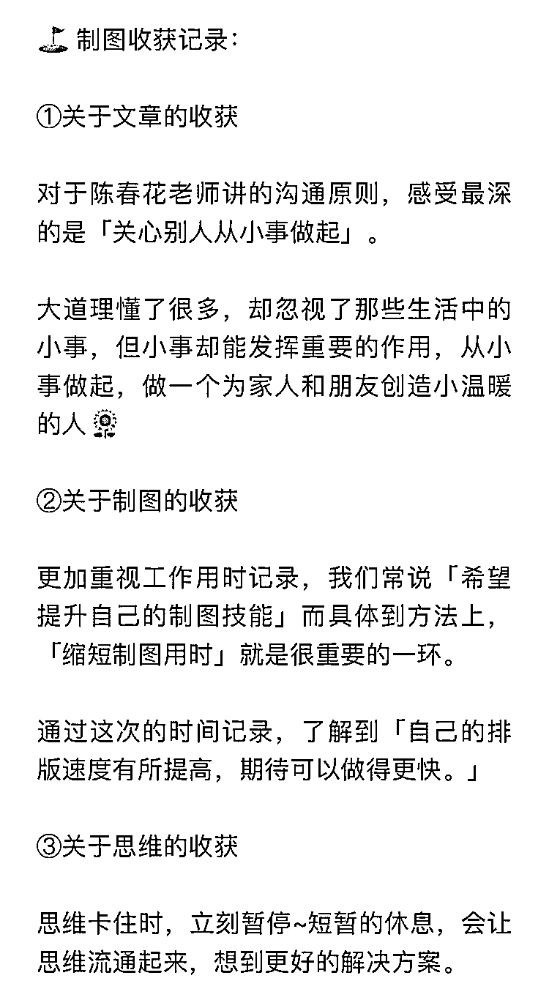
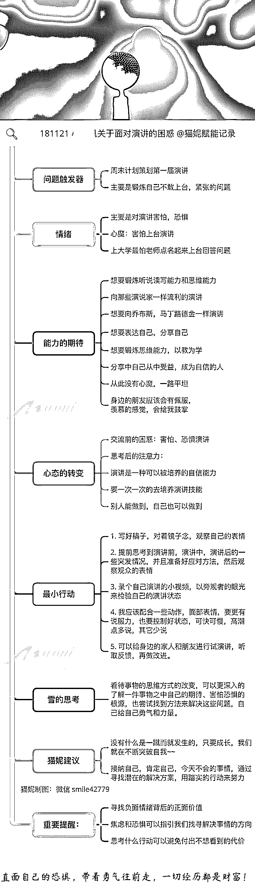
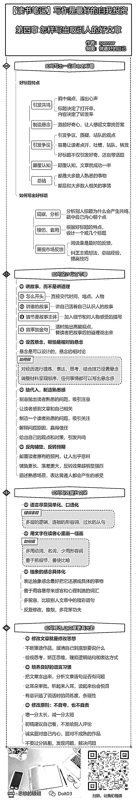
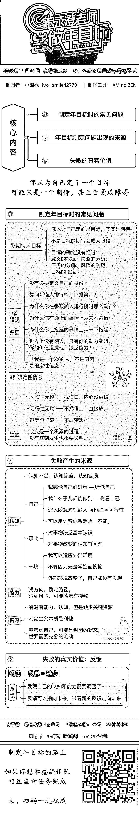
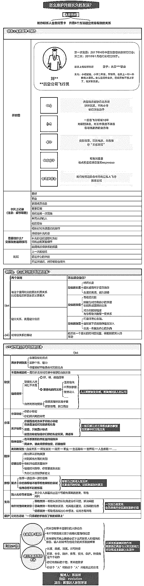
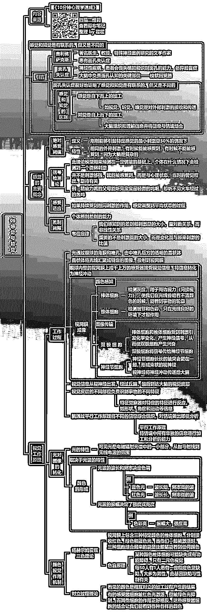

# 思维导图妙思屋知识星球整理 2019 第三部分

# 393\. 如何有效阅

如何有效阅读一本书

第五章让读书体验

更充实的 19 个技巧

评论：

# 394\.

2，导致暴脾气小孩脾气火爆的原因

评论：

# 395\. 如

如何使用思维导图搞定年终总结？

总结是为了把失败转化为财富，把成功转化为能力

评论：

熊王 : 真棒[强]一点小建议，上面的“嘉宾介绍”几个字换成人名是不是会更直观明了一点。

晋南大胖妞 : [强][强][强][强]

# 396\. 《如何开展一场高效

《如何开展一场高效的头脑风暴》阅读导图笔记，内容融了点别的🙈

评论：

Lantis : 晚上出太急了，标题有一个不对。明天换新的

做最好的自己 : 我还没做呢。

Lantis : 我课没听全啊，亏大了

# 397\. #​刻意练习​ 2

#​刻意练习​ 2018 年 12 月第一次实战练习

陈春花：学会有效的沟通

 陈春花：学会有效的沟通​

制图时间：构思+排版 60 分钟

制图工具：xmindZen

制图思路：了解文章核心思想—找小标题—找核心内容—自己总结归纳—排版—确定配色—调试结构—画图裁剪—微信预览—细化定版

制图问题：对于横版文字拉成竖版的操作不会，耽误了时间

评论：

ls : 好厉害,形式活泼,内容要点突出，更生动了

南思嘉木 L. : 谢谢~

# 398\. #​刻意练习​ 2

#​刻意练习​ 2018 年 12 月第一次实战练习

陈春花：学会有效的沟通

幕布梳理：50 分钟

Xmind 制图：120 分钟

步骤：

1.通读文章，提出框架，梳理和提炼要点；

2.通过幕后进行结构整理；

3.导入 xmind

4.确定制图样式～花费 30 分钟

5.基本结构的整理，形成初稿～60 分钟

6.导出图片格式查看问题进一步修改～30 分钟

问题：

第一次在选择的是表格样式，目的是想用相对固定的模板来提高效率，但是制作的过程当中发现达不到自己想要的效果，又改换了样式。后面在制图的过程当中，期待能够学习到如何制作自己的样式模板。

评论：

# 399\.

评论：

# 400\. 2018 年

2018 年 12 月第一次实战练习

图 1：文章导图

图 2：制图思路+实战用时+制图问题

图 3：关于实战的三点收获

☟☟☟[陈春花：学会有效的沟通](https://mp.weixin.qq.com/s/W_wJgyKrEyyD0L73DzHJQg)

评论：

# 401\. 如何有效阅

如何有效阅读一本书-第四章 通过重读笔记提高自我

把更多的时间放在思考上，制图时间缩短至 35 分钟。

评论：

# 402\.

理解暴脾气小孩

评论：

# 403\.

2018 年 12 月第一次实战练习

幕布梳理：2 番茄钟

Xmind 制图：2.5 番茄钟

步骤：

1\. 以段为单位，一边读一边精炼幕布梳理

2.利用 Xmind ZEN 进行排版

2.1 从幕布导入 Xmind ZEN

2.2 调整中心主题结构及全文字号

2.3 确定中心主题位置及大小，成品定宽。

2.4 调整文字最多的地方，确定是否符合定宽

2.5 调整其他地方

2.6 配色

问题：

1\. 软件跟新后有些功能无法使用带来的干扰。昨天做了一个番茄钟做不下去了。（偏离原有习惯模式后陷入的纠结）

评论：

# 404\. #写作业

#写作业

2018 年 12 月第一次实战练习

幕布梳理：40 分钟

Xmind 制图：1 小时 20 分

步骤：

1.文章通读分析结构

2.文字按照按结构复制进幕布

3.对内容进行提炼精简及文字调整

4.从幕布导出导图并导入 Xmind 8

5.用 XMind 自定义的风格进行制图，采用树状（右）

6.根据结构进一步精简文字（考虑对齐）

7.根据内容调整子主题结构

8.选择配色并调整导图格式

9.导出图片

问题：

1.导图有哪些需要改进的点？

2.针对作图，哪些可以精简的步骤？

3.此类文章，作图时间幕布梳理和制图分别应控制在多长时间？

4.作图时，想精简文字，又怕精简后不能传递文章精髓，如何取舍？#刻意练习#

评论：

小猫妮 | 探索自我* : 棒，注意在置顶贴选择【写作业】，再打卡粘贴内容哦。

# 405\. 1.201

1.2018 年 12 月首次练习

2.练习内容:学会有效的沟通 陈春花

3.时长:阅读幕布整理用时 50min，

xmind8 制图用时 200min

4.感受：

a，架构轻易，容易归纳

b，做图过程思维跳跃，总想换思路，布局不大好不适合屏幕阅读

c，练手主要，如实际做会换其他工具。毕竟 XMIND8 功能限制太多。

D，我能说几根线花了快一个钟嘛[流泪]。自定义颜色搞 20min，关了就要再设置。可能我不懂方法。

5.总体并不满意，阅读效果并不好。下次换别的思路。

评论：

小猫妮 | 探索自我* : 棒，记得在图里带上自己的制图信息哦

# 406\. 2018 年 12 月第

2018 年 12 月第一次实战练习

幕布梳理：50 分钟

Xmind 制图：1h30 分

步骤：1\. 先把文章大段文字按照层次复制进幕布

2.对内容进行提炼精简

3.利用 Xmind 8 自定义的风格进行制图，采用树状结构，并进一步精简文字

4.利用 Xmind ZEN 进行排版

5.进一步修改并调整整体格式及颜色 6.导出图片并用 Windows 自带画图软件去除软件自带 logo。

问题： 1\. 针对我做的图，哪些步骤可以缩短制图过程。

2\. 非作品类作图，一篇文章或一本书维持在多少时间比较合适。

3\. 导图哪些的改进点，一直对自己图片的整体色彩不满意，如何提升。

评论：

# 407\. 作业 ACE 第一

作业 ACE 第一次作业

1⃣️内容：陈春花-学会有效的沟通

2⃣️幕布结构化笔记：

3⃣️花费时间

内容梳理时间：20+30 分钟

制图时间：30 分钟

获得感受:30 分

4⃣️制图思路

文章通读

列提纲

导出 mm-xmind 转存-zen 修改

5⃣️收获

1、直接拷贝粘贴 删改速度快

2、文章要点交代清晰，但是读起来感觉有所重复，不是那么结构化

3、一定要设置自己的模板，不论是提纲模板还是导图的，加快速度[陈春花：学会有效的沟通](https://mubu.com/doc/869QqreSCw)

评论：

# 408\. #分享# 导图＋

#分享# 导图＋卡片篇

浅浅的绿＋深深的墨色系

带你解读《赋能》一书

教你打造应对不确定性的敏捷团队

[愉快]

评论：

# 409\. 1， 2018 年 1

1， 2018 年 12 月第一次练习

2，内容：陈春花--学会有效的沟通；

3，所用时长：

看内容+幕布整理用时 35min，

xmind 制图用时：97min；

4，感受：

a，内容和结构原文很清晰，整理框 不费劲；

b，做图过程有无力感，不懂得太多，留白什么的都不太懂；

c，没自信，总感觉自己做的不好，不行；

评论：

做最好的自己 : 你提炼的更精简啊，排版也更灵活，相比我有点照抄原文，没有跳出固有思维。

Lantis : 感觉整体布局的很好，短时间做到这样好厉害啊。还很对称，观感真不错

# 410\. 蚂蚁牙黑第一次作业

蚂蚁牙黑第一次作业

1⃣️内容：陈春花-学会有效的沟通

2⃣️幕布结构化笔记：

3⃣️花费时间

内容梳理时间：30 分钟

制图时间：50 分钟

4⃣️制图思路

首先通读文章，然后制作幕布结构化笔记，完成结构化笔记后导出为思维导图格式，将其导入 xmind 软件进行格式和内容的修改完善。

5⃣️收获

1、文章对于沟通的知识虽不深入，但比较全面。

2、文章结构性较强，逻辑较清晰。个人认为第三个小标题和前两个不是很统一。插图没有根据内容的轻重缓急安排，有的观点有插图，有的没有插图。

3、小故事和理论相结合，能引起读者读下去的欲望，在写作上值得学习。[陈春花：学会有效的沟通竖屏导图（蚂蚁牙黑 2016）](https://mubu.com/doc/31CMoCc-hg)

评论：

# 411\. 【🎯实战作业要求】

【🎯实战作业要求】

2018 年 12 月第一次实战练习

陈春花：学会有效的沟通

12 月 3 日 23:00（周一）之前，把你完成的导图作品分享到星球的伙伴，可以收到猫妮的详细反馈。时限之后分享 也可以得到我的简单评论和修改建议。

工具：推荐 XMind，可以利用幕布辅助内容整理，其他软件只要可以实现竖屏效果也可以

要求：作品适合手机阅读，内容简洁精炼

提醒：交作业时，记得带上刻意练习的标签

内容模板的整理参考

[陈春花：学会有效的沟通](https://mp.weixin.qq.com/s/W_wJgyKrEyyD0L73DzHJQg) [身处职场，千万要避开这 10 个学习误区@猫妮导图](https://mubu.com/doc/1gu6FoBWEk)

评论：

# 412\. 🙈试手作，《决策与

🙈试手作，《决策与判断》

请批评指正

评论：

Lantis : 还有我截图后质量非常低，怎么处理

小猫妮 | 探索自我* : 截图后，是指没有导出图片吗？

Lantis : 我描述有问题。，导出以后质量不大好。导出是选 jpg、bmp、还是 png 比较好呀

小猫妮 | 探索自我* : 选择 png 就好，可以考虑全选所有文字，最小 20 号，再导出试试

晋南大胖妞 : [强][强]真不错

# 413\. 📚

📚 《完全图解超实用思考术》-永田丰志

这本书讲的是讲文字转化为视觉化笔记的方法。重点是把 6 种逻辑模型记在心里，加强练习，灵活套用。

评论：

# 414\. 《如何有效阅读一本

《如何有效阅读一本书》第三章 用笔记把读过的书变为精神财富

没有记录等于没有发生，坚持下去才是写读书笔记的基本要求。

评论：

# 415\.

减少日常吼叫的策略

评论：

# 416\.

评论：

# 417\. 今

今日应用：纠结时处理情绪的导图分享

和大段的文字交流相比，利用一张图梳理自己的困惑，会更容易得到有针对性的反馈。下次你和朋友讨论问题时，要不要试试这种形式？

评论：

晋南大胖妞 : 的确费时间

小猫妮 | 探索自我* : 利用树状图和逻辑图的组合，有很大的发挥空间，重点是省时

晋南大胖妞 : 好的，明白。

# 418\.

减少吼叫的日常策略

评论：

# 419\. 今

今日导图应用：利用思维导图来梳理情绪

模板分享：ETA 脱困四问

注意，每一张图要考虑它的使用目的和应用场景，如果重心在思考，注意力要在内容上，排版细节和竖屏思维无需在意。

下载链接：

坚果云：

百度云：

链接: 密码:pjf3[06+导图应用+-+ETA+脱困四问情绪模板.xmind+-+坚果云+-+云盘|网盘|企业网盘|同步...](https://www.jianguoyun.com/p/DUippG0Q-eCMBxj5hYkB) [`pan.baidu.com/s/1ao9fB6VA6Ztmka4ZEbsDUw`](https://pan.baidu.com/s/1ao9fB6VA6Ztmka4ZEbsDUw)

评论：

# 420\. 薛兆丰的北大经济学

薛兆丰的北大经济学课 ，第 002 讲|马粪案…公平的背后是效率的考量#掌柜导图#经济学笔记

评论：

# 421\.

减少日常吼叫的策略

评论：

Lantis : 图很好很有启发，不过觉得事件和回应 前后加两个空格 事件 回应 这样会不会更好看

晋南大胖妞 : 谢谢[咖啡][咖啡]

小猫妮 | 探索自我* : Zen 里也可以多选主题，然后设置固定宽度哦。输入相同的数字，主题长度就会相同

晋南大胖妞 : okok，谢谢。这是个好办法，我都是用肉眼看，所以总不太齐。

# 422\. 在猫妮关于「加入社

在猫妮关于「加入社群期待」问题的引导下，用永澄老师的迪士尼策略思维模型，思考如图~2019 年期待升级中[嘿哈]

评论：

做最好的自己 : 一张图说出来大家的心声[爱心]

小猫妮 | 探索自我* : 有节奏的输出，你一定可以做到。有我在，持续行动的路上，相信你不会落下。

专业度不够，有你的行动力和我的赋能，一定可以保持提升并稳定！

想要解决问题，就更不用担心啦，我在万图挑战中，遇到的困难，以及所有的心法都会及时分享出来。[拳头]

# 423\. 复盘力#

复盘力#

每日反思模板

模板下载链接

坚果云下载（网页版点击链接即可下载）

百度云下载

链接:

密码:bzm9

反思内容

1、客观性问题

* 我记得今天哪些场景、事件、画面和对话？

* 我今天做了哪些事情？

* 谁对我说了些什么话？

2、反映性问题

* 整体来说今天情绪如何？我会用什么图像来形容我今天的情绪？

* 今天精彩的地方在哪里？低谷在哪里？

* 我在什么时间点状态很好？那时候我在做什么？

3、诠释性问题

* 我从今天学到了什么？

* 我需要记住今天的哪些洞见？

4、决定性问题

* 今天所学我能用在哪里？准备什么时候用？

内容来源：《学问》

感谢 的素材分享[05+每日反思内容+模板.xmind+-+坚果云+-+云盘|网盘|企业网盘|同步|备份|无限空间|免...](https://www.jianguoyun.com/p/DXTNQQsQ-eCMBxjK9YgB) [`pan.baidu.com/s/1tfv8Q-Dl3zy5y83lxnioYA`](https://pan.baidu.com/s/1tfv8Q-Dl3zy5y83lxnioYA)

评论：

# 424\. 今

今日导图应用：利用思维导图来自我提问，寻找答案，减少迷茫和原地纠结。

某位朋友今天问我，当同事家人问自己为什么要学思维导图时，语塞了。通过我的提问和引导，对方找到了心中的答案，猫妮将过程整理出图，供你参考。（图片分享经本人同意并去掉名字显示）

你，为什么做思维导图呢？

评论：

晋南大胖妞 : 发现小猫妮什么事都可以做成导图，做成导图一看思路清晰多了……👍👍👍学习了，谢谢猫妮分享[玫瑰][玫瑰][玫瑰][玫瑰]

# 425\. 一起学习薛兆丰的北

一起学习薛兆丰的北大经济学课

第 001 课:战俘营里的经济组织，原创笔记导图

战俘营里资源有限，依旧可以发展市场协作。每个人都是独特的个体，在不同时间不同地点会产生不同的需求。需求之间的交换与满足，便产生了幸福。我一直相信人是最根本的资源。人们有目标有方向的行动起来，就能创造价值，至少比无所事事，要创造更多价值。这一切的关键在于希望。有希望的个体就会行动，有希望的组织就会协作。

评论：

小猫妮 | 探索自我* : 很棒的输出，配合清晰和谐！可以增加 #经济学笔记#，和#掌柜导图# 的标签哦：）

掌柜 : 谢谢猫妮，下次尝试

# 426\. 一起学习薛兆丰的北

一起学习薛兆丰的北大经济学课之发刊词，原创笔记。内容和想法初衷都在图上了。

欢迎拍砖

评论：

小猫妮 | 探索自我* : 保险界的优秀导图达人！

# 427\.

加强或减弱影响吼叫的因素

评论：

# 428\. 工

工具：XMind 8 PRO（付费版）

分享一个 XMind 8 付费版的实用功能

关于外框的格式设置，可以制作自定义模板在未来反复使用，方法如图。

另外，猫妮是 XMind 官方认证的思维大师，可以给身边的朋友申请购买软件的优惠，优惠后的 XMind 8 付费版，大概 629 元，如果有需要，我一直在。

评论：

# 429\. 各位小伙伴

各位小伙伴：

我做的几个 ZEN 的导图模板，大家感兴趣应用下，最好给我下反馈，颜色格式也可以调整。你们的反馈也是我持续进步的动力哈。

下面是模板的源文件链接。

链接：

提取码：sfqe[`pan.baidu.com/s/1qo1IerP3WTbzGP4SbZi01w`](https://pan.baidu.com/s/1qo1IerP3WTbzGP4SbZi01w)

评论：

ACE : 不错啊，就是没有看到模版在哪里

做最好的自己 : 百度网盘链接啊

# 430\. 《如何有效

《如何有效阅读一本书》

第二章用购书清单指名购书

培养带目的读书的意识

评论：

小猫妮 | 探索自我* : 树状图非常省时

做最好的自己 : 嗯，对的，比模版更省时[呲牙]

南思嘉木 L. : 谢谢你的模板，已应用

做最好的自己 : 好用么，可否给点建议啊

南思嘉木 L. : 建议就是，主图板块可以添加照片框嘛～～

小猫妮 | 探索自我* : 置顶帖#资料分享#的标签里，有适合做头图的 20 张素材哦

# 431\. 《全脑教养法》读书

《全脑教养法》读书笔记

评论：

南思嘉木 L. : 谢谢你的导图，我模仿创造了一个模板

# 432\. 目

目标制定的路上，迪士尼策略是个好工具，配合思维导图，每天一张迪士尼的话感觉时间的复利会有很大的想象空间。

迪士尼策略的导图模板

链接:

密码:87st

坚果云下载（无需注册）

[`pan.baidu.com/s/1DXo5nLKe_3ASe35tJAda-A`](https://pan.baidu.com/s/1DXo5nLKe_3ASe35tJAda-A) [04+导图应用+-+迪士尼策略模板+-+猫妮.xmind+-+坚果云+-+云盘|网盘|企业网盘|同步...](https://www.jianguoyun.com/p/DaxUK5wQ-eCMBxiTsYkB)

评论：

做最好的自己 : 最近也在痛苦做 2019 年计划，感谢分享，同时惊叹你不断挑战自己。[强]

晋南大胖妞 : 10000 张思维导图[强][强][强]

做最好的自己 : xmind8 的确做模版比 ZEN 强大，可以自定义风格。[强]

小猫妮 | 探索自我* : 十年经典的背后，有它的稳定和强大，付费版更是如此，提高的效率和节省下来的时间是金钱。尤其是，你想要长期使用这个工具。

当然，我也非常期待 ZEN 的发展，有特别多的可能性

小猫妮 | 探索自我* : 记得做我的监督员呀[爱心]

晋南大胖妞 : 向你学习，一起加油！

南思嘉木 L. : 太强大了，我的目标是 200 张并分享

小猫妮 | 探索自我* : 我相信，你一定可以做到

# 433\. 《如何有效

《如何有效阅读一本书》;第一章用笔记管理读书生活

模板带来了制图效率的大幅提升，后续考虑如何同一模板不同的样式及着色。

评论：

小猫妮 | 探索自我* : [强]流程化模板化，省时高效的完成任务。另外可以带上阅读方法的标签哦：）

# 434\.

吼叫与不吼不叫

评论：

# 435\. 20181

20181123 《这样做年目标才对》

永澄老师工作坊复盘

2018 最大的成就事件是遇到了

优秀又开放 暖心又励志的小猫妮

评论：

张辉 : 请注意修改群名片

崔颖 Afra : 谢谢提醒，有什么指定规则么？

张辉 : 这样就 OK

崔颖 Afra : 谢谢

小猫妮 | 探索自我* : [爱心]为崔姐的积极主动点赞，你的进步离不开自己背后的行动！另外内容部分，建议也带上图的标题，或者核心内容。

星球内容可以随时修改，有标题 → 方便自己和他人未来搜索，也可以注意一下作品标签哦（#目标管理 或者 #学习笔记都可以），期待在未来持续发光的路上，我们能够抱紧走更远~~

崔颖 Afra : 谢谢猫妮提醒，要时刻保持作品声音的意识

# 436\.

评论：

# 437\. 猫

猫妮 70 天完成 100 万字背后的核心关键：

充分调用五感

评论：

# 438\. 用模板制作

用模板制作导图，不仅风格统一，关键是大大减少排版时间，

更多时间应该放在导图内容上。

第一个 xmind zen 模板。

模板如下：

链接：

提取码：kszq[`pan.baidu.com/s/1KzGD1Osp9HwALEm7oaTTpw`](https://pan.baidu.com/s/1KzGD1Osp9HwALEm7oaTTpw)

评论：

ACE : 非常棒的模版，打开这样，新版的 zen

做最好的自己 : 我现在还是老版本的，新版本下载不了。

ACE : 嗯，原来这样啊

# 439\. 《写作是最

《写作是最好的自我投资》

第八章 你所理解的新媒体写作,也许都是错的。

第九章 人人都能写出爆款文

新媒体不是一个新兴行业，而是一种高效地工具，它给予普通人快速崛起的门票。

评论：

# 440\. 我发表了一篇文章：

我发表了一篇文章：[这是 L 先生说公众号里的文章，](https://articles.zsxq.com/id_cdcus9rhv9bo.html)

评论：

小猫妮 | 探索自我* : [强] 考虑到移动端展示，排版控制的很棒，也可以直接图片形式分享，另外标签可以改为学习笔记哦，读书笔记的话标注一下书名，会更方便未来自己和他人搜索。

# 441\. 《写作是最

《写作是最好的自我投资》-第七章职场专业文章写作的方法论

评论：

小猫妮 | 探索自我* : 色调和版式越来越舒适，另外可以考虑带上写作方法的标签[机智]

# 442\.

情绪管理训练避免的雷区

评论：

小猫妮 | 探索自我* : 不同结构的应用真好，兼顾可读性和美感[强]

晋南大胖妞 : [害羞][害羞]

# 443\. 一张图读懂 B 站 第

一张图读懂 B 站 第三季业绩

我想跟大家说说昨晚公布 第三季度业绩的 哔哩哔哩 （Bilibili）

概况：

净收入增长了 48% 达 10.8 亿 人民币，

月活用户增长 25% 达 9270 万名

月活移动端用户增长 33% 达 8000 万名

公司业务更多元化，手游收入的比重正下降

评论：

# 444\. 梳

梳理情绪的路上，思维导图是一个好工具。

面对思维的镜子，梳理出自己的现状，期待，和能力，思考潜在的解决方案。

应用：图 1 是猫妮和某位朋友交流后的反馈。通过提问和引导，把负面情绪转化为正面情绪，想清楚自己真正想要拥有的能力，主动的寻找潜在的最小行动。

图 2 是某位朋友自己在面对问题时，通过猫妮的提醒和往期引导，独立完成情绪梳理和导图制作，顺利找到解决问题的切入点~

评论：

# 445\. 《写作是最

《写作是最好的自我投资》-第六章 如何训练你的逻辑思维

文章的逻辑比文采修辞更重要，逻辑的核心是清晰高效地思考问题。

评论：

# 446\.

情绪管理训练的附加策略

评论：

# 447\. 一直都同意选择比努

一直都同意选择比努力重要

选择自己的未来 ， 时间的优先顺序，决定了你生活的质量

把时间先分类，后排序

简单的分类更容易执行，不会总要想 这个要归到哪呢，久而久之坚持不下去了

今天我听完课决定试试看，小伙伴们拿去不谢

评论：

南思嘉木 L. : 要有自己的心流时间是真的很赞！

# 448\. 预

预告：星球配套微信群将在一周内建立（猫妮的微信是 smile42779，如果你还未添加好友，可以和我联系）

星球的内容会包括作品的分享和素材的积累。在微信群，你期待的讨论主题有哪些？

猫妮的想法会更加注重实用性的导图应用场景

比如，「今天，你用思维导图做了什么事？」

我会分享自己每日的导图应用，通过集体讨论和灵感碰撞，萃取出一个个可以复用的流程，持续积累。

如果你有其他想法，欢迎在评论区告诉我呀[爱心]

评论：

ls : 期待…

静 : 太好了，期待……

晋南大胖妞 : 期待………

做最好的自己 : 希望多点模板的制作的讨论，可以缩短导图制作时间。

白首 pyth : 微信群在哪加入，星主

# 449\. 《写作是最

《写作是最好的自我投资》

第五章 如何写好一个故事

道理只能赢得辩论，故事可以收服人心

评论：

# 450\.

情绪管理的附加策略

评论：

# 451\. 《写作是最

《写作是最好的自我投资》-第四章 怎样写出吸引人的好文章

公众号写作区别于传统写作，标题决定了打开率，内容决定了转发率

评论：

# 452\. 你的财富亲

你的财富亲密度高吗？

对于大多数人而言，小时候不会有专门的金融、财务思维训练，我们的用钱习惯和意识受家庭的影响最大。

如果从小到大身边的人并没有传递给你看待和管理金钱的正确方式，首先要补上这一课。

评论：

小猫妮 | 探索自我* : 清晰省时的制作[强]

# 453\.

情绪管理训练的附加策略

评论：

# 454\. #读书笔记

#读书笔记#

《写作是最好的自我投资》

第三章写作是注意力争夺

人人都写作的时代，门槛低了，但高度更难达到。

用户思维也是一种利他主义。

评论：

# 455\.

评论：

# 456\. 二、关注财富的反面

二、关注财富的反面

知道了四个致贫因素，就可以从反面来看如果我们想努力变得富有，需要做的事。本章会非常系统地介绍这四个致贫因素。

评论：

# 457\. 一、投资的本质是认

一、投资的本质是认知

本质上，投资其实是我们整体认知的财务变现，能够把我们对于政治、宏观经济、中观行业、微观商业、人性，甚至是对于自己的认识投射于损益这一维度上。

评论：

# 458\. 年

年目标制定的路上

持续做有力量，有勇气，更大格局

聚焦未来更大价值的事情

制图：XMind 8

思路：考虑到时间和效率，使用了 XMind 8 付费版的提取样式功能，一次性设置所有格式。无需反复修改主题颜色和字号以及外框的线条颜色及粗细。

考虑到想要在短时间清晰呈现效果，使用了树状图的结构，利用主题的框线设置来区分层次。

注意，如果内容过多，树状图可能翻起来会比较累。要控制长度，同时每张图要优先满足自己的使用目的，不要把过多注意力放在排版上。

关于呼吸感的控制，通过在分支主题之间增加空白主题实现，空白主题的文字删除，边框改白色。

评论：

# 459\. 《写作是最

《写作是最好的自我投资》第二章 坐下来,开始写

行动是最好的解决办法，在行动中思考，在思考中迭代。

评论：

# 460\.

情绪管理训练的五个关键步骤

评论：

# 461\. 《写作是最

《写作是最好的自我投资》 第一章

未来不会写作的人将失去职场竞争力

评论：

# 462\.

情绪管理训练的五个关键步骤

评论：

# 463\.

笔记

情绪管理训练的基础及 5 个关键步骤

评论：

# 464\. 沈

沈攀老师关于高效阅读的分享

评论：

小猫妮 | 探索自我* : 点击正文部分 蓝字的 #阅读方法#，可以看到同主题的思维导图，其他标签也是同样[玫瑰]

# 465\.

不当教养方式:放任型

恰当教育方式：情绪管理型

评论：

# 466\. 猫

猫妮午间随堂思维导图分享~~

2018 年 11 月 14 日 永澄说成长

为什么你的年目标总是达不成？

改变是一个积累的过程，没有立刻发生也不要失望[爱心]

评论：

# 467\. 新手报到脑

新手报到

脑图：三年级上《科学》期中复习

儿子 40 分钟要点整理，2 小时制图

评论：

小猫妮 | 探索自我* : 和孩子共同完成的作品，价值感满满！

ls : 是的，谢谢猫妮老师持续的支持与耐心解答

ls : 关于本次《科学》复习思维导图制作的反思还请各位不吝赐教[W9《科学》复习思维导图制作反思](https://mubu.com/doc/3Ab9DCYTp0)

ls :

# 468\.

几种常见的不当养育方式

评论：

# 469\.

笔记

4-7 岁养育注意事项

评论：

# 470\. 来，了解一下 5 年涨

来，了解一下 5 年涨了 3000 万倍的瑞波，暴富，也许只需 1 块钱…

评论：

# 471\. V

V 先生答疑会直播笔记

2 张随堂竖屏思维导图

面对问题如何做好回答的准备？

如何获取高手的心里表征？

收获: 说到一个问题的时候，先不着急回答，用心的分析问题。读题，代入对方的身份思考潜在的解决方案。调取自身的思维模型，理解清楚对方要问什么问题的条件下，答案更容易呼之欲出。

在有限的时间里，制作随堂思维导图，如何做到音停笔落？制作的前中后的注意事项有哪些？猫妮本周在星球会单独开篇分享

评论：

晋南大胖妞 : 随堂做…腻害[强][强][强][强]

# 472\.

笔记

养育 2-3 岁孩子的注意事项

评论：

# 473\. 周末分享一波~如何

周末分享一波~如何和领导相处，也是艺术~

评论：

# 474\. 《搞定 1——无压工

《搞定 1——无压工作的艺术》分享~

评论：

# 475\. 2

25 张竖屏思维导图顶部配图素材

@猫妮整理自 pexels

链接:

密码:1nn7[`pan.baidu.com/s/15rBUnweUO-PziJw4oHjWKA`](https://pan.baidu.com/s/15rBUnweUO-PziJw4oHjWKA)

评论：

南思嘉木 L. : 猫妮，为啥我下载打开后是空的

小猫妮 | 探索自我* : 我试了一下，没问题的哦。可能和网速或者其他原因。

# 476\.

2-3 岁养育注意事项

评论：

# 477\. 易

易仁永澄：我想要的未来

评论：

# 478\. 墨门大学·墨子系列

墨门大学·墨子系列导图

云阳先生与墨门大学合作推出《墨子》系列导图，试图以精简的语言、流畅的视觉逻辑为大家呈现传统文化 墨学的魅力，本次导图主题：【墨子总结的企业七个忧患】

至于下一次，云阳先生正和巨子大大梳理 ing～ ～ 本次还相对独立，之后推出统一的格调出来哦😊

评论：

# 479\.

笔记

2-3 岁养育注意事项

评论：

小猫妮 | 探索自我* : 持续输出的路上，有你真好[爱心] 边界线的控制，也找到了更多感觉，为你点赞！

晋南大胖妞 : 谢谢认可[害羞][害羞][害羞]

# 480\. 易

易仁永澄: 如何挖掘你的优势?

梳理一次成就事件

带来的能量是超出想象的

制图思路:

逻辑图结构的隐身版，去掉左侧的主题边框，看起来都像自由主题，实际非常节省时间。动图待补

评论：

氧元素。 : 我的一直是这样做的

小猫妮 | 探索自我* : [玫瑰]

# 481\. 稻盛和夫《

稻盛和夫《活法》序言

人有时候就是活的太明白，想的太多反而活不明白，保持一颗单纯的童心，不忘的初心，不灭的雄心，奋斗的决心，对自然宇宙的敬畏心，也许可以过的更开心，更舒心。

评论：

小猫妮 | 探索自我* : 可以在正文部分带上稻盛和夫《活法》，需要的时候方便自己和他人搜索到，每篇内容都可以随时修改哦

# 482\. #摄影笔记#

#摄影笔记#

关于摄影的四个基本要素：

立意，构图，用光，用色

评论：

做最好的自己 : 收藏了，可以把试用版 p 掉呀。

小小 sha : 觉得没有必要花时间 p 就没 p 啦

# 483\.

读书笔记

不同年龄段孩子情感式引导教育的注意事项

评论：

小小 sha : 现在可喜欢读亲的育儿笔记了，哈哈

晋南大胖妞 : [愉快][愉快]

# 484\. 利

利用思维导图记录劈叉学习的收获和日志

猫妮要试着成为

竖屏思维导图和语音写作界的劈叉小公举！

评论：

# 485\. 0

018/100 如何利用 XMind 添加分割线？

评论：

# 486\. 情感引导式教育的关

情感引导式教育的关键步骤

评论：

# 487\. 易

易仁永澄：

意义的本质 + 如何获得内在驱动

为什么我们会有怀疑意义的时候？

因为遇到了挫败

遇到挫败的积极意义是什么？

挫败是成就感的来源

真正的内在动力来自于哪里？

对价值更好的分析

评论：

# 488\. #竖屏导图.随堂笔

#竖屏导图.随堂笔记 #No.9【和鲸打卡创始人一起共读教育好文】

通过作者分析市场需求+描述用户画像+找到行业痛点三个维度，清晰的知晓该行业现状

评论：

# 489\.

笔记：育儿误区及基础

评论：

# 490\. 推荐阅读<

推荐阅读

哪有没时间这回事

它教会了我如何和时间相处

顺带推荐两个在用的

时间管理工具

时间块，Way of life！

一个记录时间

一个专注打卡

评论：

# 491\. 竖

竖屏思维导图在出行时的应用，适用于工作交流的出行目的，和享受生活的出游。

出行前：制作出行清单，制定旅行规划

出行中：手机里，拿着一张图，吃喝玩乐忙

出行后：迅速复盘，留存记录。记录「今天自己遇到的人」

导图分享：

① 出行前，猫妮去北京时的出行清单

② 出行中，去南京时，每天查看的一张图

③ 出行后，猫妮回顾在深圳的简单复盘

最小行动：

当你下一次要出门时，要不要试试看？

评论：

做最好的自己 : 把一个工具融入工作生活，并深耕[强][爱心]

# 492\. 最近做了几个图。<

最近做了几个图。

仿照大家的精致模板

然而。。。没有达到很好的效果

继续学习！明天上图

评论：

小猫妮 | 探索自我* : 模仿是很好的开始，加油，你可以的

小猫妮 | 探索自我* : 另外阶段性的分享，也可以给你带来意外收获，只有让问题暴露出来，才有解决的可能。先完成再完美。星球的每一篇发表都可以进行修改，或者图片补充的哦。

# 493\. #No.8【和鲸打

#No.8【和鲸打卡创始人一起共读教育好文】

聚焦获客增长公式=拓新渠道 * 破冰靠产品 * 转化靠运营

评论：

# 494\.

笔记

评论：

# 495\. 竖屏思维导图作品分

竖屏思维导图作品分享：

极简战略课笔记

思维导图解读新零售

制图者：Tintwell

微博：Tintwell

评论：

做最好的自己 : 这个神秘的人是谁啊

小猫妮 | 探索自我* : 今年七八月链接到我的一位朋友，行动力强，也是一位优秀的竖屏思维导图践行者

南思嘉木 L. : 好喜欢他的图！

小猫妮 | 探索自我* : 用心可以被感知到的，我知道，宁馨也是同样的踏实[爱心]

# 496\. 一

一张图，初步了解 GTD 的本质和流程是什么？

感谢 的分享[爱心]

有机会请陈哥为星球成员线上分享 GTD 的学习主题

尔东陈微信：chenweibo168

评论：

# 497\. 你被误解过吗？

你被误解过吗？

今日猫妮分享竖屏思维导图的新用法

助你被误解时，梳理情绪专注目标

下午在一个学习群，我分享链接解答了某位群友的问题，在这件事上，我的问题在于很久没看群公告，不记得分享标准是 禁广告 还是 禁所有外链 。

考虑到在有限的时间里，尽快助人解决问题，就直接分享解决方案了。然后群内对外链的存在和群规的监管产生了一点争议。很有趣的过程，也让我看到了自己的成长。半年前的我，可能会着急辩解，面对自己的善意被误解会委屈。

今天的猫妮心态非常的平和，情绪状态很好，花了五分钟做张图梳理情况，想清楚下一步的行动，迅速表明态度，然后不再消耗注意力。后来意外发现好多人对我的态度行动，表明了认可点赞和勾搭[爱心]

相信自己的真诚，可以被感知到。做自己，问心无愧，言行一致，就能够在自己温暖舒适的能量池中畅游[爱心]

评论：

# 498\. No.7#【和鲸打

No.7#【和鲸打卡创始人一起共读教育好文】

本文在试图告诉我们教育行业的慢在于品牌形成慢。

评论：

小猫妮 | 探索自我* : [爱心]小曼持续用心的输出，带来了强大的作品声音，真好！有机会可以一起交流每日做随堂导图的收获哦[玫瑰]

李小曼 : 没经验纯是笨办法，听好 3 遍以上的音频+看 2 次以上的文稿+想很久[捂脸]

小猫妮 | 探索自我* : 试试几次听的时候同步做，即使没完成也会有收获。双拼打字也可以了解一下，可以助力小曼姐的完成度

李小曼 : 好的，谢谢小猫妮，挑战一下自己

# 499\. 终

终于完成了《极速写作》最后一张导图，做这张导图时思维很混乱，因此，做出的导图也很混乱。反思原因，一是功底不够，思考不够深入，二是为了做导图而做导图，有些内容是不适合做导图，或者没必要做很详细的导图。

解决方案：1\. 后续针对不同类型的书确定是否做导图。2.更多关注做导图为了什么，是否所有的内容都要原封不动记录？3\. 通过幕布先做第一次笔记梳理，梳理后确定是否做思维导图。4.梳理的笔记需要加入自己的思考，以方便以后回顾。

评论：

小猫妮 | 探索自我* : 持续行动的过程中，可以找到很多问题。问题暴露出来之后，我们会开始有意识的想要解决[愉快]

小猫妮 | 探索自我* : 解决方案的自我思考每一次都会有价值的，加油

# 500\.

笔记

评论：

小猫妮 | 探索自我* : 内容解释部分的线条，如果选择边框为无，会让画面更清爽哦[愉快]

晋南大胖妞 : 嗯嗯，我在琢磨琢磨

# 501\. 我们几乎每

我们几乎每个人都可以称作知识工作者，而在职场中，极速写作是知识工作者比不可少的能力，唯有大量的实践，并在实践中精进方能不断的突破自己的极限。

评论：

# 502\. 育儿常

育儿常见问题及养育建议

评论：

# 503\. #No.6#【和鲸

#No.6#【和鲸打卡创始人一起共读教育好文】

本文讲到教育技术，结论是它尚未成为中心性、主导性的改革力量。文章太难理解消化，死掉我不少脑细胞[捂脸]。

正好用此文作为一个分水岭，[蛋糕][蛋糕][蛋糕]，开启我的崭新美好快乐新生活

评论：

小猫妮 | 探索自我* : 面对难以理解消化的文章，每一次尝试都是在突破自己原有的边界。相信小曼没问题的~

# 504\. #读书导图 分享

#读书导图 分享# 《让大脑自由》

大脑是勤奋的，

越不用它，死的脑细胞就会越多

但是你太过度

又会免疫力下降，损耗过度，导致罢工

不过好在他是像肌肉一样是可以训练的

所以啊，请照顾好你的大脑

运动，保持充足的睡眠，释放缓解压力

评论：

晋南大胖妞 : 👍👍👍👍

小猫妮 | 探索自我* : 边界感的控制持续升级[强]

# 505\. 从

从自然中寻找配色参考 系列 2

网站推荐

Colorpalettes.net

评论：

晋南大胖妞 : 真的是任何技能都需要学习，猫妮[强][强][强]

# 506\. 从

从自然中寻找配色参考 系列 1

网站推荐

Colorpalettes.net

评论：

# 507\.

评论：

小猫妮 | 探索自我* : 可以在正文输入「注意力」，方便未来自己了解，这是什么主题的内容[愉快]

🚶王磊 : 得到里的李笑来的《通往财富自由之路》的一讲，我扩展了一下

小猫妮 | 探索自我* : 可以在星球里搜索到这本书的思维导图哦~

# 508\. 补《社会性动物.上

补《社会性动物.上》Day 1 -Day 5

评论：

# 509\. #No.5#【和鲸

#No.5#【和鲸打卡创始人一起共读教育好文】

本课讲到老带新，我能想到的两个对比例子是：新世相的分销制和 DISC 国际双证班的推荐 F 码

评论：

# 510\. 莱特币是如何诞生的

莱特币是如何诞生的？

以太坊是如何诞生的？

V 神是如何创造神话的？

一图尽览区块链的诞生史[太阳][太阳][太阳]

评论：

# 511\. #读书导图 分享

#读书导图 分享#《自我训练》

焦虑和抑郁的时候，你应该相信自己的能力，

抬起你强壮的腿，

把眼前的“驯象师”碾个粉碎，重归自由

评论：

# 512\. 《认知天性》第四章

《认知天性》第四章、第五章笔记。

就所看的三章来说，文不对题、东拼西凑、逻辑混乱，不看了

评论：

# 513\. 笔记

笔记

评论：

# 514\. 制作一张联系人全息

制作一张联系人全息背景卡片，然后用这个卡片来展示“追踪”技巧。

怎么与对方建立终生有效的关系呢？

也就是要在一个更长的时间区间里，做更频繁更深入的互动。具体做这六个动作：

欣赏：让杀手锏赞美脱口而出。

分享：分享秘密。这秘密既包括你的小秘密，也包括你们都知道的那个秘密。

陪伴：在不断更新的类别里持续陪伴。

推荐：推荐他做新的尝试，给他意想不到的体验。

支持：包括策略支持、资讯支持、情感支持。

保护：这个动作最厉害。

抛砖引玉：

请找出三位你要终生结交的朋友，他们心中理想的自我形象是什么？

你对他们的杀手锏赞美是什么？

怎样让这个赞美在日后你和他的交往中脱口而出？

评论：

# 515\. No.004【和鲸

No.004【和鲸打卡创始人一起共读教育好文】

昨天的课程中提到了很多互联网从业者有“得流量者得天下”的误区，因为流量思维在教育行业起的作用有限；今天的课程中又再次提到做流量≠买流量，并细细地解释了为什么教育机构买流量很难获得持续发展。

评论：

# 516\. 今天第一次

今天第一次尝试实践语音写作，的确比打字要快，很快就说了 1000 个字，但断断续续，语气词停顿很多，有时候说到一半不知道说什么，还有点演讲时的紧张。

不管怎么说，烂开始比不开始要好。加油吧！

评论：

ACE : 语音输入确实比较好用，比我们平常打字要快多了，最主要的是能够使我们的思维结构清晰，表达有力，用语音输入使平常演讲更有条理。

ACE : 去剑飞老师的网店看看，果断买了个耳麦。

小猫妮 | 探索自我* : 机智啊，耳麦和话筒都值得入手，是真的神器，哈哈

# 517\. 拆书学习法

拆书学习法

评论：

# 518\. 保险导图三:

保险导图三:

保险常用词典，白话翻译文，理解了你就看懂了一半的保险合同。宜收藏！

评论：

# 519\. 育儿常

育儿常见问题及建议

评论：

# 520\. #No.3#【和鲸

#No.3#【和鲸打卡创始人一起共读教育好文】

作者相信在线教育是一个新的教育品类，并以投资人的身份剖析了自己走过的 4 个弯路，给所有正在做在线教育和准备踏入在线教育的人们上了最生动的一课。

评论：

# 521\. 十月是个值

十月是个值得记住的月份，不再一味的囤积知识，而是不断的持续输出，从早起开始，从一张张思维导图开始，不再焦虑，过程中，认识很多同频中人，有直言不讳，更多的是鼓励，真的非常感谢。希望，未来能够持续输出，不断的挑战自我，提高自我。

评论：

蛋蛋 : 传递了好多能量❤太棒

# 522\. 读书笔记#

读书笔记#

所有技巧到最后都归为不断的挑战自己，不断的突破自己，然后不断叩问自己，反省自己，和自己对话，进入一种无意识忘我状态，素材源源不断，写作也成为了一种本能。

评论：

蛋蛋 : 一直关注❤

# 523\. 读书笔

读书笔记

评论：

# 524\. 【有序】1

【有序】

1、信息管理的本质是注意力稀缺

2、注意力系统是什么？

3、3 个管理注意力的方法

评论：

蛋蛋 : 莎莎出品，必属精品

# 525\. 酒店 OTA

酒店 OTA 运营知识

如何提高业绩

1 / 提高点评分

2 / 提高口碑度

3 / 提高转化率

4 / 提高好评率

5 / 提升产品竞争力

评论：

蛋蛋 : 曾经做过酒店的我早点遇上勇哥就好了[憨笑]

# 526\. No.2#和鲸打卡

No.2#和鲸打卡创始人一起共读教育好文#

1、抓刚需，接地气，从客户实际需求出发

2、有形化，不要做纯虚拟产品，有实物更好转变家长付费心理

3、课程化和任务化，而不是零散的文章、视频

4、体制化和订阅制，而不是单独随机销售

评论：

小猫妮 | 探索自我* : [爱心] 学习的路上，为一刻不停、持续行动输出的小曼点赞！

# 527\. 四大要点教

四大要点教你策划一场好活动

七个用户驱动模型

制图者：

作者微博：tintwell

评论：

晋南大胖妞 : [强]

李小曼 : 好鲜艳的颜色

蛋蛋 : 这图的空间利用好厉害呀

# 528\. 来

来自辉哥的成长建议

自律就是为了更远大的目标，愿意牺牲眼前的利益，抗拒短期诱惑的行为。自律体现在两个方面，一个是抵御诱惑，一个是每日坚持。

[十问辉哥](https://mp.weixin.qq.com/s/SnQOEVjnwoG-_Xa3U4_9Mg)

评论：

# 529\. 你不知道的各种钱包

你不知道的各种钱包定义，都在这里了[耶]

评论：

# 530\. 孩子情绪管理问题

孩子情绪管理问题

评论：

小猫妮 | 探索自我* : 先处理情绪，再处理事情[强]

# 531\. # 极速写作的特点

# 极速写作的特点在于可以在任意场景进行，而且也必须要求随时随地可以写作，这样可以倒逼自己持续输出。

评论：

# 532\. 用四步追问法追问自

用四步追问法追问自己：

你想做什么？

你为谁而做？

他们需要什么？

因为你，他们有什么改变？

明确了目标，我们更容易找到达到那个能帮助我们的目标人物，以及到达他的路径。

并且，用一份人脉归档表，可以盘点现有的人脉。 命友 5 人，密友 50 人，好友 100 人，需要用不同的频率维系关系。并且，这 155 人也需要根据你的工作生活状态，不断地更新。

源自：戴愫的人脉管理课程

链接：[怎样成为人脉管理的高手](https://m.igetget.com/share/course/pay/detail/22/65)

评论：

李小曼 : 请问一下，表格是在软件里完成的还是以图片形式插入的呢？

小猫妮 | 探索自我* : 矩阵图，XMind 8 和 XMind ZEN 都有，ZEN 的二维表设计更人性化

李小曼 : 我试过，总是搞不定表格[捂脸]有空试试

氧元素。 : 可以先做一个大框架，然后转换格式那里变成表格的形式再去调整

氧元素。 : Xmind zen 表格里文字对齐和主题宽度不好调节。不得要领

小猫妮 | 探索自我* : 是有一些不可控因素，期待软件版本更新优化

小猫妮 | 探索自我* : 我一开始也是同感，真正去做发现，其实自己可以驾驭的。我们拥有的资源会比想象的多，解决问题的能力是可以持续挖掘的

# 533\. 服

服务是一种特殊的无形活动，是一个独立创造价值的部分，陈春花老师的这篇文，值得一读，猫妮的思维导图也送给你[玫瑰]

陈春花：看清服务的本质

[陈春花：看清服务的本质](https://mp.weixin.qq.com/s/b1YY2P8lCkzwUuo9Ed4HgQ)

评论：

子夜 : 很赞成你现在这样，把朋友圈公众号知识星球的内容区分开，不重叠。

小猫妮 | 探索自我* : 谢谢子夜的反馈哦。初期会有一些存量内容的积累，为了标签和索引过滤，接下来都会是各种各样的增量内容。微信群也会在 11 月建起来。

# 534\. 育儿常见问题分析

育儿常见问题分析

评论：

# 535\. 工具成熟的

工具成熟的发展使得极速写作不断得以突破，工具本身提高了写作效率，学习工具的过程本身也是对写作的思考及内心的修行，各种工具的灵活使用也使得写作变的更方便便捷而且有趣。

评论：

小猫妮 | 探索自我* : [强] 踏实的输出，成长看得见。

考虑到内容的可读性，外框标题的颜色可以设置更深一些的，比如黑色或者深灰。

# 536\. 整理了训练营 170

整理了训练营 170 个伙伴们的“2018 年我上的最有价值的课程”

评论：

南思嘉木 L. : 导图非常棒棒哒！感谢！！

是剽悍读书营嘛？？

李小曼 : 不是，是弗兰克的写作营

# 537\. 茶

茶馆系列·一图欣赏沪上最美的十家茶馆

评论：

蛋蛋 : 哈哈哈哈这个名字😂果然是帅气的云阳先生

# 538\. 读书笔记#

读书笔记#

《极速写作-理念篇》：极速写作不是一种高深的理论，它是一种实践，用最快的速度记录自己的思维，生活乃至脑子里的方方面面，不断的精进，不断的挑战自我，达到思维的提升，生命的延长。

评论：

小猫妮 | 探索自我* : 制作的很精致[强] 另外在外框顶边双击，可以添加外框标题

# 539\. #每日分享#

#每日分享#

一张导图一本书之

F001《会赚钱的妈妈》

现代女性的财务自由之道

评论：

# 540\. 不同气质类型孩子的

不同气质类型孩子的性格及养育建议--冷静型

评论：

# 541\. 作为一个老

作为一个老司机，日常工作中依然无法避免犯逻辑错误，今天就和其它部门同事因为问题的处理产生不同意见，虽然，对方出言不逊在先，但以暴制暴的互怼也的确暴露了修炼依然不够。平常心，放平心态。

评论：

# 542\. 保险行业导图之二:

保险行业导图之二:一图了解重疾险的前世今生😊

评论：

# 543\. 图

图标工具推荐：Icons 8 Lite

适用平台：

Mac 苹果系统电脑，APP store 搜索即可

windows

价格：免费

语言：英语

特点：可以自由选择或者输入【英文】关键词搜索

也可以先选图标风格（黑白、彩色等）

后选图标种类（箭头，标注、旗帜、购物、运动）等等

推荐者 [玫瑰][Icons8+-+离线使用 86,800+个图标(Mac 和 Windows)](https://icons8.cn/app/)

评论：

# 544\. 把文字颜色改了以后

把文字颜色改了以后，稍微清新了一些，断舍离，不能千篇一律。学习了[奋斗][奋斗][奋斗]

评论：

# 545\. 不同类型孩子的性格

不同类型孩子的性格及养育关键词---激进型

评论：

蛋蛋 : *可以加上「育儿笔记」标签哦

*另，最后一级分支，可以将「下划线」外框的形式改为「矩形」外框，这样文字的显示会和前面的分支线条水平居中啦。[愉快]

晋南大胖妞 : 嗯嗯，谢谢。

# 546\. 思维是是行

思维是是行为的指导，多点思维的锻炼，会在处理事情时可以做出正确或者是有利的选择，也有利于透过现象找出事情本质，看透了自然也就无需解释也更无需纠结。

评论：

# 547\. 如何挖矿？如何选择

如何挖矿？如何选择好的矿机？一图为你揭晓答案，了解学会挖矿。

请猫妮老师指点。

评论：

小猫妮 | 探索自我* : 建议避免大段文字在一个主题内，即使有分行，还是会产生一些阅读压力。比如底部的三个步骤，可以分为三个主题，文字再试着进一步删减，把文字符号化

王硕 : 谢谢猫妮老师，加油

# 548\. 不同类型孩子的性格

不同类型孩子的性格及养育关键词

评论：

小猫妮 | 探索自我* : 快速学习参考清晰的呈现之后，应用到自己的图中，效果很棒，发图的时候可以带上自己的标签哦，比如育儿笔记等等

蛋蛋 : (⊙o⊙)哇 这个好棒 整体很清晰哦

晋南大胖妞 : 好的👌

demo : 读书笔记的话建议加上书名，为希望深入阅读的人提供方便。

晋南大胖妞 : 嗯嗯。

# 549\. 第六课-自信与从容

第六课-自信与从容与君共享~

评论：

小猫妮 | 探索自我* : 格式和内容的调整越来越优秀[强] 思维导图的标题建议尽可能明确，是什么的最后一课，考虑几个月后的自己重新打开的时候，能不能在最短时间内，直观的了解到更多信息。

许倩 : 很有道理，记住了，要能够在之后或者是他人看的时候也能看懂，应该更加的清晰和准确

小猫妮 | 探索自我* : 也要时刻提醒自己，每张图是为了解决自己的某个问题，优先个人使用的前提下，考虑其他场景

蛋蛋 : 「倩女优图」哈哈哈好有创意 很有记忆点

翱翔万里需知己 : 你们主题里的小图画，都是找了插入进去的吗？

# 550\. 创新思维是

创新思维是打破固有的思维方式，利用转化的思考方式考虑问题，多向大师学习，或特立独行或反其道而行，根据市场或者外部环境的变化灵活运用，永远保持一颗对问题及工作的热情。

评论：

小猫妮 | 探索自我* : 背景和主题颜色注意要有反差，如果用深橙色作为底色，文字可以改白色试试

# 551\. 老师，这本书有思维

老师，这本书有思维导图没？

评论：

《如何成为专家》暂时没有，置顶帖标签里有学习笔记相关主题的图，可以看一下有没有你需要的哦

# 552\. 🔆 ➠ 美团策略脑

🔆 ➠ 美团策略脑图

整理文件时，发现这张 1 个月前做的图，之后便爱上了这个版式，分享给大家[爱心]

☟☟☟

评论：

小猫妮 | 探索自我* : 小叶的图完成质量很高[强]

做最好的自己 : 小叶的排版，配色的确很赞啊，啥时候传递点心得啊

许倩 : 超赞！！！厉害

请问这个也是直接在 Xmind 里做的吗 还是其他工具做后粘过来？

蛋蛋 : 配色好赞 有种阅读美团报告的体验

蛋蛋 : 这个结构解构一下就是 3 个圆哦

左右思维 | 小叶 : 关于配色，猫妮[爱心]已经很贴心的在置顶主题中添加了#配色版 的标签，里面有很多配色的网站和好看的模板，可以研究一下哦。

小叶作图时，习惯选择一个和「脑图主题」相关的主色，再根据配色技巧选择两个辅色。

比如这张「美团策略脑图」就是以美团 logo 的蓝和黄为主色，浅灰作为辅色，用的多，白搭不易出错~

左右思维 | 小叶 : 是在 Xmind Zen 完成的，用的多主题叠加~主题选择圆形边框、在调背景色就好了[微笑]

左右思维 | 小叶 : 哈哈，被蛋蛋点赞，好幸福[爱心]

# 553\. 不同气质类型孩子的

不同气质类型孩子的性格及养育建议

评论：

# 554\. 人是感性的动物，大

人是感性的动物，大脑往往倾向于简单的思维模式，因而，生活中充满了线性思维，特别是这样一个信息冗余的时代，以偏概全，以现象代表本质的线性思维方式比比皆是。人大脑是用来思考的，用理性的系统性的思维考虑问题，也许问题的真相也就不远了。

评论：

小猫妮 | 探索自我* : 同层级排布主题的时候，重点小标题可以考虑加外框，和加粗相比，可以进一步区分内容[愉快]

做最好的自己 : 嗯嗯，这张图，没过多排版，排版和配色还得多练啊。

小猫妮 | 探索自我* : 没关系，优先考虑自己的制图目的，合适的场景下再多考虑其他

# 555\. 🔆 ➠ 高

🔆 ➠ 高段位邮件脑图

⛳️ 除了自己学习，你还可以：

转给老板，

他会看到你努力提升的态度；

转给员工，

他会了解到自我精进的方法；

转给同事，

他会感受到高效协作的愉悦。

❣ 导图内容来源→ 得到《有效提升你的职场写作能力》

☟☟☟[高段位邮件脑图+|+如何在 10 分钟内，写出战胜 80%同行的邮件](https://mp.weixin.qq.com/s/txxqoXwmJNrHIeFNANMYWA)

评论：

小猫妮 | 探索自我* : 配色很清爽，文字处理的简洁清晰[强]

# 556\. 一个人的格

一个人的格局决定了其所发展的广度和深度，生态思维的运用让你找到新的落脚点和切入点，寻找意想不到的机遇。兵法思维的运用，让你知己知彼，掌握主动权，在未来的决战中立于不败之地。

评论：

蛋蛋 : 每日分享，输出力赞

# 557\.

🔆 ➠ 效率书单脑图

注意力稀缺的时代，如何提高效率？

⛳️ 下面是小叶整理的「效率书单脑图」

相信你可以找到适合自己的「高效法则」

☟☟☟[书单+|+2 张脑图，快速读懂 10 本豆瓣高赞效率书单（上）](https://mp.weixin.qq.com/s/CBghoSbZ1tYBPlsWfKVMVA) [书单+|+2 张脑图，快速读懂 10 本豆瓣高赞效率书单（下）](https://mp.weixin.qq.com/s/lMoTwKcssvrxCZwSQdg0vg)

评论：

# 558\. ＃HR 导图 ＃

＃HR 导图 ＃ 年底人才盘点步骤了解下👇

评论：

翱翔万里需知己 : 你好，请问你是怎么给导图打框框着的？

中心主题下可以利用这个功能框着，但是全部框导图框着，我用 xmind8 就不能使用这个功能？

你们怎么做到的亲？

小小 sha : 直接用自由主题和连接线完成哦

# 559\. 演讲训练营第五课-

演讲训练营第五课-如何避免有害的 PPT&让演讲更为高效的肢体语言 与君共享~

评论：

小猫妮 | 探索自我* : 左侧空白可以裁剪掉哦

许倩 : 好的👌[玫瑰]

# 560\. 思

思维地图可视化工具资料分享

感谢 查找资料的搜索力

关键词：graphic_organizers

资料语言：英语

评论：

尔东陈。 : 也非常感谢猫妮帮我补充了弹药库，收获满满

# 561\. 《学会提问》Day

《学会提问》Day 1 -Day 5

评论：

# 562\. 你与牛人的

你与牛人的差距不仅是能力，更多的底层操作系统，何为底层操作系统，它是你做一件事的态度，遇到困难时的心理，是一种精神层面的情绪。痛苦给予你力量，恐惧决定你的边界，兴趣愉悦决定了你的方向。

评论：

# 563\. 🔆 ➠ 职场写作脑

🔆 ➠ 职场写作脑图

3 步搞定 6 种职场文案

❣ 导图内容来源→ 得到《有效提升你的职场写作能力》

☟☟☟[职场写作脑图+|+3 步构思法，学会投资人感兴趣的职场文案](https://mp.weixin.qq.com/s/2-mdwuCVPloeBhpW1Q6ykg)

评论：

# 564\. 演讲训练营第四课-

演讲训练营第四课-写作分享给大家，希望给大家制作演讲稿提供思路~

评论：

# 565\. 第二集，7 个基本概

第二集，7 个基本概念。简单，通俗，易懂。望猫妮老师指正。

评论：

# 566\. 《阿何谈时

《阿何谈时间管理》第 18,19,20 课

至此所有的课程的分享都已经完成。

过往的分享重在练习制作导图的基本内容，比如操作，排版等

后续，会进一步形成自己制图风格，更多的关注内容。

向星球的大神们学习，欢迎交流指教。

评论：

# 567\. 🔆 ➠

🔆 ➠ 情绪调节脑图

我们的情绪有哪些？

调节情绪有哪些关键技巧？

《高情商是练出来的：美国大学里的高情商训练课》介绍了调节情绪的 4 个关键技巧～李翔知识内参，对书中内容做出了解读。

⛳️ 下面是小叶梳理的【情绪调节脑图】希望对你更好的调节情绪，有所启发。

☟☟☟[脑图｜情绪危机容易让人失控，什么是调节情绪的关键？4 个技巧为你解读~](https://mp.weixin.qq.com/s/37ohhzXskyfd2fKzvWfA1A)

评论：

# 568\. 《阿何谈时间管理

《阿何谈时间管理 》第 16,17 课

评论：

小猫妮 | 探索自我* : 每一天的成长，都让人清晰感受的到[爱心]

# 569\. 演讲训练营第三课分

演讲训练营第三课分享给大家

评论：

小猫妮 | 探索自我* : 倩女优图[玫瑰]

# 570\. #学习笔记#5 个原

#学习笔记#5 个原则 1 个心法 2 个步骤，才是一个好文案

评论：

# 571\. 🔆 ➠ 5 步流程脑

🔆 ➠ 5 步流程脑图

图 1 的内容来自方军老师对《原则》一书的解读，是小叶加入「笔记侠思维导图分舵」的测试作品。

图 2 是「达利欧生活原则」中「用五步流程法实现你的人生愿望」的细分原则。

☟☟☟

评论：

# 572\. 《阿何谈时

《阿何谈时间管理第 12,13 课》

评论：

翱翔万里需知己 : 你是怎么给导图打框框着的？

中心主题下可以利用这个功能框着，但是全部框导图框着，我用 xmind8 就不能使用这个功能？

你们怎么做到的亲？

# 573\. #教练笔记#模型是

#教练笔记#模型是个不容易设计的，我需要多看大家的作品进行学习

评论：

翱翔万里需知己 : 你们制图时，排版结构问题怎么解决的？我看着你的图很整洁，我制作的时候不是上面不齐就就是下面不齐，调节排版伤透脑筋。

您有没有好方法呀？

我复制粘贴，老是会吸附到其他主题上，你们也这样吗？

翱翔万里需知己 : 模型设计好了，以后可以用吗？我制作图每次不管什么都要重新开始，要是能保存一些原来格式就好了？

你们是怎么解决这个问题的呀？

李小曼 : 软件有很多不足，所以要学会善用它的优点，我现在很少用模版了，如果一个系列的话，头图和底部固定，剩下的随制图需要变化而变化。复制粘贴几乎不用，因为软件不太支持。结构想整齐，用联系线帮忙

# 574\. 文案类经典书籍《文

文案类经典书籍《文案创作完全手册》思维导图分享

评论：

翱翔万里需知己 : 你们制图时，排版结构问题怎么解决的？我看着你的图很整洁，我制作的时候不是上面不齐就就是下面不齐，调节排版伤透脑筋。

您有没有好方法呀？

我复制粘贴，老是会吸附到其他主题上，你们也这样吗？

壬水 : 开启主题重叠和使用自由主题对齐，可以多看下猫妮的文章，里面有讲到过

# 575\. #学习笔记# #心

#学习笔记# #心理学#

内容来自《10 分钟心理学速成》网易公开课。

信息非常密集的 10 分钟，主讲人风趣幽默、语速超快的深入浅出的讲述着心理学的秘密。

据心理学专业们的朋友们反馈，一集 10 分钟，将 N 多节普心的信息点都涉及到了。而且结合图形化的表现形式，有趣、直观。

此系列课程，从心理学历史，到心理健康，深入脑海，到我们无意识的深处，这一切的奥秘是什么？

如主讲人所说，心理学是最为广泛而多样化的科学之一，没有公式可以定义心理学。心理学的复杂性超过宇宙其他所有事物的总和。

人类的大脑是迄今为止整个宇宙中已知的最为复杂的物理对象 by 哈佛天文学家 欧文·金格里奇。也许我们的大脑还没复杂到能理解自己，但这并不会阻止我们不断去尝试，一个完整学科的魅力与精髓正是，人们提出各式各样有趣的问题，并运用一切收集数据的方法来尝试解答它们。

暂时只完成前 6 节课（2~6）的内容导图，还有更多需要慢慢去学习、探索。

评论：

# 576\. 社群带来的收益是递

社群带来的收益是递增

报酬递增- 累积和强化的效应 （ 飞轮效应 ） 初期营收很慢，但过一段时期后突然剧增，而边际成本也会下降

有 3 种方式 ：

- 边际成本为 0 （ 低到可以忽略） 如软件，药品，化妆品 等都是，前期开发成本比较高，但以后为坐着收钱

- Learning curve / experience curve 即一种非线性增长，边际成本会逐渐下降

- Network effect - 当产量增加到某个量数，它的价值会指数性增加 （ 荷塘效应 ） 如 FB , Twitter ,Linkedln 当它的用户量达日活量百万，千万时，它平台的价值是远超过它只有几十百日活量。 这指数性增长，要经过一 inflection point 折点 ，过了后，价值呈现非线性增长。所以社群最优先要是 聚集会员 达到他的临界点 critical mass 。

荷塘效应也是很明显， 在 critical mass 之前一直是很慢地增长， 但一旦超越了，那增长是倍长，价值也是指数增长。

你的社群的成员组成又是怎样？

评论：

小猫妮 | 探索自我* : 置顶贴的标签汇总里，#思维模型#里，有混沌大学 2018 年 6 月年度大课的导图，其中也有用户增长的飞轮图[机智] 需要的时候可以进行过滤索引搜索

蓝土豆 : 哈哈， 谢谢群主补充

# 577\. 《阿何谈时间管理-

《阿何谈时间管理-第 11 课：调节你的情绪》

评论：

小猫妮 | 探索自我* : 结构的应用越来越灵活了，排版的平衡也刚刚好[强]

做最好的自己 : 谢谢赞赏，我会坚持输出的。[微笑]

# 578\. 🔆 ➠ 冰山模型脑

🔆 ➠ 冰山模型脑图

冰山模型，被称为划分个人竞争力的思维模型，很多公司进行人才筛选和薪资确认的标准。

⛳️ 希望对你挖掘个人能力有所启发，祝升职加薪哟～

☟☟☟

评论：

艾伦*沃克 : 你好，导图做的很棒，但是是不是缺少场景和天赋应该拆分先天和后天呢？我是看过了孙圈圈老师的小黄书 ，所以提一下建议，别生气。😅

左右思维 | 小叶 : 优秀同学，你好呀，感谢你的提议[爱心]

1000 个人眼中有 1000 个哈姆雷特，有分歧和碰撞才会进步[握手]小叶通过圈圈老师的内容，加上了自己的理解，做到脑图之中，欢迎你来补充自己的观点哦~

# 579\. 《阿何谈时间管理-

《阿何谈时间管理-第 10 课：番茄工作法》

评论：

# 580\. 《阿何谈时间管理-

《阿何谈时间管理-第九课：清空你的大脑》

评论：

# 581\. 《阿何谈时间管理-

《阿何谈时间管理-第 8 课：如何做任务划分》

评论：

# 582\. 超

超级行动课第一课笔记

精要主义是提升学习和行动力的第一性原理

评论：

Annie Gu : 猫妮又发明新的子主题方法，所有次级主题都能统一缩短到左边的同时，减少自由主题[强]

# 583\. 见

见贤思齐，见善内省

分享一个实用的清单模板

遇到比自己强的人，不要焦虑

思考对方厉害的点，用行动弥补差距

「见贤思齐」自查清单模板

[180807-「见贤思齐」自查清单模板-曾雨悦](https://mubu.com/doc/3QaimO7iRg)

评论：

# 584\. #学习笔记#感动、

#学习笔记#感动、真实、共情，是打动人心的关键

评论：

小猫妮 | 探索自我* : 小曼的持续行动特别有感染力，另外建议蓝底白字哦

李小曼 : 谢谢小猫妮的好建议😘

# 585\. 提高专注度《沉浸式

提高专注度《沉浸式工作法:阿何谈时间管理.第 7 课》

评论：

# 586\. 学

学员@心晴 @神奇 @小鱼 @沛沛 学习一晚上之后

第一次模仿/创新完成的作品

评论：

翱翔万里需知己 : 小老师，请问怎么将两个画布的导图按原来格式复制到新画图？我复制老是会吸附到别的上面去？

# 587\. 《阿何谈时

《阿何谈时间管理第课-好习惯养成之文件管理》

我们每天都在和电脑打交道，

打造一个文件管理的系统将大大提高效率并且受用终身。

评论：

# 588\. 🔆

🔆 ➠ 学习效果导图

新知识学完就忘、记住了也不会用，怎么办？

「圈外知识整理训练营」提到了 2 个方法：快速阅读，建立知识结构；记对笔记，消化&灵活运用。

⛳️下面是小叶梳理的「学习效果脑图」

☟☟☟

评论：

