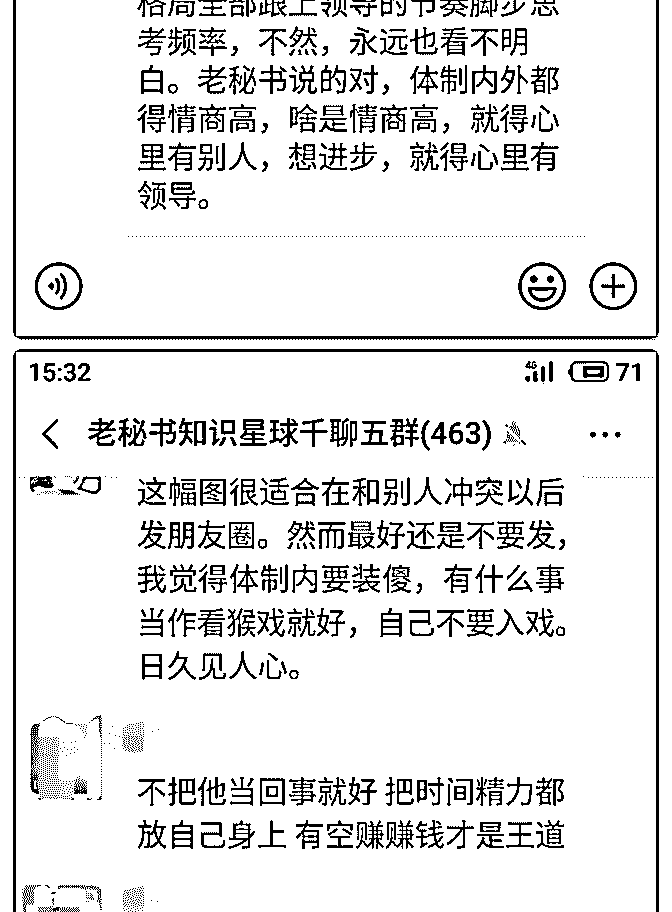

# 会员群里的聊天，我

老秘书（答疑专用） : 会员群里的聊天，我有空的时候也会偶 尔看一看，当作放松。今天会员群里有几个人的发言，我觉 得说得特别好，贴上来分享给大家。

其实一个群就像一个单位，如果大家都积极向上，互相帮 助，乐于分享，群的氛围就会很好。如果一个群大家都吐槽 抱怨，抱团取暖，怼天怼地，群就会乌烟瘴气，充满负能 量。

后台每天的问题都非常多，我没有那么多的时间全部回答， 大家多自己思考，自己总结，自己开悟。

2019-02-21(56 赞)

评论区：

小糊涂仙 : 牛人很多，自己修行还是远远不够啊，他人皆地狱，尤其是真心认可领导和他人的长处和能力，实为内心的大

转换。

紫水晶 : 受益匪浅

走西口 : 想问问新手怎么进群[皱眉]谢谢群主和各位大大

老秘书（答疑专用） : 看星球置顶的两条通知

