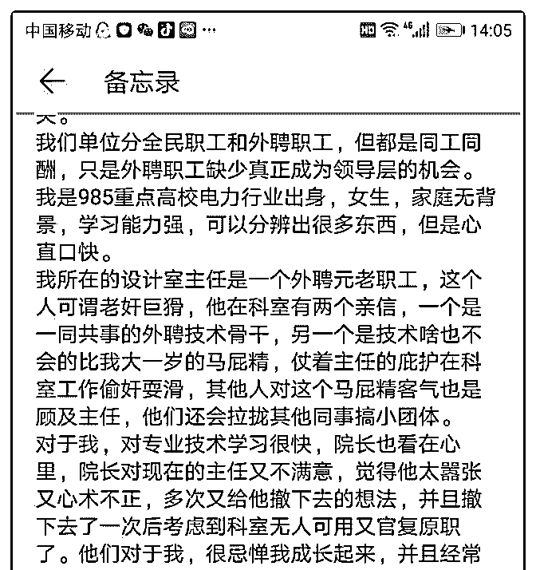
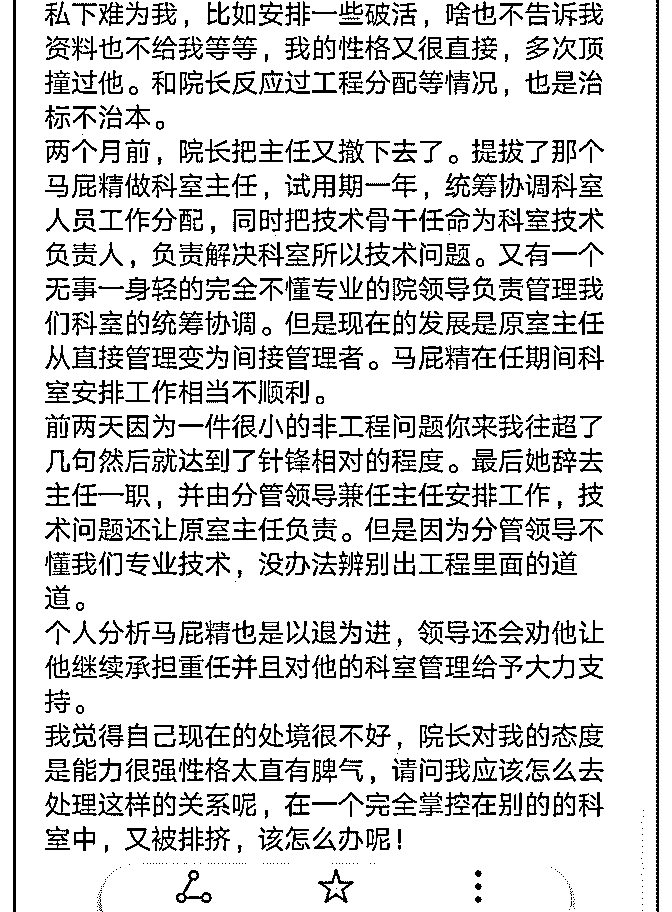

# 老秘书您好。我在职

(提问)认真的爱豆 : 老秘书您好。我在职场摸爬滚打几年，听 了您的课觉得是踩雷无数。现在的确遇到麻烦，望您费心帮 助解惑。

2019-01-19

回答：谢谢付费。在体制内，作为一个资历尚浅的新人，一

定要低调，谦虚，服从管理，不然的话就容易枪打出头鸟，

木秀于林风必摧之。 职场上的能力，不仅仅指学历和干事的

能力，还包括团结人的能力，处理和协调各方面关系的能

力，哪怕以后你当了领导，也不能依着自己的性格来，你手

下可能会有刺头、有不想干事的，与其他处室也会有利益纷

争，这些都需要人际关系处理的情商。 沟通协调，不仅仅是

能团结与自己价值观、知识、能力、水平、为人一致的人，

更重要的是要能团结价值观和知识能力水平不如自己的人，

人很难靠单打独斗成功。 体制内的职位本来就是僧多粥少，

如果你工作能力强，就会威胁到别人的利益，如果你又得罪

了人，别人就会更不愿意看到你爬上去。如果周围的人都排

挤你，众口铄金也能积毁销骨，领导也不敢把你提拔上去，

否则难以服众。 你要做的就是学一学中庸之道，隐忍、低

调、蛰伏，能成大事的人都是能屈能伸的。工作上继续提升

能力，把该学的知识和技能都学到，该经历的场面都经历一

遍，深挖洞、广积粮，以时间换空间。 上下级服从上级是职

场必须遵守的规矩，你要把锋芒收一收，尽量与领导和同事

都搞好关系，你不服管、不把领导放在眼里，或者看不起他

们，其实他们都能感觉到的，他们会把你当做对立面来对

待。 在对上的关系上，你要让领导看到你的工作能力的同

时，也看到你在为人处世上的变化，职场上不像在学校，很

多事都不能随心所欲。他们工作能力不行，你迟早能上去，

但是要有耐心。 不管是平凡人还是伟人，一生的大部分时间

都要在等待、忍耐和熬当中度过。而越是能成大事的人，越

是要心胸比一般人宽广，眼光也比一般人长远，忍耐能力比 一般人要强。(65 赞)

评论区：

秘粉 : 老秘书这段话我感觉也是写给我的，真想背下来

老秘书（答疑专用） : 期末要考

老秘书（答疑专用） : 感谢两位打赏的同学

嘟嘟 : 深挖洞，广积粮，我要把这段文字背下来

妃子笑 : 听了老秘书千聊的五十多节课，目前在第二遍细细咀嚼的过程，有的课听了三遍五遍。语音会方便碎片化学习，

昨天加入星球，看到精华区的问答，感觉文字更让人沉下心来思考，这便是悟道的开始，但对于个人而言，犹未为晚。这

半年的心路磨练感谢有老秘书的指引，不仅治愈个人起伏的情绪，最重要的告诉我们树立好的心态，要看穿本质，抓住底

层逻辑进行深度思考，抓住提升自己的核心要素，知行合一地去磨砺自己。

