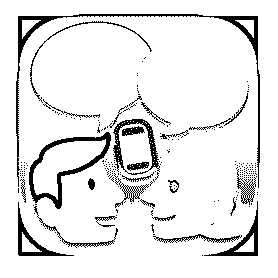

# 去日本旅游的话，推

Fenng : 去日本旅游的话，推荐一款翻译工具。日本人做的， 朴实无华。比较好用。 VoiceTra 来自 NICT

2019-05-09(37 赞)

评论区：

桜木 : 什么工具

张萌萌 : 什么名字啊？

张 3 疯 one : 什么名字呢

达ོ达ོ在简单 : 同上[捂脸]

Lr. : VoiceTra 陈德荣 : 真好 後生仔 : 这个很好

文 : 不错，已下载，以前每次用百度和谷歌翻译来判断是否有问题，翻译再反向翻译

