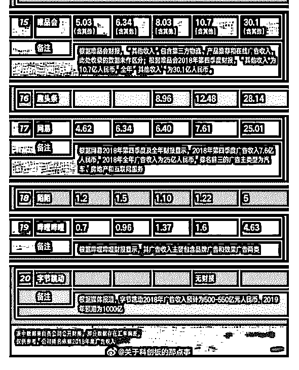

# 互联网巨头们 201

Shayne 郭啸飞 : 互联网巨头们 2018 年广告营收一览表！

2019-04-24(32 赞)

评论区：

Fenng : 这个有意思。

Fenng : 参见我之前发的这条

Shayne 郭啸飞 : 谢谢 Fenng 大补充

Fenng : 腾讯广告部门说自己营收没那么多。这个数据略存疑。

Shayne 郭啸飞 : 是的，结合你的内容，头条，百度，阿里这块的数据基本接近。腾讯的出入非常大，也缺乏财报的注解，仅

供参考吧

H : [网赚、兼职、减肥药，诈骗传销帮凶的源头竟是](https://mp.weixin.qq.com/s/eKlaC6iB4depfj6lAwC3_g)[360](https://mp.weixin.qq.com/s/eKlaC6iB4depfj6lAwC3_g)[？](https://mp.weixin.qq.com/s/eKlaC6iB4depfj6lAwC3_g)

苏勇 : 按照现在进度，大约在 2020 年头条和百度在国内的广告应收就差不多啦

圈圈 : 没想到

Fenng : 常看常新

2019-04-16(92 赞)