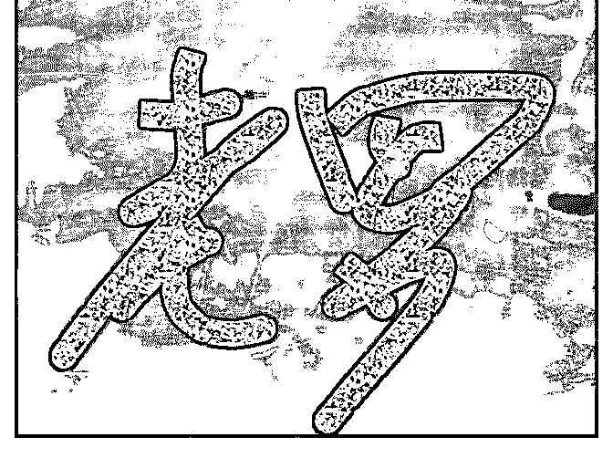

# 虽然老罗做手机不那

小曹老师 : 虽然老罗做手机不那么靠谱，但也有几个事，之前 也和朋友聊过… 1，老罗的办公电脑全部正版 windows 系统， 搞的微软那感动的，送了很多授权… 2，发布会延迟了，现场 音乐多播了几遍，立马安排人给版权沟通和付款。 #吓的我都 没图发了#

2019-04-11(42 赞)

评论区：

Kyle : 没错，付费意识很强，从来不白嫖

池建强 : 我在锤子时大部分都是 Mac，少有 Windows，不过都是正版。发布会延迟这种小细节，比准时开发布会和正常发

货，重要性小一千倍。 细节是魔鬼，别被魔鬼毁了

张大鹏 : 就是因为成本太高搞死了自己

Sirormy : 注重细节却没有把重要的事做好。

木心 : 发布会准点开始自然要重要的多。不过对一些“不重要”的小细节的态度，才能真正显出对公司文化的尊重吧。不知道

池大现在创业了，对建立公司文化怎么看？

ran : 记得才出来带我入门师傅经常对我说:“不要在意细节”。细节在某些背景下真是魔鬼

Peter : 老罗做手机哪里不靠谱了？ 依赖于中国强大的电子代工产业，以及老罗和员工们的努力，锤子的每款手机都博得了

设计界的好评，我自己用过的 M1L，坚果，都认为没什么可挑剔的。

池建强 : 我们全公司正版，发布会技术大会从来按时开，一秒不差。哈哈，另外我们每年捐助慈善，只是不爱说。

