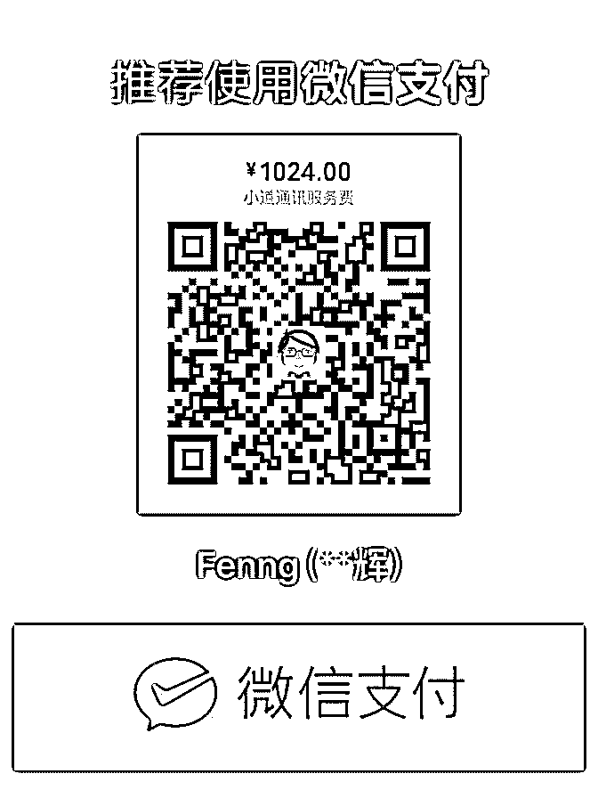

# 小道通讯的订阅说明

Fenng : 小道通讯的订阅说明 2018 版 何为「小道通讯」？这 是我创建的一个服务，已经满三周年。 小道通讯目前采用

「邮件列表」的形式。不定期发布我写的文章，在别的地方 看不到的内容，我的目标是：提供稀缺的有价值的内容。什 么是有价值的内容？对读者要有启发，要能转化为商业价 值。 这个服务适合哪些人？创业者，想投身创业的人，关注 技术创新领域的人，风险投资从业者等群体。 我并不认为这 是知识付费，更认为这是一个实验，一个坚持了三年的实 验。从这个实验的过程里，我也学到了很多，更能理解人的 行为，更理解人性。 要不要订阅？如果你看到订阅费用后觉 得犹豫，建议不要订阅了。经济条件紧张的学生和刚毕业参 加工作的人，或许也不适合订阅。 服务费用： 1024 人民币/ 人，长期有效。已经发布过的内容，我会把历史文章手动同 步给你。 订阅方法： 可以选择微信支付。也可以选择打款给 我的支付宝账号。下面附有二维码。付款后记得发一封邮件 到这个邮箱，记得附上截图： dbanotes@gmail.com 订阅前请 三思，订阅后恕不退款。作为服务提供方，应该允许我有一 点解释权，手动维护退款实在是太麻烦了，多谢你。

2018-10-04(61 赞)

评论区：

蓝客老林 : 当年老妹收到邮件老要服务我，被我“气”得差点要退款[偷笑]

Fenng : 真要耐心编辑一篇文章，就能找到编辑器不足的很多地方。要学怎么做产品，没有那么难，把每个产品功能，反复

体验，找出直觉上有问题的地方。就够了。

肖平亮 Sean : 最近更新不太勤，不过一直做下去就好

寇闹 : 同感

Alex 王伟健 : 最简单也不困难

刘容 Liurong : 还不错

麦兜：金融律师 V：g* : 邮件已发，请查收。

