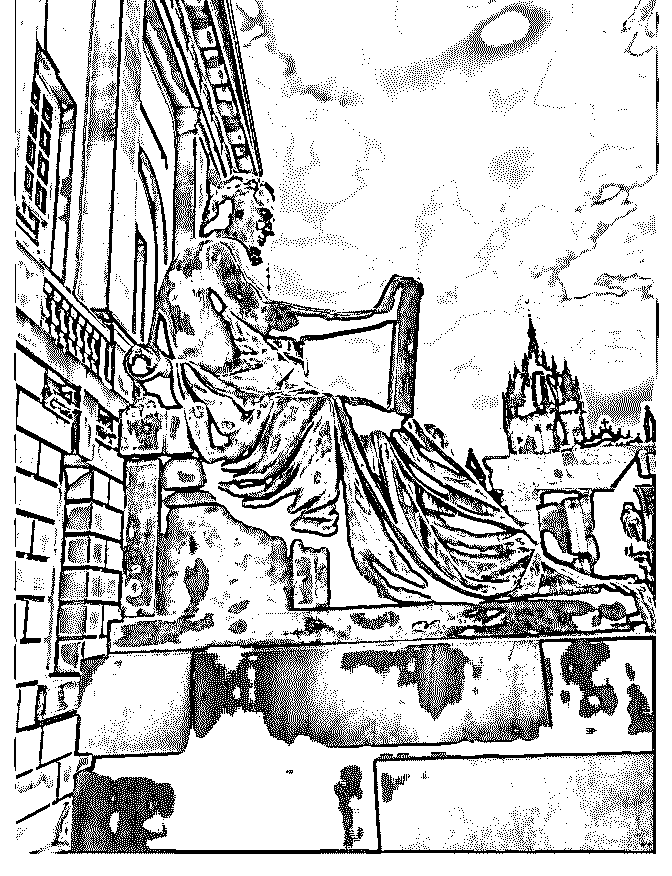

# 这次苏格兰最开心的

大象 : 这次苏格兰最开心的是找到大卫休谟和亚当斯密的墓。 两位值得跪拜的先知。牛顿找到了自然的原理，休谟发现道 德和人性的原理，斯密揭示的是经济运行的原理。奇怪的 是，在苏格兰洛克似乎没有受到足够的关注。有一本很好的 书叫《苏格兰人如何发现现代世界》，国内一直没找到。 2018-08-20(35 赞)

评论区：

Fenng : 我买给你

大象 : 哪有？台湾香港都没

Fenng : 等着收货。

赵六六的小宇宙 : 亚马逊有，是中译版名称《苏格兰，现代文明的起点》

大象 : 怪不得找不到

