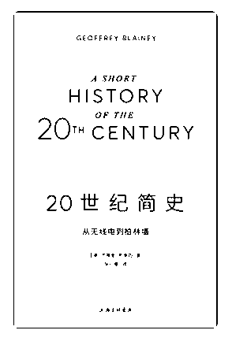

# 荐书：《20 世纪

Fenng : 荐书：《20 世纪简史：从无线电到柏林墙》 最近看完 的书里。这本书还是值得读。过去的 20 世纪，我们知道发生 了一战、二战、冷战、全球化。但一战产生的根源，希特勒 为什么能崛起，欧洲国家的形成，苏联的崩溃，很多事情的 逻辑不是很清晰。 这本书不是百科全书，很薄。作者能把不 少事情阐述清楚，很有笔力，给了我不少启发。

2018-08-05(25 赞)

评论区：

Fenng : 在群里尽量不要传播盗版信息。

毅 : 618 买了十来本书，一本看完，感觉收获不大，是再看一遍，还是接着看另一本书呢？我看书很慢，一个多月才看完博

多的财务自由之路，再拖着其他书不知道什么时候能看完

西拉卡瓦 : 我发的是京东阅读电子书购买链接，真的要花钱买的

