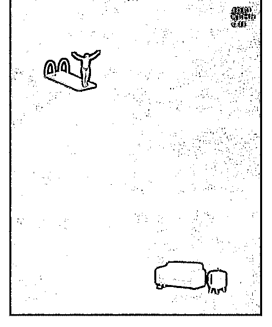

# 以前我在微博上说，

Fenng : 以前我在微博上说，微博应该允许写 140 字以上的内 容，还应该修改微博内容。一些产品经理故作聪明的反驳 说，谁总写长微博？修改内容干啥，修改一个字，就会引起 原文含义改变。有人恶作剧咋办？ 还有的脑残人说，你懂个 屁，你看推特还是 140 字儿。 给微信公众号提建议，允许修 改错别字，他们说，万一允许修改内容，有人用来诈骗咋 办？发反动内容咋办？ 后来，推特允许发长内容了。微博也 允许超过 140 字儿了，也允许修改内容了。然后出问题了 吗？妈的，用户等这个功能望眼欲穿了都。 很多时候，产品 经理担心的事情根本就不会发生。为啥我这么肯定呢？我是 用户啊。用户要做坏事，怎么都能做，还在乎这点使用成 本？ 担心用户做坏事，就不做功能上的改进，是非常愚蠢 的。也是大多数产品经理永远不明白的事情。除非他们成了 资深用户。

2018-07-21(121 赞)

评论区： 蓝客老林 : 盗图了

马辉 : 我做开发时 也是这种牛角尖 猛小蛇 : 大辉成语故事：因噎废 ture 谢晟廷 : 产品在不同阶段，有不同的目标

雷志伟 : 担心是真实存在的，但产品经理不是想这么解决这个担心，更不愿意承担这个风险。

紫宸飘絮.╮(╯3╰* : 这个事情深有同感，比如我们单位的制式合同文本，我建议直接把电子版的发下去让大家使用，毕竟

印刷出来手工填写太费劲了，可是某些部门非不让，说怕他们篡改内容，妈蛋的我说人家想干坏事的扫描了 ocr 识别不就得

了，实在不会的手工敲出来也行啊，大家猜他们怎么说。那是他们主动造假的，出事了找不到我们。估计微博的决策者也

是这么想的。

黄万钧 : 说的太对啦

Tiutiu 肚 : 没有什么是不能打破的

