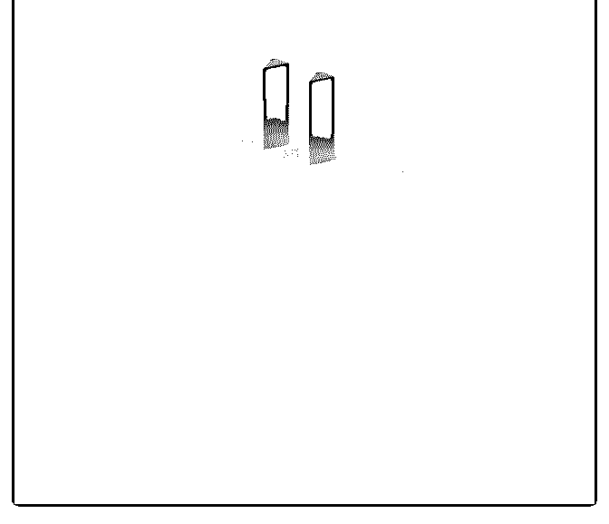
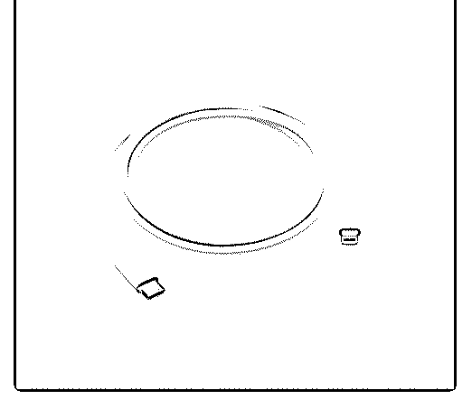

# 锤科的「坚果 Qu

Fenng : 锤科的「坚果 QuickCharge 4+ 快速充电器」 RMB 59

+ 苹果官方的「USB-C 转闪电连接线」，RMB 147 好用。 最

近一段时间 iPhone X 充电慢已经耽误不少事了。 手机快充是

必要的。

2018-06-20(29 赞)

评论区：

大副 : 线太贵了，头可以用 mac 的充电头

某烁 : 不如一步到位上小米 45w 的快充头，还能给 ipad pro 快充

明明同学 : 还能给 macbook 冲

高银 : 这种快充对手机电池有伤害嘛？

一边 : 坚果 QuickCharge 4+ + 官方 USB-C 30 分钟能充电百分之多少？我这实测 30 分钟从 11%冲到了 34%，期间未解锁开屏使

用手机，我买的是假货么~

Fenng : 你买错了吧。充满哪要 30 分钟。

上海滩法学生夏百顺 : 买了好几个背夹充电宝，大辉可以试试看，每个能有八九千毫安，一般来说带一个背夹直接和手机

合体高强度用一天问题不大

