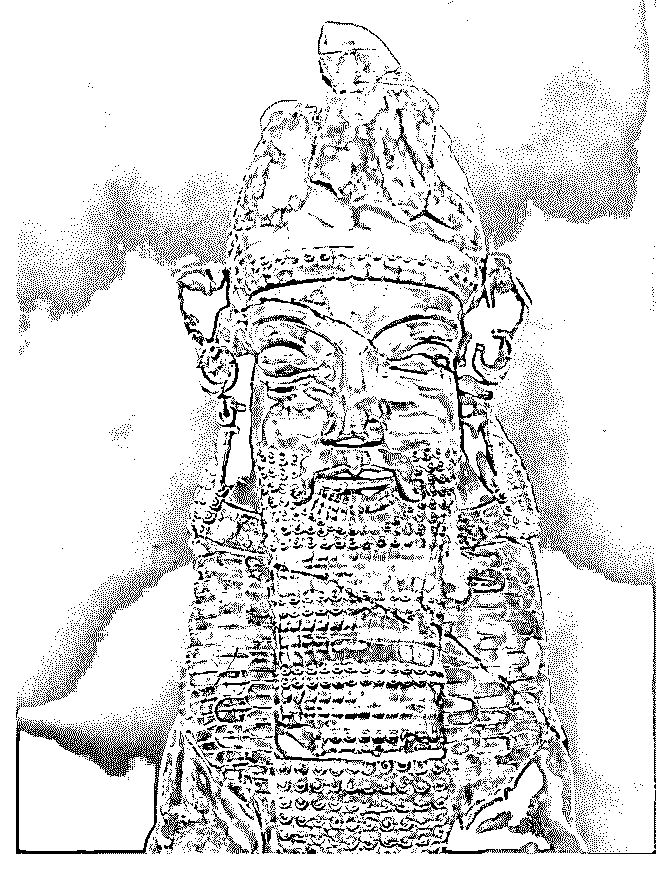

# 分享话题：伊朗归来

Fenng : 分享话题：伊朗归来谈伊朗 这几天中兴的事件引发了 不少关注，而中兴恰恰是因为违反了美国对伊朗禁运原则导 致被处罚。 真实世界里的伊朗是什么样子呢？前不久我恰好 去过，分享一下所见所闻。 文字直播。

2018-04-22(177 赞)

评论区：

Fenng : 今日伊朗对世界的面貌，主要由「1979 年革命」塑造而成。革命之前，伊朗的巴列维王朝是亲美的；革命后，巴列

维王朝被推翻，伊朗成为美国的敌对势力。这种美国的敌对势力还包括：利比亚，朝鲜，叙利亚等。在办理美国签证的时

候会有提示。

Fenng : 因为行文方便，避免不必要的麻烦，以下一律称「1979 年革命」，这个革命的起因和后续影响，你搜索便知。今日

伊朗，依然能看到大量的 1979 年以前的陈迹，无声的显示昔日的景象。如今的伊朗，随处可见宗教领袖的肖像。一共两

位，霍梅尼和哈梅内伊。

Fenng : 人口如今已经超过八千万。1979 年人口不足 4000 万。人口极度年轻化，30 岁以下人口占比 60 以上（各种数据不统

一，也有 2/3, 75% 一说)。这么多的年轻人，饮酒、跳舞等娱乐活动是禁止的。互联网是伊朗人娱乐的一大入口。

Fenng : 互联网管控也非常严重。我们国内正常访问不了的 Facebook 、Twitter 等，在那边也不能正常使用。甚至，要使用微

信公众平台的服务都要翻。中兴卖给伊朗的设备就是干这个的。消息来源：公开报道。

Fenng : 漫游过去的手机网络速度略高于 3G 水平，但不够稳定。一些可以有 Wi-Fi 的公开场所，速度都很慢。聊胜于无。当

地人所用 4G 服务网络要好一些，如果按照流量包买的话，比中国贵。考虑到伊朗的收入，费用算是高昂了。

Fenng : 从网上了解到的伊朗人均 GDP 接近 5000 美元。按照这个数字，比中国没差到哪里去。但是，因为美国制裁，实际

上伊朗人要比这个穷。国内经济并不好。具体体现在，对美元的汇率，波动巨大。我去的那天，100 美元可以兑换 480 万，

隔天，就是 560 万了。人民币在哪边没人认，国际货币主要是欧元和美元。欧元在大多数地方都可以用（以游客的活动范

围看）。

Fenng : 城市里的年轻人买不起房。伊朗房价非常贵。租房，也不便宜。租房缴的押金越多，房租越便宜。为什么这样？因

为银行存款利息有 15-25%，国内这些现金贷，跟人家这银行一笔，根本不算个啥。

Fenng : 伊朗禁酒。当然全国都没有酒卖，即使有所谓的啤酒也都是没有酒精的。大概是没有酒喝，伊朗人倒是非常能吃

「糖」。酒店的茶水吧里面放着很多白糖，那种小块状的，喝茶用。餐桌上也都是糖。顿顿饭都有可乐。可口可乐和百事

可乐都有，名字略有修改，但口味还是正宗。虽然没有酒精这样能让人上瘾的东西，可是，糖同样让人上瘾啊。

