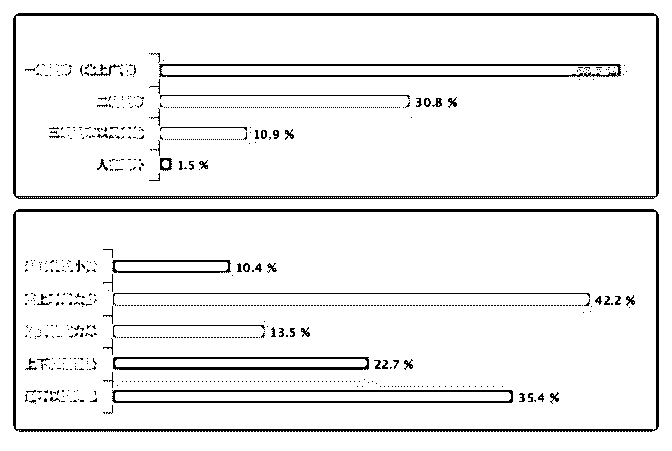
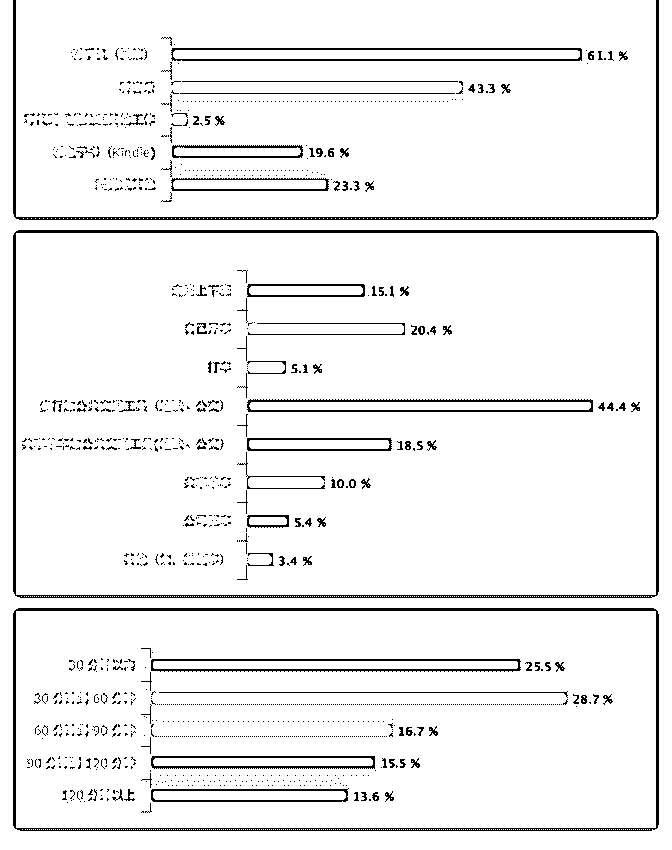

# 通勤调查数据报告，

Fenng : 通勤调查数据报告，注意提到出租车的那个，数据是 有误差的。

2017-12-03(6 赞)

评论区：

wythe : 原来这么多半个小时以内，还那么多北上广的人

阿彪 : 颜色搭配真漂亮

SmartAI : 总共多少人参加投票？

Chauncy : 图五是单程的时间还是来回加起来的？

三哥 : 累到精疲力尽和通勤时间 120 分钟以上的数据吻合。 很不幸，我在里面。[大哭]

积木's By : 北上广半小时以内的，是不是都是单身！？不然不可能啊，大家说对！

Peter : 从公司到家，地铁+步行，半小时左右。但早上为了避免挤地铁，我一般 7 点 10 分出门，然后慢悠悠的吃个早餐[呲牙]

天才火柴 : 坐标北京，买不起房，为了对自己好一点，租在了公司门口[擦汗] 一线城市 30 分钟以内的大都如此吧

