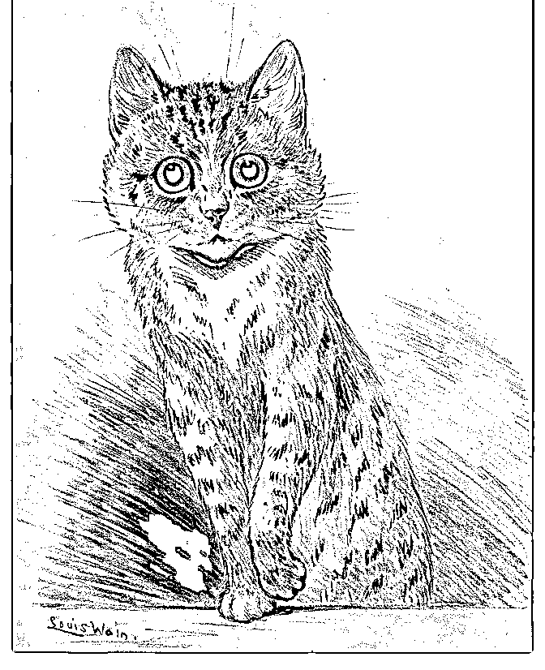

# 谈谈中小公司里的团

Fenng : 谈谈中小公司里的团队管理的体会和建议 有朋友可能 有些疑惑，说你大言不惭谈中小公司里的团队管理，你管理 过几个人？有啥出色业绩出来讲？我经历的不多，但是观察 的多，看过的多，收到的反馈多（微信公众号），分析的细 节也不少，这些东西，趁着有兴致写下来，还有点价值，改 天意兴阑珊，也就忘到脑后去了。

2017-08-12(270 赞)

评论区：

Fenng : 什么是中小公司？按照人头算吧，这里简单的把 500 人以下的公司定义为中小公司。其实几千人的公司，如果按照

500 人一个事业部划分的话，一个负责人面对的也依然是中小公司。从管理机制上看，即使是中大型公司，有些人的管理

方式也依然是中小公司的模式。而有些中小公司，反而在套用大型公司的管理方式。

Fenng : 什么阶段的公司最头疼管理？发展了数年的公司，公司死不了，但是也爆发不到哪里去，创始人困惑，中层迷糊，

一线员工混日子，看主管脸色办事儿。这时候，创始人和 CEO 就想琢磨如何通过管理来让公司更好，然后呢？创始人就到

处去上课去了，听商学院教授讲，听成功大佬讲，听一些顾问神棍讲，讲完了心痒痒，回公司告诉几个高管，你们也去，

高管去上完了，这个公司员工日子就都不好过了…我们身边这种例子太多了。

Fenng : 初创公司其实多数时候管理问题都没那么严重。一般创业失败的公司，可能更多是现金流断了才清算，倒是少有听

说因为管理有问题让公司崩盘的。但有趣的是，创业公司也有管理问题 -- 过度管理。

Fenng : 还有些人，迷恋 PDP、九型人格、MBTI 之类的伪理论不能自拔，当然，更糟的还有人通过星座来管理团队的… 值

得嘲讽的是，这些伪理论大多披着 MBA 课程的名义传播。

Fenng : 伪理论（有些人还不同意）其实很有市场。别说这个，就看看机场书店电视上那些管理大师的讲座，用易经五行管

理公司的，还有线下刘一秒们的讲座，观众如痴如醉，很疯狂啊。每次大课之后的精品晋级课程卖得很火有木有？

Fenng : 为什么说这些是垃圾呢？很简单，他们在管理上是无用的，是本末倒置的。为什么判定一个人的领导力要先得知他

是九型人格的哪一种？为什么一个人来求职要给他做性格测试？当一个团队用这种思路去管理的话，必然会引发管理上的

灾难。

Fenng : 按理说，这些公司的创始人都是一些聪明人，为什么还看不明白这个事情呢？我曾经也觉得不会这样，但后来想明

白了这个事情。如果一个创始人，他没在一个正规管理的公司工作过，遇到了管理困境的话，他可能的确不知道怎么办，

如果这时候他又没有一个管理上的长期顾问或是导师，他就会走出去寻找答案。一走出去就会掉进坑里，反而会陷入社交

圈，最后忘了初衷。

Fenng : 要管理好一个团队很难，要把一个团队管理得很糟糕，可能只需要几件事： 1.开会，每天每日每周，下班后开会，

周六周日再来个管理会… 2.每天写工作汇报，给上级讲 PPT 汇报工作 3.上班打卡，迟到扣钱 做完这几件事情之后，管理者

很舒服，团队成员心就乱了，就烦了。 但是，以上这几件事恰恰是不少管理者最喜欢做的事情，也是一些所谓的管理课程

百讲不厌的东西。

