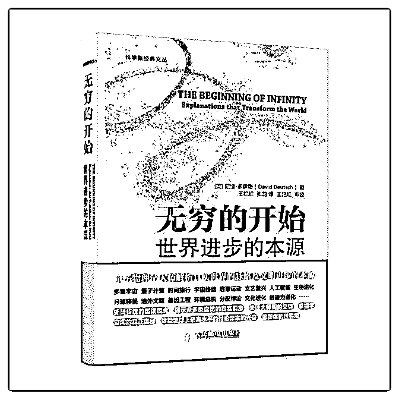

# 荐书：《无穷的开始

Fenng : 荐书：《无穷的开始》 世界的进步是一些事物得到了

「好的解释」，作者也对于社会进步也给出了很多好的解

释。 作者笔下的乐观原则是：所有的恶都是知识不足造成

的。 {和基因一样，迷米（Meme，也翻译做迷因，「一种可

以自我复制的文化要素」）也是 “自私” 的。迷米的进化未必

有利于持有者或者其所属的社会，甚至同样未必有利于它们

自己。损害社会的迷米是一种熟悉的现象，你只需想想你最

憎恶的政治观点或者宗教，它们的追随者所造成的伤害。一

些最擅长在人群中传播的迷米对社会有害，已经导致多个社

会的毁灭。} 中医、反转基因、国学，这些裹脚布为什么还能

流传而且还有众多拥趸？是因为文化迷米的进化。这种是所

谓「损害社会的迷米」，很难从一些蠢货的脑袋里清除出

去。和基因一样，这类 Meme 包含可以让自身得到复制的知

识，被大脑记住（比如：没有中医哪有中国人）。 这类

Meme 会让社会变成静态社会。 {文艺复兴出现之前的人类社

会都是静态社会，人类在这漫长的历史过程中几乎没有发生

任何改变。造成静态社会的主因是迷米，迷米的进化倾向于

使迷米保持静态。实现静态社会的手段永远是 --- 而且只能是

--- 毁掉新思想的源头，即人的创造力。因此静态社会永远有

着把孩子培养得丧失创造力和批评力的传统。} {只有一种思

维方式有能力取得进步或者长久生存，那就是通过创造力和

批评寻求好解释的方式。我们要面对的东西，无论如何都是

无穷。我们能选择的只有：是无穷的无知还是无穷的知识，

是错误还是正确，是死亡还是生存。世界最终是否有意义，

取决于人 -- 与我们相似的人 -- 选择怎样去思考和行动。} 作

者: [英] 戴维 · 多伊奇 出版社: 人民邮电出版社 副标题: 世界

进步的本源 原作名: The Beginning of Infinity: Explanations That

Transform the World 译者: 王艳红 / 张韵 出版年: 2014-11 页数:

530 定价: 59.00 元 装帧: 平装 丛书: 科学新经典文丛 ISBN:

9787115365385

2017-05-26(75 赞)

评论区：

龙哥 : 从未接触过的观点，看来值得读

胜胜 : 赶脚冯大每天要看好多东西哇

乐悦传媒 : 我居然去金东买了

何金龙 : 终于有点懂“小国寡民，老死不相往来”了。

飘柔 o 自信 : 中国法律是不是也是静止的

瓦瓦瓦特 * : 在某公众号看过同一个概念，不过翻译成文化模因（Meme）。

