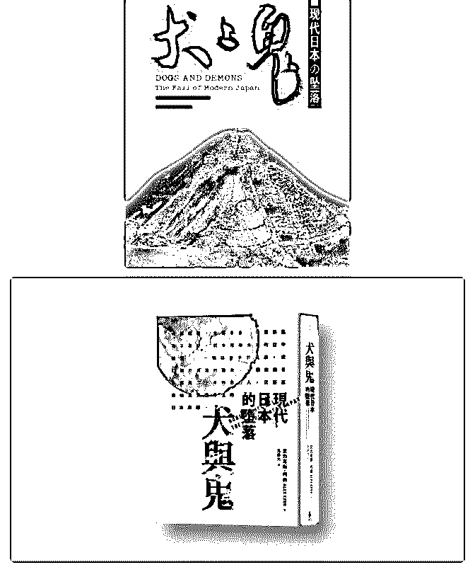

# 近期读书之 《犬与

Fenng : 近期读书之 《犬与鬼：现代日本的坠落》 很偶然看到 这本书的信息：去日本的几次，观察到日本大街小巷林立的 电线杆和蛛网般的电线，很好奇，日本为什么会忍受这样的 事物客观存在，与日本人的审美截然对立。然后找到这本书 里的解释。 对书产生了好奇，这本书国内 2006 年出版，已经 绝版，就买了一本盗印的回来。也下载了电子版，但是内容 不全。 作者所批评的日本和当下的中国非常相像，落后低效 的官僚机构，大兴土木搞建筑，粗鄙的审美，不惜污染环境 求发展，肆无忌惮的破坏古建筑，泡沫经济催生的盲目自 信…从这个角度上看，这本书是值得看的。这个日本，跟我 们现在去日本看到的，好像是两个国家。 基本信息： 作者： 阿列克斯 • 科尔（Alex Kerr） 译者：周保雄 装帧：简装 开 本：16 开 页数：284 页 出版：中信出版社 ISBN：7-5086- 0577-2 书的封面做的很垃圾（！），台版的封面也一般般。 买不到就不要买了。

2017-03-11(14 赞)

评论区：

lorraine : 中信出的书前后能保持翻译一致都要感谢了 封面装帧等审美一直不敢强求

sophie : 中国和日本很多情况很相似，所以看日本一些书就感觉在坐时光机看中国的未来似的。看日本三浦展写的《第 4 消

费时代》这本书时就有这样的感觉。

猛小蛇 : 《纽约时报一百年》里，上世纪初纽约街头也是电线如织遮天蔽日，很多是电话线……

YU : 我看看能买到不

刘翔 : 想看看。。。

Rex-文文日 : 去买本瞅瞅

