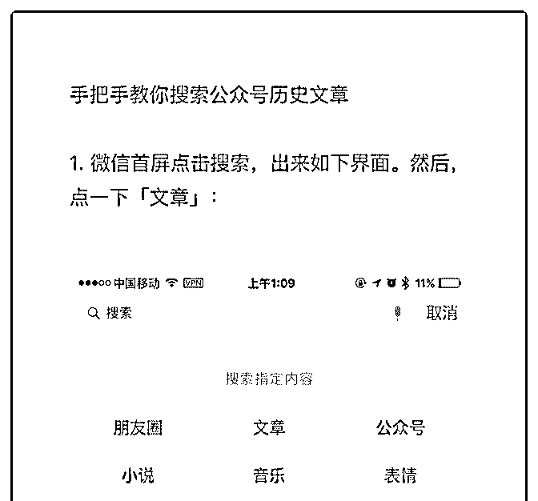
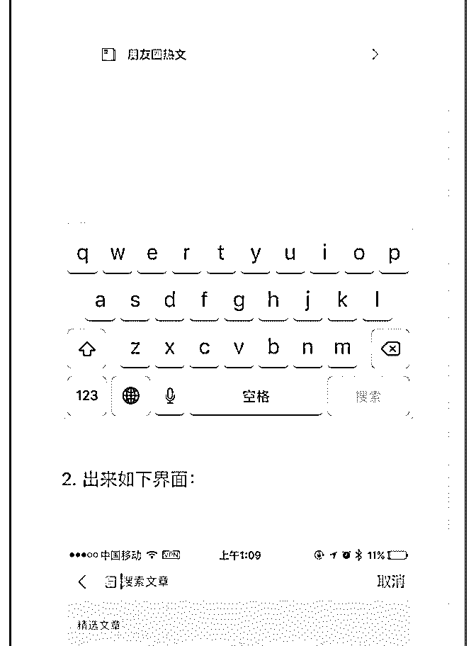
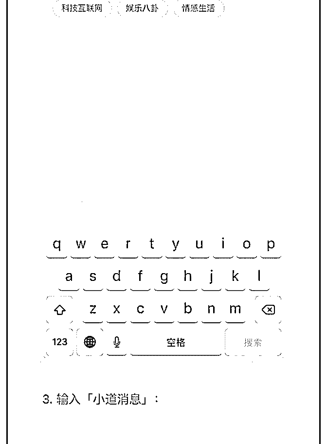
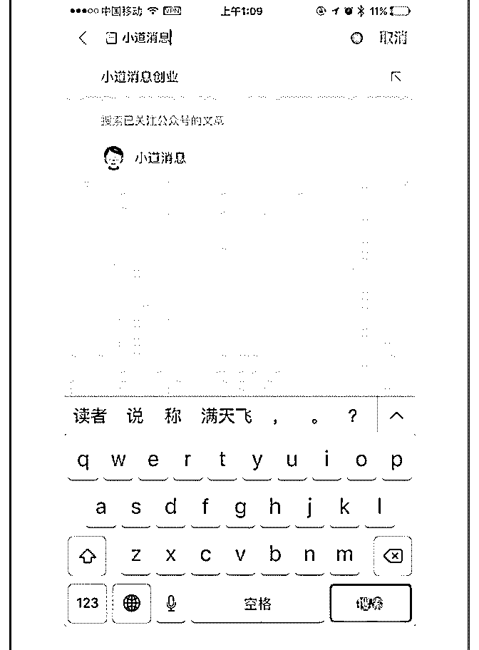
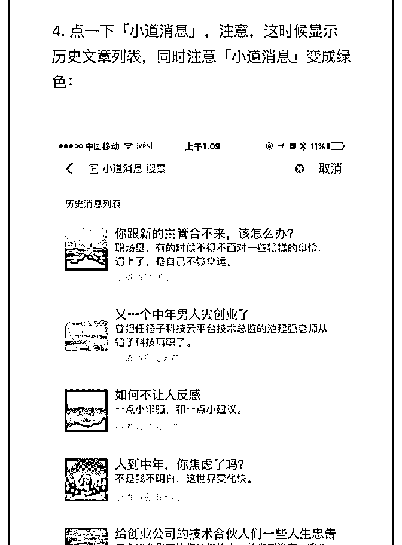
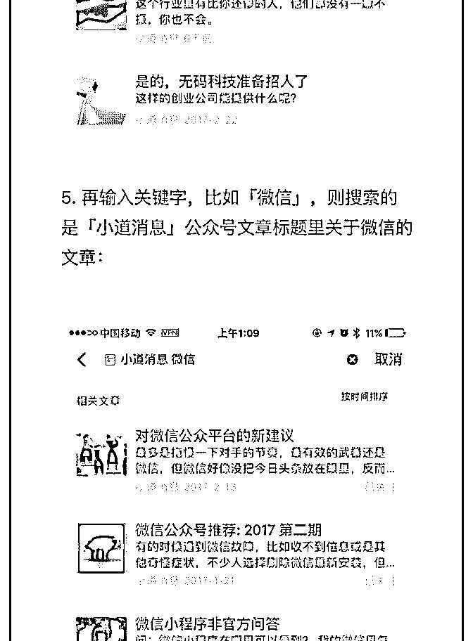
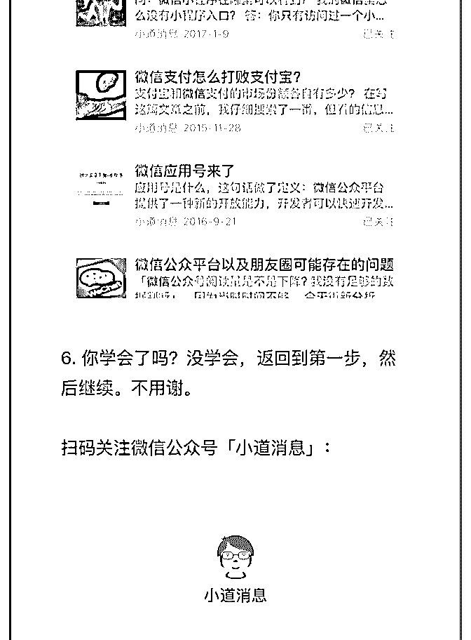

# 手把手教你怎么搜索

Fenng : 手把手教你怎么搜索公众号历史文章

2017-03-01(79 赞)

评论区： 三表 : 受教了

陈潇 : 这个和 chrome 浏览器输网址按 tab 自动变网站搜索的设计竟然是一样的啊 Sissel : 太棒了

吐槽喵星人 : 学习了一个

条形马 : 嗯，拿去群里科普科普别人，惠及一下小伙伴。

tony : 掌握各种搜索功能 提高信息处理效率

王剑 : 微信的这个搜索也是用的 elasticsearch 吗？

凯凯 : 能推荐些好的公众号吗

Fenng : 找人

2017-02-21(39 赞)

关注公众号"懒人找资源"，星球资源一站式服务