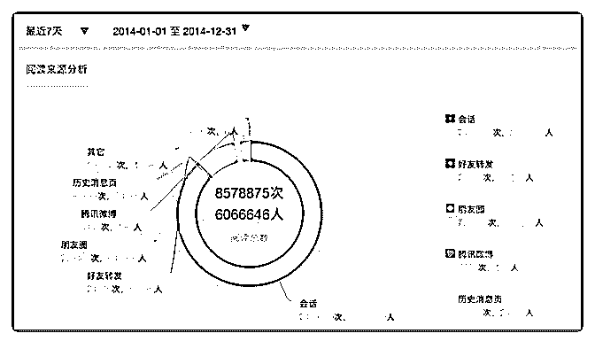
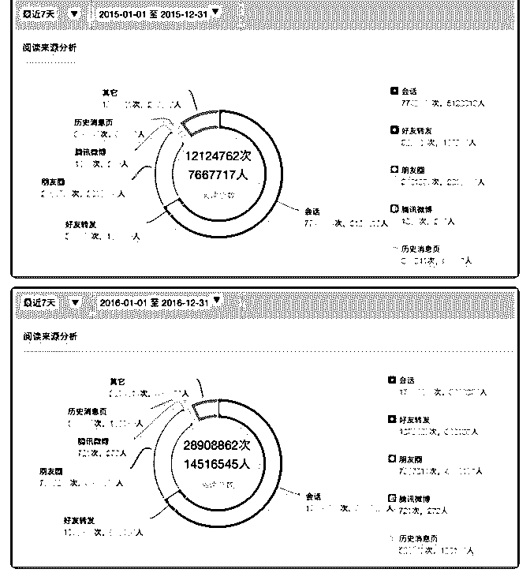

# 发几张图吧。过去三

Fenng : 发几张图吧。过去三年，「小道消息」公众号阅读 量。本来这些数据不应该公开的，现在觉得无所谓了。数据 开源。 这里面能得到很有趣的一些结论，需要你自己分析。 2017-01-02(67 赞)

评论区：

ler : 居然腾讯微博还有数据

曾革 : 666

Ric 陆炜俊 : 会话指的是 公众号直接推送打开吧？

圈主 : 看了下自己的，不足大辉老师的 1/10。

tinyivc : 冯叔好赞！这些数据好有内涵

梁帅 : 期待道叔，通过这三张图写一篇文章，想看您的思考角度。

Wayne : 收入有没有一个大概的数据，比如转化率。

