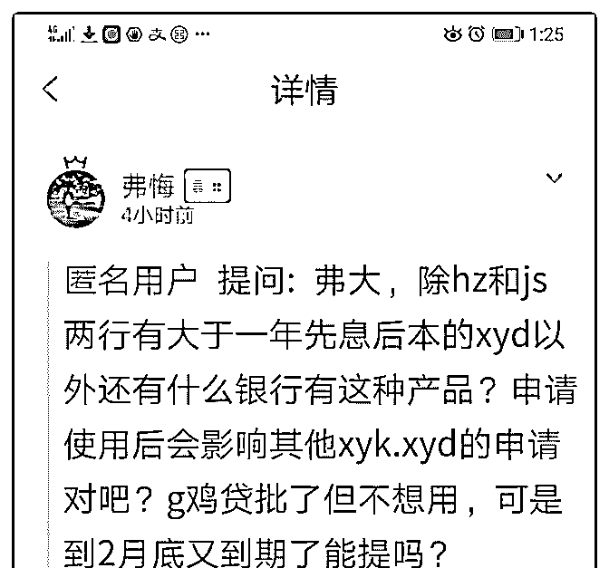
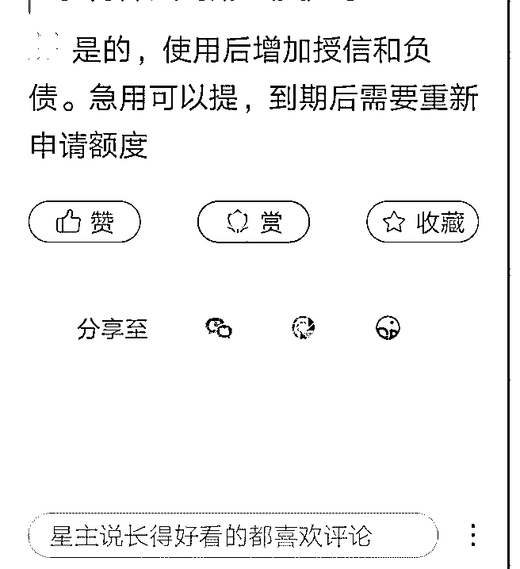

# 请问我申下 hz 的公

(提问)匿名用户 : 请问我申下 hz 的公 j 贷 30W，不取 2 月末银行 就收回去啦！问如果我还想下其他 yh 的 xyk 我是不是不取公 j 贷 为好？如果不取以后会不会再也申请不到了？

2019-01-25

回答：可以申请完 xyk 后再取公 jd，或者使用公 jd 后卡在征 xin

更新前申请 xyk。 重新申请会查征 xin，征 xin 要求和资质符合

的话还是可以下的。(1 赞)

