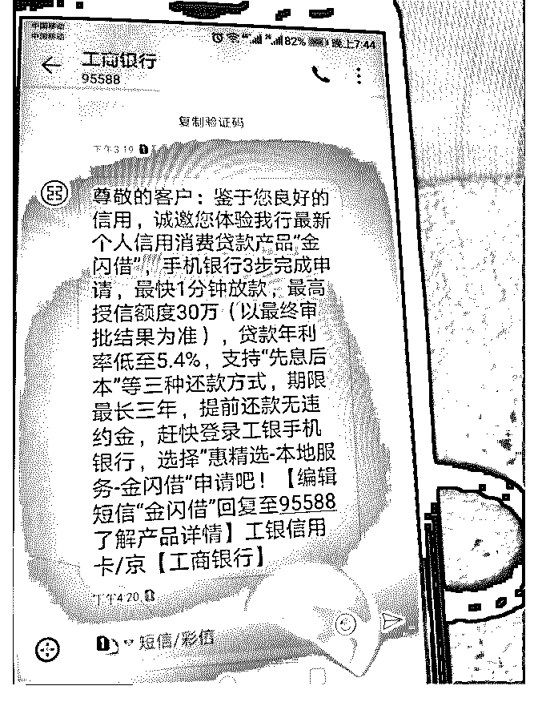

# 上个月去工行网点将

(提问)匿名用户 : 上个月去工行网点将老储蓄卡降为二类卡， 新办了一张住房公积金联名卡（住房公积金封顶交的），前 天收到一条工行“金闪借”短信。 其他情况：最近在办理中行按揭，批贷函已出；同时办理的 工行税费卡已寄卡到网点最终批卡额度未知；近两个月信用 卡审批次数 7 次，近半年 9 次。

提问：要不要借着“金闪借”这个机会，曲线提一下工行香白 2 万的 ED。还是等中行按揭贷款放款后还了一期房贷再操作？

2018-11-18

回答：最近查询过多，有一定影响，可等按揭放款后再操

作，按揭是加分项。(0 赞)

