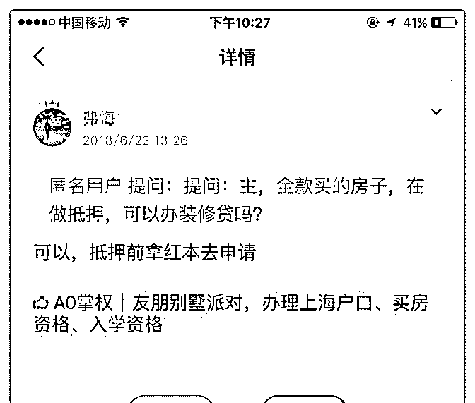

# 好奇的问一下，抵押

(提问)匿名用户 : 好奇的问一下，抵押在银行后，就办不了 zxd 了吗？如果暂时不急钱，可以先 dy，几个月后在整 xyd 吗？ 还是抵押后，融资能力会大大降低？

2018-06-30

回答：大部分 zxd 不准入抵押状态。可以整 xyd，有房子就有

融资条件(1 赞)

评论区：

吴岚 WLan : 按揭的房能做 zxd 吗？

弗悔 : 可以

yry : 就是说已经抵押的房子也可以做 xyd,那最多能做几家呢，比如抵给招行了，那招行的 e 智贷可以 app 申（但不高显示给

20w)这个和您说的招行的 xyd 是一款产品吗

