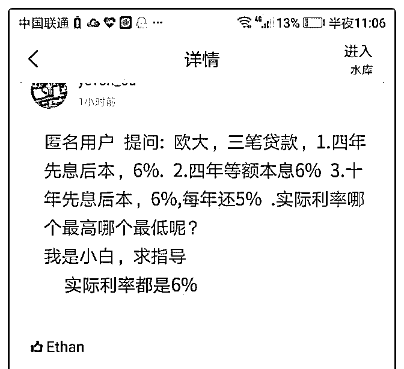

# 求解释啊图片中等额

(提问)匿名用户 : 求解释啊图片中等额本息实际利率的算法 啊，然后精华里面广州银行月息 7 厘不上 ZX 的 XYD 实际利率 是多少呢？

2018-05-24

回答：粗略算是乘 1.8，或者用 irr 拉一次就出来了(0 赞)

评论区：

坚持不懈 : 还是不清楚啊，图片里的算法是怎么解释啊

我要他生都有今生的暖* : 弗大，等额本息的利息会逐月递减的吗？逐月递减不是等额本金的概念吗？我理解中等额本息和

信用卡的等额等息是一样的，大概就是名义利率乘以 1.95 这里？

