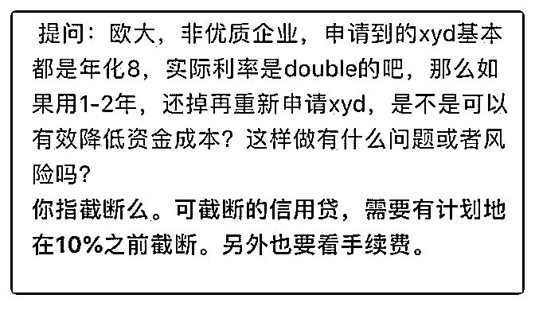

# 星主你好，请问图中

(提问)孤星泪 : 星主你好，请问图中说的 10%要怎么计算出 来？#我主要是深耕深圳本地小米圈，没有进 os 的小米圈，这 是别人分享出来的#

2018-05-13

回答：下载一个实际年化计算器，可以算出 10%的时点 截断

还要考虑罚息的综合成本，罚息一般 3-5％(0 赞)

评论区：

夏花冬雪 : 求年华计算器 APP，名字叫什么[微笑]，谢谢!

弗悔 : 研究下 irr，这个比较实用

