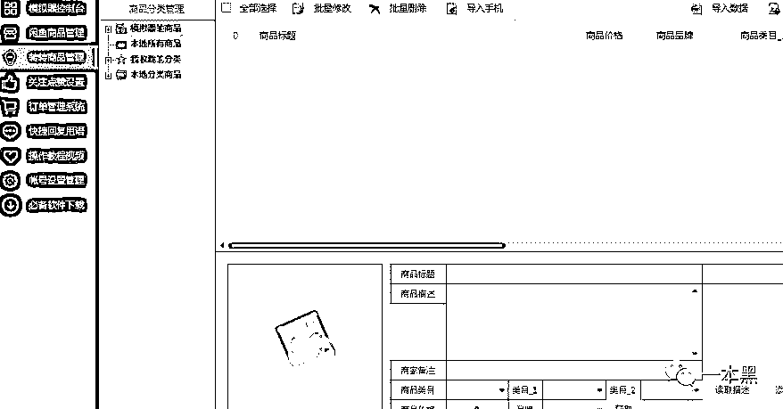
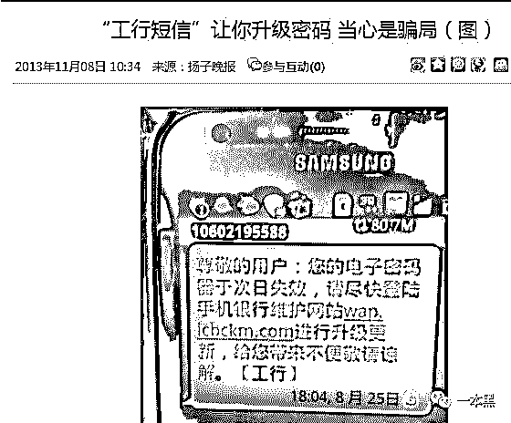
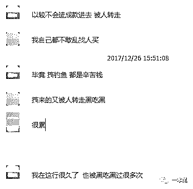
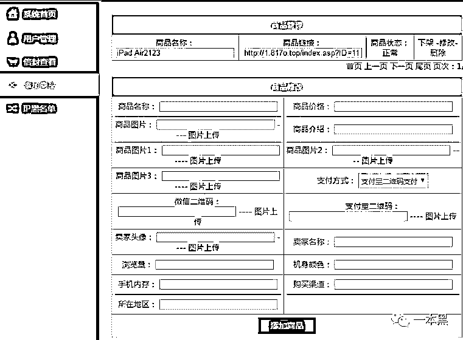
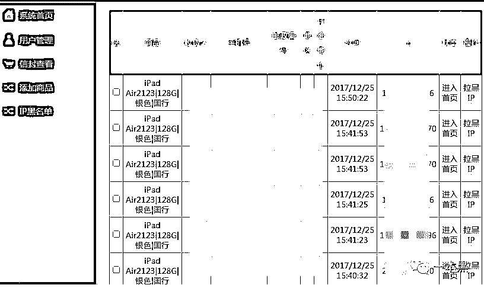
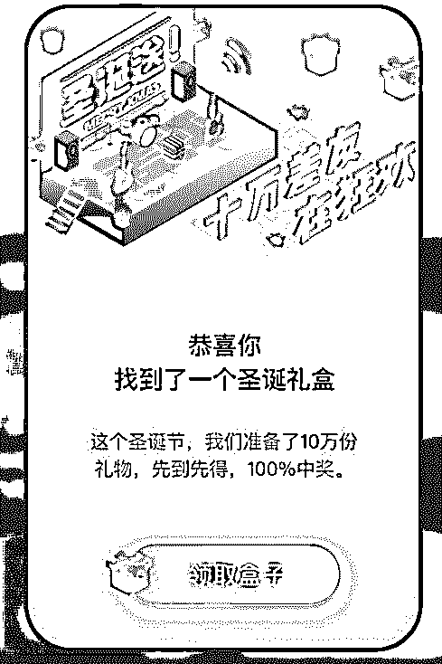
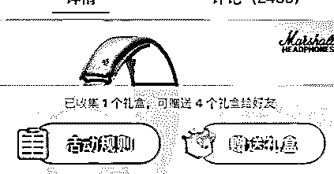
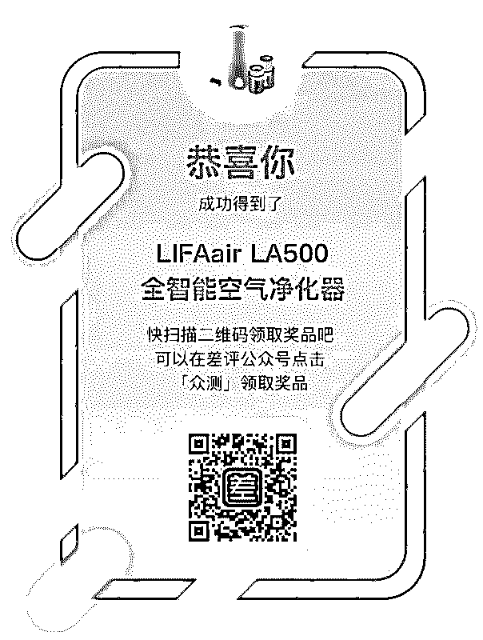

# “我在闲鱼被人用假链接骗了，对方月入二十几万，还说是辛苦钱！”

> 原文：[`mp.weixin.qq.com/s?__biz=MzU4ODAwNzUwMQ==&mid=2247483985&idx=1&sn=f89e4e2db22a59a2aab4664225b9d708&chksm=fde21373ca959a65b3c2de1de760126e2d696e42d8c93d7a2c6acf0528fc1ccf6d6e9ef76567&scene=27#wechat_redirect`](http://mp.weixin.qq.com/s?__biz=MzU4ODAwNzUwMQ==&mid=2247483985&idx=1&sn=f89e4e2db22a59a2aab4664225b9d708&chksm=fde21373ca959a65b3c2de1de760126e2d696e42d8c93d7a2c6acf0528fc1ccf6d6e9ef76567&scene=27#wechat_redirect)

文/东东（微信公众号：一本黑）

责编/振宇

【一本黑】媒体或商业转载必须获得授权，个人转发朋友圈无需授权。

读完需要

8 分钟

速读仅需 3 分钟

* * *

这是一个充满幻术的世界，也是一个真相与谎言交织的世界。

上周末闲着没事，约着老师傅去看了陈凯歌的最新电影《妖猫传》。

对于影片传达的核心主旨，我并不认为是大唐风流的展现，也并不是讲述一个无聊的人人都爱杨贵妃的玛丽苏故事。

这部电影构造了一个充满幻术的世界，它真正想讨论的是真相与谎言的问题，以及如何看待这个真相与谎言交织的世界。

看完这部电影的时候，刚好我在准备新一期的专题——“二手交易平台的骗子如何利用钓鱼链接非法牟利”。

和影片中的幻术世界一样，现实世界也是真真假假，每天都有人在“布置”幻术，自然每天都会有人上当。

在二手交易平台方面，闲鱼和转转算是比较火的两家。近日，京东上线“拍拍二手”，自然也想在二手市场上建立壁垒，开拓自己的疆土。

先不说二手市场的当前现状，光是闲鱼和转转两家就打得热火朝天，根据其自身的优势不断建立壁垒，我想这是两家“楚汉争霸”的关键决策。

但是，这些平台激烈竞争的背后，却存在着许多不为人知的套路，这些套路就像狡猾的“妖猫”，充满幻术，让人防不胜防。

   买家巧换地址，卖家钱货两空

二手交易平台中存在两个常见的骗人套路，按操纵者的不同，分为买家套路和卖家套路。

很多第一次使用二手交易平台的卖家就像一只等待被薅羊毛的羊，他们是新手，殊不知二手交易平台中的“潜规则”。

有些骗子买家在看中新手卖家发布的商品后，会主动跟卖家沟通商品的详细信息。此时，会给新手卖家造成一种自己的商品即将出售的假象。

骗子买家下单后不久，会电话告知卖家自己的地址默认填成了以前的地址，要求卖家换一个现在的新地址。到这里，卖家并不会察觉到有什么不对的地方，但是从这一步开始，卖家就陷入了买家布置的“幻术”骗局中。

几天后，骗子买家会告诉卖家自己并没有收到货，但其实商品早已成为骗子买家的囊中之物。

卖家必定会和买家争论，这时候会找客服或者小二介入。但是一般情况下，卖家是必输的，因为卖家没有按下单的地址发货，加之双方沟通过程中是使用的电话沟通，证据上并没有说服力。

狡猾的骗子买家“巧换”地址，此时的新手卖家只能眼看自己钱货两空。

  ** 准鱼鱼钩，甩杆钓鱼**

相比买家套路，卖家套路就要复杂且高级得多。

乾坤哥是本次专题的爆料者，据他所述，卖家套路之所以比买家套路复杂且高级，是因为需要搭建钓鱼网站，还需要大量二手平台的账号和支付宝账号，从事此类黑产的一般以团队居多。

从乾坤哥口中得知，这种团有专门的开发人员制作钓鱼链接和后台；有专门的人负责登陆账号发布商品；也有专人负责收购二手平台账号；他们已经形成了一个工作室，分工明确，各司其职。

首先，他们会准备一些高级的闲鱼或者转转账号，所谓高级的意思就是注册有一定时间的老号，这样更容易让人相信。这种账号一般可以从号贩子手中买到。

除了买号，他们还会购买很多黑卡和身份证来注册新的闲鱼号或转转号，然后经过一段时间的“养号”，这些账号就会变得更加让人相信。

几十上百甚至上千个账号准备好后，他们会使用这些账号发布一些虚假商品诱惑买家前来购买。

有人会说，这么多账号一个个发布商品岂不是很麻烦，这一点对方早就想到了，所以他们会利用一种可以批量发布商品的助手进行模拟人工发布商品。

这种手机助手针对闲鱼和转转开发，不仅可以自动发布商品，还可以自动擦亮商品、同步鱼塘、点赞商品、签到等。

对于这种软件的原理，老师傅解释道：“在软件里制作好数据后，利用模拟器，用脚本工具实现自动上传；人工怎么操作，脚本就怎么操作。”

商品发布后，只要有买家看重商品即可视为上钩，但是光上钩是远远不够的，钓鱼者会以各种理由把买家从二手平台上引导到他们精心制作的钓鱼链接上。

一旦买家掉以轻心，就会在钓鱼者发来的链接上付款，这个时候钱款就会沦为钓鱼者的囊中之物。

   **一千块的源码就是幻术的源头**

通过乾坤哥提供的线索，我们以购买源码的理由，联系上了一个从事该黑产的头目。

因为是“熟人”引荐，对方侃侃而谈，显得非常的热情。

闲鱼、转转的源码只需要一千块就可以买到，有一个独立的后台，可以在后台进行钓鱼链接的制作。

“13 年那会，我只是在做银行方面的钓鱼，当年的 95588 工商密码升级事件就是我搞的。一个后台，每天收入都是几万到二十几万。那时候还没开始涉及二手交易平台。”

（当年工商密码升级事件）

从对方的话语中得知，他从事钓鱼黑产已经很多年了。

“以前网银钓鱼很好赚钱，我算是第一波做的人，确实赚了不少钱，后来抓了一推人，银行方面也都升级了，没办法后来又开始转做拦截马。”

“既然做这个这么大风险，你怎么没被抓呢？”看对方如此吹嘘自己，我不由自主地问。

“我在国外搞钓鱼，国内追查到的服务器也在国外，IP 每天都在换，你说怎么抓。”

对方越说越起劲，对于自己的“光辉历史”，似乎觉得很骄傲。

交流过程中，对方还透露了他们的团队规模和具体分工，基本和爆料者乾坤哥说的一样。

如对方所说，在把鱼拉上岸的时候，还需要使用到支付宝账号，这些都要事先准备好。

“支付宝账号我都不敢乱找人买，毕竟搞钓鱼都是辛苦钱，搞来又被人转走黑吃黑岂不是很亏。”

搞钓鱼是辛苦钱？听到这里我坐不住了，正准备掏出我身后的四十米大刀......

对方还说，他们的后台支付接口可以设置成点卡的通道，买家付款后就相当于是买了点卡，最后把点卡再卖给回收商，就可以实现点卡的套现，同时黑钱也算是洗白了。

对于那些输入账号密码付款后被骗的买家，他们不仅能让买家钱货两空，还可以盗取买家的账号，盗取后的账号自然就会沦为他们钓鱼的工具。

最后我们通过“老年人冲浪技巧”收集到的一系列线索和老师傅的“计算机基础知识”，轻松拿掉对方声称售价一千元的后台。

从后台中可以清楚的看到，钓鱼链接的制作非常简单，里面有一套针对数码类商品的现成模板，只需要填上相应的商品信息即可完成钓鱼链接的制作。

只要有人点击链接付款，后台里就可以清楚地看到受骗者填写的各种信息。

在钓鱼者布置的“幻术”里，一开始在平台发布的商品是真，最后引导受骗者使用假链接付款是假，真真假假，在这个真相与谎言交织的骗局里，最终的受害者还是买家自己。

除了专门布置数码产品的假链接，他们还会以卖演唱会门票的借口非法牟利。

对方告诉我，现在用假链接卖演唱会门票，一天都可以赚到几千上万，特别是一些很火的明星，票务平台放票没多久就宣布售罄，此时他们就会到各平台发布出售演唱会门票的广告，吸引买家购买。

   **所谓幻术就是真相与谎言的交织**

《妖猫传》是一部披着幻术皮囊外衣，探讨世间真相与谎言、残酷与美好的电影。除此之外，它还讨论了如何对待这个真相与谎言交织的世界。

就像现实中存在的钓鱼链接，它先是发布真实的商品信息作为诱饵，然后通过话术把受骗者引导到钓鱼链接上付款，最终拉杆收网。

不管是影片中的幻术还是现实中的骗局，这个亦幻亦真的世界一直以来都在告诉我们一个浅显易懂的道理：“生活并不十全十美，我们可以对它弃而远之，也可以很好的拥抱它。”

还原事实｜专扒黑产

微信 ID：darkinsider

* * *

**彩蛋：**

后天就是 2017 年的最后一年了，不管你过去的一年过得好不好。

为了让各位能够有一个愉快的新年开头，也为了回馈各位一直以来的支持。一本黑的好朋友差评决定送出 10 万 份 100% 中奖的双旦礼盒！

** 参与流程很简单：**

只需三步，100%中奖的礼盒立刻到手。

大家通过众测链接领取礼盒，**领取之后， **可以屯到**12 月 31 日等待开奖。**

同时你还可以送出盒子，给小伙伴分享这波福利~

**在 12 月 31 日****（元旦前夜）****开始 **，你只要和以往众测活动一样，简单填写一下问卷来打开礼盒，**然后等着奖品砸你脸上就好！**

点击【阅读全文】即可参与！