# iPhone X 图纸价值连城，“员工”里应外合联手盗窃，撬动苹果地下产业

> 原文：[`mp.weixin.qq.com/s?__biz=MzU4ODAwNzUwMQ==&mid=2247483966&idx=1&sn=d1ea16e8c1061bb1138f70a08ec384a7&chksm=fde2131cca959a0aeeacbbb61a668c360f78bc38f19d9e6ada87dca8a783d300c9b682091ccb&scene=27#wechat_redirect`](http://mp.weixin.qq.com/s?__biz=MzU4ODAwNzUwMQ==&mid=2247483966&idx=1&sn=d1ea16e8c1061bb1138f70a08ec384a7&chksm=fde2131cca959a0aeeacbbb61a668c360f78bc38f19d9e6ada87dca8a783d300c9b682091ccb&scene=27#wechat_redirect)

文/小白（微信公众号：一本黑）

责编/振宇

【一本黑】媒体或商业转载必须获得授权，个人转发朋友圈无需授权。

读完需要

10 分钟

速读仅需 4 分钟

* * *

苹果公司一向注重保密文化，特别是对新项目信息的严防死守，前苹果硬件高管曾比喻苹果的保密文化如同恐怖组织。

┊   每个员工都只知道自己手头正在做的事情，互相之间不谈论工作；

┊   每个员工都只能进入与自己项目相关的特定区域；

┊   职的员工甚至不会知道自己的职位具体是什么；

┊   哪怕是对家人朋友，也不能透露关于工作的丝毫信息。

苹果的保密措施、对泄密的 0 容忍态度，和内部员工对公司的信仰，都是新产品机密不被泄露的原因。 

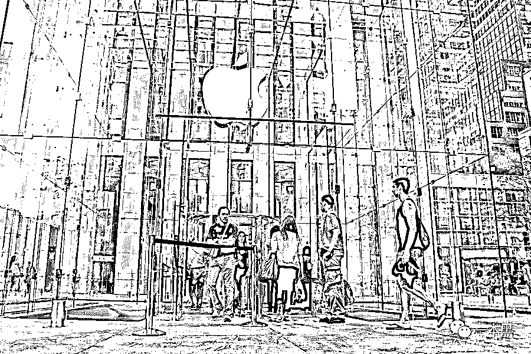

苹果公司保密尚且如此，身为其全球最大代工厂的果代工（为避免麻烦，本文全文使用该化名）自然更需要严防泄密，这就需要员工拥有足够的忠诚度，然而对大多数人来说，忠诚度都是有标价的。

苹果发布会前，8 万美金求一部 iPhone 真机的小广告贴在果代工宿舍区，3 万人民币一个 iPhone 7 彩色包装盒的收购信息大大方方贴在郑州包装厂员工宿舍区......对薪资较低的厂工来说，这无疑是一个巨大的诱惑。

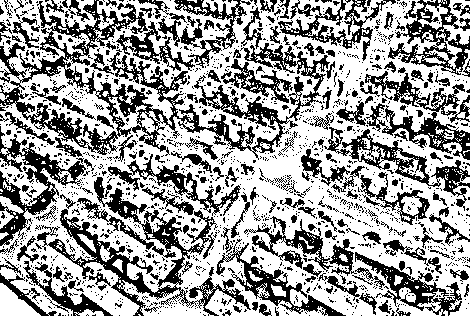

在员工基数这么大的情况下，果代工的保密环境严峻，不得不采取一些严格的安保措施，在这些安保手段下有哪些仍然被钻漏洞的例子？这勾起我好奇心的问题在最近有了解答，一个很靠谱的朋友告诉了我一些有趣的案例。 

   严格的安保措施

果代工下属 12 个子集团分别主攻不同方向，苹果未上市产品的所有生产场地均为特保区，特别是负责 iPhone 生产的甲子集团生产线，全部配有顶级安保，进出都需要进行极为细致的检查。

早年的特保区还是允许携带智能手机的，只需要在前后摄像头上贴保密签就行，不过在 15 年发生了一件事，让果代工老总大怒。

15 年底，深圳观澜果代工某产品开发人员带手机进入特保区，从文档中心借出图纸后躲进厕所撕开摄像头保密签偷拍。出厂区时被保安发现密封摄像头的保密签有动过的痕迹，继而查出手机里的全套图纸照片，保安当场获得一万元奖励。

而收买者是一个想要成为果代工的数控机床供应商，开价 20 万，企图提前准备相应的产品型号提高竞标胜算，事情败露后这个厂自然被除名。

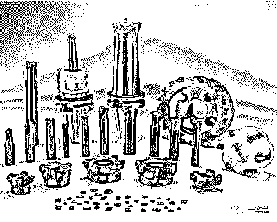

数控机床刀具

这件事儿直接影响了果代工后来的安保规则，特保区安检全面升级。

┊   不允许携带手机进入，仅部分有权限的员工可携带无拍照功能的功能机；

┊   静电衣的口袋被取消；

┊   进出特保区需要过安检门筛除所有含金属的物品（包含皮带扣和内衣小部件等），同时还需要接受保安手检；

┊   垃圾全部翻查再销毁，就连本子也需要翻开检查是否有夹带；

┊   每天清点物料数量，数字精确到个位，稍有不对就封锁整个厂区，进行地毯式搜查。

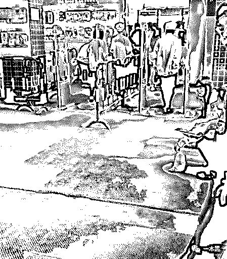

在这样细致的特保区安保面前，想夹带东西是非常困难的，曾有员工试图将物料藏在夹缝里、塞在垃圾中、甚至冲进下水道带出，最终都被搜查出来。 

但道高一尺，魔高一丈，再严密的防护机制也总会有漏洞。

  成功盗窃的“聪明人”

<inherit>11 年底，郑州果代工 3、4 个员工勾结，秘密安装无线路由器，借无线网桥接入生产系统，将水货手机烧成"正版机"(将苹果手机序列号和 IMEI 号写入来路不明的机器中，使机器可以正常使用)，五个月的时间改机 9000 多部，最终因为每天申请的机器代码超过出货量被苹果公司发现。</inherit>

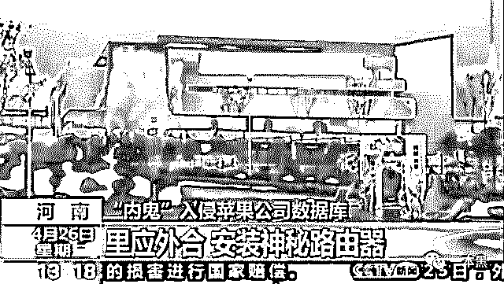

<inherit>但这种盗刷毕竟还是少数，更多的泄密行为，对象都是 iPhone 未发布的新机。外界对 iPhone 新机信息的需求除了好奇之外，更是一个庞大的灰色产业链——手机壳制造商、山寨机厂甚至是各路媒体都迫切希望在发布会之前得到信息，抢占行业先机。</inherit>

事实上，每年苹果发布会前，市面上就已经流传着各种真假难辨的 iphone 新机图纸甚至真机谍照，这其中真实的部分就是从苹果或果代工员工手中流出的。

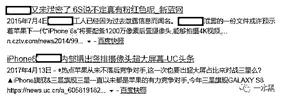

靠谱的朋友透露，近期，果代工员工小张因为违反商业秘密法正在接受审判，他成功地盗取了 iPhone 7 和 iPhone X 的设计图纸，导致这两款手机在发布会前被曝光，最终量刑估计在 5~7 年。果代工的安保如此严密，他究竟是如何盗窃成功的？

  神鬼不知的作案手法

在果代工，员工分为师级和员级，这两个级别里面又细分出以数字代表的更多等级。员级员工一般都在一线车间，往上是师级，像小张这样的大专毕业生进厂级别是师一。

小张在果代工待了近十年，升到师三、四级，工作中有机会接触到图纸，这为他成功盗取图纸做了铺垫。

苹果的设计图纸为了保密全部使用加密软件进行加密处理，但果代工一些台干（台湾籍干部）由于沟通需求是有解密文件的，而小张刚好跟他们在同一个办公室。

该台干的电脑，一直使用同一个弱密码，小何在一旁偷看过几遍，记住了关键的密码位置，经过几次猜测和尝试之后成功进入台干电脑并窃取图纸。

在这里，老师傅再次强调，不使用弱密码很重要。

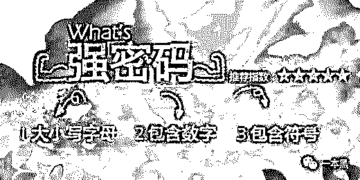

<inherit>图纸有了，解密文件也有了，那要怎样带出去呢？这里不得不提到果代工设在深圳龙华的一个检测中心。这个检测中心提供的服务是面向果代工全体的，无论是果代工的哪个分部，只要有需要即可使用。</inherit>

检测中心是一个独立的存在，并不属于甲子集团管理，保密环节非常薄弱，小张的某个表亲就在这个检测中心工作。

接下来的进展顺利，小张以合理且合法的方式将图纸传给检测中心，告知表亲文件名，让其下载，再使用手里的解密文件对图纸进行解密。盗出的设计图纸被小何挂在某 3D 建模设计论坛出售，售价 5 万。

冒着巨大的风险偷出的图纸，最后跟表亲一起分 5 万。这个价格在很多人看来都不可思议且不值得，但对果代工的普通员工来说，这相当于三四个月工资的数字已经是一个相当大的诱惑了。

跟苹果公司的员工不同，果代工的员工本身对于苹果没有任何信仰，进厂进行重复枯燥的工作仅仅是因为生活所迫，同时没有更好的选择。高强度的工作任务和低额的酬劳不成正比，一个看起来不可思议的价格，在这里其实并没有那么不可理解。

经过两三个中间商转卖后，这份图纸分别到了赌壳人、手机贴膜、山寨机生产商，以及科技大 V kk 低调手里。

  令人意外的图纸流向

如果要问苹果设计图纸泄露的最大得益者，那无疑是赌对图纸的手机壳制造厂。看起来小小的手机壳背后藏着巨大的利润空间，只要赌对一次，造就爆款带来的利润是按千万计算的。这也使得手机壳制造厂每年都愿意花大价钱去购买市面上流传的 iPhone “内幕”图纸，也就是所谓的“赌壳”。

“赌壳”是在 iPhone 新机发布前手机壳厂商的一次集体赌博行为。发布会前几个月，黑市上通常会有多份不同的 iPhone 新机图纸，制造商们通常会花十几二十万不等的价格购入图纸，再掷百万开模，小规模生产一批，发布会结束后立刻购入真机比对，比对无误即大规模量产。

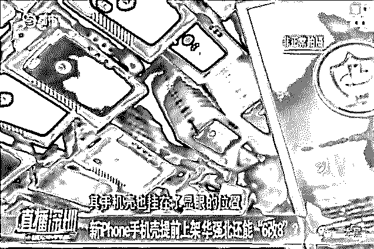

<inherit>除手机壳外，山寨机也是这条利益链里的大头。模仿得好的山寨机，不但外观难以分辨，就连系统界面都跟 iPhone 一模一样，不真的上手完全没办法看出这是一台山寨的小作坊安卓机，这些山寨机们甚至有自己的销售网站。</inherit>

有趣的是，媒体反倒是这条灰色产业链的末端，与大家的认知完全相反，他们往往是最后拿到图纸的人。当所有环节都将图纸消化过后，媒体才有可能得到被啃过一圈的新机信息，而这也是这张图纸的最后一丝价值。

  天网恢恢

说回这次泄密事件，购入图纸的科技大 V kk 低调在 16 年成功曝光过 iPhone7（当时有抄袭的争议），而这次提前曝光 iPhone X 的部分内容，引起了果代工的注意。

果代工找律师警告 kk 低调，要求他停止这种侵权行为。但是“聪明”的人总有“变通”的方法。自己不能公开，不代表其他人不行，花钱买来的图纸，不甘心就这样白白浪费。于是这份不能自己公开的图纸，被 kk 低调转卖给了国外的科技博主。

说到这里，我们不得不给大家第二个提示，不要贪心。

这件事儿的起因是贪心，最终败露也是因为贪心。

kk 低调一图多卖，将图纸分别卖给 2 个博主，这两个博主因为首发问题在 Twitter 上吵了起来，其中一方在争吵的过程中公开了和 kk 低调交易的对话截图......

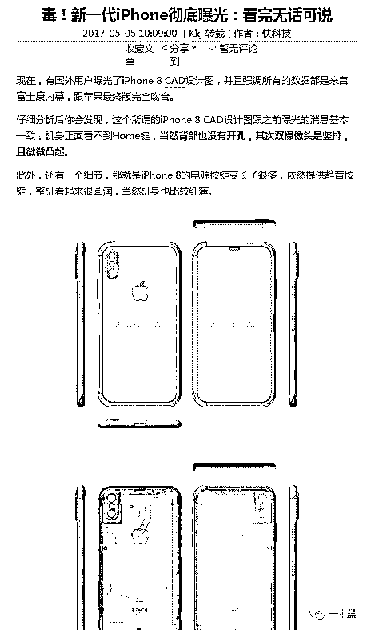

发布会前，苹果图纸被盗

新机设计图纸泄密，kk 低调被抓，对苹果和果代工来说还有更紧急的事情——溯源，企业出了内鬼是一件多可怕的事情，这么严重的泄密事件少不了严查。

果代工在进行多项筛查后拉出一份怀疑名单，排在第一位的就是态度紧张且有充分作案条件的小张。与警方联动审问后，小张招认盗窃过程，同时供出之前 iPhone 7 图纸的盗窃者也是自己。

而在他主动说出作案过程之前，没有人想到他盗取图纸的手法......

相对苹果公司而言，果代工偷盗事件之所以更多，一是员工对产品和公司都没有太深的感情，大多只为了生存而工作；二是工作强度大的同时工资偏低，这种情况下更愿意铤而走险。

苹果在手机市场占有的份额无疑是巨大的，这巨大的利益提供了许多正规的就业机会，也吸引了为数不少的灰色产业涉足。

<inherit>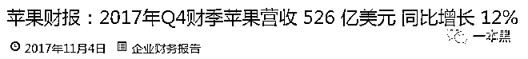</inherit>

<inherit>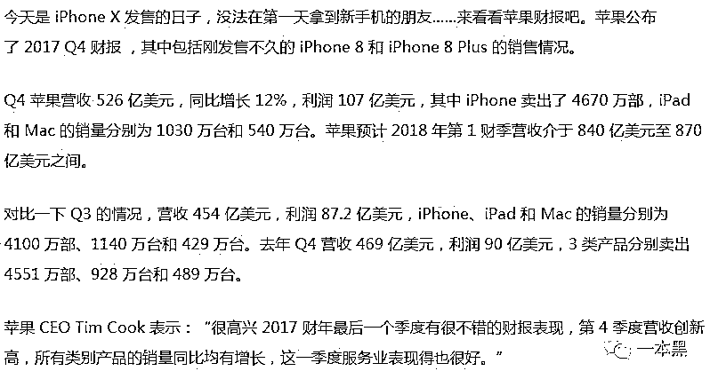</inherit>

<inherit>苹果 2017Q4 财报解读</inherit>

┊   赌壳人赌中一朝成功，赌不中还有明年；

┊   山寨机作坊借势提升销量；

┊   媒体被关注度和粉丝数牵引，博中则在一众同行中冒尖儿。

从本质上来说，其实大部分人跟小张都没有差别，忠诚、道德这些东西，始终是有一个标价的。

他被 5 万块吸引，赌壳人被更大的利益吸引，媒体人被关注度吸引，你我也总会在某些瞬间被一些超出我们“心理价位”的诱惑所吸引。

但不同的是，这些超出预估范围的诱惑出现的时候，评估过后所做的选择。

人人都知道依附苹果新机发布生存的灰产每一个环节都是违背道德甚至违背法律的，但在巨大的利益面前，人人都可能被吞噬。

如果你有更多相关信息，可以在评论或后台告知我们哦。

还原事实｜专扒黑产

微信 ID：darkinsider

* * *

题外话：【一本黑】入选了搜狐科技年度十大作者的评选，大家可以帮忙投一下票，点击**【阅读原文】**，找到 30 号即可投票。（每天可投十票）

还原事实，专扒黑产，我们一直在路上。