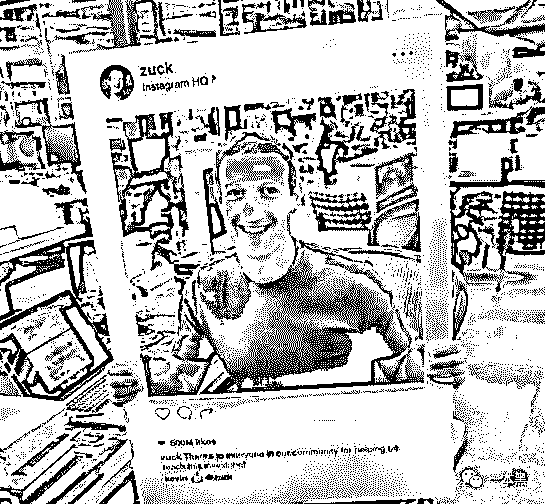
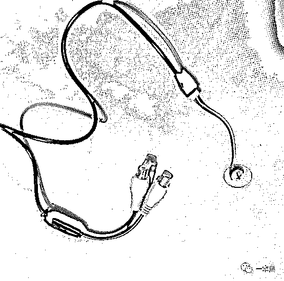
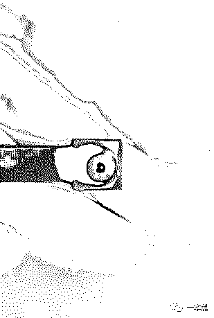

# 我用这两个方法检测出了酒店的针孔摄像头

> 原文：[`mp.weixin.qq.com/s?__biz=MzU4ODAwNzUwMQ==&mid=2247483942&idx=1&sn=8e0ffec7282a71eb422af666a6ac0637&chksm=fde21304ca959a128121b07df8262d171cde310ed6509018b9a4fc8f041e953bb772d4753b6d&scene=27#wechat_redirect`](http://mp.weixin.qq.com/s?__biz=MzU4ODAwNzUwMQ==&mid=2247483942&idx=1&sn=8e0ffec7282a71eb422af666a6ac0637&chksm=fde21304ca959a128121b07df8262d171cde310ed6509018b9a4fc8f041e953bb772d4753b6d&scene=27#wechat_redirect)

文/东东（微信公众号：一本黑）

责编/振宇

【一本黑】媒体或商业转载必须获得授权，个人转发朋友圈无需授权。

读完需要

9 分钟

速读仅需 3 分钟

* * *

<inherit>“这是一个最好的时代，也是最坏的时代”，这句话用来权衡当下再好不过。</inherit> 

技术的发展、智能的进步，到底是对人的解放还是对人的束缚？到底是让人变得更加的自主，还是让人失去自我，逐渐远离鲜活的人生和纯粹的世界？

对于我们所处的环境，究竟是一个怎样的时代这一问题，在电影《楚门的世界》里，我们看到了一个耐人寻味的回答。

而在现实生活中，我们也多多少少看到些类似的影子，前不久的水滴直播事件想必大家都早有耳闻，一篇名为《一位 92 年女生致信周鸿祎：别再盯着我们看了》的文章，讽刺性地指出与 360 摄像头关联的水滴直播将公共场合的监控直播出去，而“被直播”的人却全然不知。

<inherit>迫于舆论压力，360 在前天宣布永久关闭水滴直播。</inherit>

<inherit></inherit>

其实，很早就存在摄像头被入侵，用户隐私泄露的问题，【一本黑】也曾经做过关于摄像头被入侵，大量破解软件被挂在网上叫嚣贩卖的黑产。（传送门--[细思极恐|你的私生活正在别人的软件下直播](http://mp.weixin.qq.com/s?__biz=MzU4ODAwNzUwMQ==&mid=2247483779&idx=1&sn=4b5cbb41cb129964a48d568b4df09500&chksm=fde210a1ca9599b7822c476962a86dd63b99928162e2ad8f63da23136da2cda0bc7995a5aea0&scene=21#wechat_redirect)）

而在这个个人隐私几乎裸露的时代里，我们能做的只有提高自己的防范意识。

前阵子 Facebook 创始人扎克伯格在其个人账号上发布了一条消息，照片中的他扛着一个镜框庆祝 Instagram 的月活用户数突破 5 亿大关。

<inherit>消息发布后，很多眼尖的用户却注意到扎克的笔记本摄像头和麦克风插口都是被胶带蒙住的。可见其防范意识真的已经渗透到了工作和生活中。</inherit>

<inherit></inherit>

已经存在的摄像头被入侵是一方面，我们可以像扎克那样在不用摄像头的时候把他遮挡起来。因为再怎么高明的入侵手段是不可能入侵你摄像头的遮挡物的。

另一方面，总有新闻爆出在一些酒店很隐蔽的位置安装有针孔摄像头等事件，对于这些隐藏在我们身边而又极难发现的摄像头该怎么处理呢？

年末将至，很多人可能都忙着出差，住酒店是不得已的事情，所以了解住酒店的一些注意事项，以及如何检查酒店是否有安装隐藏摄像头是极为重要的。

前不久参加过一个关于【商业安全、隐私保护】的研讨会，对此也有不少收获，今天就给大家谈一谈关于住酒店，隐私如何保护等问题。

<inherit>住酒店，隐私如何保护</inherit>

**1、偷窥，针孔摄像头**

<inherit>针孔摄像头可以放置在酒店房间的各个角落，隐藏方式多种多样且千变万化，从插座、电视机、壁画、到吊灯，甚至是马桶上、电线的纽扣上......</inherit>

<inherit></inherit>

<inherit>（红圈处即针孔摄像头位置）</inherit>

这种线想必大家都不陌生，谁又会想到里面藏着一个针孔摄像头呢。

对于有些酒店暗藏的针孔摄像头，网上流传最广的检测方法是通过手机摄像头发出的光线来检测。

也就是说你可以开启手机照相功能，拉上窗帘，关闭房间的灯，让房间处于黑暗状态，然后用照相机围绕房间转一圈，如果有摄像头，手机上就会看到红点。

但其实这种方法的成功率最高只有 50%，因为除了角度的原因会增加识别难度外，市面上推出的反侦察夜视版本和很多高端一点的针孔摄像头用这种方法是根本识别不出来的。

<inherit></inherit>

<inherit>（目前市面上主流的针孔摄像头尺寸）</inherit>

那如何更有效的检测隐藏在黑暗之处的针孔摄像头呢？经常住酒店的朋友可以购买相关的检测设备，为防止广告嫌疑，这里就不做具体的推荐。

<inherit></inherit>

这是我们当时正在检测针孔摄像头的现场照片，图中手上拿的就是一款使用红外光+无线两种方式来探查针孔的便携式检测设备。

另外，使用针孔摄像是非常耗电的，安装者有可能会利用房间里的电源，所以在休息或者不使用电源的时候可以把房间的总电源关掉，这样针孔摄像机就无法正常工作了。

<inherit>**2、偷听**</inherit>

经常出差住酒店的人或多或少都有过这样的经历：好不容易在外奔波一天，准备回酒店洗个澡，不料却听到些不可描述的声音，或惊险或刺激......

可能有些人会充耳不闻，但“窥探”心理比较严重的人可能就会选择偷听，毕竟这种寂寞的夜晚还很漫长......

言归正传，那假如你和同事或者领导正在房间讨论一些行业内幕或者公司机密，又或者正在秘密准备筹划一场商业活动......那这个时候的“偷听”行为就属于商业窃密行为的范畴了。

在民用领域有一款设备叫做：高灵敏度拾音器，它不但可以将墙后的声音放大，还可以通过内置的调频发射功能，把监听到的信息发送给远处的接收端。

<inherit></inherit>

<inherit>（图片来自：全频带阻塞干扰    已获授权）</inherit>

<inherit>所以，在酒店商讨商业机密的时候一定要警惕隔墙有耳，简单一点的防护方法就是可以打开电视或者电脑，把音量调到最大，这可以在一定程度上对窃听器造成干扰。</inherit>

<inherit>除了“隔墙有耳”，有些窃听器是事先安放在房间里面的，那要如何检测房间是否有窃听设备呢？</inherit>

上次的【商业安全、隐私保护】研讨会上，杨叔给我们提到绝密大招：热成像。

（热成像：通过非接触探测红外能量（热量），并将其转换为电信号，进而在显示器上生成热图像和温度值，并可以对温度值进行计算的一种检测设备。）

下图是猫咪在便携式热成像设备下的效果，图片中可以清晰地看出显示在头部的发热源。（猫咪可能在思考人生）

<inherit></inherit>

<inherit></inherit>

<inherit>（图片来自：全频带阻塞干扰    已获授权）</inherit>

<inherit>通过使用热成像设备，可以检查出暗藏的窃听设备，对于隐藏的摄像设备也同样适用。</inherit>

<inherit>据杨叔所说，只要窃听设备或摄像设备在工作，其器材内的元器件就一定会发热，也就一定会产生热源。</inherit>

<inherit>所以不管这些暗藏的设备伪装成什么样，不管它是内置锂电池还是靠外接电源，都可以被热成像设备检测出来。</inherit>

<inherit>研讨会中，杨树给我们展示了一个伪装成插座扩展器的窃听设备，在热成像的检查下，和插在同一个插座上的一款正常产品形成了鲜明的对比。</inherit>

<inherit></inherit>

<inherit>（有窃听器材的设备里的元器件正在悄悄工作）</inherit>

<inherit></inherit>

<inherit>（图片来自：全频带阻塞干扰    已获授权）</inherit>

<inherit>**3、酒店万能房卡和被忽视的猫眼**</inherit>

很多人不知道酒店的房卡是可以被复制的，只要通过抽取房卡样本，加之一些技术上的精准运算和推敲，是可以生成酒店的房卡模型的。

<inherit>但更恐怖的是酒店有一种万能房卡，就是酒店清洁工人使用的清洁用房卡。</inherit>

<inherit>大家是不是有过这样的经历，收拾完东西来到前台准备退房，一般前台服务员会用对讲机告知清洁工人某个房间退房，然后清洁人员会对房间物品进行清点。</inherit>

<inherit>但明明你走出房间的时候房门是关闭的，清洁人员是怎么进入的呢？</inherit>

<inherit>事实上，清洁人员手中有一张酒店无限制万能房卡，这种卡可以在任何时间打开任何一间房门。</inherit>

<inherit>如果有不安好心的清洁人员恶意利用这种卡，又或者清洁人员无意间丢失这种卡被不怀好意的人捡到，那后果可想而知。</inherit>

<inherit>另外，有些盗窃团伙还会使用反猫眼设备来观察房间内的情况，这在一定程度上提高了他们盗窃的成功率。</inherit>

<inherit>反猫眼设备可以清楚地看清室内的环境情况，如果加之其他工具，是可以直接打开房门的。</inherit>

<inherit>所以，对于经常出差住酒店的人来说一定要保持高度的警惕性，房门反锁后可以挂上锁链，把猫眼堵上，证件财物一定要随身携带。</inherit>

<inherit>还可以购买一些出差必备报警器放在行李箱中，只要小偷触发就会报警，在一定程度上是可以吓走偷盗者的。（网上很多，这里就不做推荐）</inherit>

<inherit>这是一个最好的时代，也是最坏的时代</inherit>

<inherit>电影《楚门的世界》里，楚门经历了人造的风暴和巨浪的考验后，承载着他走向真相的船，无情地撞破了那个蓝得刺眼的、美丽却又虚假的天空。</inherit>

<inherit>从那一刻起，一个神话宣布结束，一个阴谋被置于阳光之下。</inherit>

<inherit>就像水滴直播的永久关闭，证明只要人性尚存，心灵是无法被永远操纵的。</inherit>

<inherit>这是一个最好的时代，也是一个最坏的时代。存在即合理，不管时代怎么发展，都有其自身存在缘由。而我们只有加强防范意识，才能更好的保护自己。</inherit>

* * *

<inherit>**彩蛋：**</inherit>

最后，我和老师傅通过渠道采购了一个探查针孔的便携式检测设备，和一个热成像检测设备，准备找几家酒店或宾馆实地检测一下。

我们花了整整一天的时间，分别对档次不一的酒店和宾馆进行了检查。

一开始的一无所获让我们觉得此行是不是徒劳，可没想到在最后一家宾馆的一间情侣房里，（为了有效检测，我和老师傅选择情侣房下手）我们发现了猫腻。

通过设备检测，我们发现一个暗藏在吊灯内的摄像头，拍下照后我和老师傅找到宾馆负责人。

<inherit></inherit>

对方看到眼前的一幕也表示很震惊，声称他们也不知道房间内有安装的摄像头。

到底是宾馆内鬼安装还是房客恶意安装，我们不得而知。

但某些酒店或宾馆存在暗藏的摄像头已是事实，所以学会保护自己的隐私，至关重要。

转发让更多的人看到，后期我们也许会做些活动送出文中提到的检测设备，也提醒大家在外住宿一定要注意自身隐私安全。

还原事实｜专扒黑产

微信 ID：darkinsider