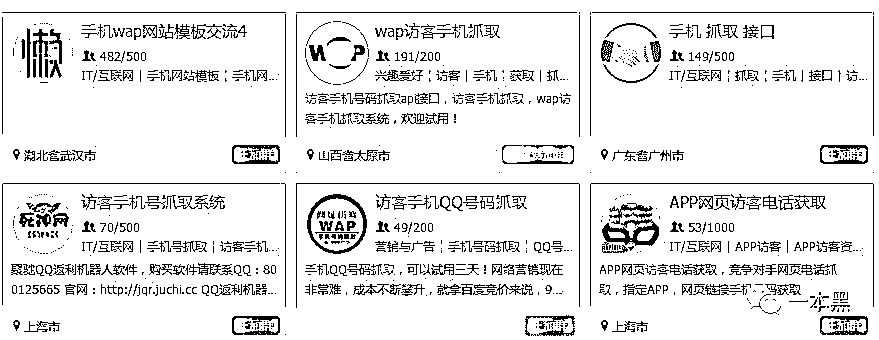
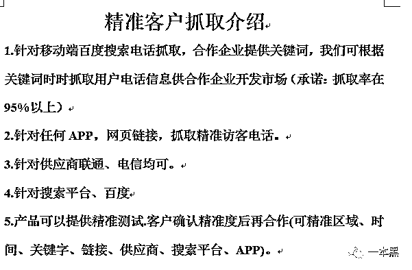
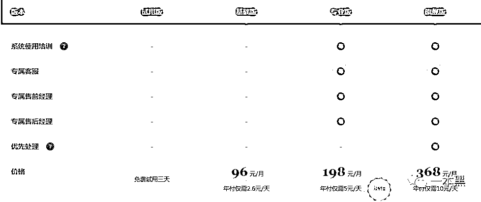
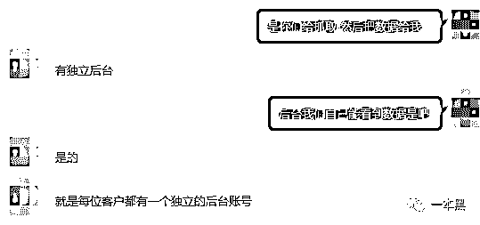
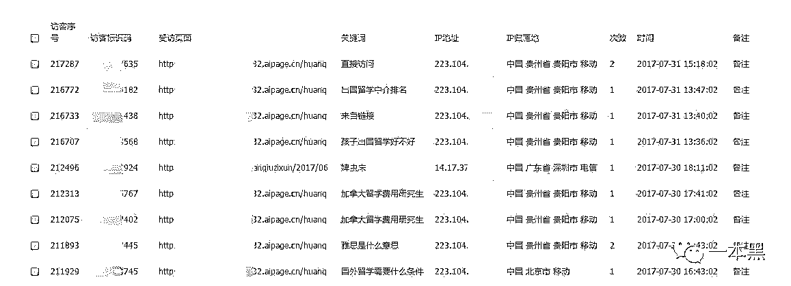
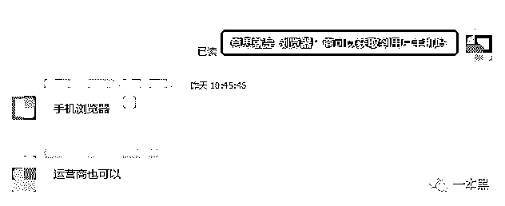
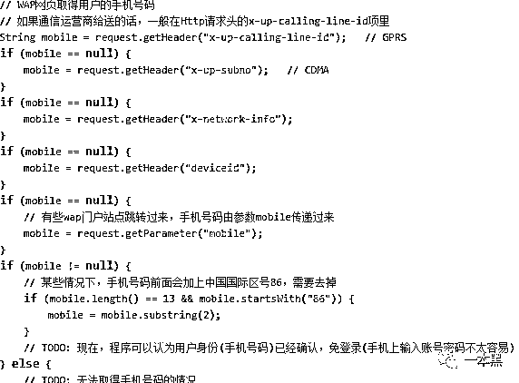
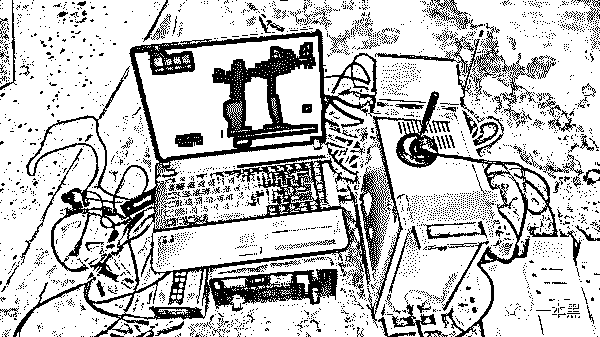

# 点击网站就泄露个人信息？怪不得总接到推销电话！

> 原文：[`mp.weixin.qq.com/s?__biz=MzU4ODAwNzUwMQ==&mid=2247483938&idx=1&sn=5b78e1f5413ecaa10243250f3f311acd&chksm=fde21300ca959a1665b80b1e8035874986d325c95d5fbb5df559687e6e58fd930c40b315582d&scene=27#wechat_redirect`](http://mp.weixin.qq.com/s?__biz=MzU4ODAwNzUwMQ==&mid=2247483938&idx=1&sn=5b78e1f5413ecaa10243250f3f311acd&chksm=fde21300ca959a1665b80b1e8035874986d325c95d5fbb5df559687e6e58fd930c40b315582d&scene=27#wechat_redirect)

<inherit>文/东东（微信公众号：一本黑）</inherit>

责编/振宇

【一本黑】媒体或商业转载必须获得授权，个人转发朋友圈无需授权。

读完需要

9 分钟

速读仅需 3 分钟

* * *

大部分企业靠仅有的流量赖以生存，不管是竞价排名还是推广活动，只要能对用户进行精准定位，把握用户习惯与趋势，就能最大限度的实现精准营销。

如今的互联网人在这方面可谓是下足了功夫，表面上是做到了对用户的精准营销，实则却让用户苦不堪言。

而衍生出来的一系列黑色产业，不仅是对个人信息的亵渎，还为电话诈骗提供了滋生的土壤。

> <inherit>**个人信息犹如窗户纸？**</inherit>

可能很多人都有过一些不胜其烦的经历，逛完某个网站或浏览了某个企业，随后就会收到对方的推广电话与短信，领域涉及培训机构、理财产品、医疗、保健等。

有人会产生质疑，浏览网页时并没有输入电话号码等行为，对方却能知道自己的电话号码等信息。

这其中涉及的个人信息泄露又有着怎样不为人知的秘密？

对此，【一本黑】决定一探究竟。

从老师傅口中了解到，这种现象应该是用户手机号被非法抓取，各企业或机构用做所谓的“精准营销”。

果不其然，通过关键词搜索，我找到几个提供此类服务的 QQ 群，并潜伏了进去。

<inherit></inherit>

观察期间不时有人发出各种广告，但大部分都是关于手机号抓取的。

以购买意愿询问其中一位群主后，他告诉我产品的套餐价格，以及服务的方式。并给我发来一个他们的网站链接。

用对方的话来说，他们可以对网站访客的信息进行抓取，获得访客的联系方式，包括 QQ、手机号码和客户来路、兴趣点等信息。

<inherit></inherit>

<inherit>（对方发过来的 word 介绍）</inherit>

然后可以对网站建立客户鱼塘（客户数据库），对有意向的客户进行跟进，以此来提升成交量。

<inherit></inherit>

从产品的套餐上来看，可分为基础版、专业版，旗舰版，对应的价格也从每月 96 到 368 元不等。

<inherit>群主告诉我，购买该产品的客户会有一个独立的后台，在后台可以清楚的看到抓取的所有信息。</inherit>

<inherit></inherit>

<inherit>而抓取信息的方式就是在指定网页或 APP 嵌入一段代码即可。</inherit>

<inherit>原来收到各种网络推广电话的原因竟然都是这些黑产从业者的精心“策划”，原来个人信息就是这样被流露出去的。</inherit>

<inherit>这不就是耍流氓吗！通过非法手段获取用户信息以此牟利，用户的上网行为与个人信息完全暴露。</inherit>

<inherit>为了彻底探清他们是如何对个人信息进行抓取的，我寻求了老师傅的帮助。</inherit>

> **手机号到底如何被抓取？**

<inherit>通过对对方服务过的某网站进行分析，老师傅果然在该网站的主页上发现了猫腻。</inherit>

<inherit>还原网址后，老师傅找到了该平台的访客统计系统，老师傅随后注册了一个账号登陆进去，但碍于没有付费所以权限很小，也就拿不到有价值的信息。</inherit>

<inherit>安全行业的渗透过程讲究思路二字，在点烟间隙，老师傅通过一个常见的漏洞类型，拿到了一个“旗舰版”的用户账号。</inherit>

<inherit></inherit>

<inherit>从后台中可以看出，用户的手机号、IP 地址、通过搜索什么关键词以及以什么样的方式进入网站都可以清楚的看到，用户行为暴露无遗。</inherit>

<inherit>当问及老师傅为何网页中插入这种代码就可以获取用户信息时，老师傅说：“只要和多个渠道合作就可以，比如和手机浏览器合作，当浏览器在浏览指定页面的时候就会上报手机号。”</inherit>

<inherit>“但他们一般都是和一些野鸡浏览器合作，当前市面上的主流浏览器不太可能会参与合作。”</inherit>

<inherit>同样的，如果和运营商有合作，也可以实现手机号的抓取。</inherit>

<inherit></inherit>

随后，老师傅给我发来了一段网页获取用户手机号的代码例子。

<inherit></inherit>

老师傅解释说：“代码中的 x-up-calling-line-id 字段后面的就是手机号码。”

<inherit>但现在随着系统升级和政策改变等原因，获取手机号码越来越难。</inherit>

<inherit>他们会通过扫描漏洞来获取运营商的数据端口，这种情况下即便请求里不带手机号，也是有可能获取到你的手机号的。</inherit>

<inherit>但也不排除有内鬼私自给这些平台开后端接口的可能。</inherit>

黑产之所以黑不光是其自身见不得光，我想还有各种“暗地勾结”，也正是这种两手遮天的姿态才助长了黑产的成长。

<inherit>至此，这条非法获取用户信息的产业链已逐渐清晰。</inherit>

<inherit>很多网站或 APP 的运营者会向这种手机号码抓取平台购买相关的服务，然后把这种恶意代码嵌入指定网页中，不管用户以什么样的方式进去该网页，后台都会获取到用户的手机号码、QQ、访问渠道、IP 地址、访问时间、地域等信息。</inherit>

<inherit>网站运营者在获取用户信息后，可以对用户的信息进行筛选和分类，对用户进行精准画像，然后再由客服实施电话或短信回访。</inherit>

<inherit>这些信息甚至还可以生成 excel 表格，运营者把用户的号码导入微信或 QQ 进行批量添加号码，从而进行精准营销。</inherit>

> <inherit>个人信息的泄露，电话诈骗的滋生</inherit>

<inherit>不光是对用户进行精准营销，这种抓取到的手机号码等信息可能沦为电信诈骗的工具。</inherit>

<inherit>你的个人信息甚至会被贩卖多次，最终传入诈骗者手中。</inherit>

<inherit>对于电信诈骗行为，老师傅说：“会有一些人通过伪基站发送诈骗短信到受害者手机上（如伪造的银行信息），受害者只要按短信提示输入密码，那他们的银行卡信息就会暴露。”</inherit>

<inherit>因为伪基站的发送有一定的范围，甚至有人会把伪基站搭建在车上，然后开着车四处游走，范围内的手机卡就会接收到诈骗短信或者钓鱼网站。</inherit>

<inherit></inherit>

<inherit>（图片来源于网络）</inherit><inherit>碍于伪基站发送范围的限制，大部分诈骗者会直接通过电话或短信的形式进行诈骗，所以也就出现了徐玉玉等类似的事件。</inherit>

<inherit>（伪基站：通过伪装成运营商的基站，冒用他人手机号码强行向用户手机发送诈骗、广告推销等短信息。）</inherit>

<inherit>有些钓鱼网站甚至还隐藏着木马病毒，这种木马病毒会拦截银行发给用户的所有短信，而这些短信会转移到骗子的手机上。</inherit>

<inherit>只要验证码到手，受害人的银行卡就可以完全被骗子掌控。想要转移受害者银行卡中的钱，也就是分分钟的事情。</inherit>

<inherit>对此，老师傅特地给我示范了一次这种木马病毒的危害。</inherit>

<inherit>老师傅拿出一个调试手机装了一张绑定银行卡的手机卡，紧接着又往手机上安装了一款测试版木马病毒。</inherit>

<inherit>当往银行卡里转钱的时候，另一台手机却收到了转账记录。</inherit>

<inherit>老师傅解释说这种木马病毒不易被发现，只要用户的手机被病毒攻占，那么后果不堪设想。</inherit>

<inherit>其实，信息泄露的渠道多种多样，除了某些网站的抓取之外，还有可能在修手机的时候泄露出去。</inherit>

<inherit>有些手机维修店在维修客户手机的时候，会把客户手机中的各种资料拷贝一份，如通讯录、照片、各种账号等信息。</inherit>

<inherit>他们有专门招揽有意购买信息的客户，也有固定的销售渠道，这些被拷贝出来的信息出售后用在什么地方我想大家心里都有数。</inherit>

<inherit>而这种藏匿于“地下”的交易方式通过他们的各种“掩体”做得风生水起，也让执法难度增加了不少。</inherit>

<inherit>可能有心的人在准备修手机之前会把手机恢复出厂设置，以避免自己的信息泄露。</inherit>

<inherit>但老师傅说：“即使手机恢复了出厂设置，手机中的信息是有可能被还原的。”</inherit>

<inherit>这正是信息泄露的恐怖之处，高明的技术手段让你防不胜防。</inherit>

> <inherit>我们如何防范？</inherit>

<inherit>从网站对手机号码等信息的抓取，维修手机可能带来的信息泄露，再到信息泄露带来的电信诈骗，这些见不得光的产业链无疑是在侵犯人们的个人隐私和财产安全。</inherit>

<inherit>也就有了疑问互联网时代到底有没有隐私可言？</inherit>

<inherit>面对周遭这个复杂的世界，我们无法改变什么，我们能做的只有提高自己的安全意识。</inherit>

<inherit>对于某些网站可以对用户信息进行抓取这一问题，老师傅说可以把 4G 网切换成 WIFI 或者 VPN，这在一定程度上可以避免信息被抓取。</inherit>

<inherit>对于如何辨别钓鱼网站，由于篇幅原因，大家可以后台回复：“辨别钓鱼”，查看老师傅给大家提供的辨别小技巧。</inherit>

<inherit>而对于维修手机出现的信息泄露，老师傅建议大家最好找手机品牌的售后或者比较正规的维修店，尽可能的减少信息泄露的可能性。</inherit>

<inherit>纵观中国互联网的发展，信息泄露一直是人们关注的话题，但信息贩卖却日趋严重，有增无减。</inherit>

<inherit>个人信息沦为贩子手中的牟利之物，层层贩卖，所以也就有了多家银行给你推销信用卡、多家房地产给你推销楼盘这种事情。</inherit>

<inherit>虽然无力阻止，但却给了我们一个忠告，个人信息的保护尤为重要，别等到财产损失的那一天才后悔莫及。</inherit>

互联网时代到底有没有隐私可言，答案必定是否，但如果自身做到最大限度的自我保护，我想这个“否”会慢慢改变。

<inherit>最近，百度安全就联合海淀警方重拳打击了该黑色产业链——“手机访客营销黑产”，由此也可以看出，企业对黑产的打击力度也在逐步增加，为广大用户的上网行为保驾护航，避免了更多人的信息泄露。</inherit>

<inherit>虽说该黑产是暂时消停了，但有没有“卷土重来”的一天，长路漫漫不得而知。</inherit>

<inherit>我们能做的只有让更多的人学会保护自己，仅此而已。</inherit>

还原事实｜专扒黑产

微信 ID：darkinsider

<inherit>后台回复：**“辨别钓鱼”**，查看老师傅给大家提供的辨别小技巧</inherit>