# 揭秘后台操控的捕鱼游戏，想赢？不存在的！

> 原文：[`mp.weixin.qq.com/s?__biz=MzU4ODAwNzUwMQ==&mid=2247483912&idx=1&sn=731224df1eb420d9273b0df65e6eb814&chksm=fde2132aca959a3ceb0eb43cf0fd9dda20f6f4e67f3e8d0220c6d9fe2663848b900a47f7d44e&scene=27#wechat_redirect`](http://mp.weixin.qq.com/s?__biz=MzU4ODAwNzUwMQ==&mid=2247483912&idx=1&sn=731224df1eb420d9273b0df65e6eb814&chksm=fde2132aca959a3ceb0eb43cf0fd9dda20f6f4e67f3e8d0220c6d9fe2663848b900a47f7d44e&scene=27#wechat_redirect)

<inherit>文/东东（微信公众号：一本黑）</inherit>

责编/振宇

【一本黑】媒体或商业转载必须获得授权，个人转发朋友圈无需授权。

读完需要

10 分钟

速读仅需 4 分钟

* * *

<inherit>**本期专题与差评一起发布！**</inherit><inherit>垂钓者享受着狩猎的快感，然而殊不知自己却是他人手中的鱼儿。</inherit>

对于结果已经注定的赌局来说，与其说你在玩游戏，不如说游戏在玩你。

> <inherit>**渔翁撒出诱饵，待鱼群入网**</inherit>

<inherit>一直以来，朋友圈的一位好友小军一直在做着移动电玩的生意。</inherit>

<inherit>像大多数微商一样，他总是会在朋友圈发一些关于捕鱼游戏的截图，目的旨在招揽客户。</inherit>

<inherit>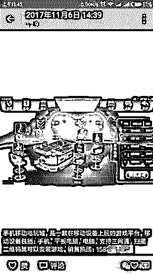</inherit>

<inherit>捕鱼游戏：是一种很经典的游戏类型，从游戏厅到端游、手游都存在这种游戏类型。</inherit>

<inherit>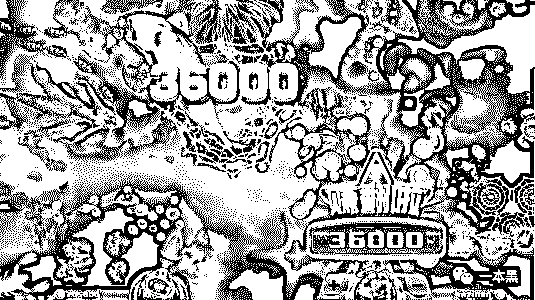</inherit>

<inherit>（图片来源于网络）</inherit>

出于好奇，我和他闲聊了几句。

<inherit>通过小军，我联系到了一个捕鱼平台的经营者。</inherit>

<inherit>对方朋友圈的内容和小军如出一辙。攀谈几句后，对方询问是否有意愿购买他们开发的手游平台，内含二十多款游戏，比如金蟾捕鱼、摇钱树、德州扑克、百人牛牛等带有博彩性质的游戏。</inherit>

<inherit>对方告诉我“不管是上分下分、还是输赢操控，都可以通过后台自己控制。玩家的输赢尽在掌握之中”</inherit>

<inherit>这些立马引起了我的兴趣，马上表示有意购买平台。</inherit>

<inherit>如对方所说，投资者可以直接购买他们开发的捕鱼游戏，信息提交一周后就可以上线运营。</inherit>

<inherit>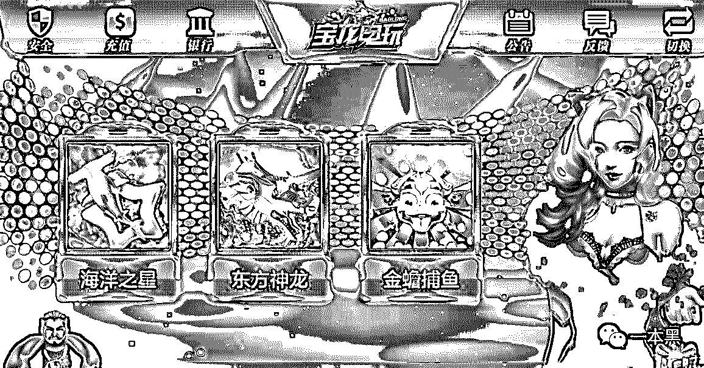</inherit>

<inherit>一款好的捕鱼游戏在开发的过程中不仅包含鱼种的设计、难易程度、鱼的出现情况，还包含捕鱼奖池的控制功能、机器人的添加、任务等各个方面。</inherit>

这里有两种购买方式，一种是买断平台，另一种是租赁。

买断平台只需要一万块，如果在游戏中安装线上支付接口的话需要另加 3000，如果不安装那就是线下充值。（为了不留下银行流水，小平台喜欢采用微信转账的方式让用户充值）

租赁根据时间定价，月租是一千块，年租是五千元。

<inherit>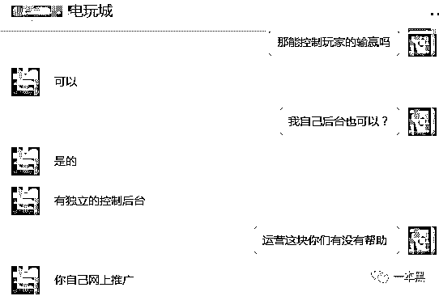</inherit>

<inherit>（后台控制输赢是我最感兴趣的模块。）</inherit>

随后对方告知一万块只是购买平台的价格，每个月还需要缴纳一千元作为服务器的费用。

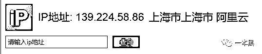

<inherit>（查询 IP 得到服务器的位置）</inherit>

根据对方透露的信息，我们进行信息反查，确定对方是一个浙江的软件开发公司，售卖游戏平台是他们其中一块业务。

控制输赢的方式很简单，用对方的话来说就是只需要输入对方的 ID 就可以了。

<inherit>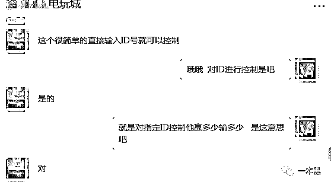</inherit>

然后他们会给购买平台的买家定制专门的平台，包括界面更改、名字更改（为了客户所购买的软件看起来不重复）

<inherit>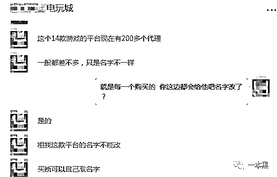</inherit>

购买平台的买家拿到软件后自己进行推广招揽客户，在游戏中，一百块钱可以兑换十万积分，上分下分都是在后台操作，最重要的是可以对输赢进行控制。

也就是说，虽然玩家有赢有输，但是平台都能赚钱，先赢后输是玩家的常态。

据对方所说这款游戏平台现在已经有 200 多个代理，一般的代理一个月就可以轻松赚到十万块。

<inherit>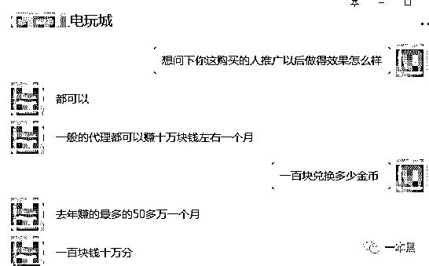</inherit>

我们探寻了几十家出售此类游戏平台的卖家，价格大约是在 1 万元到十万元不等，平台的功能也都大致相同，几乎九成以上的平台都可以在后台控制游戏结果，也就是说市场里大多是黑平台。

<inherit>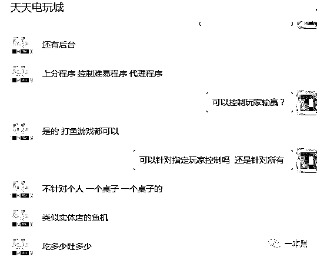</inherit>

不过为了吸引玩家，他们会适量控制游戏输赢，得先让玩家尝到甜头，才能钓到更大的鱼。

<inherit>为了能更深入的调查，老师傅又翻出了「计算机基础」。</inherit>

<inherit></inherit>

<inherit>（没想到吧！）</inherit>

> <inherit>**玩家是鱼，偷吃鱼饵就相当于入了网**</inherit>

了解事情的经过后，老师傅像往常一样打开自己的武器库，等待的过程中随手点了一根烟。

据对方所说，他们有独立的服务器程序、上分程序和控制程序。根据现有的线索，老师傅对其中一款游戏平台的后台进行了分析。

本以为这种小平台老师傅可以游刃有余地进出，可困难总是比想象的大。

探究过程中，老师傅察觉到一些异样，对方在防护上下了不少功夫，只要输错五次密码，我们的 IP 地址就会被封掉，无法访问对方的网站。

除此以外，网站还增加了安全防护工具，可以防御好几种常见的攻击方法，这里的原理就不细说了。

<inherit>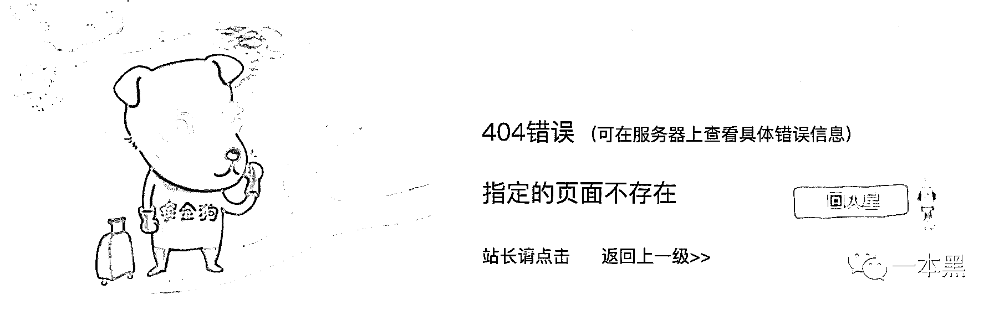</inherit>

让人感慨的是，黑产的安全意识已经远胜国内大多数公司，揭露黑产的难度远超过我们平时做安全测试的难度。

这无疑给老师傅增加了一定的难度。

此时老师傅感叹：“没想到这么小的平台，安全意识这么高。”说完拿起桌上还剩半包的烟，一筹莫展的样子。

但功夫不负有心人，经过老师傅【计算机基础知识】收集到的线索，老师傅终于拿掉了该游戏平台的后台，会员管理、游戏记录、推广员等信息一览无遗。

<inherit>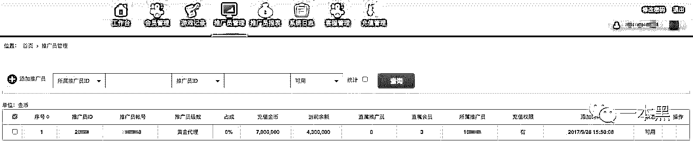</inherit>

在游戏记录里也可以查询得到指定玩家的消费记录，我想该玩家永远也不知道自己像颗棋子一样，被玩弄于股掌。

<inherit>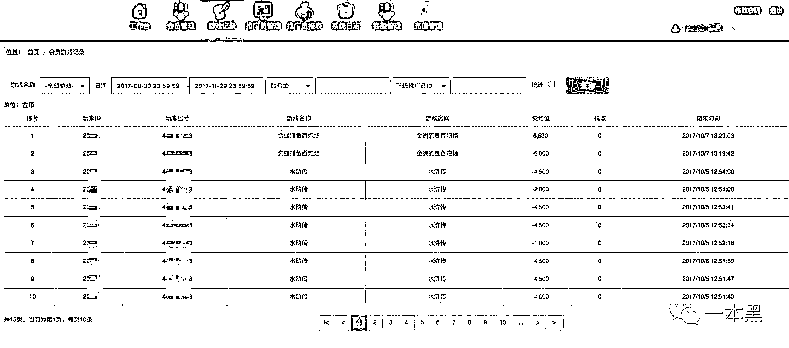</inherit>

在控制程序中，不管是难度级别（捕鱼成功的概率）还是抽水比率，都可以进行控制。

<inherit>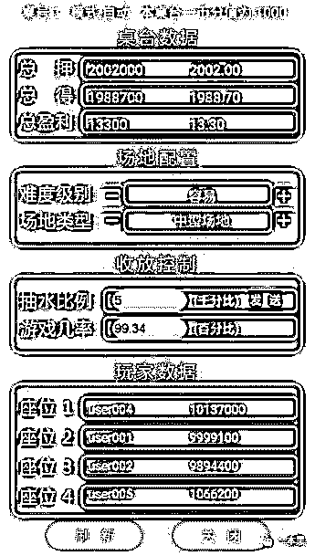</inherit>

现在大家应该对捕鱼类的游戏有了大概的了解，总之，玩家到底能不能赚钱，当然能。因为不能赚钱的机器是卖不出去的，也吸引不了更多的玩家来玩。

对于这其中的原理，举个例子就好比一台捕鱼机有十个人在玩，每人投 10 块钱，一共就是 100 块，此时会根据系统的控制进行相应的抽水，比如机器抽水 50 块，剩下的 50 块就分给 10 个人中的一两个人，等于说只有这两个人会赢，其他人必定输钱。

南方的天气艳阳依旧，老师傅对于这种通过控制输赢来牟利的手法早已见怪不怪。

“其实这个线上捕鱼软件和线下的捕鱼机是差不多的，就像线下捕鱼机，一天的赢钱数和输钱数都是事先设置好的，一旦超过了这个比例想赢钱那是不可能的。”

说完老师傅掏出一根烟点上，然后从电脑里找出了一张图片。

<inherit>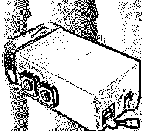</inherit>

“看到没，这就是捕鱼机遥控器，一般在游戏厅里面，有人用这种类似的遥控器做手脚以此来降低玩家赢钱的概率。”

正如卖家说的那样，吃多少就让你吐多少。

> <inherit>**待到渔翁收网，就只剩下后悔莫及**</inherit>

听过一句话叫：“挖金子的人没有富，卖锄头的人先富了”，这句话放在捕鱼这种游戏行业也不为过。

因为在运营和推广上可能还会存在各种各样的问题，推广难度或法律监管。所以那些一开始自己做推广的人还不如直接转行售卖游戏平台。

对于运营者来说，如果平台和服务器都是现成的，自己只需要负责运营，所以经营博彩的门槛越来越低。

据我所知，有些专门做平台开发的公司光是销售平台费用就可达上千万，还不算抽成和维护费用。

说到维护费用，这里也有很多套路，比如有些卖平台的会删减部分代码，购买者一开始并不会发现有什么问题，等平台出问题了，自然就会花额外的维护费用去维护。

捕鱼游戏本身并不是博彩，但是如果游戏币可以再折算成现金，那么就有了博彩之嫌，所以我们目之所及的游戏都属于可以用现金换游戏币，但是游戏币不可再转换为现金。

然而为了规避法律风险，“银子商”应运而生，银子商专门负责将游戏币折现，而银子商和游戏公司没有直接的瓜葛，所以采取这种模式把游戏和提现分开。

而实际上，银子商和游戏平台串通的例子并不少，这种手法只是掩人耳目。

因为国外法律的不同，对于博彩游戏是否可以进行货币交易的规定也不同于国内，所以市面上也有不少借游戏之名做博彩之事的游戏产品，而这些应用在各大付费排行榜上都是名列前茅的。

在国内，由于政策原因，这种博彩游戏的发展有很大的限制，相比海外博彩游戏“吸金巨头”的称昵，国内博彩则显得逊色很多。

一般小的游戏平台会采用线下充值上分下分的方式进行货币交易，但对于稍大的平台，为了让交易更方便，大多数都会开通线上支付接口，这样也会增加他们的风险。

为什么从古至今都存在因为赌博而走上人生惨地的例子，我想最终还是因为人性。这种具有赌博性质的游戏平台无疑是在玩弄普通人的智商。

或许人们都有一股不服输的劲，但如果用错了地方，恐怕是要适得其反。

财富的损失不说，让家庭土崩瓦解就是上升到责任问题了。

总之，赌博会让一个人失去理性，最终走上无法回归的道路。

捕鱼游戏亦是如此，渔翁撒出诱饵，待鱼群入网，然后伺机收网。

**留给鱼儿的只有“追悔莫及”，倘若不能迷途知返，厄运终究会再次降临。**

还原事实｜专扒黑产

微信 ID：darkinsider