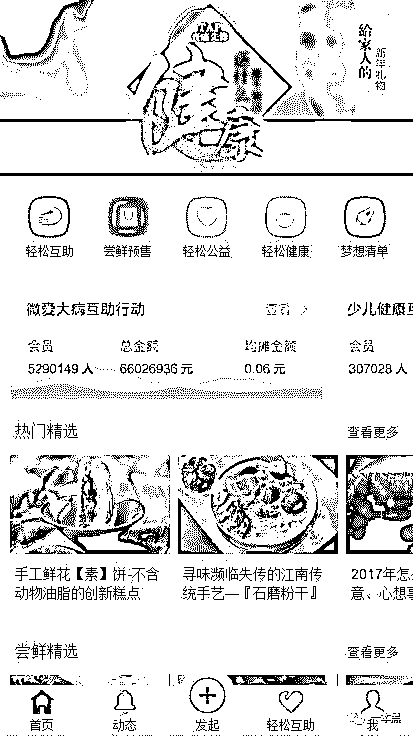

# 从涉黄黑产到洗钱渠道，公益诈骗让你防不胜防！

> 原文：[`mp.weixin.qq.com/s?__biz=MzU4ODAwNzUwMQ==&mid=2247483907&idx=1&sn=feceb893c9e3be589aa98bab4455a45d&chksm=fde21321ca959a37afe28af40d28879a9af32563fd19c124f0bb8b316bb11800aed6fadef96d&scene=27#wechat_redirect`](http://mp.weixin.qq.com/s?__biz=MzU4ODAwNzUwMQ==&mid=2247483907&idx=1&sn=feceb893c9e3be589aa98bab4455a45d&chksm=fde21321ca959a37afe28af40d28879a9af32563fd19c124f0bb8b316bb11800aed6fadef96d&scene=27#wechat_redirect)

文/读者投稿（微信公众号：一本黑） 

责编/振宇、东东

【一本黑】媒体或商业转载必须获得授权，个人转发朋友圈无需授权。

读完需要

10 分钟

速读仅需 4 分钟

* * *

当你知道了太多事实，你就会觉得目之所及的各种新闻都是一种虚假说辞，让我意识到一本黑不只要揭黑，更要维护事件的真貌。  

这次的推文来自一个混迹于黑产圈的读者投稿，谈到的所有内容都真实存在，作者不希望和黑产牵扯太多，所以文字由我稍作调整，用一个合适的角度呈现给大家。

文中涉及【交友】、【淘宝哥】、【黑卡】、【轻松筹】等四个黑产，其中”轻松筹“是该团伙的原创，而且至今还没有被大规模效仿。

这里的「交友」黑产此前已经被一本黑爆料过，而「淘宝哥」、「黑卡」和「轻松筹」此前并未在一本黑得到揭露，希望大家可以通篇读完，以防自己落入陷阱。

> **「交友黑产」**

故事始于 16 年的一个下雨天，我接到朋友的电话，朋友说“Am，现在有人给我介绍了个项目，据说一个微信号日产 200！”

我瞬间就楞了，“日产 200？骗人的吧！有这好事还轮的到你？”。

朋友认真地告诉我是真的，他们的工作室有几千台设备，日收入一直保持在几十万。

其实就是打着交友的旗号，用机器人和对方玩文字暧昧。

默认回几句就要求对方充值，除此之外，多人聊天、查看微信号、电话等信息也必须要花钱开通 VIP，还为了打消对方顾虑说送 100 元话费，本质上就是诱惑用户充值，空手套白狼！

他接着说“这是在公众号上运营的，公众号需要开通微信支付，用群控操纵女微信号发朋友圈，一天站街 5 次，不需要加人就是为了展示给男性用户看，这些通过群控就可以完成。”

（图片来源于网络）

（  站街是一种营销手段，主要是利用社交软件附近的人功能，用站点的方式来曝光自己。在附近的人功能里面让自己被别人搜到，就能让人看到你打的广告，从而进行推广。这个方法在 QQ 作为主流 IM 工具的时候就已经出现。）

电话里不方便聊太多，我们晚上专门找了个地方边喝酒边谈。

酒桌上朋友拿着手机给我展示着所谓的 “同城交友”。

既要赚足男性眼球，又不想冒涉黄的风险，他们在图片的选择上下了不少功夫。

尽管运作模式粗放甚至漏洞百出，但是依然可以促使不少的男性付费。

虽然看起来不可思议，但是色流一直是互联网的一股庞大的暗黑流量，只要和色沾边的内容总能享受到流量上的优待。

世界最大的成人网站可以在 alexa 流量排行榜上一直保持在前三十名，播放量常年在 50 亿左右，所以色流的力量不容小觑。

既然话已至此，我直接问他“你告诉我这些，是打算让我帮你什么？”朋友告诉我，他现在只是个代理，上家(运营者)会抽走 4 成的利润，所以想拿了源码单干。

言外之意，就是想让我从服务器里把源码拖出来。（用老师傅的话来说：“搞定了服务器，你就可以为所欲为”）

他留下网址和后台账号，回去等我的消息。

**「交友黑产」之盗取源码**

其实那时我也并没有十分的把握，毕竟技术上的东西现在很少碰了，内心既担心技艺生疏又怀着一种重出江湖的兴奋。

时间随着键盘的敲击声慢慢流逝，经过多种尝试，终于在上传头像的功能里找到了一个开发者没有留意的漏洞，这个漏洞不止让我拿下了网站拖出源码，同时，让我在数据库里看到了令人吃惊的数据。

**日注册用户有 7 万多人，付费率高达将近 80%！**

总后台可以看到机器人的设置，里面都是设置好的文本发送还有关键词回复，因为关键词回复工程量太大，只能设置一些通用的关键词，所以说不了两句就要求充值。（由于时间久远，数据的图片已经找不到了。）

照片和语音都有专门的文件夹，头像和照片都是套图，这些可怜的男同胞花了钱其实也只是在和代码聊天。

我将源码打包发给了他，并约他第二天见面。

**「交友黑产」之走访工作室**

第二天见面后我提出“能带我去做这个项目的工作室参观一下吗？我想看看有多少台设备。”

朋友没有拒绝，但是提醒我隐藏身份，假装成也想做这个项目的人。

路上我随口问了一句“是不是有几百台设备在跑？”这次他的回答让我彻底奔溃了，“几百台？**做这个项目已经不按台算了，按楼层来算！我们有 2 层！”**

来到工作室我才明白，这里和网上所看到的图片根本不能相提并论，一排排设备挂满了所有的架子。房间里 48 口充电器的散热风扇发出恼人的轰鸣声，其间还夹杂着每次持续几秒钟的叮咚声。

为了不引起怀疑，照片没敢多拍。

那天的心情已经无法用语言来形容，何况这种规模的工作室还不止一家。

当时心里百感交集，做什么毛生意不如买几十台设备做这项目，一个月能顶得上我一年的收入了。

从工作室出来，我压抑不住好奇，追问他这个项目是从何流出的？如此赚钱的门道谁又会到处宣扬？

然而，与其说他给了我一个答案，不如说他的回答又给我打开了一扇门，一扇关于**电信诈骗，买卖数据，制作黑卡的大门…**

> **「全镇武装的“淘宝哥”诈骗黑产」**

“这个思路是 XX 市的「淘宝哥」传出来的！他们中有人转型做交友，买设备的时候走漏了这个项目的模式。”

我继续追问他“淘宝哥是什么？是开淘宝店的吗？”

朋友深吸一口气“**淘宝哥就是通过某些渠道买到淘宝客户数据的人，这些数据精确到消费时间、地址、姓名、电话。拿到数据之后，会开始对目标进行诈骗。”**

“首先，淘宝哥（骗子）会打电话给目标，自称是网店的客服人员，通知你因为淘宝网支付系统出了点问题，目前该笔交易资金已经被冻结，希望你申请退款，退款成功后再重新交易。

期间他们会不断使用话术博取你的信任。

之后，让你加客服 QQ 并且给你发送钓鱼网址让你申请退款。

电话里他们不停地对目标洗脑，诱导你把手机号和验证码都填进去。

在你点击确认退款后，骗子就得到了你输入的所有信息！”

听到这些我内心一直无法平复，“这些人就不怕再出一次“徐玉玉”事件吗？”

朋友一遍点着烟一遍跟我讲，“任何行业都有自己的准则，就算是黑产也是盗亦有道。

淘宝哥的准则就是不对学生下手，假如事后才知道，也会把钱还给他们。

有时碰到真的家里困难的，面对学生的哀求，淘宝哥还可能多退几千回去，毕竟都是穷人出身，都明白个中的辛酸。

当然，个别不守原则的人就另当别论。”

这时我想的是这 TM 的做诈骗还分有没有原则？

朋友叹着气告诉我“大多数淘宝哥会告诉自己，即便我不骗他，也有人会去骗。

平时可能还会去烧香拜佛，做这些都是为了让自己内心舒服点。”

“这些数据是怎么来的，是不是商家自己出售客户的信息？”。

他冷笑了一声：“**这些数据也是一条黑色产业链，批发这些数据的 boss 会把自己的小弟安插在快递公司，淘宝商家里头上班。**

“更厉害的人会绕过 360 等主流杀毒软件，把木马发给淘宝商家的客服，从他们电脑上窃取数据。

**“除此以外，可能还有一些阿里的内部人员会把这些数据提供给一些商家，这些商家用完再出售一遍，拿到这些数据的二手贩子再把数据出售给诈骗团伙。”**

“我们那有一个镇子，里面的年轻人基本都在山上做这个。遇到有外人去他们那里，村民都会问他们过来做什么的。如果发现不对劲会马上散出消息保护淘宝哥全身而退，还有的人会雇佣一些镇上的人在各个地方当眼线。”

当时我就像是小孩听大人讲故事一样听着。没想到这诈骗的团队已经庞大到了一个镇，而且还有村民、眼线帮他们当哨兵。

从窃取数据到诈骗，整条产业链分工是多么的明确。

打听了一下，运气好的淘宝哥日产能有几十万，保守计算，一个团伙月收上亿不是问题。

据我所知，为了应对执法打击，淘宝哥的诈骗套路也在不断更新。

诈骗的法律风险还是太高，很多人开始调整方向，前文提到的「交友」就因此而生。

> **「黑卡」黑产的必备工具**

这就让我想到一个新问题，「交友」早期是在公众号运营，现在转向 app，但是这些都是需要开通微信支付或者支付宝支付的，他们肯定不会用自己真实的公司去申请。

那么黑产就需要大量的工商注册信息。

这里用到的工具就是黑产的必备工具——黑卡。黑卡与绝大多数的黑产紧密相连，可以说是黑产的最重要环节！

这里的黑卡不是那种土豪专属的银行黑卡，而是黑产收钱用的黑卡！

**黑卡一般是以套为单位出现，包含身份证，银行卡，手机卡，U 盾，被称为四大件。**

黑产团伙就是拿着这四大件去办理个体商业户，成本 1000-2000 不等，再用商户资料去开通公众号的微信支付。

这里面的银行卡和电话卡也都是淘宝哥常用的作案工具，确保不会留下和自己有关的痕迹。

黑产对黑卡的需求量很大，手握几百套黑卡是业界平均水平。

通过几个黑市卖家，我了解到了黑卡的来源。

以前，银行还没有人脸识别系统，黑产会专门找人出去收身份证，然后让长得像的人去办卡。

但是现在银行启用了人脸识别，所以黑产也换了方法。

他们专门在类似网吧这样的场所，寻找不务正业游手好闲的年轻人（其中还有吸毒者），然后支付 100-300 元的报酬让他们去办卡，这些卡就是日后黑产用的黑卡。

那些好吃懒做拿着钱就跑去上网，不然就是有染上毒瘾的人，这类群体为了钱什么都敢做。

> **「市场风云变化，黑产手法也不断升级」**

正邪一直在相互抗衡，市场也在不断变化。

**腾讯封杀交友类的公众号，黑卡也被打压了**，但是道高一尺，魔高一丈，交友从公众号转型为 APP，而黑卡也从身份证原件变为了复印件。

如今网络安全逐步升级，钓鱼网站逐渐没落。

现在，淘宝哥很少以“支付系统出问题”做理由，而是用“产品质量有问题可能引起过敏”等做为理由，告知受害者需要退款，然后借机**询问芝麻信用的分数，如果符合条件就开始诱导受害者开通借呗，网商贷，招联好期贷等借款服务。**

再告诉受害者钱已经退到这里面，让用户去注册查看，不知情的用户看见里面居然有上万元也很吃惊。

然而“客服”却可怜巴巴的说是退款退错了，希望你能扣除原有的商品价格将剩余的还给他。

善良的受害者如同淘宝哥手上的玩物，被耍的团团转。

数日之后，当受害者收到催款短信方才如梦初醒。

此时的我已经觉得自己看待事物的方式大有变化，混入了黑产界的“江湖”，假装自己是个小白获取小道消息，慢慢让我成为了黑产界的百晓生。

然而，过了一年我再次发现一个更为黑暗的产业。。。

> **「轻松筹，到底是轻松筹还是 “轻松”筹？」**

时正三月，刚好点开了家人发的一条轻松筹筹款的朋友圈。 

正要给癌症小孩捐款，突然发现收款方居然不是轻松筹的官方名称，而一个和官方商户名称相近的名字。

这让我产生了怀疑，首页没什么疑点，可疑的是点击其他按钮的时候居然没反应。

当我观察了网址方才发现域名并不是官方的域名，让我断定这就是假的轻松筹！

为求真相，我开始对目标进行探究。

我利用计算机基础知识对该网址进行了分析，试了很多种常用的方法都是以失败告终。

无奈之下，居然想出了一个成功率连 1%都不到的方法。

然而一切因此柳暗花明，我追踪到一个香港的 IP，而服务器端口的密码被我用 QAZxsw 连进去了！

最终我在后台看到了真相。

果然所有的数据都是假的。

对方很是谨慎，完成一个项目就立刻删除，所有的资金都流入公众号的支付平台内，外界无从得知他们究竟“筹”到了多少钱，不知道各位读者里可有人上过当。

到此就告一段落了，可能大家觉得我没有及时发布而且有部分图片也没有，因为过去那么久所留下的图片也是找了好久才找到的，而且我最近才知道有一本黑。

现在告诉你们应该也不迟，如果你们觉得有用的话，后续我会继续公布一些黑产界不为人知的秘密，也请各位读者能将这些危害社会的手段告知给身边的人，文笔拙劣，各位见笑。

最后，谢谢一本黑给我机会能把这些藏在心里的秘密大白天下。

振宇：志同道合，何需言谢。

还原事实｜专扒黑产

微信 ID：darkinsider

本次专题来自读者投稿，我们进行编辑。

这种方式比较有趣，也算是某种程度上和我们的一种沟通。

打黑道路上光凭一己之力恐怕难有成效，如果你熟知某些行业的内幕，可以给我们爆料，让更多的人避免上当受骗。

我们相信，在黎明过后，迎来的是光明世界。