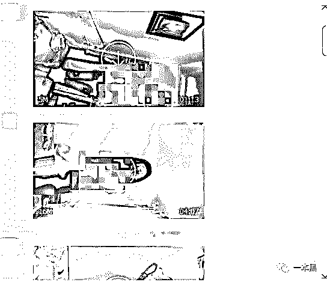
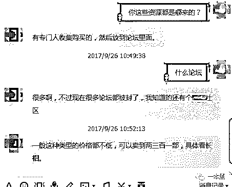
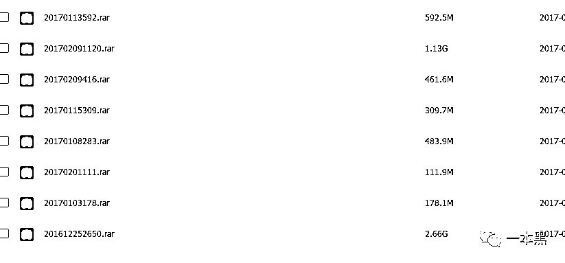
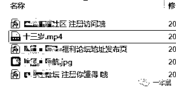
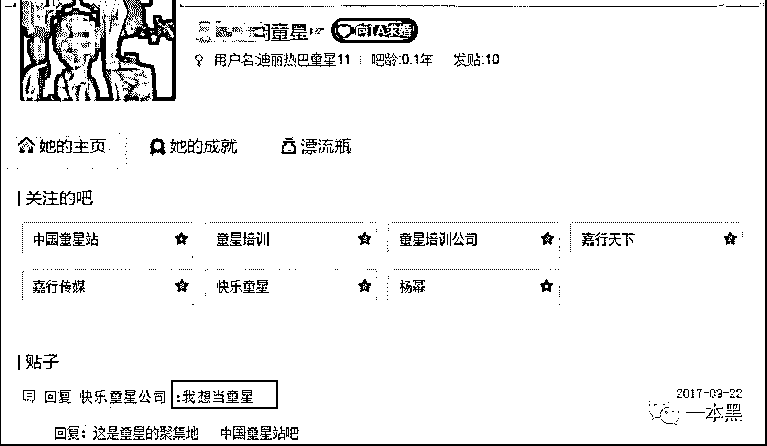

# 你们只知道红蓝黄事件，那这些贩卖性侵视频的黑产谁来管？

> 原文：[`mp.weixin.qq.com/s?__biz=MzU4ODAwNzUwMQ==&mid=2247483902&idx=1&sn=1bb606bb7d5c7fa6347b0ebf50881aff&chksm=fde210dcca9599ca1266f057ffe88a6a87e77d7c74ce1e5c919e7166f26bf4092c1532ed6b3f&scene=27#wechat_redirect`](http://mp.weixin.qq.com/s?__biz=MzU4ODAwNzUwMQ==&mid=2247483902&idx=1&sn=1bb606bb7d5c7fa6347b0ebf50881aff&chksm=fde210dcca9599ca1266f057ffe88a6a87e77d7c74ce1e5c919e7166f26bf4092c1532ed6b3f&scene=27#wechat_redirect)

文/东东（微信公众号：一本黑） 

【一本黑】媒体或商业转载必须获得授权，个人转发朋友圈无需授权。

读完需要

10 分钟

速读仅需 4 分钟

* * *

【一本黑】一直是一个理性、客观主导的号，秉承着还原事实的态度，对于时下新闻性较强的各种事件并没有做出评论。

从最早的辱母杀人案到现在的红蓝黄事件，其实我们有很多话想说。

每一次的热点事件都会有很多媒体争相报道和议论，但无奈都是一家之言，又或者是东拼西凑，对于事件真伪的把控，仅仅停留在表面。

就拿前不久的江歌案来说，最早由【局面】进行报道，很多别有用心的媒体用看图说话的方式加上旁白，对某些事实的真相大加揣测，用谎言去对抗谎言，所以也就造就了事实的苍白无力。

对于此时的红蓝黄事件，又将掀起一波民众的高潮。

但我认为，凡事都得理性，切勿随流，我们得用证据去诠释事件背后的真相。

你们只知道红蓝黄事件，那这些贩卖性侵视频的黑产谁来管？

早在今年 9 月，【一本黑】就曾通过调查，揭露过一起假借招募童星为名，诱骗女童拍摄裸体视频甚至性侵的报道。

而这些幼女的裸体视频，最终会沦为“商品”，成为肮脏利益链条的下游产物。

以下是原文节选。

> <inherit>裸体视频沦为“商品”，成为肮脏利益链条下的产物</inherit>
> 
> <inherit>色情行业也有垂直分类，也就是这些受骗女孩的裸体视频。</inherit>
> 
> 然而这种分类相比其他类别则是该淫秽产业中的香饽饽，这也是为什么会有那么多假借童星招聘进行诈骗的缘故，一切都是利益的驱使。
> 
> 当受骗女孩把自己录制的裸体视频发送给诈骗者时，也就宣告了这条黑色产业链的开始。
> 
> 他们把这些视频收集起来打包贩卖或是上传色情网站和论坛。
> 
> 在一个付费的 QQ 群里，群主每晚会分享几部幼女的裸体视频或是性侵视频。
> 
> <inherit></inherit>
> 
> <inherit>（QQ 群里的视频分享）</inherit>
> 
> 和群主混熟后，我问群主是如何吸引这些人加群时，群主说先通过各种渠道发布一些图片或者视频然后留下联系方式，自然就会有人入群。
> 
> 这种现象想必大家都见怪不怪，各种贴吧、论坛、社交软件层出不穷。
> 
> 群主说，一般这种类型的视频都会卖出比较高的价格，两百到三百一部，具体还得看长相。
> 
> <inherit></inherit>
> 
> 他们有些是诈骗者也是贩卖者，同时也是色情论坛的管理者，通过把收集到的视频或照片上传色情论坛来吸引流量，诱导好色者付费购买，从中谋取利益。
> 
> （这一块的牟利行为不光是诱导大众购买，网站的各种博彩广告收益也高得惊人）
> 
> 群主每天在群里分享视频的同时还会宣称自己有 200G 这种类型的视频，打包价 88 块，随即在群里发了一个网盘链接。
> 
> 网盘中有几十个压缩包，但都需要密码才能打开。
> 
> <inherit></inherit>
> 
> <inherit>（压缩包截图）</inherit>
> 
> 为了验证群主所述的真假，也为了探清到底有多少女孩受骗，我们寻求了一本黑老师傅的帮助，老师傅开始针对压缩包的密码进行破解。
> 
> 本以为很容易就能破解成功，不料第一次就失败了，老师傅连忙感叹：“看来这些人还有点防范意识啊。”
> 
> 在尝试了多次后，破解结果并不能说是完全成功，但也验证了这 200G 视频的真假。
> 
> <inherit></inherit>
> 
> <inherit>（破解后的压缩包示例）</inherit>
> 
> 只有少许的压缩包未能破解成功，老师傅说未能破解的压缩包密码应该是掺杂了中文、字母、数字、符号的强密码，要不然不会破解不开的。
> 
> 视频中无知的女孩让人不寒而栗，可想而知他们的父母看到后会是什么样的心情。
> 
> <inherit>骗局背后：是卑鄙者道德的缺失？</inherit>
> 
> 一个十几岁女孩的认知程度真的没有想象的那么高，当他们在贴吧看到各种所谓传媒公司“招聘童星”的广告时，都会在帖子下面跟贴，留下自己的个人信息，甚至留下自己的照片，希望得到传媒公司的青睐。
> 
> 从一名王姓女孩的贴吧主页中可以看到，她关注的全是各种童星培训的贴吧或是传媒公司，在帖子的回复中也不难看出她对于想当童星的渴望。
> 
> <inherit></inherit>
> 
> <inherit>（主页截图）</inherit>
> 
> 我们通过黑客手段对这些传媒公司的调查发现，所谓童星培训，造梦工厂基本都是些空壳公司，早已被工商部门列入经营异常列表。
> 
> 他们只不过是色情诈骗者伪装的一个面具罢了。
> 
> 都在说 80 后、90 后的我们焦虑、浮躁，可这些未涉世的孩子何尝不是。
> 
> 明星亲子等节目对这些十来岁孩子的错误引导，加之父母在家庭教育上的严重缺失，让她们形成了错误的价值观，“一夜成名”成了她们这个年纪幻想的事情。
> 
> 一旦父母发现自己的孩子遭遇这种诈骗行为，他们却只能哑巴吃黄连，有苦说不出。
> 
> 调查中发现，一些受害者父母担心孩子的裸照或者视频会被广泛传播，给孩子和家庭带来声誉上的影响而不敢报警，敢怒不敢言成了这种事件收尾的方式。
> 
> 然而这样的结局只会让那些丧心病狂的诈骗者逍遥法外。
> 
> 在我们看来，他们诈骗的不止是几张裸体照片或视频，而是这个社会的意识与教育的缺失。
> 
> 醒醒吧，这个浮躁的社会与现实。
> 
> 那只伸向未成年少女的黑手，别让这种低俗的黑色产业链去玷污那些纯洁的灵魂。
> 
> 卑鄙，终将是卑鄙者的通行证。
> 
> <inherit>**而道德，是这个社会该有的墓志铭。**</inherit>

其实，这种性侵儿童并获利的手段早已形成一条成熟的黑色产业链，相比幼儿园性侵，这种方式更惨无人道，他们利用语言上的蛊惑，让儿童无法辨别是非。

虽然多数黑产大肆掘金让人触目惊心，但这种性侵儿童并录制裸体视频进行贩卖的黑产可以说让人头皮发麻，他们的道德完全被自己踩在了脚下。

突然想起一个真实的故事，1984 年，发生在美国的一起枪击事件震惊全国，小男孩乔迪被自己的教练持续性侵，教练被逮捕后，等候在机场的乔迪父亲掏出枪将教练打死。

因为民意法官判定为误杀，父亲因此被判 5 年缓刑。

乔迪长大后热衷于公益事业，30 年后父亲也因病去世。

当问及乔迪父亲当初有没有后悔开枪时，他说：“我对我所做的事情从未后悔过。”

这里并不是鼓励报复，而是我们该思考，为何会有如此多类似事件的发生？

人生而不易，从呱呱坠地到长大成人，当我们质问这个世界会好吗的时候，是否也该想想这到底是人性的泯灭还是法律的容忍。

又或者其他。

和其他的热点事件一样，这次的虐童事件最终会烟消云散。

而我们要做的不仅是义愤填膺，还要学会冷静思考。

<inherit>如何保护自己儿女的安全，如何杜绝这类事件的再次发生，都将是作为父母和即将成为父母的我们的使命。</inherit>

<inherit>肉体的伤痛可以治疗，心灵的伤痛该怎么治？</inherit>

我想说的是，但愿，但愿有一天，法律和人性最终会走到一起。

最后，引用电影《熔炉》里的一句台词**：**“我们之所以战斗，不是为了改变世界，而是为了不让世界改变我们。”

还原事实｜专扒黑产

微信 ID：darkinsider

后台回复“性侵”可查看性侵专题