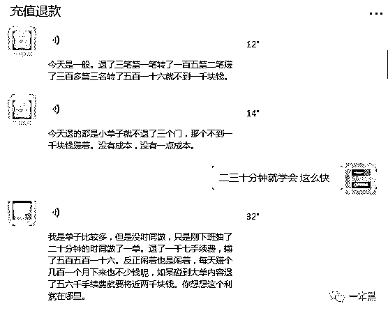
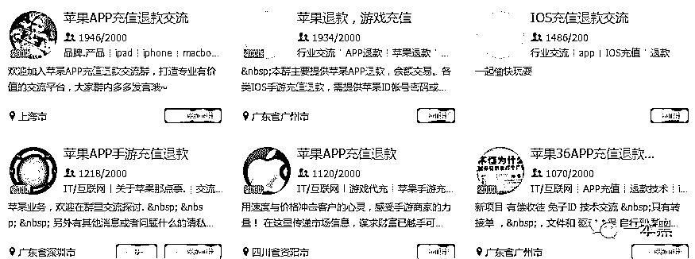

# 充值游戏道具的钱还能退？从此手游不花钱？

> 原文：[`mp.weixin.qq.com/s?__biz=MzU4ODAwNzUwMQ==&mid=2247483896&idx=1&sn=c3f3e2e7c66fb2cbf091dfc8f1a388c8&chksm=fde210daca9599ccd87a1835106173d99a25562dfe2eb33bf3a1e8518f9f51a136d11befd19a&scene=27#wechat_redirect`](http://mp.weixin.qq.com/s?__biz=MzU4ODAwNzUwMQ==&mid=2247483896&idx=1&sn=c3f3e2e7c66fb2cbf091dfc8f1a388c8&chksm=fde210daca9599ccd87a1835106173d99a25562dfe2eb33bf3a1e8518f9f51a136d11befd19a&scene=27#wechat_redirect)

文/东东（微信公众号：一本黑）

【一本黑】媒体或商业转载必须获得授权，个人转发朋友圈无需授权。

读完需要

9 分钟

速读仅需 3 分钟

* * *

互联网的发展一直秉承着用户至上的原则，在这个流量为王的时代，用户才是第一生产力，所以很多平台都会有相关保障用户权益的政策。

<inherit>不管是实物还是虚拟商品，只要商品有问题，用户都有权进行退货退款。</inherit>

<inherit>然而就有不少人利用这种退款政策大肆掘金，就拿苹果的退款政策来说，很多人可以说是躺着就把钱赚了。</inherit>

<inherit>今天我们就来聊一聊苹果充值退款中衍生出来的灰色产业。</inherit>

> 想学东西？先交钱！

前几天刷朋友圈的时候，突然看到好友的一条转发，大意就是可以对 ios 游戏和 app 的充值进行退款。

也就是说你在游戏里充值的钱可以帮你退回来，挽回一定的经济损失，并且不封号不扣钻石元宝点券，对 id 和游戏没有任何影响。

<inherit></inherit>

看着截图里充值王者荣耀点券成功退款的截图，想着自己曾经玩王者荣耀也充值了不少钱，是不是真的可以退出来，对此，我有了极大的兴趣。

我赶紧加了消息中的联系人，想必这里面会别有洞天。

随着暗访调查的逐步深入，这条利用苹果退款政策疯狂掘金的产业链也逐渐露出水面。

<inherit>所谓的充值退款，就是用户在游戏内充值钻石或者道具，这些退款人会联系苹果，通过编造一系列不想消费的理由，让苹果把充值的钱返还给用户，然后从中收取一定的手续费。</inherit>

<inherit>通过了解，该产业的盈利模式主要分为两种，一种是常规的退款业务，另一种则是通过收徒弟的方式收取教学费用。</inherit>

当我询问学费多少钱时，对方表示学费 2888 元，二三十分钟就可学会，并且会手把手的带着徒弟做单。

聊天中对方不断说出自己每天的盈利情况，接到小单子一单可赚几百块，大单子可达上千块，而且完全没有成本，利润相当之高。

<inherit></inherit>

<inherit>（对方聊天进行了语音转文字处理）</inherit>

<inherit>当问及退款流程的时候，对方只是含糊其辞地说了需要提供资料，然后针对具体的账号情况制定不同的退款计划，总的来说退款方式有好几种，主要得根据账号的消费情况来定。</inherit>

<inherit></inherit>

<inherit>对方声称，虽然学费比较贵，但如果学会的话每笔成功的退款都会产生几百上千的利润，对于能力强的人，一两天就可以把学费赚回来。</inherit>

> <inherit>退款人还能成为一种职业？</inherit>

<inherit>如果说这条产业链已经初具规模，那么一定可以找到这个圈子并混进去。</inherit>

<inherit>而混进这个圈子的入口毋庸置疑就是 QQ 群。</inherit>

<inherit>通过 QQ 群的关键词搜索，果然发现很多苹果充值退款群的存在。</inherit>

<inherit></inherit>

<inherit>顺利混入几个群后，随处可见浓浓的广告气息，时不时就会有人发出承接苹果 app 退款的广告。</inherit>

<inherit>每个群都有几百上千的网友，可以看出这条产业链已经逐渐走向成熟。</inherit>

<inherit></inherit>

<inherit>（群里泛滥的广告信息）</inherit>

<inherit>群里还会有各种招代理接单人的广告信息，我以合作代理的名义加了其中一个人，想要从中了解清楚他们的业务模式。</inherit>

<inherit>所谓的代理接单人也就是专门寻找客户，并把客户介绍给退款人，类似于“销售”。对方还表示介绍过来的客户成功退款后收益平分。</inherit>

<inherit>退款人是交易过程的重要环节，首先需要客户提供自己的苹果账号和密码，还需要开启手机呼叫转移，把转移的号码绑定在退款人的手机号上。</inherit>

<inherit>对方告诉我，早些时候他们会使用专门的手机号码生成器，来给苹果客服打电话，以此来躲过苹果对于电话号码的记录。为了省去不必要的麻烦，现在直接让客户设置呼叫转移就行了。</inherit>

<inherit>当问及为什么需要苹果账号密码时，对方表示需要登录苹果官网查看订单和消费情况，只有在 90 天内购买的订单才可以退款。</inherit>

一般新的苹果账号不太容易退款成功，苹果官方会认为这是批量注册用来恶意退款的 ID。

<inherit></inherit>

<inherit>因为在网页上通过 iTune 进行退款的成功率不是很高，并且需要等待较长的时间，所以退款人会通过电话的方式和苹果客服进行沟通退款。</inherit>

<inherit>可别小看电话沟通，这里面还有很多小技巧，如果退款理由说得不恰当，必然会导致退款失败。</inherit>

<inherit>对于第一次退款的账号来说是很容易的，如果账号有第二次第三次退款行为，苹果客户就会查看你的 ID 账号，成功率自然就会下降。</inherit>

<inherit>这时候就需要退款人提前编造好的退款理由，一般退款人会说这是家里的小孩误充、又或者退款人会把理由推到游戏问题或开放商的问题上。（比如：“道具丢失”、“闪退现象频繁”）</inherit>

<inherit>退款成功后，原先购买的道具依然可以正常使用。</inherit>

<inherit>当然，每一次的退款都不是百分百成功的，对于网易旗下的产品，对方称因为其内部机制的原因，有时候会出现封号的可能。</inherit>

<inherit></inherit>

> 苹果 ID 还能卖钱？

<inherit>因为苹果的退款政策，让越来越多的人加入到这块“分蛋糕”的队伍中来，最终必将导致苹果和各大厂商血本无归。</inherit>

对此苹果也上了很多风控系统来提高恶意退款的门槛，但一山还比一山高，由此也就出现了定制任意国家 ID 的服务。

充值退款也不再局限于个人，各种工作室如雨后春笋，在生长的同时，也在不停地吮吸着苹果和各厂商的血液。

有的工作室甚至还有自己的官网，生意仿佛做得如火如荼。

<inherit></inherit>

淘宝往往能反应一个产业的供需现状这句话一点也不假，通过关键词搜索，发现很多商家在做着苹果 ID 出售的生意。

<inherit></inherit>

而这些 ID 除了提供普通用户使用外，还会成为退款人牟利的工具。

商家提供各国的 ID，退款团队批量购买，通过一定的方式登录苹果官网以报告的形式进行退款。（为了防止模仿，具体操作就不说明。）

对于苹果 ID，不仅淘宝有专门的商家出售，QQ 群也充斥着各种各样的小贩，他们每隔一段时间就会在群里发出出售各国 ID 的广告。

<inherit></inherit>

QQ 群内的小商贩出售的 ID 号分国家和地区，售价大概在 0.8-10 元之间。

为了验证账号的真假，我尝试购买了一个日本的 ID。（ID 挂在发卡平台上出售）

<inherit></inherit>

通过登陆苹果官网，验证了该账号的真实性。

因为该商贩把 ID 账号挂在发卡平台上出售，对于发卡平台来说，老师傅还算比较熟悉。（此前揭露过 21 岁小伙卖吃鸡外挂日入上万也是通过发卡平台出售。）

老师傅再次展示了他娴熟的【计算机基础知识】，用字典等方式进行了爆破。

进入商家后台后，卡商销量一览无余。

<inherit></inherit>

虽然销量不像此前的吃鸡外挂那样日入上万，但一天几百上千的流水还是比较暴利的。

不过也不难理解，每个 ID 卖这么便宜，如果遇不到大客户销量肯定上不去，再加上狼多肉少的局面，生意自然也就显得萧条。

通过商户信息和登陆 ID，可以查出该商家是位于黑龙江省的一个 ID 贩子。

<inherit></inherit>

<inherit>（像这种卖 ID 的商家遍布 QQ 群，数不胜数。）</inherit>

“这些商家哪来的这么多苹果 ID？”我疑惑地问老师傅。

“这不就和手机卡商类似吗？”

“他们通过苹果设备供货商，租借苹果新机来批量生产 Apple ID。然后通过设置注册账号，下载应用等方式来“养号”，说白了就是模仿用户行为，让苹果以为这是真实用户，以便最大限度的实现充值退款。”

甚至还会有黑客利用专门的密码撞库软件去破解苹果用户的账号和密码，然后修改密保和密码，再将修改后的账号出售以此获利。

<inherit></inherit>

这也就是为什么有些人的 Apple ID 会被盗的原因，在某一个小角落，被盗的 ID 账号正在沦为商品批量销售。

当然，这种做法无疑是侵犯了公民的个人信息，是属于违法行为。

对于 QQ 群内大量售卖苹果 ID 的卡商，我们并不能断定这些账号的来源，但是这条衍生出来的产业链的牟利行为是毋庸置疑的。

> <inherit>退款政策到底伤害了谁</inherit>

从退款人、玩家、到贩卖苹果 ID 的这一条利益链上，他们自始至终都在利用苹果的退款政策进行牟利，就像大多数的产业链一样，已经形成了一个闭环，他们是利益共生的一个共同体。

实际上，苹果和游戏运营商是有利益分成的，但最终利益损失比较大的还是游戏运营商，开发的游戏道具得不到相应的付费报酬，影响的是自己游戏的收益。

原本用来保障用户权限实行的退款政策，却被不少“有心人”动了歪心思。

阳光之下必定会有阴影，这种针对退款政策“研究”出来的灰色技术和灰色玩法总会有吃不到食的一天。

我们在思考退款政策到底伤害了谁的同时，不妨来回想一个有关生态系统的案例。

在一个由狼和羊组成的草原生态系统中，如果狼的数量大量减少，羊的数量变化情况会是怎样的？

又或者如果狼的数量大量增加，羊的数量又会呈现怎样的变化？

这一点，对于大多数灰黑产，同样适用。

还原事实｜专扒黑产

微信 ID：darkinsider