# 【双十一黑产】不是优惠太少，是你输给了优惠杀手

> 原文：[`mp.weixin.qq.com/s?__biz=MzU4ODAwNzUwMQ==&mid=2247483880&idx=1&sn=9b2e4dfaa82862c99aaecfc9fa499ead&chksm=fde210caca9599dc7ce1d69ec1460ab6dabce30f76af889434d7044c783114855e689d5fc016&scene=27#wechat_redirect`](http://mp.weixin.qq.com/s?__biz=MzU4ODAwNzUwMQ==&mid=2247483880&idx=1&sn=9b2e4dfaa82862c99aaecfc9fa499ead&chksm=fde210caca9599dc7ce1d69ec1460ab6dabce30f76af889434d7044c783114855e689d5fc016&scene=27#wechat_redirect)

文/东东

责编/振宇（微信公众号：一本黑）

【一本黑】媒体或商业转载必须获得授权，个人转发朋友圈无需授权。

读完需要

9 分钟

速读仅需 3 分钟

* * *

想必前几天大家都被马云和王菲合作发布单曲的新闻刷了屏，作为电商界的大佬，“灵魂歌手”的马云在追星路上可以用一句电影台词概括：“抱歉，有钱是真的可以为所欲为。”  

之所以提起马云，是因为其开创的“双十一”购物狂欢节即将到来。

曾经看过一个报道，双十一当天 X 宝卖出的尿不湿可以吸干 6 个西湖。2016“双十一”全天的销售额高达 1207 亿，降价促销总是可以让国内的庞大内需在一个点爆发。

每逢购物节平台就会大发福利，这么多优惠，守在电脑前的你又能抢到几个？

不论你多认真，就算抢赢了其他用户，你也抢不赢灰产的正规军。

因为那些本该属于用户的优惠，大多数都流入了“羊毛党”手中，任凭用户多努力，得到的只能是冰山一角。

本期我们讲讲薅羊毛这个巨大的灰产，让你知道那些本该属于你的东西是怎么落入别人口袋的。

> 从薅羊毛到羊毛变现

所谓“羊毛党”，是指有选择地参与各互联网渠道的优惠促销活动，以相对较低的成本甚至零成本换取物质上实惠的人群，这一行为被称为“薅羊毛”。

而关注与热衷于“薅羊毛”的群体就被称作“羊毛党”。

<inherit>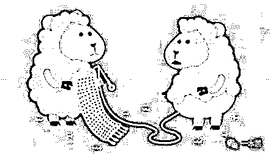</inherit>

就拿双十一的各种优惠劵和红包来说，“羊毛党”的工作就是在各电商平台寻找优惠劵或能领取红包的机会，然后大规模的获取，把属于用户的东西都放进自己口袋。

羊毛党使用大量手机号在各大电商网站批量注册账号，再使用这些账号去抢优惠劵或红包。

这种现象不仅存在于电商平台、只要有优惠的地方就有羊毛党的身影。

而这只是羊毛党“薅羊毛”的第一步，他们在拿到优惠劵后，会以各种形式进行推广销售，最终实现“羊毛”变现。

我们举一个已经被封杀掉的薅羊毛例子。

经常网购的人一定知道，每当完成一笔购物交易，X 猫店家就会赠送一定的积分，这些积分可以下次购物的时候抵掉部分现金。

而当一笔交易完成后，即使发生退货行为，之前赠送的积分依然存在，并且如果当天是用户的生日，还可以拿到 5000 点的积分。

羊毛党们就是利用这两点，通过注册大量生日接近购买日的账号进行购买再退货，他们一方面有自己的 X 猫店铺，又或者和 X 猫店铺暗中勾结，从而达到薅取积分的目的。

<inherit>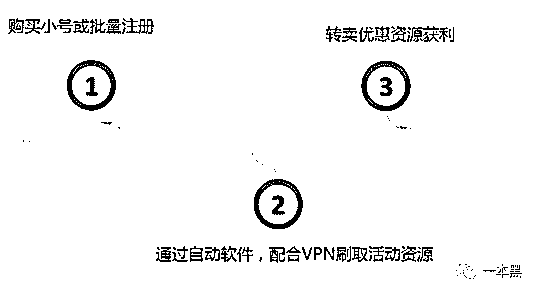</inherit>

<inherit>（黑产电商刷单手法：图片来自于腾讯云）</inherit>

羊毛党甚至会对上十亿级别的上市公司发起挑战，冥冥之中，胜券在握。

早在去年八月，就有新闻爆料某上市公司被“羊毛党”薅到破产，半年亏损 16 亿。

某上市公司推出的直播平台，为了吸引用户可谓是投入重金，只要用户注册这个直播平台，每天直播十分钟以上就会有 30 元的现金奖励。

第二天第三天依然会有 30 元的收入，并且往后的每天会有 10 元的收入，这些收入在直播的第二天便可提现。

这对于以“薅社会主义羊毛”为宗旨的“羊毛党”来说可真是一块肥肉，他们通过大量的手机号在该直播平台注册新用户从而赚取现金奖励。

根据统计，该直播平台的活跃活用只有 112 万，和投入的 16 亿相比可谓凤毛麟角、不成正比。

因为缺乏防御机制，高额的补贴没有带来预期效果，反倒成了“羊毛党”的囊中之物。

<inherit>所以，【一本黑】认为一个平台能否快速发展，仅仅把握住时代潮流是不够的，还得时刻提防灰产的威胁，往往胜负就在于这些看似微小的博弈中。</inherit>

> “羊毛党”如何薅外卖平台的首单减免

<inherit>总之，这是一个以年轻人为消费主流的时代，不管是一年一度的双十一，还是各种商家的促销活动，都给羊毛党带来了商业机会。</inherit>

<inherit>经常看到 QQ 群或微信里有人发广告，声称可以代下外卖平台的首单，前提得支付一定的佣金。</inherit>

<inherit>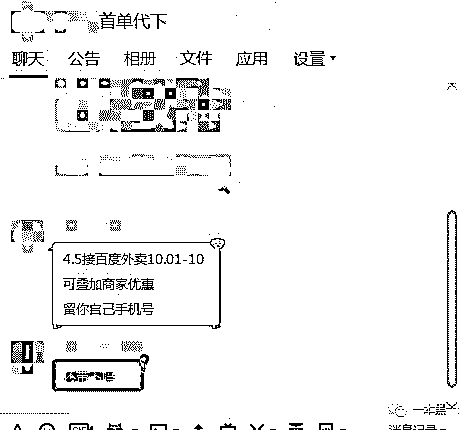</inherit>

<inherit>大家都知道，当前比较主流的外卖平台（美团外卖、饿了么、百度外卖）对于全新的账号（也就是首单）是有减免活动的，这个 15 元的首单减免优惠也就成了“羊毛党”用来薅羊毛的“产品”。</inherit>

<inherit>【一本黑】之前的专题里就说过，淘宝能反应一个产业的供需现状、QQ 群则是这个产业的“线下”店铺，这样的 QQ 群已经超过一千个。</inherit><inherit>所以通过 QQ 群关键词搜索，混进了几个外卖代下的群。</inherit>

<inherit>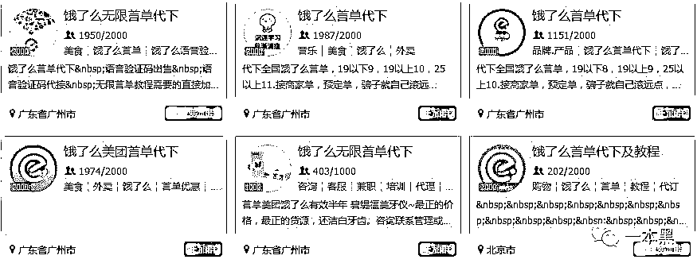</inherit>

<inherit>经过一番摸底调查，我发现了这其中的来龙去脉。</inherit>

<inherit>首先羊毛党需要大量的全新外卖平台账号，而这些账号在注册过程中就需要使用手机号来接收短信验证码以完成注册，但每个手机号只能注册一次，羊毛党肯定得使用工具软件来注册。</inherit>

<inherit>通过在 X 宝搜索“手机号注册”果然发现一些店铺在做这样的服务。</inherit>

<inherit>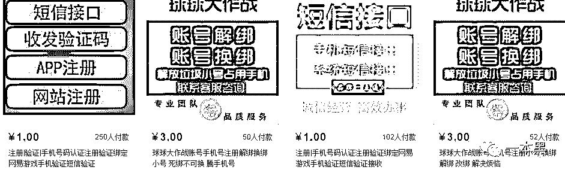</inherit>

<inherit>随后我们找到了一款手机短信接码软件，只要在软件上搜索你需要注册的平台名称，再点击获取号码，就会得到一个手机号。</inherit>

<inherit>通过实验，当把这个手机号输入某一款外卖软件，点击获取验证码的时候，该短信接码软件就会收到这个手机的验证码，把这个验证码输入后即可完成注册。</inherit>

<inherit>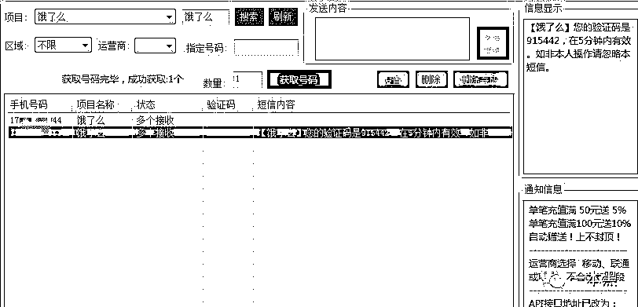</inherit>

登陆账号后，外卖软件的首单红包随即而来，“羊毛党”们就是通过这种方式完成了全新账号的注册。

<inherit>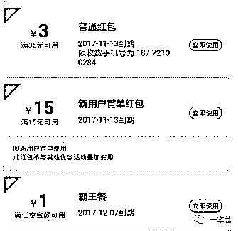</inherit>

但这仅仅是第一步，外卖平台也曾考虑过防止被“薅羊毛”，对新用户首单减免的优惠劵做出了 3 个限制，分别是：新手机号、新账号、新设备。

<inherit>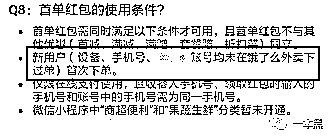</inherit>

<inherit>对于这三个条件，因为手机号是在接码软件上获取的，因此都是从未使用过的新号。而账号则是通过该手机号注册的，所以满足了前两个条件。</inherit>

<inherit>只要解决“新设备”这个问题，那么首单代下自然水到渠成。</inherit>

<inherit>（新设备：手机型号，序列号，版本号、IMEI 等信息，外卖平台以此来判断是否是同一个手机）</inherit>

<inherit>那到底如何还原“羊毛党”们对于这一环节的操作呢！我只能找到老师傅。</inherit>

<inherit>老师傅手中的黑科技可真是多，通过在一款模拟器里安装的一个软件，据说这个软件可以随机生成模拟器所模拟设备的信息，实验一番后，老师傅还原了这一过程。</inherit>

<inherit>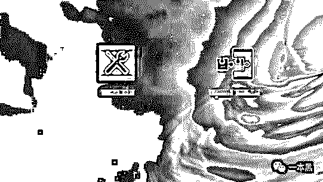</inherit>

因为是随机生成的设备信息，外卖平台就会误以为用户使用了新的手机下单，也就满足了首单减免限制的第三个条件。

简单来说“羊毛党”就是通过接码软件获取手机号和验证码进行注册，再通过相应的软件模拟手机设备信息，完成外卖平台的首单减免限制。

最后通过一系列的招揽用户手段，最终达到“薅羊毛”的目的。

通过实验我们发现，这种接码软件获取一个账号的成本在 2 毛钱左右，基本可以忽略不计。

而外卖平台的首单优惠 15 元，羊毛党为了实现“羊毛”变现一般会以 8 元钱出售给用户，而一个账号可以在多个外卖平台使用，也就是说一个账号可以获利 16 元甚至 24 元。

另外，外卖平台对于首单减免还有一个要求就是外卖的接收号码必须为注册账号的号码，羊毛党们为了能让用户顺利拿到外卖，会让用户在“备注”栏里填写收货人的电话，以方便用户能收到外卖。

加之这种针对外卖平台的薅羊毛行为可以遍布全国各地，只要在宣传和推广上做到位，一天上百单的销量是轻而易举。

羊毛党每一单的单价并不高，所以赚多少，全看羊毛党的规模。

这种外卖平台薅羊毛行为其实和 X 猫店铺以及直播平台薅羊毛行为如出一辙，无非就是通过接码平台获取大量手机号去批量注册账号，而这些账号就是“薅羊毛”的工具。

<inherit>小的羊毛党手里会有几万张，大的则可能拥有上百万张，而这些电话卡大部分是从运营商内部流出的。</inherit>

如此之多的电话卡和账号操作起来过于繁琐，为了提高效率，羊毛党使用“猫池”来统一管理所有的电话卡，批量获取验证码，并且用电脑控制多部手机批量注册账号，参与优惠活动也是统一操作。

<inherit>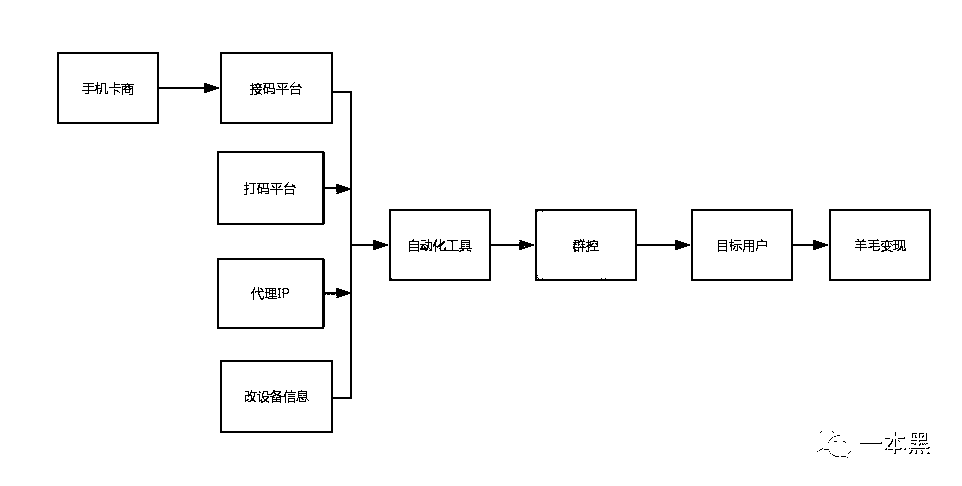</inherit>

接码平台给羊毛党提供手机短信接收服务进行收费，并和对接的卡商进行利益分成。

而这些大量的手机号来自“猫池”，卡商管理着“猫池”，并持续为接码平台提供相关项目的短信收发服务。

<inherit>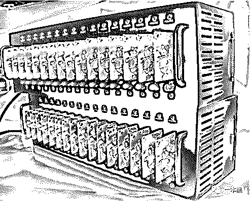</inherit>

<inherit>（猫池：图片来源于腾讯云）</inherit>

除了上述案例，秒杀、低价抢购、抽奖等活动，都是羊毛党的必争之地。

从手机号管理、收取验证码、破解平台的图形验证码、改设备信息（规避平台的反刷机制）、批量操作抢夺优惠，最后到羊毛变现，都已经形成了成熟的产业链，每个环节都涉及繁复的细节，由于篇幅限制我们就不展开去细讲了。

> 这是大家都不关心的防御

<inherit>不管是各大电商平台还是社交软件，无处不在的“羊毛党”无疑已经成为平台运营商眼中的过街老鼠。</inherit>

<inherit>如何在这个硝烟弥漫的战场上打赢这场关于人性的战争，我想这是值得平台运营商思考的事情。</inherit>

<inherit>业务安全的对抗，本质上就是数据和经验的对抗，在这一方面，不少安全服务商都推出相应产品来对抗羊毛党，这次提供资料的腾讯云天御防刷就是此类产品的代表。</inherit><inherit>大数据结合防御策略来和“羊毛党”进行对抗，不仅可以打击大量的虚假账号，还能减少对正常用户的误伤。</inherit>

<inherit>总之，大数据只有结合经验才能成为安全领域对抗的一把利器，同样经验也需要通过数据来印证达到进一步提升的目的，形成方法论。</inherit>

<inherit>不管是各大电商平台还是 O2O 平台、或是互联网金融平台，无处不在的“羊毛党”无疑已经成为平台运营部门眼中的过街老鼠。</inherit>

<inherit>据统计，各大国内一线电商及互金平台，在利用福利拉新或促活的运营活动时，如果没有采用严格的活动反作弊风控手段，那么 10—50%的运营福利都会落到集团性的羊毛党黑产的口袋中。 </inherit>

<inherit>羊毛党是一个分工明确、合作流程成熟的产业链，如何在这个硝烟弥漫的战场上打赢这场关于企业与黑产产业链之间不平等的战争，我想这是值得平台运营商思考的事情。</inherit>

<inherit>业务安全的对抗，本质上就是数据积累和经验沉淀的对抗，在这一方面，不少安全服务商都推出相应大数据风控模型来对抗羊毛党，这次提供资料的腾讯云天御防刷就是此类产品的代表。</inherit>

<inherit>大数据结合防御策略来和“羊毛党”进行对抗，可以帮组企业过滤垃圾访问，节约大量的运营经费，最终平台用户享受到真实的运营福利。</inherit>

<inherit>总之，大数据只有结合经验才能成为安全领域对抗的一把利器，同样经验也需要通过数据来印证达到进一步提升的目的，形成方法论。</inherit>

还原事实｜专扒黑产

微信 ID：darkinsider