# 足不出户日赚上千？赚不赚钱心里没点 X 数吗？

> 原文：[`mp.weixin.qq.com/s?__biz=MzU4ODAwNzUwMQ==&mid=2247483876&idx=1&sn=7a2c329a8b5b57c56fc895e15593979b&chksm=fde210c6ca9599d0820373eefa23cec70a2c5dd1e2ca2cfd637a62fc3607fc326fdad6e2de72&scene=27#wechat_redirect`](http://mp.weixin.qq.com/s?__biz=MzU4ODAwNzUwMQ==&mid=2247483876&idx=1&sn=7a2c329a8b5b57c56fc895e15593979b&chksm=fde210c6ca9599d0820373eefa23cec70a2c5dd1e2ca2cfd637a62fc3607fc326fdad6e2de72&scene=27#wechat_redirect)

文/东东（微信公众号：一本黑）

【一本黑】媒体或商业转载必须获得授权，个人转发朋友圈无需授权。

读完需要

7 分钟

速读仅需 3 分钟

* * *

**本专题将和【终结诈骗】联合发布**

<inherit>鱼龙混杂的网络世界，真假难辨的虚拟空间，遍布着各种各样的骗局。</inherit>

<inherit>日赚几百甚至上千早已成为网赚行业的宣传噱头，很多人都觉得网赚很轻松，不用风吹日晒，不用跑腿故作姿态，一根网线一台电脑就可以轻松把钱赚。</inherit>

<inherit>凡是都要透过现象看本质，其实，以上所说的，都是来自于亲身经历并赚到钱以后才会有的优越感，对于亲身经历这件事，很多人往往就在这一步入了坑。</inherit>

<inherit>也有很简单的网赚项目让不少人轻松赚到钱，让他们误以为网赚其实如履平地，但其实这种项目都是昙花一现，最终恐怕是覆水难收。</inherit>

<inherit>正因为网络世界的深浅不一，让一些居心叵测的人设计出各种各样的骗局诱惑新手上当，等发现的时候，诱骗者早已卷钱跑路，也只能无奈交了智商税。</inherit>

> 稀里糊涂误入网赚圈，足不出户就能赚钱？

<inherit>阿华（化名）是一名在校大学生，闲散的大学生活让他逐渐失去对生活的一切热情，唯一的爱好就是打英雄联盟。</inherit><inherit>但前几天 WE 惨败的消息让他放弃了北京鸟巢之旅，对于黄牛手中翻了几倍的门票，他已漠不关心。</inherit>

<inherit>在昏沉的下午，他默默关掉直播页面，漫无目的地浏览着一些无关紧要的网页，无意间，一个挂机赚钱的网页出现在他眼前。</inherit>

<inherit>这是一款永久免费使用的挂机赚钱软件，声称只要把软件挂在后台就可实现轻松赚钱。</inherit>

<inherit>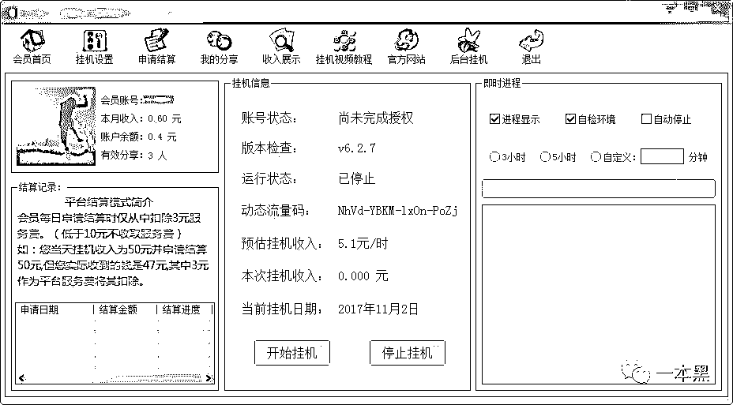</inherit>

这对阿华来说可谓是一道福音，软件上有预估收入，平均一小时大概可赚 5.1 元，如果一天从早挂到晚的话可以赚 60 来块，钱虽然不多但好歹一天的饭钱算是解决了。

二话不说，阿华在官网下载了软件，安装注册完成后，软件提示需要完成挂机设置才可以显示全部内容。

于是阿华照着挂机软件的设置步骤完成了配置，当他回到主页点击开始挂机时，主页显示挂机程序启动中，正在检查是否完成挂机账号配置......

正当阿华以为就要成功的时候，进度显示区却显示尚未完成授权，需要完成分享操作并且有效分享人数达到 10 即可完成授权。（有效分享：指使用自己的账号分享给他人，他人完成下载并注册即可视为有效分享。）

于是阿华找到【我的分享】界面，复制分享链接到自己的所有 QQ 群，微信群，还叫朋友帮忙下载注册，以达到有效分享。

<inherit>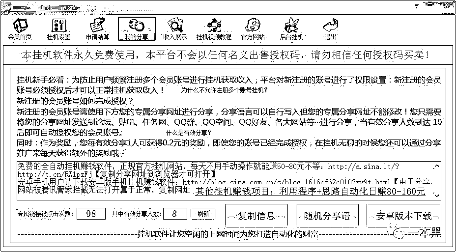</inherit>

可是不管阿华怎么分享链接，有效分享人数还是不能达到 10，这时候他不耐烦了，这么麻烦的操作让他没有心思再继续下去。

他开始质疑这款软件的真假，是否真的可以挂着就有钱赚。

他仔细阅读了其中的说明，发现一个有效分享可以获得 0.2 元的奖励，他试着来到申请结算页面，在收款账号处输入了自己的支付宝账号，点击申请结算，弹出框显示申请成功，将于第二天 23:00 之前结算完毕。

随后阿华暂时关掉了软件，也停止了向好友分享链接。

可没想到第二天阿华的支付宝真的收到了 0.2 元的现金结算。对方的账户名称也确实是这款软件的名称。

<inherit>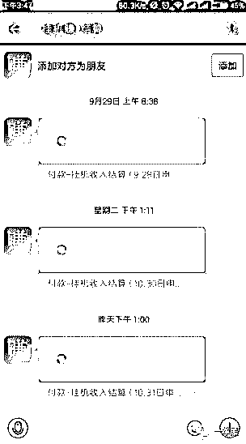</inherit>

此时阿华又重新相信了这款软件，疯狂分享自己的链接以求获得有效分享，对此，阿华的朋友还以为他被盗号了。

但不管怎么分享，有效分享只能达到 8，无论如何也没法达到 10，所以阿华始终不能完成授权。

> 蠢蠢欲动，无奈交纳智商税！

<inherit>但阿华似乎对网赚产生了兴趣，在鱼龙混杂的网络洋流中，他再次找到了一款声称可以日赚上千元的软件，和之前所谓的挂机软件不同，这次的软件需要做任务才能赚钱，看上去靠谱多了。</inherit>

<inherit>阿华在网上看到一篇名为《您的第一桶金，从这里开始的文章》，文章的讲述者也是这款软件的设计者—阿豪。</inherit>

<inherit>在文章中，阿华被阿豪的网赚经历所折服，他除了佩服阿豪的才能胆识外，也开始对阿豪设计的这款网赚软件蠢蠢欲动。</inherit>

<inherit>这款软件名为非凡入金系统，据设计者阿豪所述，只要用户打开软件，就可以在里面做任务赚钱，每天都有最新的赚钱任务发布，任务详情和操作一目了然，并且赚的钱当天就可以体现。</inherit>

<inherit>看着文章里别人日赚上千的截图，阿华动了心，但使用这款软件需要付费 400 元购买，在纠结了一段时间后，阿华拿出自己剩下的生活费购买了这款软件。</inherit>

<inherit>软件安装完成后，阿华进行了注册，并按步骤向阿豪申请了登陆权限。</inherit>

<inherit>随后，阿华登陆了软件，原本以后马上就可以赚钱的他却被泼了一盆凉水。</inherit>

<inherit>里面的任务基本都是叫你去买理财产品，比如先用自己的钱买一个 1000 元的理财产品，一个月后返还 1020，赚取 20 块钱的费用。</inherit>

<inherit>阿华觉得这种方式并不可信，于是赶紧找到客服，但随之得到的却是几句敷衍回复，最后阿华还被拉黑了。</inherit>

<inherit>原本以为有投入就会有回报，看来这次阿华是交了智商税。</inherit>

> 揭秘足不出户的网赚骗局

<inherit>在大多数的网赚骗局中，基本都是利用人性的贪，以夸张似的网赚经历和数据吸引网赚新手上当。</inherit>

受骗者的心理被牢牢把控，从而沦为网赚骗局中的羔羊。

对于阿华遇到的两款软件，挂机赚和非凡入金系统，一个声称只要把软件挂在后台就可以赚钱，一个声称只要做任务就可以轻松赚钱。

实则都是披着羊皮的狼，混淆大众的视野，从而达到牟利的目的。

对此，老师傅分别对两款软件进行了相应的技术分析。

挂机赚为何不能授权成功？

对于挂机赚，有相应系统的版本，还有安卓版本，老师傅通过一定的技术手段拿到了这款挂机赚安卓版本的源码。

通过分析，该软件由【易语言】开发，这款软件在挂机之前需要配置一个账号进行挂机设置，才能正常使用。

通过分析挂机设置的源码得知，该软件只是进行了逻辑上的简单设置，也就是说在判断输入框账号和密码的时候只判断了是否为空，以及账号密码是否小于五位数。

只要满足这两个条件即可配置成功，换句话说就是账号和密码大于五位数就行。（所以只要输入大于五位数的任意信息都可以配置成功）

<inherit>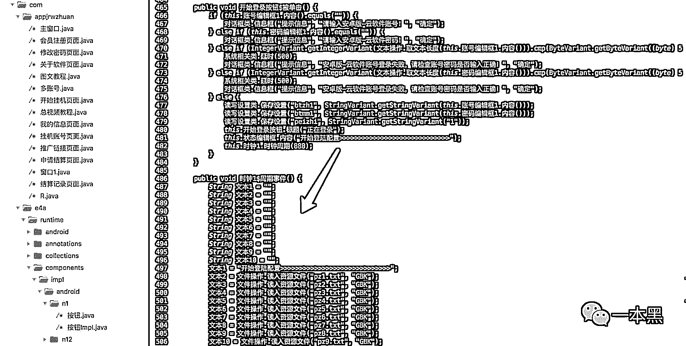</inherit>

而软件显示出来的正在配置等信息都是在代码里写死的，根本就毫无意义，**只不过是为了蒙蔽用户罢了，给用户造成一种软件正在运行的感觉**。

软件要求有效分享必须大于 10 才能正常使用，但为什么阿华不停的分享链接有效分享还是不能到达 10 呢，其实这也是在程序里设定好的。

通过分析软件，老师傅发现当分享链接被点击大于 3 时，有效分享人数会变成 1，于是就奖励 0.2 元；当分享链接被点击大于 7 次时，有效分享人数变为 2 人；当分享链接被点击大于 100000000000 次时，有效分享人数才会达到 9。

<inherit>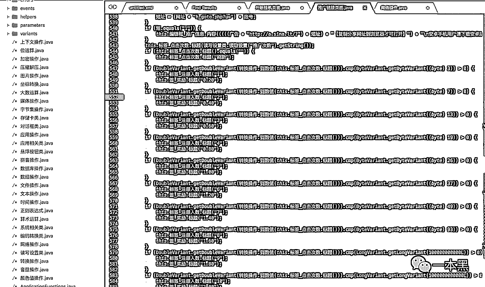</inherit>

所以，根本就不会出现有效分享变为 10 的情况，也就根本没有开启挂机的可能。

没想到吧！完全是套路啊！

因为一个有效分享会奖励 0.2 元，阿华在实验提现的时候之所以能体现成功，**其实是设计者为了让用户更加相信软件。**

“那他们为什么要这样做呢？”我好奇地问老师傅。

“他们只是利用这种设计让用户无限的把链接分享出去，相当于给他们自己打广告，吸引更多的人下载使用，再循环分享。”

“这样做有什么意义呢？”说完我向老师傅递了根烟。

老师傅没有接我手中的烟，反而给我递了根烟说：“抽我的。”

接着老师傅不慌不忙的的说：“**做这种网站或软件的人，****只不过是利用挂机的幌子让用户安装他的软件而已，****他们通过 CPA 下载安装赚钱。**”（CPA：一种广告计费模式，当用户点击某个网站上的 cpa 广告后，这个站的站长就会获得相应的收入。）

“这种类似的软件特别多，还有一种软件，让你点击广告即可赚钱，但需要绑定你的支付宝，当你一旦绑定后，你的支付宝密码就有可能泄露。”

“相比让用户成为免费劳动力为其宣传，迫使用户下载，另一种诱导用户付费购买软件那就是诈骗了。”说完老师傅弹了弹烟灰，打开了另一款软件——非凡入金系统。

<inherit>所谓做任务赚钱——其实是大忽悠</inherit>

<inherit>阿华发现购买的非凡入金系统里面的任务根本就不可信，在反馈过程中，客户不仅把阿华拉黑，还对阿华的账号进行了锁定，完全登陆不进去。</inherit>

<inherit>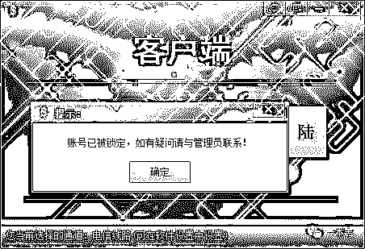</inherit>

当问及为什么会被锁定时，阿华说对方为了防止受骗用户截图。后来我们以购买者的身份加了客户阿豪的 QQ，在聊天中，对方也确实说了截图就会被踢。

<inherit>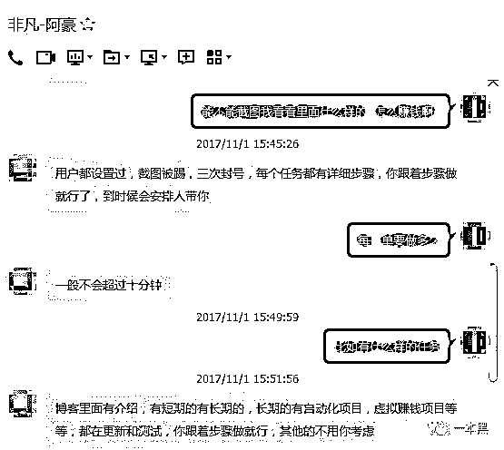</inherit>

<inherit>（软件设计者阿豪）</inherit>

为了证实阿华所说，老师傅可谓是“越过山丘，才发现无人等候”。

想要登陆进去必须拿到充值卡，但想要老师傅花钱，不存在的！

老师傅通过一款反汇编工具打开了这个软件，修改了其中的一些汇编语言指令，保存修改的补丁后，老师傅成功绕过了软件的充值“门槛”。

<inherit>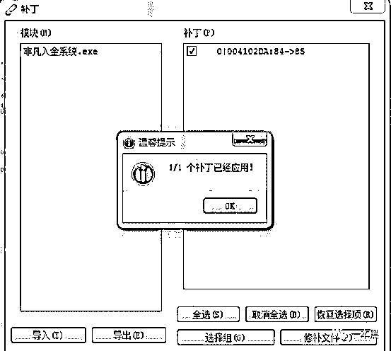</inherit>

进入软件后，通过一番使用，真如阿华所说，里面的任务基本都是华而不实，空架子罢了。

<inherit>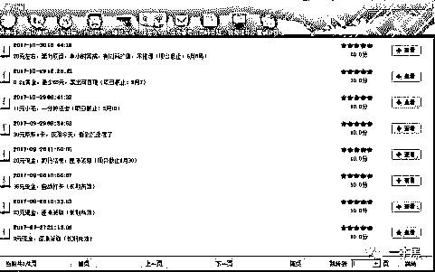</inherit>

除了让你购买理财产品，还会给出一些淘宝优惠劵让用户去购买，也会在软件上分享一些别人赚钱的项目和方法。

总的来说，这款软件只是整合了网上的一些资源，从而来忽悠网赚新手而已。

<inherit>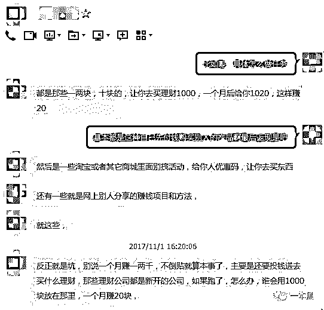</inherit>

<inherit>（爆料者阿华）</inherit>

对于该软件的后台，老师傅并没有兴趣去拿，但这种忽悠网赚新手的诈骗行为，值得引起人们的警示。

网赚江湖尔虞我诈，还望诸位留心观察！

* * *

本周专题和【终结诈骗】公众号联合发布，一家为百姓提供有趣防骗知识的公众号。

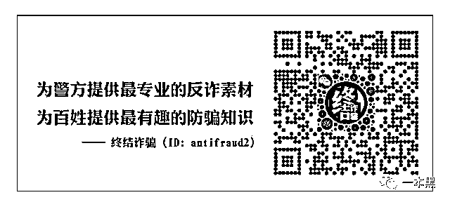

还原事实｜专扒黑产

微信 ID：darkinsider