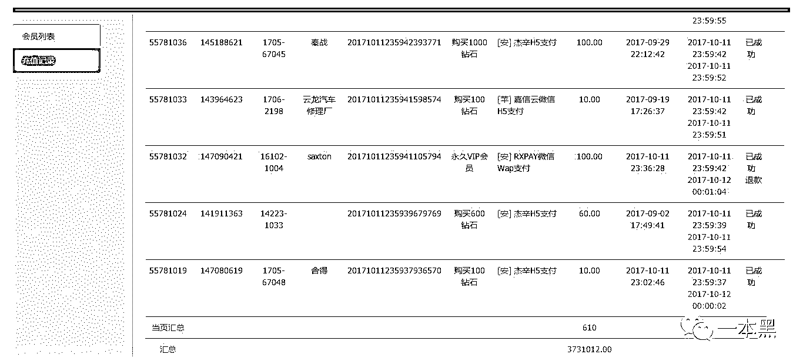
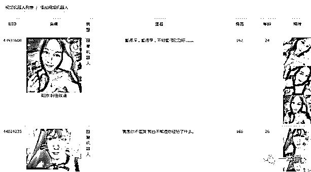

# 从“约 P”需求说起，扒出一个年入十几亿的黑产“兵工厂”。

> 原文：[`mp.weixin.qq.com/s?__biz=MzU4ODAwNzUwMQ==&mid=2247483866&idx=1&sn=3140cd526cee430bfbbb6853d3dab1d3&chksm=fde210f8ca9599eea6522eec01554c721fa46fe748f4e1ad05ed0e14b51d6fe665eeb3bbd168&scene=27#wechat_redirect`](http://mp.weixin.qq.com/s?__biz=MzU4ODAwNzUwMQ==&mid=2247483866&idx=1&sn=3140cd526cee430bfbbb6853d3dab1d3&chksm=fde210f8ca9599eea6522eec01554c721fa46fe748f4e1ad05ed0e14b51d6fe665eeb3bbd168&scene=27#wechat_redirect)

文/东东（微信公众号：一本黑）

【一本黑】媒体或商业转载必须获得授权，个人转发朋友圈无需授权。

读完需要

8 分钟

速读仅需 4 分钟

* * *

<inherit>**本专题和【差评】联合发布。**</inherit>

自古以来，掩盖和拒绝天生就是这个社会的附庸，但它并不能杀死人性的欲望，就是因为一直以来的遮遮掩掩，才让黑产如此轻松的利用人性大肆掘金。

时代在进步，黑产也与时俱进，相比之前揭露的假黄网，这次我们遇到了黑产中的“正规军”，碰撞之下可谓惊心动魄。

一切还是从一个卖“小黄片”的故事说起，这帮“正规军”到底如何做到日牟利近 400 万，拨云见日，且听我慢慢道来。

> <inherit>由贩卖小黄片的微信号入手，顺藤摸瓜</inherit>

<inherit>在一局游戏结束后，有个陌生人加我好友，随后发来一段文字，大致的意思是：激情，劲爆，请加微信 XXXX，包爽！看着比游戏有意思，就加了微信。</inherit>

凡是都有预热或者前奏，但是对方开门见山，这么直接还是第一次见。

<inherit></inherit>

在后续的对话中，姑娘提议用视频讨个红包，能露的地方基本都给我看了个遍。见我无动于衷，无奈红包要的越来越小，从 28 块一路降到到 10 块。

<inherit></inherit>

感觉视频不是现拍的，所以我猜是变相在微信里卖“小黄片”的。

聊了会，姑娘也不耐烦了，告诉我给十元就能进群看直播，不来就算了。

想着也就十块钱，我还是想进群看看。

<inherit></inherit>

结果，哪有什么群，所谓的群只是对方发来的一段视频，紧接着就是所谓群里各种大尺度的对话和视频，看起来群里很活跃。

原来是套路，就在我觉得是不是翻车了的时候，对方又继续发来了几个大尺度视频，不停的诱惑索要进群红包。

为了不让那十块白花，我又抛出了几个红包。

皇天不负有心人，终于，我见到了所谓的群。

<inherit></inherit>

一个据说能同城约 P 的 APP！

<inherit></inherit>

套路这么久，总算还是找到了“正规军”，至此，共支付红包 26 元，流量若干。

这款 APP 到底暗藏着怎样的猫腻，接下来就看老师傅的了。

> 打着同城约 P 旗号，实则诱导付费

通过对方发过来的二维码，扫描以后进入下载页面，没想到是这样的！

<inherit></inherit>

<inherit>（下载页面）</inherit>

居然是同城交友（约 P）软件，真的像上面这些人说的一样吗？

我带着疑惑点击了下载，只有 5.36M，下得还挺快。

下载完成后注册，进入引导页，跳转到一键打招呼的页面，随后就有很多“美女”发来消息，内容都是些比较露骨话。

<inherit></inherit> 

刚注册就有这么多人发来消息，难道真的是同城交友（约 P）软件？

选择其中一个消息回复，底部出现索要联系方式的按钮，不过需要充值才能回复。

在我迟疑要不要充值的同时，依然还会有很多“美女”热情的发来消息，还有发视频请求的，但接通视频同样需要充值。

总结一下，不管是回复消息还是接受对方的语音视频聊天都需要充值，文字聊天是消费 Y 币，语音视频聊天是消费砖石，如果充值 VIP 的话就可以和所有人聊天，包括文字、语音和视频。

<inherit>VIP 包月是 65 元，永久 VIP 是 100 元。</inherit>

想要老师傅花钱充值？不存在的。为了剩下充值的钱，我找到了老师傅，也想让老师傅看看这款 APP 到底有多深。

“这很有可能是一款诱导付费 APP，即使你充值了也不一定能约到真人。”老师傅在看完 APP 后这样说道。

为了彻底探清该 APP 的真假，老师傅利用【计算机基础知识】拿到了这款同城交友软件的源码，通过分析源码，证明了这款 APP 的虚假性。

与此同时，老师傅还在某开源网站上找到了类似的源码，由此可见该制作成本并不高。

<inherit></inherit>

从源码里不难看出，APP 里的“美女”以及各种话术、语音视频请求都是代码写好的，全是机器人，这就验证了之前刚注册的三无账户为何会频繁收到“美女”的挑逗信息。

<inherit></inherit>

这就好比在品牌店买到地摊货一样，钱花出去了，货是假的是一个道理。

“看来有不少人交了智商税。”老师傅从烟盒里拿出一根烟，我急忙把火递了过去。

“怎么样，要不要把后台搞一搞？看看到底坑了多少无知青年。”

老师傅把烟头往桌上的烟灰缸轻轻一弹，伴随着烟头冒出的一股浓烟，接着打开了他的秘密武器。

> <inherit>人性弱点被利用到极致，年入数十亿的黑产大门悄然打开</inherit>

此时已是近黄昏，透过桌前的落地窗可以看清这座城市即将到来的辉煌。

而这款 APP 背后的“流光溢彩”相比这座城市，一样的精彩纷呈。

得益于老师傅精通的【计算机基础知识】，没多久，老师傅在分析软件发送的数据时，发现这款 APP 频繁的与一个域名网站存在通讯。

以此为切入点，老师傅通过分析该域名找到了管理后台，并顺利摸进了该产业的“兵工厂”，一场庞大的数据正在实时迭代更新，价值数亿黑产的大门也悄然打开。

从充值记录中可以看出，有购买钻石充值的，也有充值 VIP 的，一天的数据流水就高达 370 多万。

<inherit></inherit>

<inherit>（一天的数据流水）</inherit>

一天流水近 400 万，这样算下来，一年就是十几个亿，看来该黑产的小目标算是稳稳的完成了。

“一天一套房，稳妥的很。”老师傅看着屏幕上统计出来的数据，狠狠地吸了最后一口烟，摁灭烟头的时候，插满烟头的烟灰缸已经快容不下了。

后台里完整的展示了该 APP 所有信息，包括会员管理、数据报表、渠道管理、运营数据等。

从安装量来看，截止下午到就有六万多的安装量，这还没算晚上的高峰，其中安卓用户占比较大。

<inherit></inherit>

即使你充值了会员，可以回复对方的消息，但是对方基本都是机器人，这些都是在你看不到的地方包装好的。

<inherit></inherit>

<inherit>（机器人列表）</inherit>

“那这些真人照片从哪来的呢？”我疑惑的问老师傅。

“像他们这种比较大规模的，一般会聘请专门的模特或主播拍照，还有可能是网上下载的照片。”

老师傅说他们还得和渠道商合作去推广自己的 APP，这样才会有流量，只有曝光度高了才会有人上钩。但是充值的钱里面，渠道商一般会拿走八九成。

而在后台的渠道列表里看到的渠道类型基本都是 APP 投放，也就是说他们主要靠 APP 与 APP 之间相互导流的方式来引流。

<inherit></inherit>

<inherit>（渠道列表）</inherit>

而从合作模式来看属于 CPS，吸引一个用户的报价是三毛钱，这成本，相比十几亿的流水完全可以忽略不计。

（CPS：简单点说，就是你帮助商家销售产品，赚取一定的佣金。）

这种同类型 APP 之间的导流，相对来说获取的会用户比较精准，都是有约 P 需求的群体。

他们也会去贴吧、QQ 群、论坛等地方发广告，来获取更多的用户，但是这种手段相比 APP 之间的合作，稍微逊色了一点，但也不失为一种引流手法。

不少人充值后发现完全不是那么回事，深感上当受骗的人比比皆是，从后台的用户反馈也可以看得出来。

<inherit>（用户反馈）</inherit>

后台数据还有所有用户注册时使用的手机号，要是对方通过这些手机号进行诈骗或广告投放，对用户的影响可想而知。

<inherit></inherit>

<inherit>（用户手机号）</inherit>

<inherit>最后，老师傅通过社工手段找到了这款 APP 的幕后操作者，该 APP 所属长沙一家网络科技公司，法定代表人沈某。</inherit>

<inherit>除了这款同城求偶外，老师傅还发现多个域名，原来该公司旗下还有多款类似的 APP。</inherit>

<inherit></inherit>

<inherit>“怎么就没人举报这种公司呢？”我向老师傅提问。</inherit>

<inherit>“虽然他们涉及的流水高达上亿，但是均分到每个人身上也就几十块钱，你说谁会为了几十块钱浪费时间去投诉呢！”</inherit>

<inherit>“而且即使他们被打掉了，换个马甲照样可以圈钱。”</inherit>

其实，这次揭露的这款诱导付费 APP 与之前写过的假黄网类似，都是通过各种渠道吸引用户下载，最终达到诱导付费的目的。（直通车——[上了个“假”黄网，误入了 7 亿黑产的大门](http://mp.weixin.qq.com/s?__biz=MzU4ODAwNzUwMQ==&mid=2247483670&idx=1&sn=35e2e3e0143a5284c1ec6b99da51ff97&chksm=fde21034ca9599226daf9381846118a0438a38b0ad429581d703325842dd664cc425c4bf1b04&scene=21#wechat_redirect)）

更多细节就不再展示，总之，这种利用人性弱点大肆掘金的黑产在一本黑的报道下会不断浮出水面。

落地窗外早已灯火通明，这座城市依旧灯火阑珊。

老师傅吸完最后一口烟，烟灰缸也塞满了烟头，这场精彩纷呈的黑产背后还会有多少无知少年上当我们不得而知。

**这个世界的真假伪善，应该让更多的人知道。**

* * *

**声明：**本文开头微信截图由读者提供，我们进行故事化叙述，在此，对提供线索的读者表示感谢。

世界本就黑暗，如果你有黑料想让更多的人知道，欢迎点击底部菜单给我们爆料！

* * *

以下是理财产品国金宝的产品推广，广告内容我会在下文写的清晰明了。这里不代表一本黑的意见，请大家自行判断。提示：理财有风险，投资需谨慎。

**国金宝**是个理财平台。

**背景：国有企业持股超过平台的 51%，注册资金 1.3 亿元。运营近两年，有 140 万投资人，成交量 78 亿。**

30 天期，历史年化收益 14%              18 个月期，历史年化收益 14%

12 个月期，历史年化收益 13%           180 天期，历史年化收益 12%

礼物有三：

**一：抽奖（活动截止 11 月 30 日）**

年化投资金额=实际投资金额*投资期限/12 月 (新手体验标不参与)

活动期间内单笔年化投资≥5000 元即可获得一次抽奖的机会

**二：京东卡（新手体验标不参与）**

1、单笔年化投资大于或等于 5 万元，可获得京东 300 元礼品卡；
2、单笔年化投资大于或等于 50 万元，可获得京东 5000 元礼品卡。

**三：最高 3%返现**

注：红包返现金额可立即投资或提现，若红包返现金额超出该用户“我的红包账户”余额，则超出部分将不予以奖励。

**10 月 31 日前点击文章底部原文链接注册国金宝。可添加微信号：国金宝客服（guojinbaokefu1），验证通过后凭当日注册手机号码即可领取 5 元微信红包！**