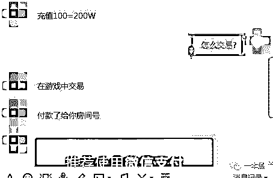
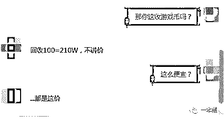
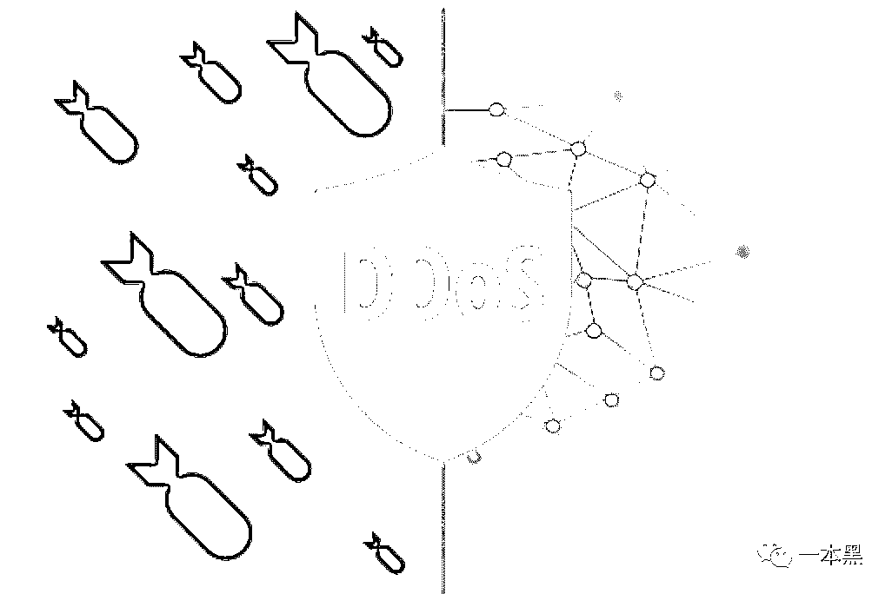

# 从网络赌博的不毛之地，到网络攻击的灯火酒绿

> 原文：[`mp.weixin.qq.com/s?__biz=MzU4ODAwNzUwMQ==&mid=2247483858&idx=1&sn=3ee0bdde0a840be372f9831504aa9f47&chksm=fde210f0ca9599e6b44dd5e85b63ee04d9bd402c580a5825e23564caeee25b432a9dff209919&scene=27#wechat_redirect`](http://mp.weixin.qq.com/s?__biz=MzU4ODAwNzUwMQ==&mid=2247483858&idx=1&sn=3ee0bdde0a840be372f9831504aa9f47&chksm=fde210f0ca9599e6b44dd5e85b63ee04d9bd402c580a5825e23564caeee25b432a9dff209919&scene=27#wechat_redirect)

文/东东（微信公众号：一本黑）

【一本黑】媒体或商业转载必须获得授权，个人转发朋友圈无需授权。

读完需要

8 分钟

速读仅需 4 分钟

* * *

在古龙的小说《绝代双骄》中，轩辕三光是十大恶人之一的恶赌徒，他嗜赌如命，赌博让他六亲不认。

为此，他的左手只剩下食指和中指，甚至一只眼睛也能成为了他赌博的物品。

赌博就和染上毒品一样，控制不住便会家破人亡、堕入人生惨地。

这是一块不毛之地，也是一块流亡之处。

> 看似是随机事件，其实是概率事件

电影《嫌疑人 X 的献身》中有一句话：“看似是数学问题，其实是几何问题。”这种思维放在赌博里也是成立的，”看似是纯随机事件，其实是概率事件“。

赌博是一个数学问题，是一个概率问题，甚至可以说是一个被精心设计好的概率问题。只要时间的维度足够长，庄家就永远是赢家。

概率决定十赌九输是常态，沉没成本导致自控力的丧失才是最真实的存在，输掉的钱不断滚雪球，赌徒的心理也在不断的放大，最终形成一个深渊黑洞。

（沉没成本：我们把这些已经发生不可收回的支出，如时间、金钱、精力等称为“沉没成本”，这里代指赌徒输掉的钱）

从线下到线上，棋牌手游的出现无疑给赌博提供了一个更宽广的平台，有人说现在的手游玩家，一半是《王者荣耀》，另一半应该就是棋牌游戏。

> 法外之地的洗钱工具——“银子商”

大家都知道，不光是线下赌博、所有的游戏产业对赌博行为都是严厉禁止的，特别是棋牌游戏这一类。

在各大平台，玩家可以通过购买游戏币来玩游戏，但是玩家在游戏中赢取的游戏币是不能兑换成现金的。

于是在一些地下产业链中就出现了针对热门棋牌游戏的兑换产业，法外之地的变现工具——“银子商”。

“银子商”是一个统称，可以说是游戏和玩家之间的中介，主要通过低买高卖虚拟货币的方式来赚取差价。

而“银子商”的出现，打通了游戏币和人民币双向转换的通道，给予了玩家一个将游戏币变现的渠道。

少数初具规模的银子商在尽量的合法化，而大多数银子商顶着风险在法律边缘苟且偷生。

QQ 群是银子商的重要通讯阵地，随处可见的棋牌银商报价不一。

我们了解到其中一款名为“欢乐斗牛”的棋牌游戏报价 100 元可以充值 210W 游戏币，对比官方售价 1 元 1 万来说，银子商的报价确实便宜很多。

为了探清银子商的交易模式，我们扮演客人来到 QQ 群中。

加了群主后，对方表示，为了防止打击，交易需要在游戏中进行，随后对方发来了一个设好密码的房间号。

<inherit></inherit>

进入游戏筹码为 100W 的房间后，对方直接点击了弃权，所购买的游戏币就这样进入了我的账号，交易过程简单粗暴。

当我问及是否可以出售自己账户中的游戏币时，对方表示可以，只不过价格会稍低一些。

<inherit></inherit>

银子商就是通过这种方式从中赚取差价。

不管是在棋牌类游戏，还是各大涉及虚拟货币的游戏中，都存在这样的银子商。

这些活跃在 QQ 群中的银子商基本都是“小作坊型的地下银子商”。

实际上，“银子商”的出现是打了网络犯罪的擦边球，他们就像一条泥鳅，手中握不住，抓也抓不紧。

在传统的赌博当中，换筹码和参与赌博游戏都是在同一个地方完成的。

而银子商和棋牌游戏的合作方式就类似于将“筹码兑换”和“牌桌”分开，这种模式目前在法律上还没有清晰的规定，并不能被定义为是变相的博彩。

除此之外，银商还可能会和棋牌运营商勾结，既出售游戏币，也回收玩家出售的游戏币，从而实现了棋牌游戏的“筹码变现”。

银子商避开了法律的定义，以此攫取巨大的利润，由此难免会想“难道将换筹和牌桌分开，就是合法的经营模式吗？”，这里是不是存在了一个用合法手段来进行网络博彩的味道？

抛开法律这个我们不擅长的领域，来单独谈谈在棋牌行业里横行的黑客攻击。

> DDoS，一场关于资源的战争

除了银子商的问题，棋牌游戏的背后，还存在一场关于资源的战争。

【一本黑】曾经写过淘宝的恶意流量攻击，其本质就是通过一定手段打击自己的竞争对手，让对方业务停摆，借此抢夺客户。

棋牌行业中，平台为了抢夺客户会进行 DDoS 流量攻击，这种攻击方式是游戏行业常见的攻击竞争对手和黑客勒索的手段。

持续的 DDoS 攻击会导致服务器瘫痪，玩家无法登陆，用户迅速流失，被攻击的游戏平台日损可达数百万元。

<inherit>棋牌游戏遭遇流量攻击在业内屡见不鲜，攻击的平均峰值都在 400G 左右，个别最高的甚至可达 1 个 T。</inherit>

<inherit>400G 是概念呢？</inherit>

从 2015 年的数据来看，当时 477G 的峰值创造了记录，本年内就监控到了超过 10 万次的攻击事件。

<inherit>而对比当下，三四百 G 的攻击已经是业内常态，最高峰值已经达到了一个 T，流量攻击在这两年也在飞速发展。</inherit>

那么到底什么是 DDoS？

（DDoS，全称分布式拒绝服务攻击，指借助客户/服务器技术，将多个计算机联合起来作为攻击平台，对一个或多个目标发动 DDoS 攻击，从而成倍地提高拒绝服务攻击的威力。）

也就是说，攻击者利用大量“肉鸡”或服务器对攻击目标发动大量的请求，消耗目标主机资源或网络资源，从而使被攻击的主机不能为用户提供服务。

<inherit>（什么是肉鸡：也称傀儡机，指可以被黑客远程控制的机器，黑客可以随意操纵它并利用它做任何事情）</inherit>

在生活中，有很多场景可以解释 DDoS 攻击。

台风过境天气，月入三万的卖饼大妈盘了地铁口的一家店做起了门店生意，眼红的同行雇来一群无赖把餐桌占满但就是不下单，想买烧饼的年轻人只能绕道而行，一天下来，卖饼大妈生意全无，这就属于恶意 DDoS 攻击。

一辆只能容纳五人的出租车，活生生塞满了一百个人，这可以理解成是一种“DDoS 攻击”。

<inherit>有攻就会有防，对此，奋战在一线的工程师是最有发言权的。</inherit>

一个腾讯云安全的工程师从自身经历告诉我们，因为境外的流量比国内更加便宜。

所以绝大多数的流量攻击都是从境外发来的，比较常见的就是越南、墨西哥、巴西等国家的服务器，这些就是黑客购买的“黑机房”。

<inherit>黑客攻击的时间往往也是很磨人的，周末以及平日的 9 点到 10 点，都是游戏上线人数最多的时间，在这个时间里攻击效果才是最好的。</inherit>

为此，工程师经常会因此而加班，每一次攻击都会持续到午夜三四点钟。

刚到家就被叫走、电影看一半被叫走，对于工程师来说都是常态，时间久了，家人难免抱怨，可是安全就是这样的行业。

越是大家放松的时候，就越是服务器忙碌的时候，而紧急状况出现了，安全人员也是必须要第一时间做出响应。

黑客的攻击是以“打死”为目的，没能打死目标的服务器就收不到钱，所以一次攻击不成功，下次就会更猛烈，假如连续几天都不能成功，那就会放弃攻击，毕竟流量也是有成本的。

说到这里，我简单的说下流量攻击的防护原理，其实这种防护最本质的是在于资源，这个资源指的就是网络带宽资源，带宽可以理解成是马路的宽度，马路越宽，可容纳的车辆就越多，也就不容易发生堵车的情况。

所以防御流量攻击，就一定需要大带宽的服务器，业内称为“高防服务器”，但这种服务器的价格也不是一般的厂商能够负担的，所以都会选择直接购买云防护产品。

流量攻击中包含了很多种方式，因此，安全工程师要不断变换防御的策略从而到见招拆招，将袭来的一波波攻势逐个瓦解。

这里的攻防细节其实十分有趣，但是由于涉及了太多的网络工程知识，所以在此就不展开谈了。

从本质上看，DDoS 的对抗，终究是资源的对抗。

这几年手游确实火了，羡慕别人的时候也别忘了人家踩了多少坑，面临多少困难，多数厂商即便被打挂了，也要硬着头皮说是自己临时维护。

毕竟国内对黑客攻击的看法过于全面，厂商担心失去用户的信任，让人以为自己是没能力才被打死，所以打碎了牙也得往肚子里咽。

网络世界的攻击手法“流光溢彩”，对抗之路还需任重道远。

希望有一天，网络世界这块“不毛之地”可以高楼林立，“流亡之处”也能灯红酒绿。

还原事实｜专扒黑产

微信 ID：darkinsider