# 400 元刷出 4000 万的播放量，视频行业存在怎样的灰色产业？

> 原文：[`mp.weixin.qq.com/s?__biz=MzU4ODAwNzUwMQ==&mid=2247483848&idx=1&sn=fff9c631db4d126636a316bb235f42eb&chksm=fde210eaca9599fc11014759afad23616ff6eb8cbbc58599978af46602b906e24bf06d80e626&scene=27#wechat_redirect`](http://mp.weixin.qq.com/s?__biz=MzU4ODAwNzUwMQ==&mid=2247483848&idx=1&sn=fff9c631db4d126636a316bb235f42eb&chksm=fde210eaca9599fc11014759afad23616ff6eb8cbbc58599978af46602b906e24bf06d80e626&scene=27#wechat_redirect)

文/东东（微信公众号：一本黑）

【一本黑】媒体或商业转载必须获得授权，个人转发朋友圈无需授权。

读完需要

8 分钟

速读仅需 4 分钟

* * *

想到一句歌词：“阳光下的泡沫是彩色的。”

然而，阳光下的泡沫也有“灰色”的时候。

时下比较火热的网剧当《无罪之证》和《白夜追凶》莫属，两部剧是否让国产悬疑片柳暗花明这里就不做评价。

《白夜追凶》上线不到半月就获得近 4 亿的播放量，口碑超过同时段播出的《那年花开月正圆》，成为了今年下半年网剧中的一匹黑马。

这让我想起曾经刷屏的《欢乐颂》，第一部和第二部分别拿下 110 亿和 252 亿播放量的新闻；还有达康书记领衔的《人民的名义》的 309 亿播放量；《三生三世十里桃花》的 422 亿播放量；《我的前半生》124 亿。

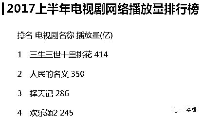

（部分 2017 上半年网剧播放量过百亿的电视剧）

中国 14 亿人口，七亿网民，为什么会出现如此之高的播放量呢？有人说这是视频网站的数据统计方式造成的，毋庸置疑，和数据统计方式肯定有关系。

当前大部分视频网站对外报出的播放量并不是正片的播放量，我们所看到的上百亿播放量而是每一集播放量的叠加和多个平台的累积，这其中甚至掺杂了花絮、预告片、相关视频等的播放量。

但也有人质疑存在“刷量”行为，对于这一疑问，【一本黑】准备一探究竟。

<inherit>利益的驱使滋生了这块灰色地带的生长</inherit>

<inherit>淘宝购物无所不能，只要你想得到，基本没有找不到的东西。所以淘宝往往反映了一个产业的供需状况。</inherit>

<inherit>是否真的存在网站播放量的“刷量”行为，在搜索框输入了“刷播放量”，但是搜索出来的结果却让我很失望，难道“刷量”行为真的不存在？</inherit>

后来换了几个关键词，在输入“网剧播放量”的时候，出现了如下信息。看来商家在关键词上的把控还是有些隐晦的。

<inherit></inherit>

<inherit>（淘宝搜索截图）</inherit>

商家标题中并未明确指出“刷量”等相关信息，但从中透露出的字眼还是给人一种暗藏猫腻的感觉。

<inherit>可能很多人会疑问为什么标价都是一块钱呢？</inherit>

<inherit>和卖家交流一番，说明需求后，卖家给我发来了各大视频网站播放量“刷量”的报价单。</inherit>

<inherit>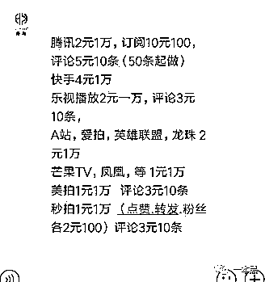</inherit>

<inherit>（报价单截图）</inherit>

每个网站的“刷量”价格都不等，卖家告诉我这是因为有些平台针对“刷量”行为进行过打压，他们会根据不同平台采取不同的“刷量”方式。标价一元是为了方便客户根据需求进行下单。

在询问多个店家后发现，每个商家的报价参差不齐，基本都在 2-5 元之间。但平台是越来越多，除了主流的几大视频网站，一些近年火热的手机短视频 app 也可以进行刷量。

如果说淘宝能反应一个产业的供需状况，那么 QQ 群则是这个产业的“分销商”。

在 QQ 群的搜索框输入“播放量”三个字，随即弹出各种刷播放量的群，这些群就像一个个的店铺，有着精准的用户和明确的供需关系。

混入一个名为“刷播放量”的群后，可以在里面看到很多人的刷量需求。

<inherit>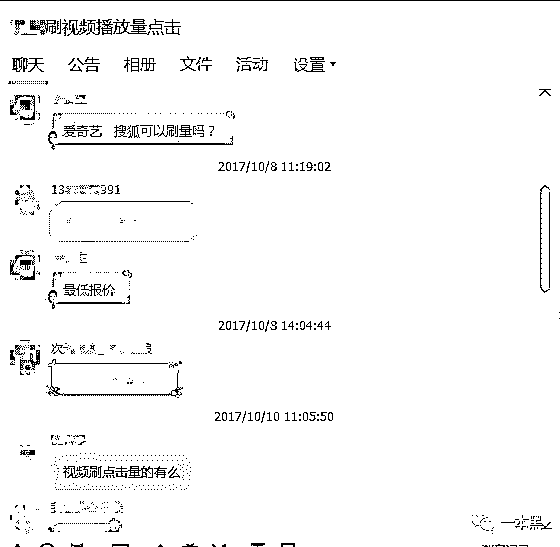</inherit>

<inherit>（刷量需求）</inherit>

<inherit>群主告诉我其中一个视频网站的刷量报价，4 元可以刷一万的播放量。</inherit>

<inherit>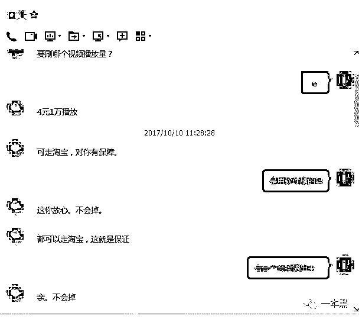</inherit>

<inherit>（群主的报价）</inherit>

为了验证视频刷量的真假，我随机找了一个播放量较低的视频，看看到底是否如群主所述。

<inherit>按照群主的要求，只需要网站链接就可以开始执行“刷量”工作。</inherit>

<inherit>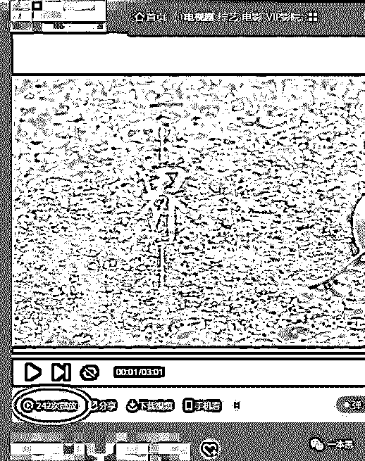</inherit>

<inherit>（刷量之前是 242 次播放）</inherit>

几分钟后，群主告诉我已经搞定了，当点击网页刷新，该视频的播放量真的从原本的 242 上涨到了 1.3 万，整整刷了一万多的阅读，仅用了短短几分钟时间。

<inherit>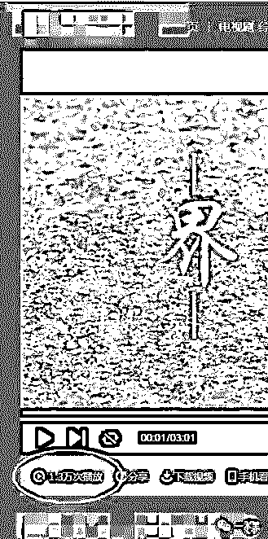</inherit>

<inherit>（刷量后的 1.3 万）</inherit>

<inherit>在这个碎片化的时代，想要吸引观众的注意力，数据造假是其中的一种手段，只有先把数据变成一个可以任意掌控的“泡沫”时，才能得到更多人的点击。</inherit>

<inherit>群主告诉我，一部草根剧或视频如果前期不刷点播放量，根本就带不来更多的关注。</inherit>

<inherit>这里面就存在着一场制片方和广告主的博弈。</inherit>

<inherit>我们都知道一部网剧或视频中总会出现一些广告主投放的广告，广告主和片方是签订对赌协议的，如果点击量达不到广告主制定的一个点，片方就可能在利益上受到一定的损失。</inherit>

<inherit>广告主往往是拿不到视频网站的后台数据的，所以有些不懂行的广告主就有可能被表面的高播放量忽悠，片方则借此和广告主完成广告的投放，收取其中的广告费。</inherit>

<inherit>一位从事影视行业的朋友告诉我，这种刷量行为在影视行业早已司空见惯，大家都这样做。</inherit>

也有精明的广告主知道其中的猫腻，所以他们并不会从单一的播放量来判断一部片子的质量。

视频平台也希望自己网站的数据好看，只有一个视频的播放量高了才会吸引更多的观众点击。

关于该行业水深水浅的问题就不做过多的介绍，可以肯定的是视频刷量行为确实存在。

<inherit>总之，是利益的驱使把这个行业的“泡沫”吹向了灰色地带。</inherit>

<inherit>老师傅揭露刷量原理</inherit>

<inherit>那刷视频播放量的技术原理又是什么呢，在摸清这条灰色产业链后，我连忙请教了老师傅。</inherit>

<inherit>国庆后发现老师傅帅气了很多，原来是烫了个新发型，比起之前更加的有男人味。</inherit>

<inherit>“其实这种刷播放量的原理很简单的。”老师傅翘着二郎腿，从桌上拿起烟盒，叼烟、点火的动作连贯而自然。</inherit>

<inherit>（上期童星诱骗专题中没有提到老师傅抽烟，这次我给老师傅买了包好烟。）</inherit>

<inherit>“怎么个简单法？”我连忙回应。</inherit>

“可以有很多方法，简单点的就是利用代理服务器不停的更换 IP，然后去访问指定的视频网站，因为是不同的 IP，所以平台就会认为有不同的电脑点击过视频，点击量也就是这样刷起来的。”

每一个视频网站都对 IP 有所限制，当检测到同一个 IP 不停访问网页的时候，只会记录一个播放量，不可能同一个 IP 无数次打开视频就算无数个点击量，如果这样的话就不会出现这种更换 IP 刷量的行为。

“还有一种方法就是可以用工具写脚本伪造通信协议。”老师傅说完在烟灰缸里弹了弹烟灰。

“怎么个伪造法？”

说完老师傅打开电脑随便找了个视频播放平台，打开其中一部电视剧，老师傅告诉我，当点击视频暂停，再点播放的时候，会给后台发送一些请求，只要找到控制播放量的数据包，就可以通过脚本伪造通信协议的方式达到刷量的目的。

<inherit>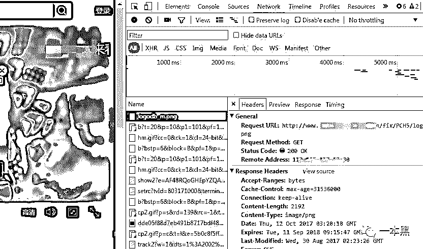</inherit>

<inherit>（点击暂停播放发送的一些数据包）</inherit>

可以把【同一个手机号】比作后台服务器，【短信】比作发送的请求，当使用很多号码给这个手机号发送短信时，接收到的短信就相当于一个 IP，服务器就视为一个 IP 访问了视频，点击量就加一。

“那如果视频网站存在作弊系统呢？”我对此提出了疑问。

老师傅说，即使有作弊系统，只要掌握它验证的规律后，绕过它的验证也不是很难。

随后老师傅针对该剧 1.9 亿的播放量却只有九千多的点赞数表示怀疑，这么大的反差比难道不会藏着些猫腻吗。

<inherit>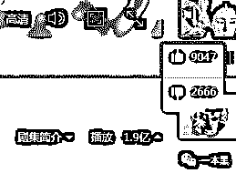</inherit>

<inherit>“那他们为什么不把点赞量也刷上去呢？”</inherit>

“最直观的是播放量，再说一个账号只能点击一次，如果要刷点赞量的话就需要很多个账号，这样成本就会增加很多，也没必要。播放量刷起来足以达到效果。”

其实说有反作弊系统，都是些空口白话，这些视频网站对于刷量也是睁一只眼闭一只眼，你说同一部剧在两个视频平台播放，如果一个平台的播放量碾压另一个平台，这个平台会不急吗？

这些都是和自己的利益挂钩的，平台也希望自己的浏览量大，即使“瘦死”，它也想当“瘦死”的“骆驼”。甚至视频播放平台直接在后台修改数据都是有可能的。

老师傅说完关掉网页，把烟头往烟灰缸摁灭，拿起桌上的保温杯喝了起来，摁灭的烟头在烟灰缸中飘出最后一丝浓烟。

<inherit>热闹投票背后，一群人操控的“生意”</inherit>

<inherit>朋友圈随处可见的拉票、点赞活动想必大部分人都见识过，比如什么萌宝大赛、宠物评比大赛、歌手比赛等。</inherit>

你是否厌倦了亲朋好友刷屏的拉票信息，凡是都得透过现象看本质，其实这里面也暗藏玄机。

朋友圈投票、公众号留言点赞活动和视频刷量类似，已经形成了一条产业链，这种热闹投票的背后，实则是一群人在操控的“生意”。

之前【一本黑】在情人节的时候也做过留言点赞奖励现金的活动，所以就以【留言点赞】为例为大家揭露这其中的猫腻。

通过各种社工手段，找到一位打着“十万水军，实力效率”广告的投票刷票“商家”，通过了解，刷 100 个赞的报价是 18 元，为了验证真假，我找了一个曾经留过言的公号，并把文章发给他，指明所需要刷的 ID 后，对方告诉我只需要五分钟就可以搞定。

<inherit>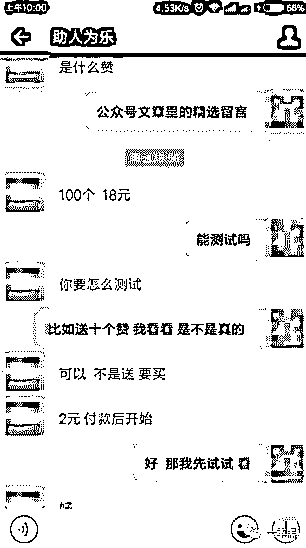</inherit>

<inherit>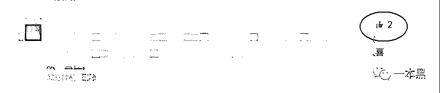</inherit>

<inherit>（刷之前点赞数为 2）</inherit>

当我问及这种刷量方式是人工还是机器的时候，对方回应是通过人工来刷的，并且需要很多微信号。

<inherit>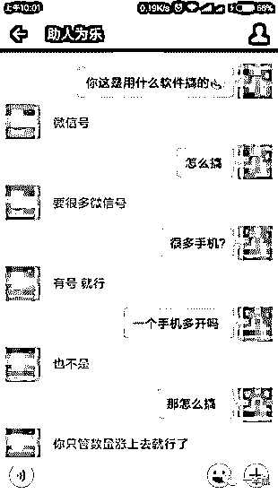</inherit> 

五分钟过后，对方告诉我已经搞定，当我再次进入文章底部查看留言点赞的时候，点赞量已经被刷到了一百多。

<inherit>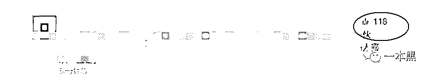</inherit>

<inherit>（刷之后的点赞数）</inherit>

通过翻阅此人的朋友圈可以发现，此人“从事”投票刷屏业务已经很长时间了，朋友圈其中的一张照片引起了我的注意。

<inherit>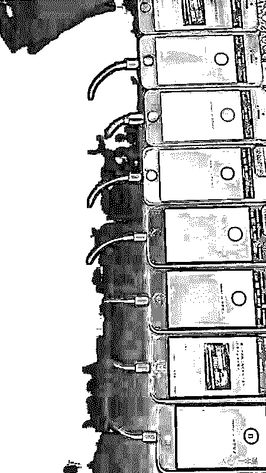</inherit>

关注【一本黑】比较早的朋友看到这张照片可能已经知道是怎么回事，没错，这就是群控。

（什么是群控：群控，分为线控和云控。可以用一台电脑控制上百部手机，实现手机群控。

让软件解放双手，一台电脑控制百部手机，同时操作微信达到电脑群控手机的效果，极大程度上节省人工成本，提高办公和微信营销效率。）

【一本黑】之前就做过关于群控的专题--[深究号称能触达数亿用户的群控产业链](http://mp.weixin.qq.com/s?__biz=MzU4ODAwNzUwMQ==&mid=2247483722&idx=1&sn=184c939b780e2cb0bc1bbf3dc7ca4889&chksm=fde21068ca95997e7ab55363f1f701ebf34014d0d3d5a76dc464ce9740e3352475ff47a9868c&scene=21#wechat_redirect)当时分析了三种通过群控获利的途径，而这种投票刷票我想可以归为第四种。

在验证的过程中还发现了一个“有趣”的事情，从中也看出了“商家”的心机有多深。

我给对方的文章是一个积攒的活动，该公号人气并不是特别的高，当我让对方把自己的留言刷到前面几名后，第二天发现排名降了很多（不排除别人点赞增长的因素）。

也是为了能得到其中的奖品，所以我又花钱把点赞量刷到了第一，到了晚上，第二名的点赞量超过了我，这时候我就开始怀疑了。

会不会是对方故意把第二名刷到第一名，然后诱导我付费再次刷量，这完全有可能。

如果是在比较大型，参与人数较多的投票或点赞中，对方完全可以利用这种反差来诱导用户再次付费刷量，这个时候用户受骗的几率就会大大增加。

最后得到的礼物往往还不及刷量的支出，何必而为之呢。

不管是利益的驱使还是虚荣心在作祟，这个真真假假的世界都需要我们透过现象看其本质。

阳光下的泡沫不一定是彩色的，世界的虚伪我们依然会继续鉴别。

还原事实｜专扒黑产

微信 ID：darkinsider