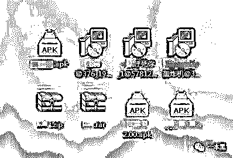
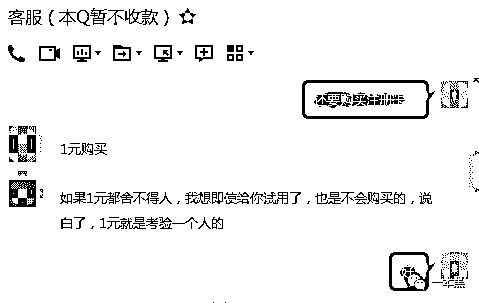
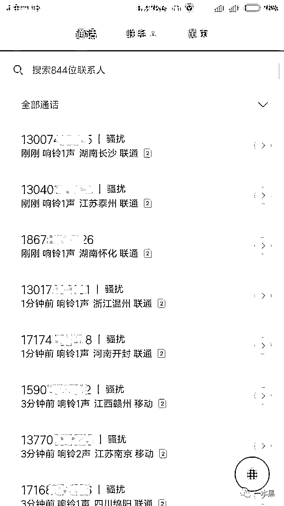
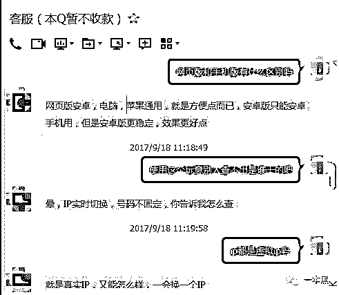
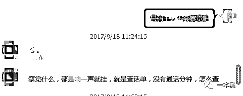
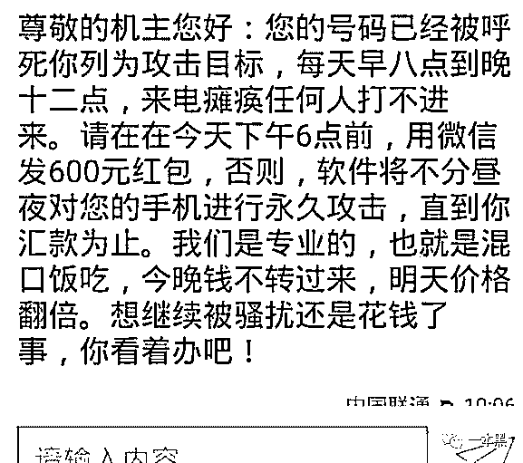
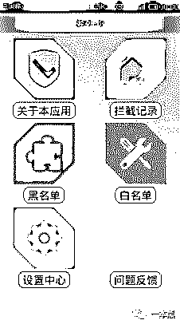
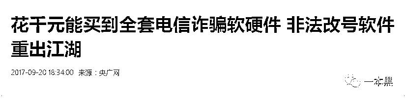
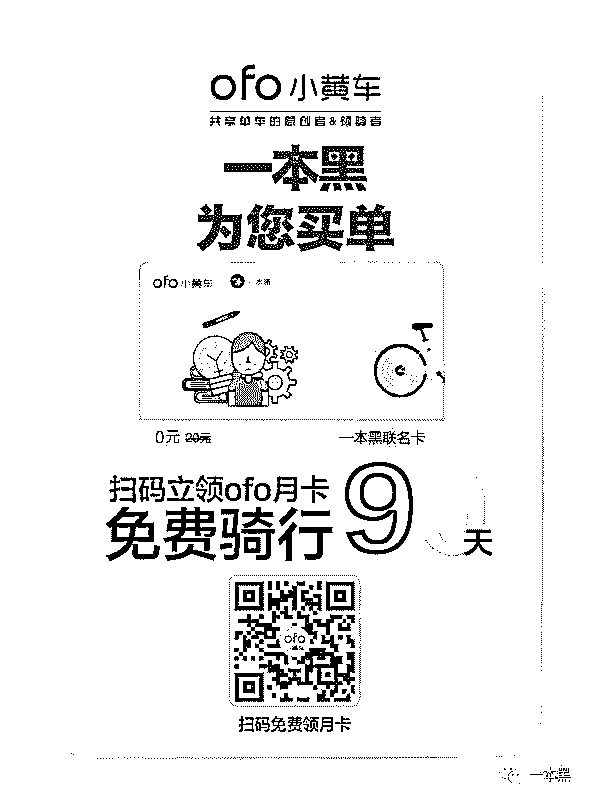

# 不给 600 块就彻夜搞我？社会社会，惹不起惹不起！

> 原文：[`mp.weixin.qq.com/s?__biz=MzU4ODAwNzUwMQ==&mid=2247483819&idx=1&sn=126cb0bd6c8df260d64c751e297110ad&chksm=fde21089ca95999fbe7fcf77258ea9b67fd6afda467f6af209ccf24bd9841e71908b33253f1a&scene=27#wechat_redirect`](http://mp.weixin.qq.com/s?__biz=MzU4ODAwNzUwMQ==&mid=2247483819&idx=1&sn=126cb0bd6c8df260d64c751e297110ad&chksm=fde21089ca95999fbe7fcf77258ea9b67fd6afda467f6af209ccf24bd9841e71908b33253f1a&scene=27#wechat_redirect)

文/东东（微信公众号：一本黑）

【一本黑】媒体或商业转载必须获得授权，个人转发朋友圈无需授权。

读完需要

10 分钟

速读仅需 4 分钟

* * *

上周末的一个酒局上，听一个做销售的朋友说起他最近的一件烦心事儿。

朋友在公司的销售业绩一直都不是特别好，前段时间好不容易谈下一个大单，准备签合同的时候，却出了意想不到的状况。

做销售的朋友都知道得时时刻刻和客户保持沟通联系，特别是在这种关键时候。

因为合同的问题，客户想对朋友进行反馈，可就在这时朋友的电话死活都打不进去，要么一直占线，要么处于关机状态。

最后因为时间问题，客户取消了合作。

“那你手机到底是怎么回事呢？怎么就联系不上你了？”看着朋友一肚子的火没处撒，我赶紧向他询问。

朋友告诉我前段时间就有一些陌生号码打给他，基本都是响一声就挂断或者刚一接通就挂断，因为频率比较少，一天只接到一两个，朋友并没有当回事。

但慢慢的这种来电越来越多，直到客户提出修改意见那天，他的手机基本已经瘫痪无法正常使用。

每隔几秒就有陌生号码拨进来，导致朋友的手机一直处于占线状态，期间朋友有对这些号码进行过拦截，但是每次拨过来的号码都是不一样的，所以也起不到多大的作用。

朋友整夜整夜的被陌生号码骚扰，满电的手机可以被呼到关机为止。

我立马意识到朋友一定是遭到一种叫【呼死你】的软件攻击。很早之前就听老师傅提起过这种类似的软件。

<inherit>和老师傅说起这件事的时候已经是傍晚时分，办公室的落地窗可以看到这座城市的灯红酒绿。</inherit>

老师傅也在燃起的烟头中回忆起了自己“熠熠生辉”的往事。

<inherit>老师傅险些误入灰色产业，揭秘【呼死你】</inherit>

<inherit>老师傅在早年还是小师傅的时候，看到过身边一些朋友做过灰色产业，其中一件就是关于【呼死你】软件的制作和售卖，那时候还很年轻的老师傅差点误入歧途。（其实老师傅现在也很年轻）</inherit>

<inherit>这种软件一开始是用来针对城市里贴小广告的，为了铲除城市牛皮癣，由南京一家科技公司开发的管理系统。</inherit>

通过呼叫的方式，告知帖小广告的不法广告主，让他们在限定时间到指定地点接受处罚，否则系统就会不停地拨打该号码，让广告主无法正常使用。

<inherit>“那时候几个朋友从这里面看到了商机，准备拉着我一起干，觉得这种损人利己的事不道德，也就拒绝了。”</inherit>

“后来是他们自己开发了这几款软件，然后在网上售卖。”老师傅说这是很多年前的事情了。

<inherit>购买的人一般都用来报复或者恶搞，需求量很大，听老师傅说他的几个朋友当时赚了不少钱。</inherit>

<inherit>“我好像还有当时他们开发的几款软件，不知道还在不在，我找找看看。”老师傅把烟头往烟灰缸里摁灭后，在他的资料库中找到了朋友们当年的“作案工具”。</inherit>

<inherit></inherit>

<inherit>（老师傅找到的软件）</inherit>

<inherit>“那这些软件现在还能用吗？”说完我给老师傅递了一根烟。</inherit>

“肯定不能用了，这些都是老古董了。”

<inherit>“也不知道当年的那帮兄弟现在怎么样了。”老师傅似乎想起了很多往事，狠狠地吮吸了一口手中的烟。</inherit>

“那这其中的原理是怎么做到的呢？”我再次向老师傅问到。

“原理其实很简单，无非就是调用了很多个网络电话的接口，然后在短时间内拨出多个电话。”

就好比一个新申请的 QQ 号添加了很多好友，就可以给好友发送信息是一个道理。

“比计算机基础还要基础。”说完老师傅笑出了声。

看着老师傅这装逼的样子，我也只好佩服。

<inherit>灰色产业不仅是利益链条，还是犯罪的开端</inherit>

为了探清老师傅曾经历过的这条产业，我找到了很多售卖【呼死你】软件的 QQ 群混了进去，刚一加入群主就主动发来了私聊消息，看来为了“业绩”，每个行业都很拼啊。

软件分为手机版、网页版、还有硬件版。可以购买一块钱的注册卡进行试用，试用时间为三分钟。

<inherit></inherit>

<inherit>（聊天截图 1）</inherit>

购买注册卡注册成功后，我使用了自己的手机号码测试，当点击开始拨打的时候，手机立马接到陌生来电，响一声后随即挂断，大约五秒过后又有新的号码打进来，统计后发现基本一分钟之内就会接到十几个陌生号码。

（响一声来电）

当我问及软件的安全性时，群主告诉我号码不固定，都是实时切换的，所以安全上不用担心。

<inherit></inherit>

<inherit>（聊天截图 2）</inherit>

群主还说这种响一声就挂断是没有通话分钟的，即使查通话记录单也查不出来。

<inherit>看来这个漏洞已经被他们掌握得炉火纯青了。</inherit>

<inherit></inherit>

<inherit>（聊天截图 3）</inherit>

从商家给的注册卡购买页面可以看出，他们入驻了一个发卡平台，这不就和上次【外挂】那个专题是一个套路吗？直通车--（[21 岁的少年贩卖游戏外挂都日入万元了！你还在往游戏里充钱？](http://mp.weixin.qq.com/s?__biz=MzU4ODAwNzUwMQ==&mid=2247483799&idx=1&sn=e85b06b868ae59ebd4573c622f77c37f&chksm=fde210b5ca9599a3f219921a223aed1b0129ac74008183fd75f2fa3c88b7fd90a18aafdc05bf&scene=21#wechat_redirect)）

“有没有兴趣干他娘的一炮？”我对着老师傅小声地说。

“没必要，和上次都是一个套路，拿到的只是些交易数据而已，意义不是很大。”看来老师傅还是喜欢做些有挑战的事情。

“有些只是通过卖软件赚钱，可怕的是有些人不光卖软件，还会利用这个软件做更多违法的行为。”老师傅似乎对这里面的门道一清二楚。

“比如呢？什么违法行为？”我连忙向老师傅追问。

“现在信息泄露这么严重，他们会通过一定的渠道购买到受害人的信息，然后通过软件对机主进行骚扰后，伪装成软件公司的技术人员，声称可以解决这个问题，从而骗取一定的费用。”

“还有一种简单粗暴的直接就进行诈骗，威胁受害者，不给钱就让你的手机瘫痪。”

<inherit></inherit>

<inherit>（丧心病狂的敲诈短信）</inherit>

<inherit>面对骚扰与攻击，即使没有绝对方法防御也要保持警惕</inherit>

“那如果遇到这种手机号被人恶意攻击的情况怎么办呢？”

可能有人就会说了，可以使用拦截软件进行拦截。但是有些拦截根本是不管用的。

还有人可能会说直接换掉手机号不就行了！

但是你想想你的手机号用了几年了，绑定了多少账户，所以轻易换手机号并不是那么的容易。

特别是针对做销售的朋友，用了多年的手机号突然换掉了，那失去的可不单单是一个手机号那么简单，而是很多重要客户的联系。

“其实针对这个情况基本上是无解的，但也有一些方法可以做出一定的防范，却只能治根不治本。”老师傅再次点燃了一根烟。

“黑科技多得你想不到，既然有了【呼死你】，也有人开发出【接死你】来应对【呼死你】的挑战。它可以快速拦截虚拟号码的骚扰。”

<inherit></inherit>

<inherit>（接死你效果图）</inherit>

“可以添加黑名单，设置为“自动接听”或者“立即挂断”。但是有一个问题就是【呼死你】随机拨出去的号码基本上都是不重复的，所以添加黑名单也就相当于徒劳了。”

但是如果你知道是谁对自己下黑手恶搞，可以把来电转接设置到对方的手机号码上，以其人之道还治其人之身。

此外，【呼死你】还有一款兄弟软件【短信轰炸】，通过向各个网站发送注册请求，让受害者收到大量垃圾短信，使受害者放松警惕，从而蒙蔽受害者。

如果遇到这种情况，一定要擦亮眼睛，攻击者有可能正在解绑你各个账户的手机号或者盗取你的账户，他们让解绑的通知混在这些垃圾信息中，来蒙蔽受害者的双眼。

只要发现有银行、支付宝之类的短信提示，应该马上联系银行或相关部门，避免遭到财产损失。

虽然现在很多手机都有关键字屏蔽功能，但是一经设置，就有可能会把正常的短信提示屏蔽掉，安全上必然会大打折扣。

所以针对这种遭遇也是很无奈。

<inherit>为何诈骗行为形式多样，屡见不鲜</inherit>

<inherit>“对了，还有个改号的软件，可以对手机号进行修改。这事我就干过，不过并不是做坏事。”老师傅可真是深藏不露。</inherit>

原来老师傅年轻的时候喜欢上一个姑娘，为了不让对方发现，老师傅使用改号软件对自己的手机号进行修改，然后给姑娘发短信打电话，这段浪漫的时光持续了几个月。

老师傅说，改号软件其实就是一个网络电话，对方的来电显示相当于一个数据包，改号软件可以对这个数据包进行修改，修改完成后对方显示的号码就是修改后的号码。

说白了就好比川剧中的变脸，一张张的脸可以比作是变脸过程中的数据包，演绎人员可以随意切换不同的样式，显示在观众眼里也会有不同的样子。

这和改号的原理大同小异，都是为了达到隐藏身份的目的。

很多不法分子通过改号软件进行诈骗的行为屡见不鲜，可想而知在一定的场合下，当你接到一个被改成自己父母的号码的电话时，告知你父母出车祸需要手术费用，你会相信吗？

<inherit>你可能会说你不相信，因为你父母就在你身边，但是别忘了，撒大网不一定能钓到大鱼，但一定能钓到鱼。</inherit>

<inherit></inherit>

<inherit>（改号软件重出江湖）</inherit>

<inherit>这让我想起之前的准大学生徐玉玉，被诈骗电话骗走近万元学费，因为心脏骤停离世的事件。</inherit><inherit>这个事件只是电信诈骗中的一个缩影而已，“170”、“171”身后的虚拟运营商到底是什么，应该值得我们关注。</inherit>

（虚拟运营商通俗来说就是在三大基础运营商之外引入的民营企业。可以把它叫做代理商，从移动、联通、电信运营商哪里承包一本分通讯网络的使用权，然后通过自己的系统把服务卖给消费者。）

犯罪分子选择虚拟运营商号段主要因为它低廉的价格，因为虚拟运营商和基础运营商相比在知名度和用户度上都相差甚远，所以只能靠低价吸引消费者，这也就是为什么虚拟运营商成为诈骗重工具的主要原因之一。

诈骗形式多种多样，不管是【呼死你】软件的骚扰诈骗、徐玉玉事件的电信诈骗、还是近日汪涵杨乐乐夫妇被诈骗 788 万的事实，无形中都在提醒我们该时刻保护自己的财产安全，不光要从信息上、还应该提高自己意识上的防范。

世界本就可恶，希望有一天【一本黑】能带着光明从黑暗中走来。

还原事实｜专扒黑产

微信 ID：darkinsider

上周专题中给大家申请的 ofo 小黄车 3000 张免费骑行卡已被领完，考虑到还有人没领到，又给大家申请了 3000 张。

有需要就赶紧领取吧！

