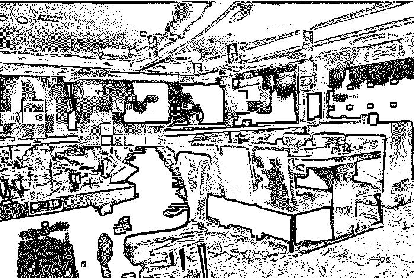
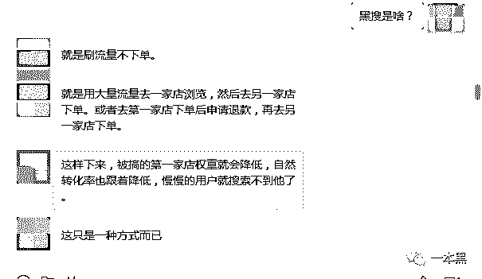
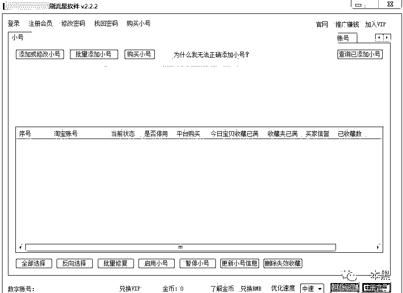
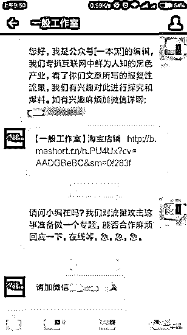
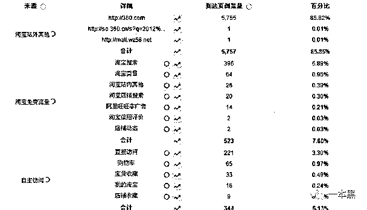
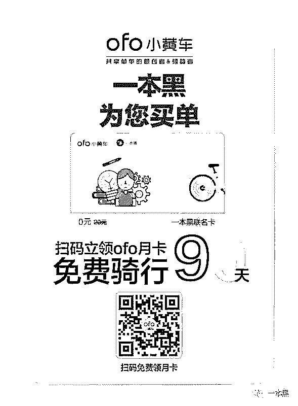

# 灰色产业的存在并不是偶然，创作者该何去何从？

> 原文：[`mp.weixin.qq.com/s?__biz=MzU4ODAwNzUwMQ==&mid=2247483811&idx=1&sn=f60a35350722ab2f479295011b0f429b&chksm=fde21081ca959997fbbd7f9cf6acea8887ce9afc9818f4fbe3ae8e539e4abb6c90bd8acf9b9d&scene=27#wechat_redirect`](http://mp.weixin.qq.com/s?__biz=MzU4ODAwNzUwMQ==&mid=2247483811&idx=1&sn=f60a35350722ab2f479295011b0f429b&chksm=fde21081ca959997fbbd7f9cf6acea8887ce9afc9818f4fbe3ae8e539e4abb6c90bd8acf9b9d&scene=27#wechat_redirect)

文/东东（微信公众号：一本黑）

【一本黑】媒体或商业转载必须获得授权，个人转发朋友圈无需授权。

读完需要

8 分钟

速读仅需 4 分钟

* * *

自古今来，很多人都习惯用诋毁或者贬低别人的方式来凸显自己的专业，特别在当今这个时代，这就是所谓的同行相轻。

文人相轻、名人相轻、程序员相轻。似乎同行相轻早就已经渗透到了各行各业。

前几天老板在群里分享了一篇文章，内容大概说的是某设计工作室自主设计的一款产品因为创新、火爆等原因遭到同行盗版，店铺被同行恶意流量攻击。

<inherit></inherit>

从文章的陈述中得知，该品牌因为遭到“报复性流量攻击”使自己在某宝上的店铺权重大幅降低，最终导致用户搜索不到他们的产品，销量停滞不前、工厂停工、员工陆续离职等问题接踵而至。

该文评论下网友纷纷表示惋惜，对此也表示了对于原创工作者的支持。

一时间在圈内外引起了广泛的讨论，一方面在谴责报复者的恶劣手段，另一方面也有对平台质疑的声音。

<inherit></inherit>

此前【一本黑】所写专题在未授权的情况下也经常被人杜撰抄袭，这是对创作者极大的不尊重，对原创极大的不屑。

<inherit>对于这种恶意竞争，特别是存在盗版行为的，【一本黑】是绝对不能容忍的。</inherit>

那只隐藏在背后的黑手究竟是如何的丑陋，【一本黑】对此作出了探究，但在这过程中却遭遇各种阻扰和不被支持。

很多人都说这里面的水很深，劝我们不要涉及，但有句古话说得好：“明知山有虎偏向虎山行。”

所以，我们还是去做了。

<inherit>世上总有你不知道的事</inherit>

淘宝界有一句很出名的话：“十个淘宝九个刷，还有一个搞批发。”不难看出这里面的水有多深。

我立马询问了一个曾经做过电商的朋友，想必他对这一块一定很熟悉。

午饭约在一家东北菜馆，我知道他喜欢吃东北菜，所以特地选了这家店，见面后我急忙给他递上一根烟。

<inherit></inherit>

<inherit>（东北菜店内）</inherit>

菜还没上桌之前，我们用询问近况的方式寒暄几句后便开始切入正题。

“其实你所说的这种情况在三四年前就已经出现了，那时候还比较普遍，近年来已经很少见了。”朋友说完端起桌上的茶喝了一口。

“那这种流量攻击到底是如何操作的呢？”我继续询问。

“初步断定这种所谓的“报复性流量攻击”是通过类似刷单的方式来操作的，反正最终的结果就是拉低商家的转化率，从而使商家权重降低，这样就会导致用户在搜索相关关键词的时候搜索不到该商家。”

（店铺权重是影响商品排名的关键，是淘宝搜索引擎的依据。高权重意味着高排名。权重越低或是没有权重，商品出现在搜索前列的几率接近于零。）

“说白了这就是同行之间存在的竞争。”

“那这些进行流量攻击的是有专门的团队在做吗？还是个人？”趁着饭菜还没上齐，我继续追问。

“淘宝里有专门刷信誉的公司或者个人，这些灰色业务他们都可以做。”朋友刚说完这句话饭菜也已上齐，我们只好暂停讨论。

饭后朋友接到一个电话，下午还有事要处理，我也不好意思耽误，也就提前结束了交流，临走前朋友告诉我，等晚上有时间给我发些资料，或许对我有帮助。

饭局结束后，我突然想起了自己的学生时代，那个年少无知的岁月里，无意间在网吧电脑上看到一条日入 80-200 的兼职信息，随后便入了刷单的坑。

通过在某语音平台上缴纳会费后，就开始了刷单的培训。此后浏览网页、选购商品、假聊、下单等操作信手拈来。这种事想必大部分人都经历过。

<inherit>天黑路滑，社会复杂</inherit>

晚上，朋友给我发来了几个文件，文件里出现一个我没见过的名词：“黑搜”。

<inherit></inherit>

经过他的解释，黑搜的意思就是刷浏览量，但是不下单。

也就是说利用大量的流量去一家店铺浏览，然后跑去同行业的另一家下单；又或者去第一家店铺下单后申请退款，然后再去同行业第二家下单。

也可以通过搜索某个关键词，浏览第一家，然后跑去第二家下单，这样一来就会导致第一家的权重下降，第二家的权重增加，从而拉低第一家的转化率降低排名，直到用户搜索不到该商家为止。

<inherit></inherit>

<inherit>（聊天截图）</inherit>

在这个套路如此之深的社会，还有这样的操作？简单佩服佩服。

“做淘宝的都知道千人千面这个词，淘宝的这个技术主要就是为了提升用户在购物上的体验度，提高流量的价值，降低流量消耗。”朋友接着给我说。

“好比如一个身价上千万的成功人士，如果逛淘宝的时候满屏幕都是 9.9 包邮的商品，你说他会购买吗？”

“还有就是一个用户画像的问题，俗话说物以类聚人以群分，你是什么样的人就会搭配什么样的商品，淘宝里面所谓的‘猜你喜欢’这个功能就是这个道理。系统会记录并把每一个品类细分到人群。”

“那这些和流量攻击有什么关系。”听朋友说这么多，我都有点懵了。

“那些进行流量攻击的团队或个人就是利用这个机制，采用黑搜这些相应的技巧来进行恶意流量攻击。这就是导致被恶意流量攻击的商家用户匹配度不高，用户无法搜索到商家，转化率降低的原因。”

原来是这样，我恍然大悟。

“有没有什么办法能查到这些人？”我接着追问。

朋友告诉我在刚刚发的几个文件里，有个淘客达人的资料，里面有些人会做这方面的业务。还有很多刷单的团队或者个人都会做这种灰色产业。

<inherit></inherit>

<inherit>（淘客达人资料图）</inherit>

我试着加了资料里一些淘客的 QQ，可是都没有回复我，在资料里，我找到一些 QQ 群，加了进去，在群文件里发现一些用于刷流量的软件。

<inherit></inherit>

<inherit>（软件截图）</inherit>

老师傅通过抓包后得到一个域名。

通过对国内大部分网络进行测试，发现都不能访问该网站，证明网站已经停用。

<inherit></inherit>

对应域名注册者名下的其他域名也已经停用，看来这些软件确实是有一定的年纪了。但是昔日的痕迹依然可以清晰可见。

<inherit> 这个世界是怎么了？</inherit>

后来，我联系上了该工作室，想要他们提供一些后台的数据给我们分析。

<inherit></inherit>

<inherit>（联系截图）</inherit>

加了微信对方却回应数据暂时不方便透露。

明明是为了能更深入的调查，主动联系受害者，却得到这样的回应，这让我们感到不解。

别人不愿提供相关信息也不勉强，但是既然都走到这一步了也不能就这样停下来。

通过搜集资料、逐步暗访，我找到了一名曾经遭受过恶意流量攻击后转行的店家，沟通过后，他给我发来了当初保存的一些后台数据。

一般来说，量比较大的都是用软件来刷，从停留时间来看基本都是浅度访问。

<inherit></inherit>

<inherit>（效果图：商家访问量倍增，都是浅度访问）</inherit>

在下图流量的来源中，可以看出站外的流量是最高的，占了总访问量的 85.82%，也就是说该店铺被恶意刷流量了。

从“详细”中可以清楚的看出网站的来源，但由于这仅仅是商家提供的截图，没有完整的详细链接，所有也就不能够进一步的深入。

如若遭受流量攻击的工作室能够给我们提供详细信息，我相信通过老师傅的“计算机基础知识”，肯定能把来源翻个底朝天。

<inherit></inherit>

<inherit>（效果图）</inherit>

<inherit>在访客详情中，可以很明显的看到访问的来源都是相同的，但是访客的位置却有变化。</inherit>

<inherit></inherit>

<inherit>（效果图）</inherit>

<inherit>通过这些信息就能判断该店铺被恶意刷流量了，这对于店铺的转化率是有很大影响的。</inherit>

这位曾经的店家告诉我，当初他们打电话给淘宝客服沟通，但是对方却表示对这个事不知情，全然一副爱理不理的样子。

对于淘宝客服这种不正常的推脱，让这些店家不禁怀疑其中涉及“暗箱操作”。

<inherit></inherit>

<inherit>（朋友的爆料）</inherit>

是否暗箱我们并不敢妄下定论，清者自清，明者自明。

因为受害者不愿配合的原因，我们这次的探究算是不完美的，也只能到此告一段落。

<inherit></inherit>

<inherit>（对方不愿透露）</inherit>

<inherit>“他们为什么不愿提供数据让你去查呢？既然都公开发声了，为什么不希望追查到底呢？”朋友对此质疑到。</inherit>

我们只是单纯地想把互联网中的某些灰色产业扒出来让更多的人知道，毕竟这个世界这么黑暗，总得有人出来做点什么。

“这件事应该没这么简单。推文一出，原本停滞的销量突然就暴涨，原本没什么人气的公号却在几天内突破 10 万+，产品出现了供不应求的现象。”朋友对他们的遭遇提出了质疑。

<inherit>“是情怀让他们得到了广大人民的支持，然而这种现象如果没有人为因素的推动是不可能做到的。”朋友越说越有劲。</inherit>

<inherit>这个想法立即被我否定，我向来不惮已最坏的方式来揣测别人，况且我也相信大多数人都是有良知的。</inherit>

对于这种现象，【一本黑】完全有能力去彻底探查，但无奈于信息太少，所以只能到此为止。

时间漫长，【一本黑】还会继续去做那些正确的事，在这条道路上，我们坚定初心，也望拱手支持。

* * *

看完往下拉有福利：

还原事实｜专扒黑产

微信 ID：darkinsider

彩蛋：

ofo 小黄车是我们的好朋友，特地为大家申请了 3000 张免费骑行的卡，逼话就不多说了，直接扫码领取。

周末愉快！吃鸡吃鸡！

