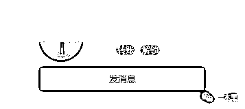
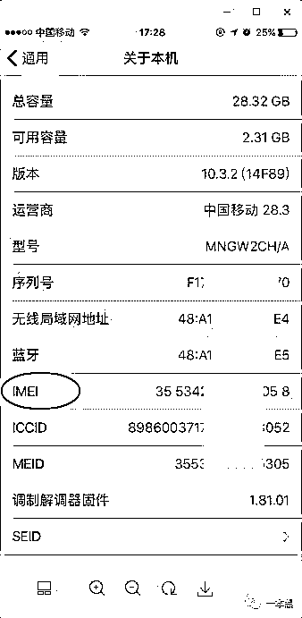

# 都在说 iPhone，我来谈点不一样的，

> 原文：[`mp.weixin.qq.com/s?__biz=MzU4ODAwNzUwMQ==&mid=2247483804&idx=1&sn=7b27dfb14b8c1b386bae6c88dbe1a929&chksm=fde210beca9599a8be04f4b82c9fc5a36abb88bcf4b7250be0eaeda7c9e1f996888bcea12074&scene=27#wechat_redirect`](http://mp.weixin.qq.com/s?__biz=MzU4ODAwNzUwMQ==&mid=2247483804&idx=1&sn=7b27dfb14b8c1b386bae6c88dbe1a929&chksm=fde210beca9599a8be04f4b82c9fc5a36abb88bcf4b7250be0eaeda7c9e1f996888bcea12074&scene=27#wechat_redirect)

文/东东（微信公众号：一本黑）

【一本黑】媒体或商业转载必须获得授权，个人转发朋友圈无需授权。

读完需要

8 分钟

速读仅需 4 分钟

* * *

人生能有几个十年，不管是曾经韶华的时光，还是漫漫余生，但愿有阳光能照进回忆。

大头就有一段不堪回首的记忆，当时年少的大头还是安全圈的一名门外汉，作为大学毕业最后的疯狂，酒桌上的大头豪言要不醉不归，各种酒瓶碰撞的声音是大头大学四年最后的倾诉。

还有些清醒的大头从口袋里拿出自己的 iPhone5S，订了学校附近常去的一家宾馆，然后默默地看着坐在自己身旁的女朋友，静静地点燃了一根烟。

大头醒来的时候已经是中午时分，太阳从窗户斜斜地照进来，透过光照的路径可以看到悬浮在空中的细小漂浮物。

大头转过头看着躺在一旁的女朋友，随着脑袋的晃动，他感到头疼得厉害，看来昨晚确实是喝了不少。

他摸了摸枕头下的手机，发现手机已经关机了，找了半天才在床下找到充电器。对着床头的插孔插了半天也没插进去，反而随着摇晃让他的头疼变得更厉害了些。

好不容易充上了电，当打开手机的时候，眼前的一幕让他瞬间清醒了不少。

他发现自己的手机不知道怎么回事被莫名的锁住了，更可疑的是手机页面上留下了一行文字：“该手机已被锁定，如需解锁，请联系 XXXXXXX。”留下的联系方式是一个 QQ 号码。

一开始他以为是女朋友或者朋友的恶搞，毕竟他们都知道大头的解锁密码，是不是因为昨晚喝大了大家搞的一个恶作剧，他不停地回忆关于昨晚酒桌上的细节。

通过一番询问和验证后，朋友们纷纷表示昨晚都喝断片了，哪有这么无聊的时候去恶搞。

一脸懵逼的大头全然不知道发生了什么，不就喝个酒手机没电关机了吗，怎么一晚上功夫手机就被锁了呢？

“你先用别的手机登陆自己的 Apple ID 账号，看看能不能登上去，是不是手机被黑了？”听朋友这么一说，大头慌了神，赶紧借用朋友的 iPhone 登陆了 Apple ID 账号。

结果在意料之中，ID 账号果然登陆不上了，他的密码已经被修改了。

大头赶紧拿着手机跑遍了学校附近的修理店，询问专业的维修人员。

结果他们都告诉大头这是苹果官方的保密设置，需要正确的 Apple ID 账号才能打开手机，只能找苹果的官方人员解决。

眼看就要毕业了，却发生这样的事，这让大头忐忑不安。

在这期间，大头尝试着重启了无数次手机，希望能在重启之后手机能恢复原样，结果却是一次次的失望。

后来，大头向苹果公司的客服打去了电话。告知大头这件事情可以帮忙解决，但是需要提供手机相关的证明，比如购买凭证、手机序列号、发票等。

但是大头的手机已经用了一年多了，这些东西早就不知道扔哪里去了，顶多能找到个手机包装盒。

本来有了一线希望，但却有给大头泼了一盆凉水，看来只能“束手就擒”了，大头试着加了手机页面上留下的 QQ 号。

<inherit></inherit>

<inherit>（效果图）</inherit>

在此人 QQ 号码签名栏的位置看到：“转账，解锁。”四个字，真的是简单粗暴，废话不多。

联系上这个人之后，他告诉大头：“报上手机串号和机型。”

<inherit></inherit>

（串号在之前的专题有提到过，也就是 IMEI 码，可以在关于手机中找到，也可以在手机拨号界面，输入*#06#，屏幕上显示的 15 位数字就是本机的 IMEI 码）

“手机打不开没办法查看串号啊！”大头着急地做出了回应。

“你可以找到手机的包装盒子，上面可以查询得到。”对面隔了几分钟后回复大头。

大头把找到的串号发送过去后，对方通过验证确定手机后，给大头发了一个微信支付二维码。

“解锁费 800 块，到帐秒开，不啰嗦。”大头此时心里憋了一把火。

随后对方又发了一句话：“不给钱，手机就报废了！”为了解锁，大头只能忍气吞声了。

在支付了 800 块后，大头的手机恢复了正常。

最近 iPhone8 发布，大头突然聊到他伤心的过去，老师傅听了之后冷笑一声：“一定是你上了一些羞羞的网站。”

为了搞清楚状况，我给老师傅递了一根烟，想让他讲讲这其中的原委。

“其实道理很简单，很多人在上网的时候浏览的一些网站都需要登陆，这样就会留下自己的账号信息，一些被挂暗链或劫持的网站经常出现这种情况。”

“还有就是有时候会莫名其妙的收到一些奇怪的链接，当用户点击进去后就有可能造成信息泄露，这基本上都是些钓鱼网站。”

“iPhone 的账号一般都是通过邮箱注册的，黑客可以通过这些方法获取用户的邮箱然后盗取，从而锁定你的手机，也可以更换账号，让你完全没有办法。”

“有可能你手机里面的照片，短信等信息都会被别人看到。”

安全从来都是一个经久不衰的话题，用户在上网的过程中浏览或者登陆一些网站的时候，一定要具备一定的辨识度，别让那些不法分子乘虚而入。

当遇到一些需要使用 Apple ID 账号登陆的时候，可以检查该网站的域名信息是否正常，很多高仿的网站需要仔细辨别，往往一些小细节就可以暴露出攻击者的丑陋面目。

保护好自己的信息，任重而道远。

iPhone 十年，我们见证了一个了不起的时代。

网络安全，同样值得人们重视。