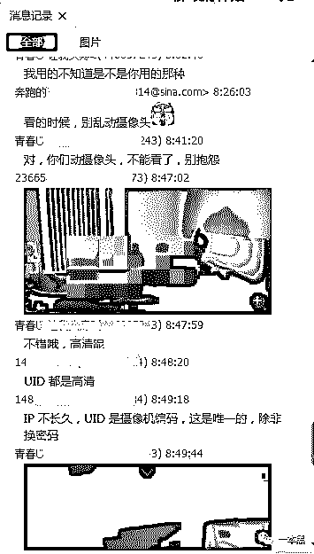
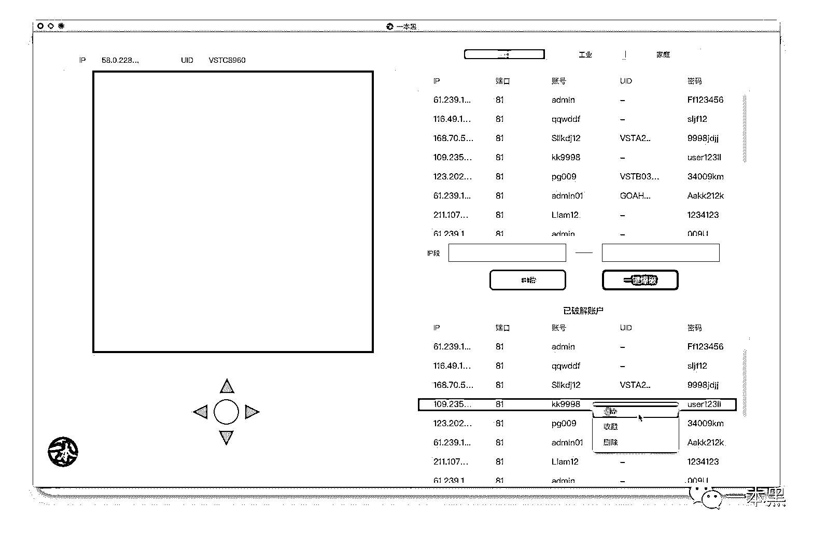

# 细思极恐|你的私生活正在别人的软件下直播

> 原文：[`mp.weixin.qq.com/s?__biz=MzU4ODAwNzUwMQ==&mid=2247483779&idx=1&sn=4b5cbb41cb129964a48d568b4df09500&chksm=fde210a1ca9599b7822c476962a86dd63b99928162e2ad8f63da23136da2cda0bc7995a5aea0&scene=27#wechat_redirect`](http://mp.weixin.qq.com/s?__biz=MzU4ODAwNzUwMQ==&mid=2247483779&idx=1&sn=4b5cbb41cb129964a48d568b4df09500&chksm=fde210a1ca9599b7822c476962a86dd63b99928162e2ad8f63da23136da2cda0bc7995a5aea0&scene=27#wechat_redirect)

文/东东（微信公众号：一本黑）

【一本黑】媒体或商业转载必须获得授权，个人转发朋友圈无需授权。

读完需要

6 分钟

速读仅需 3 分钟

* * *

**本专题由差评爆料，一本黑进行探究。**

周末约了三五好友在 KTV 唱歌，反反复复的老调子都是些不好也不坏的生活。歌里总少不了酒，酒过三巡，一帮狐朋狗友就拉拉扯扯地说着些不着边际的话。

唯独不喝酒也不唱歌的小皮一个人躺在包间沙发的另一角捣拾着手机，我走过去想看看他到底在干嘛。

等我走近了，看到屏幕上那“露骨的私生活”直播，一时间尴尬的说不出话来。都在唱歌喝酒，难怪这小子这么安静，原来是脑子被下半身支配了。

<inherit></inherit>

画面中的女人从浴室赤裸地走出来，然后坐在沙发上吹头发，摇摇欲坠的浴巾是影像尺度的最后一道分界线。正看得起劲，屏幕上突然弹出：“成为顶级 VIP 将可继续观看。”

<inherit></inherit>

<inherit>（要求解锁的图）</inherit>

“卧槽”小皮不自觉吼了出来，抬头便看到了我。猝不及防的四目相对，让他脸上也写满了尴尬。

“诶，你这什么软件啊，借我看看呗。”为了缓和尴尬，我得说两句。

“没什么，一个软件而已。”他带着点吞吐的语气。

“别装了，我都看到了，好东西不一起分享是吧！”

“在一个群里面看到的，花了几十块钱买的，这才看了一眼，你就来了。”

通过小皮的描述，原来这是一款偷窥别人家庭摄像头的软件。现在有不少人给自己家装了家庭摄像头，人在外面就可以监督家里的小孩或宠物。但是这也给隐私泄露开了扇门，有些摄像头会被破解，那么别人就可以天天对你家进行实况直播！

而这个 APP 就是小皮在一个群里发现的，出于“好奇”，他花钱购买了这款 APP。

小皮又点开了其他摄像头，结果和第一个一样，都是只能看几分钟。

“什么垃圾啊，都要充钱。”正馋的时候，要了命了，充就吧，一咬牙小皮直接充了 128。

<inherit></inherit>

<inherit>（充值的截图）</inherit>

充值以后确实可以看了，但奇怪的是为什么和之前看过的一样，这哪是直播，分明是录播啊！

破解别人摄像头，然后看人家私生活直播的 APP 真的存在吗？又是通过什么手段做到的？

出于强大的好奇心理，带着这两点疑问，我决定对这款名为【破解摄像头】的 APP 做深度探究。

<inherit>黑客窥探出庞大色流黑产</inherit>

<inherit>要弄清这个“私生活实况直播”的真貌，还得借助老师傅的“计算机基础知识”。</inherit>

<inherit>老师傅一向对扫黄打黑颇有兴趣，这种事交给他就会真相大白。</inherit>

<inherit>用不了一个小时，他就把整个 APP 翻了个底朝天。看着调查的结果，老师傅表情嘲讽地说：“傻子，你们被人骗了。我分析了一下数据，APP 里的影像是录制好的 MP4 格式的文件，并不是实时的家庭摄像头监控。128 元买的只是几个视频而已，根本看不到什么直播。”</inherit>

<inherit></inherit>

<inherit>（这里的 WS9.MP4 就是那个录好的视频）</inherit>

<inherit>又是假的？我们见识过了假游戏，假黄网，现在又出了个假直播？</inherit>

我问，“做 APP 这人赚了多少钱？能查查有多少人上当了吗？”

“他可不是一个人，是一群人！”老师傅继续说“我查了下，他们是一个组织，一共有几十个域名，一大半已经被封掉，剩下的基本都是和色情有关的网站，里面都是给博彩引流或者是一些诱导付费的 APP。”

追踪 APP 的数据，我们确定了域名地址，然后查出了此域名注册者的姓名、邮箱以及注册时间。

<inherit></inherit>

根据这些线索，我们顺藤摸瓜地找出了他们注册的其他域名，逐个排查后发现这些

域名都是清一色的色流（和色情挂钩）网站，一副庞大的黑色产业浮出水面。

<inherit></inherit>

<inherit>（色流网站部分截图）</inherit>

这些域名都绑定在同一个服务器上面，网站还都进行过安全加固。比起现在市面上漏洞百出的网站，他们的网络安全做的很到位，所有补丁齐全，防护的策略也想的很周全。想要进入后台，就需要付出较大的时间成本，而且还容易留下痕迹，既然模式清楚了，也没必要在这里浪费太多时间。

“这个组织有规模，而且很专业，网站都做了加固，安全性很高”老师傅抽着烟感叹“黑产的专业化越来越高，流氓也越来越有文化了！”

我好奇地问，“这些人是怎么通过这些色流网站赚钱的呢？”

老师傅答道：“打黄色擦边球的网站无非是为了吸引流量，从而给博彩或者给一些成人用品之类的电商导流。伪装成家庭摄像头直播的骗钱 APP 也是一种很有效的变现方式，和我们爆料的[上了个“假”黄网，误入了 7 亿黑产的大门](http://mp.weixin.qq.com/s?__biz=MzU4ODAwNzUwMQ==&mid=2247483670&idx=1&sn=35e2e3e0143a5284c1ec6b99da51ff97&chksm=fde21034ca9599226daf9381846118a0438a38b0ad429581d703325842dd664cc425c4bf1b04&scene=21#wechat_redirect)是一样的。”

最后老师傅还笑着补了句：“这种小儿科，简直不值得一提，我只是用了我的‘网上冲浪技巧’而已”。

此时的我并没有说话，为了以后愉快的工作，我并不能打断他。

老师傅意犹未尽“其实这种摄像头偷窥早就有了，原理也很简单，你不信去搜搜，应该有很多。”

我尝试去寻找小皮所说的 QQ 群，结果搜出了如此多的结果，个个都是近两千人的群。。

<inherit></inherit>

我随便加了几个群，想要一探究竟。

<inherit>摄像头成为了色狼偷窥的“墙洞”</inherit>

在 QQ 群里，一款名为【千里眼】的软件不断被提起，根据群内网友的聊天得知，该软件可以破解千里之外的家庭摄像头，陌生人的隐私完全可以在这里看到。

也就是说，只要你家里装了摄像头，你的一举一动，都有可能被这些软件的使用者偷窥和监视。

在这个你我互不相识的网络世界里，人的本性暴露无遗，他们的窥探心理被无限的放大。

<inherit></inherit>

<inherit>（部分聊天截图）</inherit>

<inherit>还有人时不时的分享一些自己扫描出来的摄像头截图，摄像头的主人完全不知道自己已经被监控，自己的一切隐私完全暴露在网络的另一头。</inherit>

<inherit></inherit> 

所以只能去询问群里最活跃的群主，群主以 170 元的价格兜售这些软件，群友购买之后就可以通过 IP 任意扫描摄像头了。

软件是偷窥的工具，而那些被破解的摄像头才是偷窥的眼睛，只要有了这些摄像头的 IP 和密码就可以随意观看，而这些群主要就是通过售卖软件和筛选出来的摄像头信息进行营利。

<inherit></inherit> 

而且在群里还有针对该软件如何操作的视频教学，只要跟着视频中的方法，任何人都能很快学会。

<inherit></inherit>

<inherit>（视频截图）</inherit>

遇到困难当然还得寻求老师傅的帮忙，是该轮到老师傅上场的时候了。

老师傅开始娴熟的使用他“计算机网络技术基础（hexie）”的知识对该 PC 端的软件进行分析。

老师傅点燃一根黄鹤楼叼在嘴里说：“其实原理很简单，他只不过是通过扫描 IP 段，锁定这些摄像头，接着就开始尝试破解一些设有弱密码的目标”。

<inherit>因为每一个摄像头都有一个 IP，它就像一把锁一样，密码就是要是，一旦钥匙和锁芯吻合，门就可以被打开。</inherit>

“而这款软件就是不停地扫描 IP 并对密码进行爆破（用工具反复试验可能的密码），直到登录成功为止。而且这些工具的开发十分简单，软件代码都不难获得。”

<inherit></inherit>

“既然这么简单，你能自己做一个吗？”我连忙补充道。

“这太小儿科了，没什么意思。”老师傅不屑地说。

<inherit>最后老师傅在我的劝说下答应“制作”一个简单的“直播神器”，前提是我得请他吃一个星期的饭。为了还原事情的真相，我也是下了血本了。</inherit>

在某知名开源平台上，老师傅找到了类似的源代码，并结合实际搭建了一个破解软件，软件可分别区分公共、工业、以及家庭的摄像头。可以自动扫描并且对密码进行爆破。

“那咱们赶紧扫描一些有哪些可以破解的家庭摄像头呗。”软件制作完成后，我迫不及待的想要老师傅给我演示。

“想得美，我们是有底线的。”说完老师选择了公共摄像头，输入了 IP 段开始扫描，果真发现一堆可以观看的公共摄像头，全都是弱口令或者空口令。

<inherit></inherit>

<inherit>（老师傅制作的破解软件）</inherit>

<inherit>怎样正确地使用家庭摄像头？</inherit>

<inherit>互联网这把双刃剑在给人们带来方便的同时，也埋下了安全的隐患。把设备接入互联网就如同在互联网上敞开了一扇大门，给一些不法分子可乘之机。</inherit>

监控平台弱口令漏洞频发，这是一种在全世界都有的普遍现象。

<inherit>不仅仅是家庭摄像头有这样的情况，现如今用于城市管理、交通监控的公共摄像头设备中，同样存在大量的弱口令，他人轻而易举的就可以入侵这种摄像头。</inherit>

<inherit>国家互联网应急中心曾做过这样的实验，挑选了当前市场上占有率排名前五的智能摄像头品牌中的其中两家，进行弱口令漏洞分布的全国性监测，结果令人惊讶，这两种品牌的摄像头，就有十几万个摄像头用的弱口令。</inherit>

安全从业者都知道一款搜索引擎——Shodan，他不是在网上搜索网址，而是直接进入互联网的背后通道，搜索互联网设备。他真正值得注意的能力就是能找到几乎所有和互联网相关联的东西，包括服务器、摄像头、打印机、路由器等。我们制作的“直播神器”就是利用了 shodan 的接口，强烈建议空间浏览器屏蔽家庭智能设备，不要给恶人提供便利。

摄像头的设计者也应该假如短信验证等环节，就可以规避用户使用弱口令所带来的风险。

除此以外，不用预设密码，密码越复杂就越好，有条件最好做到定期更换。摄像头不要对着较为私密的空间，床和浴室尽量躲开。升级固件要勤快，可以减少设备可能存在的漏洞。在家的时候可以关闭摄像头电源或者用遮挡物挡住，记住，再强大的黑客也没法突破你的遮挡物。

看完文章，看看你家的摄像头动了吗？

* * *

文中 APP 由差评提供，我们进行深入探究，和故事化的叙述。

友谊的二维码：

