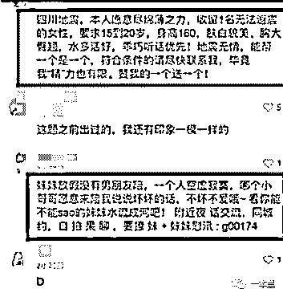
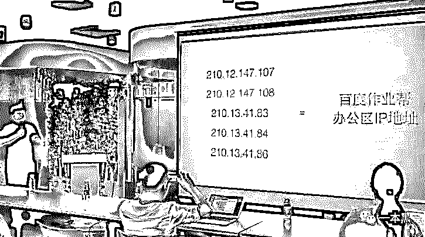
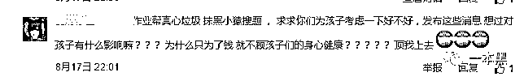
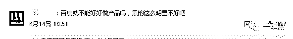
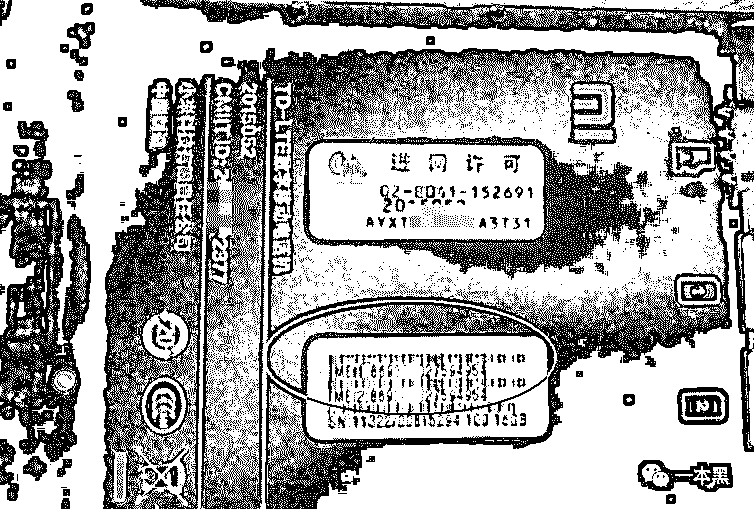
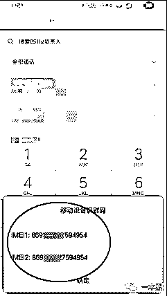
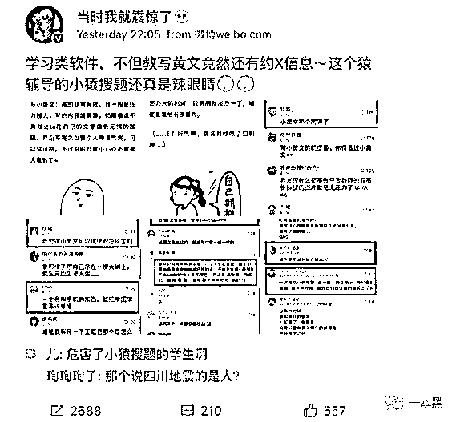
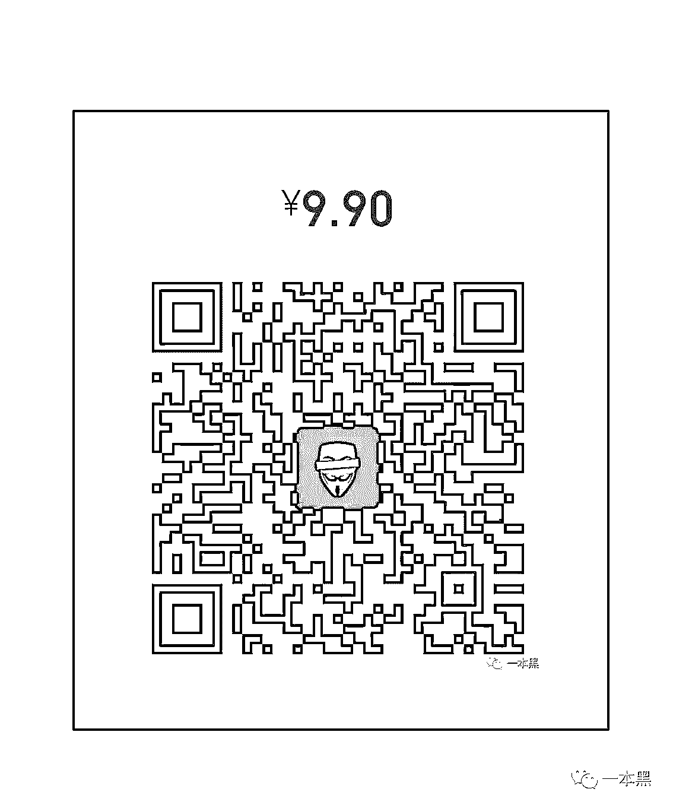

# 都忙着骂百度缺德，我们说点大家不知道的

> 原文：[`mp.weixin.qq.com/s?__biz=MzU4ODAwNzUwMQ==&mid=2247483772&idx=1&sn=05bec0457ec7d89a39d3aba599b19d09&chksm=fde2105eca9599486a6dd917e3bbc5a087394ab0d4b2fc0f77df08e6e4c9fa6deb018abea172&scene=27#wechat_redirect`](http://mp.weixin.qq.com/s?__biz=MzU4ODAwNzUwMQ==&mid=2247483772&idx=1&sn=05bec0457ec7d89a39d3aba599b19d09&chksm=fde2105eca9599486a6dd917e3bbc5a087394ab0d4b2fc0f77df08e6e4c9fa6deb018abea172&scene=27#wechat_redirect)

文/东东（微信公众号：一本黑）

【一本黑】媒体或商业转载必须获得授权，个人转发朋友圈无需授权。

读完需要

6 分钟

速读仅需 3 分钟

* * *

最近，百度又被推到了舆论的风口浪尖。对此，我们会站在安全从业者的角度浅析这件事，没有长篇大论，敬可放心。

没有什么比管理层的发声更能体现一个公司的坚决，李鑫言之凿凿的控告，让作业帮和小猿搜题的争端已然势同水火。

近日，一款名为「小猿搜题」的在线教育 APP 指控同类竞品「百度作业帮」故意在其 APP 内发布不良信息，并安排公关恶意夸大抹黑，一场疑似“恶意商业竞争”的闹剧在互联网上炸开了锅。

<inherit></inherit>

<inherit>（涉黄内容）</inherit>

这些“违禁”内容里不仅涉黄、还包含对四川地震的调侃。根据【小猿搜题】的调查结果显示，这种恶劣的栽赃陷害和蓄意抹黑行为，是百度「作业帮」所为。

小猿搜题副总裁李鑫在发布会上斥责：“这是我见到的史上最肮脏的攻击陷害行为，简直是触目惊心，而且还发生在了教育行业。”

<inherit></inherit>

随着受害者将矛头直指百度，舆论也疯狂倒向了对百度的谴责。

<inherit></inherit>

<inherit></inherit>

<inherit>（微博评论）</inherit>

<inherit>这让我想起百度网盘被爆大量涉黄的事件，违规的内容给平台方带来极恶劣的负面影响。</inherit>

<inherit>目前事件尚未尘埃落定，对于此次疑似“恶性商业竞争”的事件，这里不再赘述过多的道德论述，只是谈谈企业在内容审查上的策略和业务安全的重要。</inherit>

<inherit>【小猿搜题】凭何断定此举是【作业帮】所为？</inherit>

<inherit>根据【小猿搜题】的表达，他们对发布涉黄信息账号进行了追踪，发现发布涉黄内容的手机采用了虚假的 IP 地址。根据老师傅的经验，这种虚假 IP 无非就是他们使用了海外的服务器作为代理(VPN)，或者是使用虚拟机进行操作。</inherit>

不只是掩盖 IP 地址，账号也是用非法的手机号码注册，而这些手机号在所在运营商的状态下并未售出，手机号码也无从查起。

<inherit>据我们所知，时常会有未经过实名验证的手机卡流入黑市，要买到这些电话卡并非难事。</inherit>

尽管 IP 和手机号码都无从查起，但是手机的“身份证”（设备号）已经露出马脚。从现在掌握的消息来看，小猿根据发布消息的手机设备号，调查到了这个手机的其他上网行为，且发现该手机还使用过其他 IP 登录过【小猿搜题】。

柳暗花明，小猿顺藤摸瓜，利用此号码查询到了这几台设备用过的所有 IP，通过对比，确定此 IP 地址就是【作业帮】的办公所在地，其中有个 IP 地址还被作业帮的 CEO 用来登录小猿搜题。

<inherit>什么是设备号？</inherit>

设备号官方用语叫 IMEI，是手机的唯一识别号码。

<inherit></inherit>

<inherit>（如图所示）</inherit>

拿掉手机电池后，可以看到机身上的 IMEI，该设备号同时读写在手机的内存中，它是唯一的，就像是我们的身份证号，是该手机在厂家的“档案”和“身份证号”。和身份证一样，每一位数都有特定的含义。

前六位数一般代表机型，接着的两位数一般代表产地，之后的六位数是“串号”，一般代表生产顺序号，最后一位数为检验码，目前暂作备用。

【小猿搜题】就是通过对比厂家的“档案”，才让此事水落石出。

另一种快捷查询方法就是在拨号界面输入*#06#，屏幕上就会出现 IMEI。

<inherit>（如图）</inherit>

根据老师傅的了解，开发者不能获取 ios7 之后版本的 IMEI 码，这样看来发布涉黄者的手机设备应该是 iPhone6 之前的版本或者安卓手机。

<inherit>浅析企业内容审核</inherit>

前段时间小密圈因涉黄被封，其实就是典型的业务安全问题。

现在企业不得不越来越重视业务安全。数量庞大的论坛、贴吧、APP 里的 UGC 内容（用户原创）越来越多，网络上的内容迎来了爆炸式的增长。然而这些内容一直没能保持在可控的范围内，赌博、色情、暴力等内容一直是屡禁不止。

从以前色情泛滥的快播到百度云网盘、再到如今的小密圈，催使互联网公司不断提高在内容审查上的能力。

除了大公司会自己建立审查过滤机制，大多数企业会选择使用第三方的产品来解决自己的业务需要。这种产品可以提供“消息过滤服务”，这种服务一般可以应用于网站和 APP 的内部场景，包括发帖、评论、聊天。可以将这些场景中的恶意文字和图片内容、包括违法违规、色情垃圾广告、恶意营销等，处理掉。

原理就是当用户使用 Web 客户端或 APP 访问服务器时，服务器会记录相关的账号、IP、时间、IMEI、图文内容等，通过对这些信息上传到某个“消息过滤服务器”，进行判断和验证，识别用户发布的内容中是否含有敏感、色情、欺诈广告等关键词，然后返回结果，从而断定当前用户是否发布了恶意信息。

企业的业务安全不止停留在对内容的审核上，公关风险则是整个事件的放大镜。

【作业帮】通过新浪微博@当时我就震惊了 等多个营销号在同一时间发布了内容一致的“小猿搜题 APP 涉黄内容”的微博，这才让这场“互黑战争”开始爆发，从而引发了社会舆论。

无论最后结果如何，两方的负面信息都已经被用户感知，形象都受到了影响。

<inherit></inherit>

<inherit>（大 V 转载）</inherit>

除了找大 V 转载，【作业帮】还在记者采访中冒充【小猿搜题】用户的家长，以此来制造虚假的话题，从用户的角度攻击【小猿搜题】。

这种行为是模糊了底线的，不管是雇佣大 V 在网上发帖，雇佣水军评论，还是通过新闻事件，都可以在短时间内对竞争对手造成一定影响，还会引发社会的舆论甚至投资者对其公司的不信任。

虽然国际上也普遍认为安全依靠威胁驱动，但是利用安全充当公关武器还是令人唏嘘。

<inherit>**浅析事件的背后**</inherit>

这两者教育类的 APP 都处于相似的发展阶段，又是同一个赛道的参赛者，这恐怕才是“战争”的来由。

表面上，这次事件是两个品牌之间的公关战，实际上却是为了最大限度的获取 C 端用户的品牌依赖度和信任度。

打响品牌，以一个良好的口碑赢得用户的好感，是两家教育培训行业很关键的一步。对移动互联网教育来看说，思考的问题应该是如何变现和持续的流量增长。

<inherit>而不是在公关的牌桌上显露自己的智慧。</inherit>

虽然各行各业都存在着竞争，但竞争可以相互促进和进步。对于这种通过钻企业内容审核机制空子和公关行为损害用户，特别是对孩子的身心健康有损的行为确实是很可耻。总之，此次事件暴露出的问题不仅体现在道德方面，也体现在企业内容审核机制的不完善，业务审查不严谨方面。

**题外话**

熟悉【一本黑】的朋友们都知道我们这个号旨在把互联网中的黑色产业、行业里鲜为人知的故事，从幕后带到大众面前，让圈外人也能无障碍的理解。

信息爆炸的时代，相比内容数量，我们更希望把高质量的内容送给用户，更新频率我们会尽力提高。

前段时间小密圈因某种原因暂停服务，后来出现一系列问题，在这里说明一下：现在小密圈还在升级维护阶段，已确定小密圈将改名为【知识星球】，应用市场和 APP Store 暂时还未上架。原本就安装了小密圈的用户可以继续使用，后来者可以先使用微信小程序，在小程序里搜索知识星球即可。

一直在希望圈子做到小而美，因为用户数量越大，用户的口味就越杂，并不利于圈子内容质量的把控。这本就不是一个适合所有人的圈子，希望诸位三思而后行，考虑清楚再入圈，切勿冲动消费。这汇集我们的知识分享，以及我的个人见闻，希望能够一直纯粹下去。

