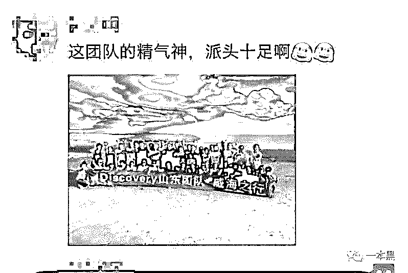
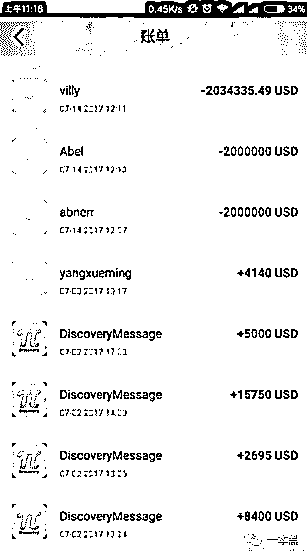
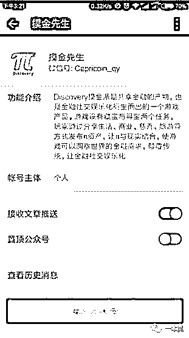

# 玩了个“假”游戏，却闯入一个疑似传销的黑暗组织

> 原文：[`mp.weixin.qq.com/s?__biz=MzU4ODAwNzUwMQ==&mid=2247483761&idx=1&sn=ccf64b55b1d9bd052636c894b043dfaa&chksm=fde21053ca959945aadbfb51f451c2ee1a11a81e2fc9ecfb49521c0178787f5afbcb78e46a27&scene=27#wechat_redirect`](http://mp.weixin.qq.com/s?__biz=MzU4ODAwNzUwMQ==&mid=2247483761&idx=1&sn=ccf64b55b1d9bd052636c894b043dfaa&chksm=fde21053ca959945aadbfb51f451c2ee1a11a81e2fc9ecfb49521c0178787f5afbcb78e46a27&scene=27#wechat_redirect)

虚拟货币注定是生来自带热点的宠儿，从挖矿热到炒币潮，再到新兴的 ICO，它的一举一动总能创造一个又一个财富神话。若虚拟货币遇上了传销，又会是怎样的噬金猛兽。

从魏则西到李文星，他们的故去将商业社会里人们为利益而模糊底线的行为体现的淋漓尽致。过于物质的社会，金钱令人为之着魔，因而让人性的阴暗被极大释放。

题材由差评爆料，本文也是我们一起合作发布。(差评，互联网最浪的科技资讯自媒体，幽默犀利揪出事件本源与糟粕，给世界补 bug，为美好而发声！)

故事从我的身边人光耀说起。

那天，对手游从不感冒的光耀正在津津有味的玩手机，一眼看过去就是一个 AR 游戏。

（游戏图）

“你这玩得什么游戏，很好玩吗”

“摸金派，是个 AR 游戏”他继续盯着屏幕。

在旁看了会，我说“没听过这名字，画面看着一般啊”

他不耐烦的说“你没听过正常，画面有什么用，起码这游戏玩着能赚钱。画面再好，不给你钱不还是浪费时间。”

听过玩游戏花钱，没听过玩游戏挣钱。这一棍打的我有些恍惚，“这游戏还能挣钱？”

“一般的游戏都是让你花钱，人家摸金派就不是。这是虚拟货币和共享经济，先是自己投点钱，之后都能赚回来。这么说吧，这游戏有两个赚钱的途径，一个叫「藏宝」，一个叫「夺宝」，你现在看我玩的这个是 AR 夺宝，打赢了敌人就给材料，然后就可以合成变为钱。藏宝就简单，啥也不用干，基本就是点几下，解锁了藏宝图，就能给你钱。你说这游戏良心不？”

不会是给真钱吧？我继续追问。

“当然是真钱。你在游戏里得到的是一种虚拟货币，这个叫「派」，和比特币的原理不是一个意思吗，你拿着这个派就可以换成人民币。你投多少，就给你成倍的返。我是进的晚了，早些进的都挣了不少。这个东西，不到一年就能把投的钱翻一倍，早知道有这个，我肯定把买车的钱都放这了，一年下来，福特就换了路虎。”

实在有点超出我的认知，我赶忙劝他别被骗了，怕他投了钱却拿不回来怎么办。

光耀越来越不耐烦，不屑地看着我，“你钱放支付宝就不怕没？人家这是国外的派克集团，旗下好多业务，会为了这点钱跑路了？你自己也是搞互联网的，还这么幼稚？而且这是最热的区块链和虚拟货币技术，你以为是皮包公司吗？”

说着就掏出手机给我打开了“派克集团”的官网。

（“高大上”的官网图）

本来以为应该是山寨风，现在对着这个比我司官网还漂亮的网站，我也语塞了。

现在光耀信誓旦旦，我只能自己去求证了。我表示也要入局，让他帮我装了 app，并且把带他“上级”的微信发了过来。

摸底调查

“上级”名为“XX 蜗牛”，我一共加了三次，直到晚上十二点才通过我的请求。我的小号让他有些生疑，所以从开始就很谨慎，一直寻问我是如何得知他的。

“朋友介绍我来的，想了解下玩法”我直入主题不理会他的盘问。

“最低一万二起投。”

“回报率和回报周期是多少呢？”心里虽然知道，但也还是走走程序为好。

“共 50 张藏宝图，每周只能解锁一张，周期是 50 周。收益是 95%，25 周就可以回本，一年就能让资产翻倍。”

基本和光耀的表述是一致的。

藏宝图就是先用人民币换π，再用π参与藏宝游戏，玩家就能得到 50 张藏宝图，玩家每周可以解锁一张藏宝图来进行提现，玩家藏宝所用的π越多，每张藏宝图的价值就越高。这里的投资方式完全是参照游戏的玩法设定。

在 APP 里面，所有的理财，交易活动都是用【π】充当货币来进行的，所以你要先用人民币购买【π】来参与。

“里面的一【π】相当于人民币多少钱？”我对他进行了提问。

对方告诉我：“现在的一π相当于人民币 42.2 元，澳门周年庆后，π就会稳步上扬。”

澳门周年庆是什么鬼？

在聊天中，他还给我发送了很多关于他们公司即将举行的全球发布会，我瞬间觉得怎么这么高大上。难道这是真的？真的有大公司进行运作，真的会举行全球发布会？

正在我疑惑之际，他又给我发来了消息。

“用户名多少，我加你好友？第一个加好友就是锁定推荐。”

“锁定推荐？”我一脸懵逼。

“锁定推荐就是我第一个加你为好友就会成为你的推荐人，这样能加速解锁藏宝图。”

原来拉好友入伙，可以加快获得收益的速度，这就是摸金派的扩张机制。人们为了更快赚钱，就会不断拉朋友来玩，促使摸金派越来越壮大。

传销不断地变换手法，许多打法律擦边球的模式不断产生，一般来说，只要是发展下线，就有传销的嫌疑。

“你玩这个玩多久了，赚了不少吧！”套近乎的话永远不嫌多。

“去年 11 月开始玩的，平时都是直接用π付支付，而且一直在复投。”

“π付？π可以在生活中使用？”我再次被震惊。

我为了验证他所说的商家支持π付，在 APP 中挑了一家商店做测试，看是否真的可以用π进行支付。

（APP 上搜索到的店家）

“可以使用π付，而且享受 85 折的优惠”店家清楚地回应我们。

随机抽验了几家，结果也是无一例外，可以基本确定地图上的商家是真的支持派付。

虚拟货币诞生已有十余年，就算是风光无两的比特币也没能实现线下的普及，所以一直没能走进大众的生活里，然而摸金派的虚拟货币竟然可以在现实生活中进行支付，实在令人匪夷所思。

在 APP 里可以看到，支持π付的商家已经遍布全国，对于一线沿海城市，支持π付的商家已经是密密麻麻，普及度相当可观。

（以上海某地区为例，红点是支持π付的商家）

为了能够让这个虚拟货币的支付落地，摸金派设计了一套让买卖双方都受益的机制。

商家设定一个把收入转化成藏宝的比例，所埋下的宝藏就是在这家店的附近，当有玩家参与挖宝的时候，就有可能出于挖宝的目的来到商家附近，从而就有可能在此地消费。

这个过程就相当于是商家拿出自己的一部分收入，来换取更多的流量。而玩家在消费时也可以参与挖宝来获得收益，整个逻辑是个可循环的利益生态。

这是他们的朋友圈。

欲望烧掉了理智，然后径直冲向极端。他们在刻意强调相信「摸金派」，对各类“商业英雄”抱以欢呼，一些“老玩家”的成功，使他们更有实现抱负的底气，以为凭自己的欲望来碰运气，就可能复制致富的神话。

**高超的包装能力带来火速发展**

最后，通过分析他给我发的一堆资料和聊天记录得知，该 APP 实则是包装了虚拟货币、区块链、共享金融、游戏化社交等花哨的概念，由此创造出了一个叫「π」的虚拟货币。理财的回报是一年翻一倍，该团伙用匪夷所思的回报来诱惑玩家入局。

众所周知，虚拟货币的数量是固定的，不能随意发行，而这种“要多少，有多少”的虚拟货币，必然只是精心包装过的敛财工具。

（大量资料作为包装）

从盈利模式上看，摸金派很像是旁氏骗局的变种，通过利用新投资人的钱来向老投资者支付利息和短期回报，较长的回报周期就是为资金的周转留够时间。而玩家可以通过拉新玩家入伙的方式来缩短自己的回报周期，这个机制就是主要获客手段。

对于传销和旁氏骗局的定义很复杂，不管摸金派是否符合法律定义，作为非司法机构，也没有权利去给别人定性，但是所有可疑的痕迹都可以让我们持有怀疑态度。

黑客出马，查出真身

老师傅用“计算机基础知识（hexie）”拿下了这个 APP，对该 APP 玩家的分布做了大致统计，早期从山东开始蔓延，现在已经发展到了全国，其中，深圳、上海、海南是重灾区。

玩家在游戏中用人民币兑换「π」，并非是直接和平台兑换，而是通过一个名为「共享者」的角色来兑换。

经过抓包分析，我们拿到了全部的管理员账号，随后我们对其中一个账号进行爆破。当时账号里有六百七十多万美元，直到今日，账号内的余额已经被组织全部转走。

我们分析了该账号半个月的流水记录，发现才半月的时间，收入就高达五千万人民币。

（该账号绑定了 11 张银行卡）

这样的账号有一百多个，涉案金额很可能在几十至上百亿。

几经周折才获得了他们的真实 IP，经过调查，发现他们用的是亚马逊的服务器，部署在美国的博德曼市。

随着我们队派克集团的资产调查越来越深入，我们发现网站归属于深圳的一家网站设计公司，该公司的老板也是传销组织的管理者之一，此人也正是光耀的“上线”。既然是设计公司，难怪网站做的并没有那么山寨。

通过手机号、QQ、邮箱等蛛丝马迹，我们很快“社工”出了两名骨干的身份，这里就不多谈。这个 C 姓的管理者和另一个山东 F 姓的管理者是摸金派的两个主要管理员，负责运营整个摸金派的用户。

继续深入

知人先知面，该团伙利用各种手段对自己进行包装，哈佛的分享会，会见了某国领导人或者参加什么峰会都是他们的日常活动。然而这里大多数照片都是捕风捉影，不能直接证明他们在其中的角色，经查证，内容基本都是张冠李戴，只有在一些小城市的活动是真的。

群里面的成员天天嚷嚷着“早日发大财，实现财富自由”的口号，连名字也都是【明天会更好】、【通往财富之道】支流。在这里，我仿佛看到了另一个世界，他们有着和正常人完全不一样的价值观和世界观。

组织形成了自己独特的文化，定制化的表情包都已经做了出来。

在群里，大家总是转发一个名为“摸金先生”公众号里的内容，里面就有些低级的错误。

【摸金先生】这个公号在 2017 年 2 月 7 日由【开普币 CPC】改名为【摸金先生】。开普币在 2016 年就被央视曝光为金融诈骗，是如假包换的庞氏骗局。

存在许多类似的公众号，已经形成了矩阵。

骗子为什么要宣称高的离谱的收益？

为什么要宣称高的离谱的收益，把收益说地点不是更真实吗？

其实不然，夸张的说法可以快速的筛选出目标群体，相信的必然是傻子，这就提高了效率；另一方面，就是吸引那些明知道是骗局却还要自作聪明进来玩火的人，不论是庞氏还是传销，早期加入者确实能赚到些钱。可怜之人，必有可恨之处。

有些被骗的人根本不恨当初骗自己的人，而是让他们弄另一种玩法，一定要带他们玩。因为他们觉得第一次失败是因为自己来晚了，所以下一次就有熟悉规则和抢占先机的优势，乘机从中谋取一把利益。

从过去的暗黑币、开普币，虚拟货币的骗局愈演愈烈。

之前央视对虚拟货币的传销也有过相关报道

* * *

<inherit>友谊的二维码</inherit>

