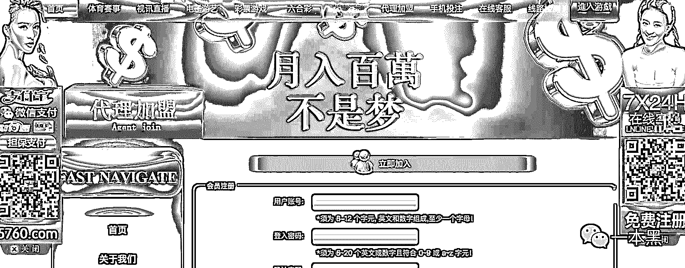
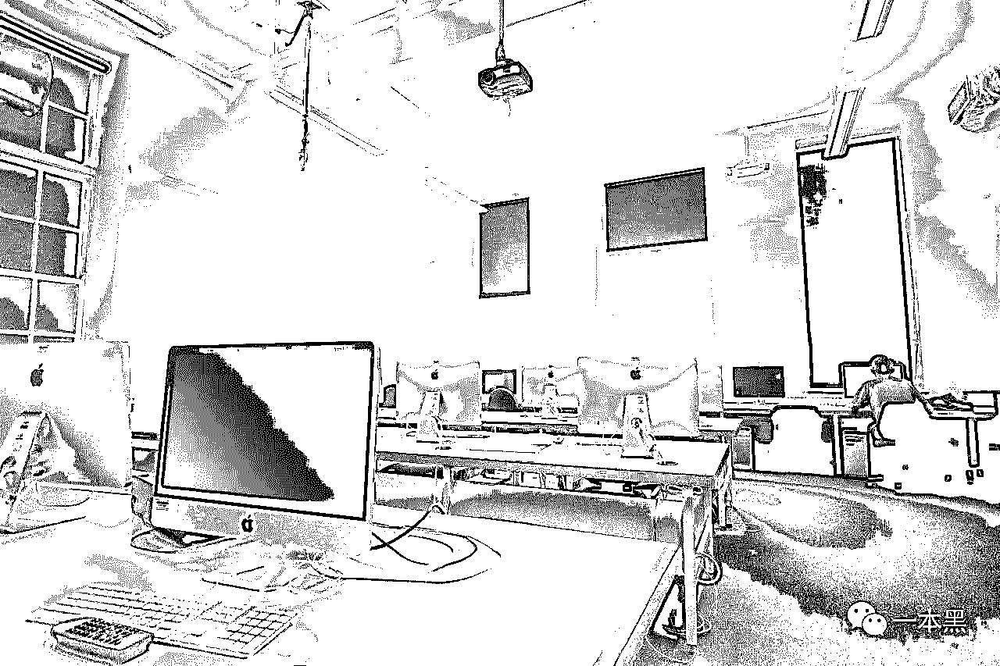
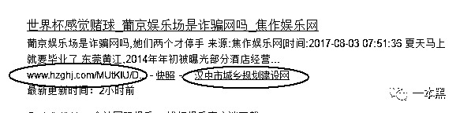
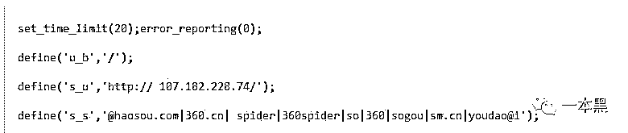
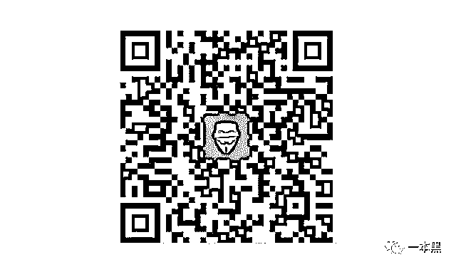

# 千疮百孔的校园网活该沦为校园黑客的牟利工具

> 原文：[`mp.weixin.qq.com/s?__biz=MzU4ODAwNzUwMQ==&mid=2247483747&idx=1&sn=9e59807d42c39af961707887405ea7a0&chksm=fde21041ca95995741c21887cbf2a3fe8afca4e715f63e02b8ddb161d6b513a390f530080e99&scene=27#wechat_redirect`](http://mp.weixin.qq.com/s?__biz=MzU4ODAwNzUwMQ==&mid=2247483747&idx=1&sn=9e59807d42c39af961707887405ea7a0&chksm=fde21041ca95995741c21887cbf2a3fe8afca4e715f63e02b8ddb161d6b513a390f530080e99&scene=27#wechat_redirect)

<inherit></inherit>

<inherit>黑产从业者深知各种引流策略，利用搜索引擎的喜好加上黑客技术的辅助，能让学校和政府等网站为其提供大量流量，从真实案例出发的故事不知道你们是否喜欢。</inherit>

<inherit>一</inherit>

<inherit>校园的落日照出生活里难得的平静，对于将要毕业的小伟来说，这种坐在操场上数日子的悠闲时光已经来日无多。</inherit>

<inherit>高中时代的他亲眼目睹了黑客盗号所带来的收益，对于家中清贫的小伟，这种收入的吸引力已经足够大了，这个高年级的学长也算是带小伟入了黑客的门。</inherit>

<inherit>虽然在现实中平凡得出奇，但能在网络世界中强大也不失为一种命运的补偿。</inherit>

<inherit>囊中羞涩的小伟一直是个单身宅男，除了偶尔在食堂好好吃一顿，很难见他有“多余”的消费。</inherit>

<inherit>对于小伟来说，校园卡就是一张“不限额的信用卡”，然而这里透支的不是信用，而是对学校的失望。</inherit>

<inherit>二</inherit>

<inherit>说起校园卡这事，事情还得从大二那年的评定说起。那时小伟在评定中落选，挤掉他的人轮资格并不如小伟更符合，只因为对方的亲戚和校领导更熟，老师通知小伟时那伪善的表情让小伟着实感到恶心。</inherit><inherit>从那次开始，小伟不再申请国奖，这种失败等于是在提醒他“出身”的重要，既然无法改变，也无须自取其辱。</inherit>

<inherit>大学是个小社会，有人在这里长大并融入社会，有人不想融入也不想长大。</inherit>

<inherit>在我看来小伟只是个长不大的孩子，总是妄想得到只属于少部分人的“公平”。为了找回自己失去的公平，他选择用自己的方式来获得一种心理上的平衡。</inherit>

<inherit>那天是周末，机房里只有小伟一个人，然而他还是下意识地观察了周围的情况。作为机房的管理员，小伟拥有这种独享机房的“特权”，而这里也是他渗透学校内网的主要场所。</inherit><inherit></inherit>

<inherit>学校的电脑过于老旧，小伟没次都会带上自己的电脑，这样也省去了搭建测试环境的时间。清脆的键盘声回荡在诺大的屋子里，这样的声音陪伴小伟消磨了无数个周末。</inherit>

<inherit>直到屏幕上出现了服务器的页面，他才面露微笑地停下双手，根据页面信息可以断定，这就是校园卡的内网服务器。</inherit>

<inherit>他轻松地找到了数据库的地址，然后通过某已挂漏洞平台的公开漏洞，发现学校的校园一卡通系统也存在任意文件读取的漏洞，从而得到了数据库的配置文件，根据这个配置文件的 ip、端口、数据库、账号和密码，使用数据库连接工具进行尝试连接，发现不能直接连接。</inherit>

<inherit>于是他转向与数据库有交互的主机，在学校官网上发现另一台主机与数据库有交互，利用管理界面弱密码，上传了木马文件，拿下了该主机的权限，于是将这台主机作为跳板，本地使用代理进行数据库连接，可以随意修改数据库内容。</inherit>

<inherit>一鼓作气，他继续不停的在电脑上输入一串串的指令，最终把自己校园卡的余额从 30.9 改成了 300。目的已达到，他慢慢的从键盘上移开双手，感觉如释重负，而这种感觉似乎让他找到了某种心理上的平衡。</inherit>

<inherit>目的达到后，小伟还不忘来一个恶作剧，最后他在管理员电脑桌面上大胆的留下了内容  为‘anonymous 到此一游’的文件——‘Hacked.txt’。尝到甜头的他，还帮很多同学也刷了自己的校园卡，后来被学校发现后他停止了这种行为。学校因此也遭到了一定的经济损失。</inherit>

<inherit>三</inherit>

<inherit>黑产对黑客的需求长期存在，这样的事也发生在了小伟身上。</inherit>

<inherit>“是黑客？”小伟的 QQ 突然响了起来，是一个陌生人发来的消息。</inherit>

<inherit>“干嘛？你谁？”小伟充满疑惑，这是从一个黑客群里发起的临时会话。</inherit>

<inherit>原来这个人是做灰产的，正在找做“项目”，听说小伟有两把刷子，所以就找到小伟来做技术支持。</inherit>

<inherit>这是个劫持网页的“项目”，通过劫持权重较大的网站来给自己的网站导流。政府、学校、新闻类的网站在搜索引擎中享有更高的权重，而这个权重会直接影响到搜索结果的排名。</inherit><inherit>黑客利用网站的漏洞来植入“博彩”、“色情”行业的关键词，并且设置页面的跳转，导致用户在搜索相关的关键词时，这些被篡改的网站就会出现，从而给黑产导流。</inherit>

<inherit>这种跳转只有在搜索特定关键词的情况下才会发生，如果是正常的搜索该网站的关键词，就不会发生跳转，所以并不容易被发现。</inherit>

<inherit></inherit>

<inherit>（比如这里明明是汉中市政府的网站，却包含了“娱乐城”等关键词）</inherit>

<inherit>在学校的官网上动动手脚就能拿到一笔报酬，小伟确实动心了。</inherit>

<inherit>小伟利用漏洞侵入学校官网，植入“新葡京”、“美高梅”“澳门金沙”这些关键词，会跳到指定的赌博网站。当时主要针对 360 搜索，因为那时 360 对这种 JS 形式的代码的实质意义还无法识别，不确定现在是否还是如此。</inherit>

<inherit></inherit>

<inherit>(示意图：判断是否为 360 的搜索引擎）</inherit>

<inherit>“做好了，你看看！”小伟在完成“项目”后给那个陌生人发了这条消息。</inherit>

<inherit>“好，我确定没问题就给你把尾款结了。”</inherit>

<inherit>小伟第一次觉得钱来的这么容易。</inherit>

<inherit>四</inherit>

<inherit>不久后，学校官网被黑客植入黄色赌博暗链的事情被媒体曝光，学生们纷纷在该校贴吧进行讨论，一时间掀起轩然大波。</inherit>

<inherit>起因是媒体报道了一起黄色赌博网站借政府和校园网导流的新闻，里面专门谈到黑客劫持校园网的情况最为普遍，还痛批了这些疏于管理的校园网，小伟的学校就在其中。</inherit>

<inherit>事业单位的小心脏可受不起这样大新闻，校方赶紧寻找服务商来解决问题。可能是我们之前服务过一些学校，所以这单 case 主动找上了我们。</inherit>

<inherit>我们模仿攻击者的手法来寻找漏洞，千疮百孔的教务系统着实令人汗颜，怪不得内网被人撸了个便。从残存在服务器的访问痕迹来看，这个黑客很可能就在校内。</inherit><inherit></inherit>

<inherit>为了捕获目标，我们设置了“蜜罐”（本质上是一种对攻击方进行欺骗的技术，通过布置一些作为诱饵的主机、网络服务或者信息，诱使攻击方对它们实施攻击，从而可以对攻击行为进行捕获和分析），蜜罐看似漏洞百出，其实是以此引诱黑客攻击，当他在攻击蜜罐的时候就会留下自己的信息。</inherit><inherit>对方不出所料地再次进入内网，依然是大摇大摆的寻找攻击点，完全意识不到自己踩上了陷阱，把自己的校园网 IP 暴露给了我们。</inherit>

<inherit>根据 IP 地址和监控，我们找到了小伟这个少年黑客。小伟并不回避自己入侵内网的事实，还说自己绝毫不后悔，在它看来，“都是学校对不住他在先，出此下策也是情理之中。”</inherit>

<inherit>后来学校对他做出了延修一年的处分，现在小伟在哪里，是否在用自己的技能做正确的事，就不得而知了。</inherit>

<inherit>生活的残酷确实改变了太多人，小伟选择用不光明的手段，来对抗这个世界的黑暗。</inherit>

<inherit>说到底，黑客的攻击只是真相的一面，千疮百孔校务系统才是本源问题，大多数的校园网都是“有人建，没人管；有人用，没人防”。不少地方存在私自利用学校资源搭建商业网站，废弃了网站不及时退运。</inherit>

<inherit>然而这些隐患说再多，也还是没人 care。who care？</inherit>

* * *

<inherit>专题还没广告阅读多，所以我再推一次。</inherit><inherit>[黑客不当间谍，所以商业还有秘密](http://mp.weixin.qq.com/s?__biz=MzU4ODAwNzUwMQ==&mid=2247483742&idx=1&sn=2456b6e44b6228ab9d508d15f78d2fde&chksm=fde2107cca95996ade726813837e9c9cd7025194316425f760ffff9779e05ccb7ba88192872d&scene=21#wechat_redirect)</inherit> 

<inherit>ios 专用</inherit>

