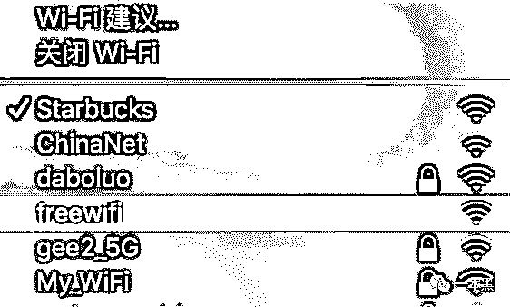

# 黑客不当间谍，所以商业还有秘密

> 原文：[`mp.weixin.qq.com/s?__biz=MzU4ODAwNzUwMQ==&mid=2247483742&idx=1&sn=2456b6e44b6228ab9d508d15f78d2fde&chksm=fde2107cca95996ade726813837e9c9cd7025194316425f760ffff9779e05ccb7ba88192872d&scene=27#wechat_redirect`](http://mp.weixin.qq.com/s?__biz=MzU4ODAwNzUwMQ==&mid=2247483742&idx=1&sn=2456b6e44b6228ab9d508d15f78d2fde&chksm=fde2107cca95996ade726813837e9c9cd7025194316425f760ffff9779e05ccb7ba88192872d&scene=27#wechat_redirect)

<inherit>一 </inherit>

<inherit>喝着咖啡上着网的人们不会想到，黑客可能就在坐在房间的角落，旁若无人地窥探着他们在网络上的一举一动。</inherit>

<inherit>面容精致的人总是享有别人的注视和优待，都怪门边的姑娘确实明媚，老师傅默默地和她的一上网，一边看着人家的微博、一边收集她的资料和联系方式。这个典型的技术宅，光凭分析别人的数据就能获得极大的成就感。</inherit>

可惜我讨厌无意义的劳动，所以他不会在我面前如此消遣。

<inherit>午后的咖啡馆是最能让我平静的地方。</inherit>

<inherit>街上穿梭着忙碌的上班族，身旁是农药不停的老师傅，阳光打在身上，照出了生活的平静。</inherit>

<inherit>不过今天来咖啡厅并非是为了偷懒，而是要测试我们的“钓鱼 wifi”。从来到这里开始，我们自己制作的热点就已经打开了，为了尽可能诱鱼上钩，wifi 的名字也是高仿。</inherit>

<inherit></inherit>

<inherit>（真正的星巴克 wifi 在列表下面）</inherit>

<inherit>我们在屋子的中央放置了 WiFi 热点，不设密码的 wifi 会被开启「无线网络」的手机自动连接，再配合这个以假乱真的名字，就算没有弹出星巴克的 wifi 登录页面，也没那么令人生疑。</inherit>

<inherit>闲时新来的客人并不多，所以连进来的设备也很少。</inherit>

<inherit></inherit>

<inherit>老师傅看着后台抓取到的数据说了句“设备太少，抓到的数据都没什么意思，不如我们改天早点来吧。”</inherit>

<inherit>认识了这么久，他那点小心思我都明白，不过就是想再蹭我一杯星冰乐。</inherit>

<inherit>“那就把星巴克的 wifi 打掉吧，让他们全连进我们的热点，数据够多了就拿回去分析。”我不想耽搁时间。</inherit>

<inherit>老师傅自知说不过我，默默的开始对星巴克的 wifi 进行 DDOS 攻击，这种攻击方式就是通过发送大量数据来让该设备超载，wifi 就会在这段时间里停止服务。星巴克的 wifi 才挺了不过十几秒就失去了连接，于是乎大量的手机和电脑开始涌入了我们的热点。</inherit>

<inherit>瞬间爆炸的数据已经让我们无从下手，只能回去先对信息降噪再进行分析。</inherit>

<inherit>经过对数据的分析和整理，我们拿到了大量浏览记录、社交网站的信息、朋友圈刷的图片等，对于个人信息的分析和利用我们之前已经谈了不少，这次我们更关注的是和工作有关的内容。</inherit>

<inherit>在分析出来的数据里我们获得了几个公司的后台地址，有些甚至包含了他的账号密码，这些已经足以导致公司敏感信息的泄露。</inherit>

<inherit>这次伪造热点用的设备名叫菠萝派（pineapple），这是一个可以将 4G 流量转化为 wifi 信号的设备，通过这个设备的后台可以监控接入设备所访问的网站、浏览的图片，发送的 cookie...</inherit>

<inherit></inherit>

<inherit>这个方法也有个很大的缺点，流量监控只能针对 http 传输的网站，而使用 https 加密传输的数据是无法被获取的，所以只能针对部分网站和 APP，而涉及信息敏感的网站绝大多数都是加密的。这点我在『链接』中阐述过了。鉴于现在一个密码走天下的人还那么多，截获一些小众 APP 的账号密码依然是有价值的。</inherit>

<inherit>二</inherit>

<inherit>上期我们复盘了一种防不胜防的 USB 入侵方法『链接』（具体的技术解释和防御策略我也在小密圈中分享了，等小密圈维护结束大家可以去看看），从过往案例分析，USB 设备的攻击多发于办公环境中，所以我们这次顺带谈谈黑客技术对商业机密的威胁。</inherit>

<inherit>从以往的经验来看，黑客以窃取企业信息来牟利的案子并不罕见。</inherit>

<inherit></inherit>

<inherit>黑客窃取股票的内部交易信息来牟利，所以基金、券商、上市公司高管都是黑客的目标。</inherit>

<inherit>当年红极一时的网络游戏「传奇」就是因为源代码被黑客窃取，所以才出现遍地的私服，迫使盛大只能用频繁更新游戏的方式来对付私服。网络公司的数据泄露也是屡见不鲜。</inherit>

<inherit>三</inherit>

<inherit>这次我们扮演了「商业间谍」的角色，背景则是一家做硬件的公司，渗透进内网获取资料便是我们的最终目的。</inherit>

<inherit>重研发的企业格外重视安全，耗资巨大的研发资料乃是科技公司生存的根基。这家公司的 CEO 是我的好友也是我们的客户，为了充分检验自己的安全程度，很乐意和我们来一次攻防游戏。</inherit>

入侵的地点就选在他的办公室，我让他留下以目睹整个过程。

藏好域名是保护内网安全的第一关，不给外人攻击的目标就是防御攻击的最好方式。然而不少公司的内网域名已经在外网暴露，且被搜索引擎收录。除了普通的搜索引擎，还有一种空间搜索引擎，被黑客常用来寻找和攻击目标一切有关的信息。

<inherit></inherit>

<inherit>（zoomeye，有兴趣可以查查它的功能）</inherit>

<inherit>有意思的是，黑客往往通过猜测就能找到后台的地址，比如在域名中加入类似 admin 这种单词就可以，这就是所谓的暴力破解。</inherit>

<inherit>看着我们的“三板斧”不奏效，朋友愈发的有自信，开始跟我谈论制定赌注。</inherit>

既然目标对内网入口的保护做的很好，我们只好先入侵先 wifi 再进入内网。无奈对方是有备而来，常见的弱口令和路由器漏洞都不存在。wifi 万能钥匙类的产品常被黑客利用，所以在办公场所内是禁止使用的。

<inherit></inherit>

<inherit>(用万能钥匙渗透京东的案例）</inherit>

眼看渗透一筹莫展，老师傅提出用更大胆的“非常”手段进行入侵。既然黑不进去，那就让员工来“告诉”我们密码。

<inherit></inherit>

<inherit>（大菠萝）</inherit>

大菠萝又再次派出了用场，这次我们把大菠萝伪装成了公司的 wifi，用大功率的网卡进行流量攻击，直接打掉公司里所有的 wifi。网络断开后，马上就有员工尝试连接我们的热点，大家对弹出的密码框没有多想，纷纷手动输入了 wifi 密码，这样我们就获取到五个不同的密码。五个密码分别属于五个无线网，公司虽然谨慎地做了网段隔离，将「生产网」/「工作网」/「访客网」分离，但是无奈密码全部暴露。

网段隔离可以禁止跨网段的访问，比如访客网络内不能直接访问工作网络的内容。根据用途来划分不同的网段，相当于是对工作内容和权限的划分。生产网络的使用者一般是开发人员和运维，对于大多数公司，这里包含了所有最敏感的资料。工作网络一般是公司所有人都可以使用的网络，而访客网络是专门提供给来访人员的。

当我们直接连入了以 DEV 开头的生产网络，朋友深知大势已去，安全的最大漏洞终究是人的意识。

公司内部的电脑普遍存在漏洞，只需要在局域网中扫描就可以找到一大堆可攻破的机器，甚至还有人连「永恒之蓝」漏洞的补丁都不打，企业重视外部安全远胜于内部安全的问题可见一斑。掌握了大量可被控制的机器，进入内网获取资料已经没任何问题。

除了 window 的漏洞，老旧的 office 同样是重灾区。我们用某个同事的邮箱向运维发送了一个伪装成 excel 文件的木马，在对方打开的时候，木马就已经利用 office 的漏洞控制了电脑。

安全漏洞的问题其实已经老生常谈，之前大肆泛滥的「wnna cry」利用的就是永恒之蓝这个漏洞，然而微软早在两个月前就已经发布了安全补丁，只是用户不重视而已。

既然漏洞是黑客攻击的重要入口，如果能够拿到别人所不知道的高危害漏洞，那么就可以悄无声息的进行大规模打击。这种只要极少人知道且还未被官方修复的漏洞被称为 0day，为了攫取利益，黑市里常有贩卖 0day 的例子。

<inherit></inherit>

这是一个 0day 的交易平台，价格、危害、利用的场景都一一列出，方便黑客选择自己需要的漏洞。

站在攻击者的角度看，除了极个别防护策略十分复杂的厂商以外，绝大多数公司的网络安全都是千疮百孔，人员的安全意识也十分薄弱，黑客有无数种方法可以制胜于千里之外。对于人数越多的公司，人员安全的管控也就更加困难。如果商业间谍都能花心思学跟黑客学两招，不知道还有几个企业能守住自己的“秘密”。

<inherit>在安全领域，百密一疏的例子实在见得太多，除了一些不可控因素，更多的还是用户的不重视或不思考。庆幸很少有黑客从事商业间谍，不然天下生意都没有了秘密。</inherit>

为了回避真正的思考，人们愿意做任何事。

* * *

IOS 用户的赞赏通道

