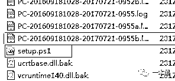
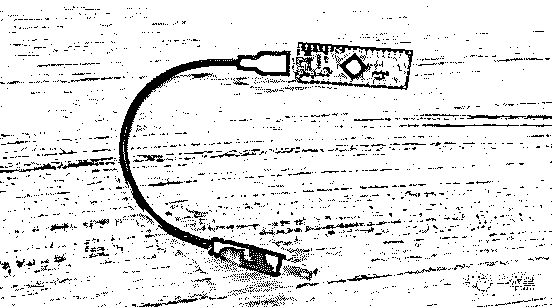
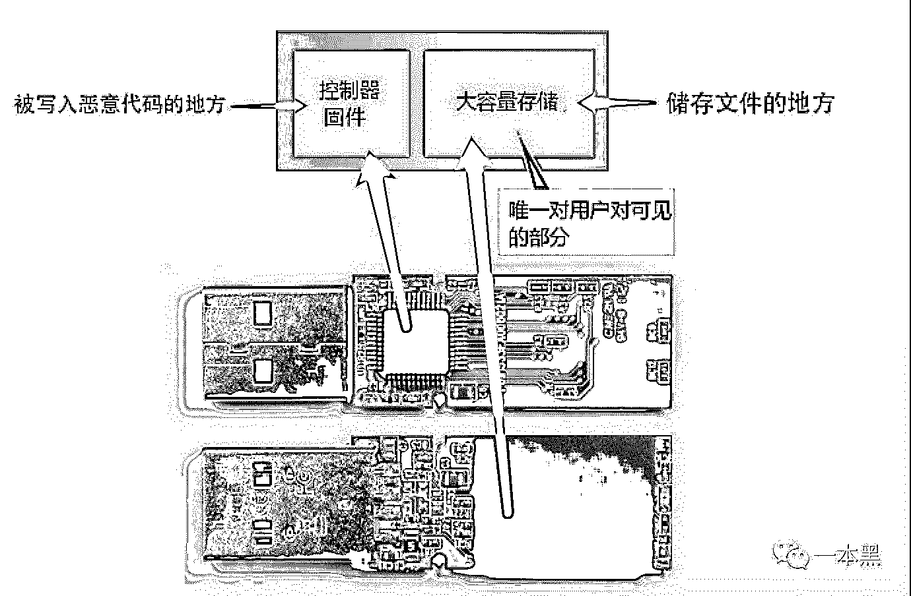
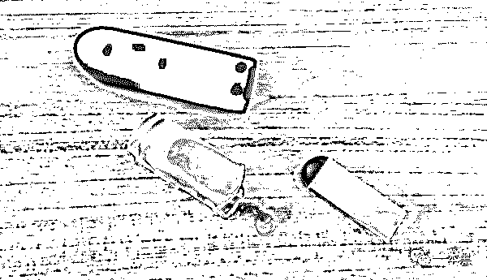
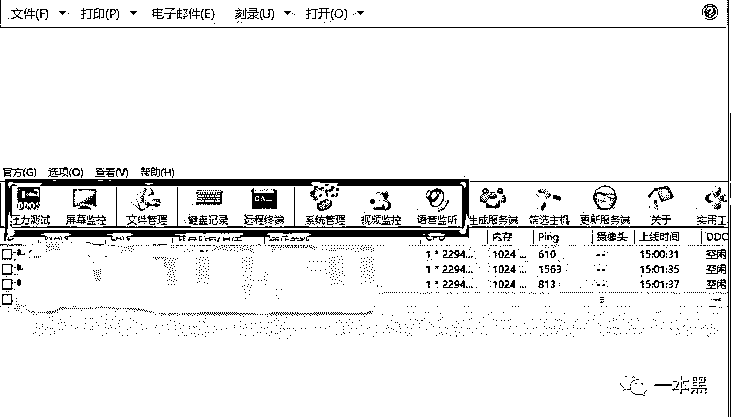
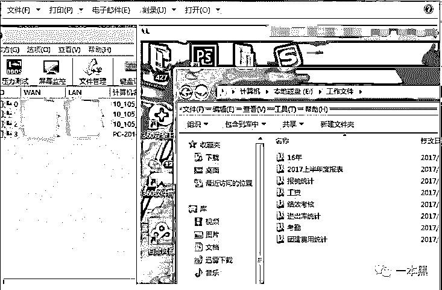
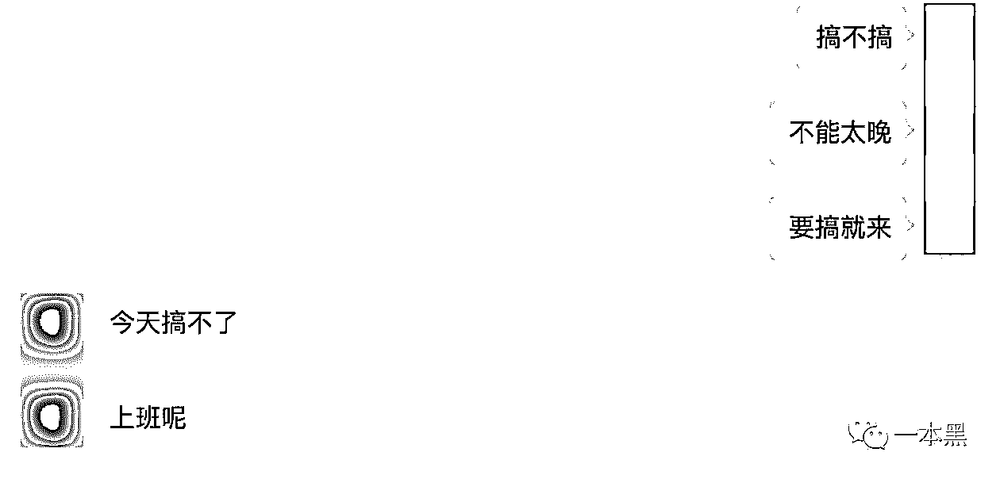
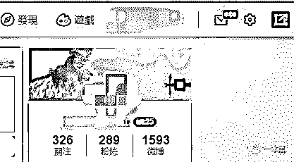

# 复原：一种防不胜防的 USB 攻击方式

> 原文：[`mp.weixin.qq.com/s?__biz=MzU4ODAwNzUwMQ==&mid=2247483733&idx=1&sn=3643b0595d054f98498590c95827352a&chksm=fde21077ca9599613914f570709d638e4e6bb3aab9dce4a1ba709a8c5e1855bd502fd6c32989&scene=27#wechat_redirect`](http://mp.weixin.qq.com/s?__biz=MzU4ODAwNzUwMQ==&mid=2247483733&idx=1&sn=3643b0595d054f98498590c95827352a&chksm=fde21077ca9599613914f570709d638e4e6bb3aab9dce4a1ba709a8c5e1855bd502fd6c32989&scene=27#wechat_redirect)

<inherit>在踏入安全圈之前，我的日子平静如水。</inherit>

<inherit>自从入了安全圈，我就成朋友眼中计算机怪人，自此以后，修电脑、求资源之类的事儿都不会忘了我...</inherit>

<inherit>“我真不会这些。”看着朋友们期待而来，失望而归的表情，我想，我大概是个假黑客吧。</inherit>

<inherit>一天，一个朋友找到我。朋友是一个在圈里小有名气的设计师，已经很久没联系了，突然发信息过来，开始还以为是这哥们儿要结婚，又该准备份子钱了。</inherit>

<inherit>**一**</inherit>

<inherit>“你是在搞网络安全吗？有个事儿想请你帮个忙。”</inherit>

<inherit></inherit> 

<inherit>没等我推辞，朋友就跟我说了，他电脑里的文件被加密了。里面有他最近在做的一个很重要的项目，准备很长时间，现在文件却突然打不开了，自己也没有备份。眼看着要交付了，万般无奈下才来向我求助。</inherit>

电脑出现了中毒的症状，希望我可以帮他把电脑救回来。

<inherit>朋友表示，自己用电脑也是有常识的，从来不会去点击来源不明的链接，也没上过什么“不该上”的网站，杀毒软件也装了，所以没那么容易中毒。</inherit>

<inherit>我看了一下，打不开文件是因为文件被加密了（AES 算法），采用这种算法加密文件，必须用其对应的密钥才能解开，这样看来我也爱莫能助。</inherit>

<inherit>我决定帮他找出问题的来源。经过排查，我在 C 盘的某个目录下发现了一个 powershell 脚本。</inherit>

<inherit></inherit>

<inherit>（红框部分就是一个 powershell 脚本）</inherit>

脚本里的代码是从指定服务器里下载文件，这很可能是个攻击脚本。不仅如此，这个 powershell 脚本还做过免杀处理，所以杀软也无法检测。从过往经验来看，这种攻击脚本大多都是靠 U 盘等外接设备传播。

<inherit>“最近电脑有没有借给别人用过，或者有没有用过陌生的 U 盘？”我问他。</inherit>

<inherit>“有过一次，就在前几天，有个同事拿他的 U 盘过来找我拷资料，奇怪的是明显示装了驱动，却读不出内容，我以为是 U 盘的问题，就让他换个 U 盘。但之后再拷文件时，却发现都打不开了，之后重启几次也没用。”</inherit>

<inherit>问题应该就在这个“U 盘”上，听起来很像是类似 rubber ducky（业界称为橡皮鸭）的设备给他的电脑植入了一段恶意代码，这段代码会自动下载一个木马，木马再对其文件进行加密，之后木马会执行把自己删掉，所以用杀软扫描也是一无所获。</inherit>

<inherit>橡皮鸭可通过 USB 接口连接电脑，且体型小巧，所以适合伪装成 U 盘进行攻击。</inherit>

<inherit>“所以是那个 U 盘的问题吗？那他是怎么把病毒弄到我电脑来的？”朋友突然醒悟过来。被一起工作的同事暗算，他又惊又恼。</inherit>

<inherit>问了下他被暗算的原因。朋友犹豫了一下，没讲什么，不过看得出他现在心里跟明镜似的。</inherit>

<inherit>相比二流国产剧的情节，我更想去自己去验证下这种攻击方式。虽然理论上可行，不过在我所知的案例中，还没有出现过这种攻击实例。</inherit>

<inherit>**二**</inherit>

<inherit>其实这个问题并不复杂，所有的 USB 设备都有一个微控制器芯片，作为设备与计算机之间的接口。而这个芯片上的固件可以被重新编程甚至植入病毒。而且，BadUSB 可以轻松绕过防病毒软件，所以极难被查觉。</inherit>

<inherit>这只是一种攻击的途径，目的可以有很多种，危害的程度也可大可小，危害完全取决于攻击者。</inherit>

<inherit>我决定以一包辣条的代价，请老师傅出山，为大家复原一次用 USB 设备植入病毒的过程。</inherit>

<inherit>首先，作案前需要有一个可以被重新编程的 USB 设备，在某宝上，几十块钱就买到一个，简直是居家旅行黑人电脑的利器。</inherit>

<inherit></inherit>

<inherit>我在网上找了张图，简单给大家介绍一下这个设备。在蓝色的板子上，一面是存储器，一面就是控制器固件，也就是被写入恶意代码的地方。恶意代码会在电脑安装该 USB 驱动的时候自动运行，这时它会模拟键盘或鼠标操作，自己编写 powershell，这个过程可能转瞬即逝，整个过程都不会被杀软报警，所以极难察觉。</inherit>

<inherit></inherit>

<inherit>货到手后，老师傅先生自编一段 powershell 代码，然后将这段代码植入设备，插入电脑后，就可以自动执行指令，将病毒植入到电脑。</inherit>

<inherit>本以为一插就怀孕，结果什么也没发生。。。</inherit>

<inherit>“不应该啊！”老师傅没想到，自己也有翻车的一天。</inherit>

<inherit>“卧槽！我怎么没想到这茬！”老师傅一阵苦笑。</inherit>

<inherit>其实是电脑的输入法默认输入中文，所以没能完成植入。原来老师傅的克星，不是杀软是输入法！</inherit>

<inherit>既然找到了症结所在，那就问题也就迎刃而解了，只要在前面设置一个大写锁定的指令，后面的指令就可以进行正常操作了。</inherit>

<inherit>植入代码后，老师傅就可以对这台电脑为所欲为了。</inherit>

<inherit>三</inherit>

<inherit>利用外部连接的硬件设备进行病毒传播的手段并不新颖，早在软驱时代，这就是传播病毒的主要方法。随着互联网的发展，利用网络传播才渐成主流，以至于很多人逐渐淡忘了 USB 可以传播病毒，所以会放松警惕。</inherit>

<inherit>我们来做个实验，看有多少人会中招。</inherit>

我就近在星巴克和 kfc 放了五个已经植入攻击代码并伪装成了 U 盘的设备，一旦被人插入电脑，可以在短短几秒内植入木马，远程操控、实时监控也就不在话下了。

<inherit></inherit>

<inherit>（太小的 U 盘是不行的，图片就是意思一下）</inherit>

<inherit>结果是有三个人中招，电脑感染木马后，我们可以监控屏幕、操纵摄像头等操作。</inherit>

<inherit></inherit>

<inherit>屏幕监控</inherit>

<inherit></inherit>

<inherit>可以看出对方应该是个财务，我们完全可以获取这些资料并且掌握该公司的人事和财务状况。</inherit>

和男友很直白的交流。。。

<inherit></inherit>

通过监控屏幕和记录键盘敲击，经过分析后我获取了对方的对方的微博账号和密码，并登录了她的微博，发现这个微博账号关联了淘宝、知乎等账号。所以登陆了微博就可以“快捷登录”其他关联的账户。如果她还是那种“一个密码走天下”的人，那么她的个人信息和财产就完全没有安全可言了。

<inherit></inherit>

还好，她遇上的是我们这些有（mei）良（dan）知（zi）的黑客，实验点到为止，没有再往下挖了。

<inherit>讽刺的是，我发现这三个人里还有一个是科技公司的运维，可见即使是有计算机常识的工程师也缺乏必要的安全意识。一个早已被用烂的病毒木马传播方式，依然能让不少人中招。</inherit>

<inherit>四</inherit>

键盘、鼠标、充电宝等，都可以被植入恶意代码，加上计算机外高度依赖 USB 外接设备，以至于这种攻击方式成功率极高。也许就是上个洗手间的工夫，电脑就可能被人入侵，一举一动完全暴露在别人的眼皮子地下。

<inherit>黑客从来只黑有价值的人，如果你觉得自己很安全，那只是你缺乏被黑的价值，这句话毫不夸张。在商业领域，矛与盾的较量从未间断。</inherit>

<inherit>在科技领域，为保密或窃取研发资料所产生的博弈从未停止。例如华为这种极重研发的公司，投入重金的研发资料一旦泄密，其造成的影响是不可估量的。在巨大利益的诱惑下，不少猎手都对其跃跃欲试，让华为不得不网络层还是硬件层，都投入了极高的防护成本。</inherit>

<inherit>但如果从企业的员工身上着手，会不会取得成果呢？我们想试试。</inherit>

<inherit>所以我们策划了一本黑有史以来的第一次户外渗透实验，直接瞄准业内的知名科技、互联网公司，从攻击者的角度来看看大公司员工的安全意识究竟有多高？</inherit>

前段时间调整了小密圈的门槛，用来过滤掉一部分不必要的杂音。一开始并没有打算招太多的人进圈，初衷也只是想作为一个“引路人”，帮助更多对安全感兴趣的人。

只欢迎真正想学习交流安全技能的朋友入圈。 

希望通过黑产信息来赚钱的人就不要进来了。

<inherit></inherit>