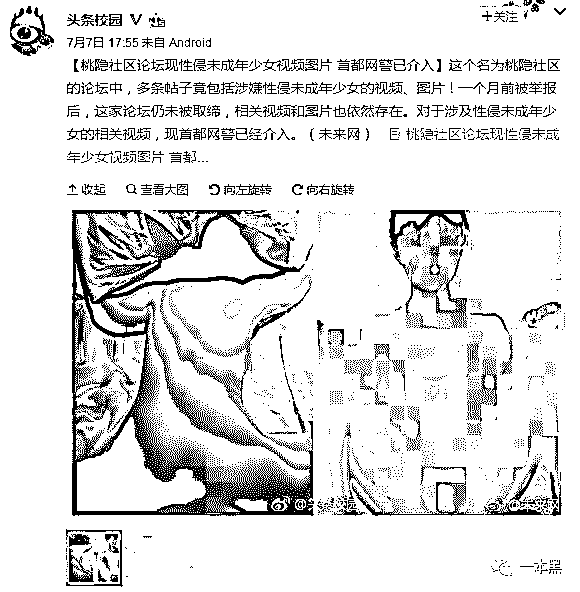
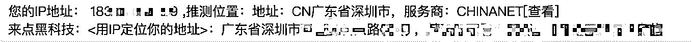
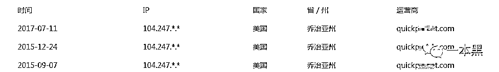

# 那个把“少女”变成“女人”的人，谁来管管

> 原文：[`mp.weixin.qq.com/s?__biz=MzU4ODAwNzUwMQ==&mid=2247483730&idx=1&sn=b3d95ea52d805eea512f9f6e7ba6574f&chksm=fde21070ca95996654363ab5de0c97a72ec8a9914b7adc080e29430bcc9daa5c371fa23ff3bb&scene=27#wechat_redirect`](http://mp.weixin.qq.com/s?__biz=MzU4ODAwNzUwMQ==&mid=2247483730&idx=1&sn=b3d95ea52d805eea512f9f6e7ba6574f&chksm=fde21070ca95996654363ab5de0c97a72ec8a9914b7adc080e29430bcc9daa5c371fa23ff3bb&scene=27#wechat_redirect)

文/一尺（微信公众号：一本黑）

【一本黑】媒体或商业转载必须获得授权，个人转发朋友圈无需授权。

读完需要

13 分钟

速读仅需 8 分钟

* * *

前几天刷微博的时候，刷到这么一条：

<inherit></inherit>

众所周知，网络上的不雅视频和艳照有相当大的比例是作者自己上传的，这种现象或许大家早已见怪不怪。因为图中被侵犯的是未成年人，所以这条微博下面的评论都是在呼吁网警把视频作者找出来。

说到裸照被人发上网，我想到老师傅跟我说过的一个奇葩经历。

几年前，老师傅还处于意气风发的学生时代，一时贪玩就黑进了一个黄网，没想到直接把数据库脱了下来，在这些数据里，他看到一个熟悉的 ID，经过反复验证，确定这个人就是自己身边的朋友——他把自己女友的图片发到了这个社区！

<inherit>看到自己熟悉的身边人，被赤裸裸地挂在网上，供人浏览取乐。打那以后，老师傅每次看到他们俩就联想到一些奇怪的画面。私生活被分享到黄网，而女生还一无所知。难以想象，如果是口风不严的人看到，将使女孩面临哪般窘境。</inherit>

我不知道还有多少人看过这些图片，这些人里会不会有人认识女孩。如果有，他们又会如何看她，有没有给她的生活造成困扰。

在网上发隐私照片的人，动机大致有三种

1、炫耀。一些人为了显示个人魅力，猎艳后把这些东西在网上分享，以满足个人的虚荣心。

2、报复。可能是情侣分手后，出于报复心理，把他们的私生活公之于众。

3、利益。这个就属于黑产的问题了，因为黄网的盈利方式很重要一点就是广告，为了尽可能吸引流量和留住“客户”，就需要持续更新内容，网站会向发布者提供一定程度的报酬，还有人以此谋生，在宾馆、公厕安装摄像头进行偷拍，以向黄网出售图片和视频获利，甚至还有专门的组织，互相交换“资源”，形成一条完整的“产业链”。或许日后会专门就此做一个专题，专门扒一扒这个事儿。

大家都知道，在网络上发布政治敏感的内容很容易被查水表。既然如此，发布淫秽色情或者是其他违法信息，应该也是可以被找到的。

**网警是怎么找人的？**   

前一阵子，《人民的名义》大火，那个经常在网上说些“不该说的话”屡次三番被请去喝茶的“郑乾”给人留下深刻印象。那郑乾初犯的时候，警察是怎么找上门来的？

在现实场景中，如果发生了什么案子，警方首先要做的就是封锁和保护现场，然后通过现场遗留下来指纹、凶器等信息，抽丝剥茧，一步步缩小嫌疑人的范围，找出最吻合的那个。

在网上也是如此。在网上发布过任何信息，都会留下痕迹，警方就可以通过分析、跟踪这些痕迹，警方可以通过逆行追根溯源查的方法，找到信息的发布者。

其中，IP 是一个非常关键的线索。

IP 是运营商给用户的一个上网地址，相当于收发信件的门牌号，是具有唯一性的，所有用户的上网都必须使用到 IP。在网上发布内容时，发布者的 IP 地址会被网站的服务器记录下来，这就是警方寻找目标的最重要线索。

网警只要从用户发布内容的网站入手，调查用户发帖时的 IP 地址，然后根据这个 IP 地址，就可以确定发帖人所在地区以及运营商。最后在运营商的服务器里，找到这个 IP 所对应的用户地址。

<inherit></inherit>

用我的 IP 地址做例，可以定位到具体到小区，如果是运营商的定位，则可以定位到是哪户。

假如你在百度贴吧发帖子，只要在百度的服务器里查数据，就可以获取你发帖时的 IP 地址，再找运营商查询与之对应的实际地址。

假如是利用公共场所的网络发帖呢？对于这种情况，网警也会利用 IP 地址确定位置，再根据发帖时间，调取那一时间内该地点的监控录像，同样可以找到发帖人。

所以，简单来说，要找到发帖子的人，大概是这三个步骤：

  1、查询发帖人的 ip 地址

  2、通过网络运营商查询到该 ip 对应实际位置地址

  3、去该该地址找人

**如何对抗追查？  **

<inherit>明白了警察是怎么找到造谣生事的郑乾，也就明白了网警破案的逻辑。无论是网络诈骗，还是发布违规内容，追查的方法也都是如此。</inherit>

当然，搞黑产的也不会这么坐着等警察上门来抓，他们会采取手段来保护自己。

比如说，用假 IP“骗”过警察。

既然知道 IP 地址会暴露自己的位置，所以，他们会通过挂 VPN（虚拟网络）的方式上网，这样服务器里会留下假的 IP 地址。比如在深圳上网，网站服务器里显示的却是来自台湾的 IP。但警方可以对这个假 IP 进行回溯，找到 VPN 的提供方，从而查询在那个特定时间点，是谁用了这个“假”IP，而这个人的真 IP 又是什么？

不只是发布违法内容，黑客入侵网站也会在服务器里留下自己的 IP 地址，所以他们会使用多层 VPN 来提高追查的难度。这种方法虽然可以增加追查的成本，但是如果警方逐层回溯，依然可以找到目标。

既然 IP 地址是命门，那黑客是否可以抹掉这个线索？

理论上黑客可以黑进服务器，擦除自己的访问痕迹（尤其是 IP 地址）。不过一般来说，平台都会不断同步内网和外网的数据，把服务器里的数据存进内网。黑进内网的难度奇高，想抹除里面的数据几乎是不可能的。所以，从技术上来说，任何人的任何操作都是可以被追踪到的，只是看有没有必要或者成本是不是太高。

所以，并不存在绝对安全的方法，会不会被抓到，只是取决于警方的态度。

近年来有许多网络犯罪，例如诈骗、传销之类的，最后都不了了之，很大原因是其危害不够大，涉案金额也不够多，还不足以驱动警方付出相应的追查成本。这就导致许多不法份子逍遥法外，在一定程度上纵容了网络犯罪。

**黄网，为什么打不绝**   

为什么黄网总是屡禁不止？

是否可以抓到在上面肆意传播各种性侵、偷拍视频的人？

这两个问题都指向了一个答案。

因为许多色情网站的服务器都是在境外的，而在这些国家，色情网站并不违法。这些国家也就成了色情网站的温床，其中，海外最大的色情网站基地就在美国，不少黄网都是用的美国的服务器，随手打开一个黄网，查了下它的 IP，也是在美国的。

<inherit></inherit>

由于中美两国在法律上存在差异，加上跨国办案的协调问题，往往只能对其域名进行查封，但是黄网永远是打一枪换一个地方，备用的域名有很多，所以不打掉服务器就不能真正消灭一个黄色网站。

拿最知名的某 91 社区来说，尽管屡被封杀，但是换个网址又出来了。因为服务器只要在，即使域名被封也还有大量的备用域名。

说回这次桃隐社区里未成年人的性侵视频，不只是现在，未来也还会出现类似的事件，恐怕最后大多是不了了之。

世界上有些不公，在于不是所有的善，都能被传扬，不是所有的罪恶，都会得到惩戒。这，才是最让人无力的。

永远不要以为黑产离自己有多远，在这个世界上，总有阳光照不到的地方，滋生着种肮脏的交易，如果人人都视而不见，那黑暗就永不为人所知晓，肮脏也将继续滋生，直到将魔爪伸向我们身边的人，吞噬掉我们的生活。做这篇专题，一是想让大家知道，世界上没有绝对保险的技术，能让为恶者逍遥法外不受监控，不要心存侥幸心理；但另一方面，现实状况也的确存在一些无奈，期待日后可以有办法解决。

* * *

IOS 用户赞赏专用

更多阅读：

[深究号称能触达数亿用户的群控产业链](http://mp.weixin.qq.com/s?__biz=MzU4ODAwNzUwMQ==&mid=2247483722&idx=1&sn=184c939b780e2cb0bc1bbf3dc7ca4889&chksm=fde21068ca95997e7ab55363f1f701ebf34014d0d3d5a76dc464ce9740e3352475ff47a9868c&scene=21#wechat_redirect)

[黑客世界的大门已经敞开（小密圈入口）](http://mp.weixin.qq.com/s?__biz=MzU4ODAwNzUwMQ==&mid=2247483725&idx=1&sn=9d29f365fc9e020529e933eefdd6971d&chksm=fde2106fca9599792cd5cb603af2d3af4afdc4ba7f2913bc7cdbe98cfa464565437ca139beef&scene=21#wechat_redirect)

今天已是小密圈内容分享第三期