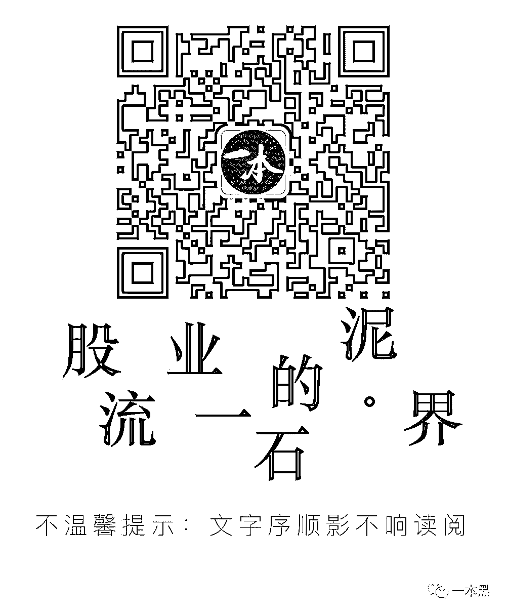

# 深究号称能触达数亿用户的群控产业链

> 原文：[`mp.weixin.qq.com/s?__biz=MzU4ODAwNzUwMQ==&mid=2247483722&idx=1&sn=184c939b780e2cb0bc1bbf3dc7ca4889&chksm=fde21068ca95997e7ab55363f1f701ebf34014d0d3d5a76dc464ce9740e3352475ff47a9868c&scene=27#wechat_redirect`](http://mp.weixin.qq.com/s?__biz=MzU4ODAwNzUwMQ==&mid=2247483722&idx=1&sn=184c939b780e2cb0bc1bbf3dc7ca4889&chksm=fde21068ca95997e7ab55363f1f701ebf34014d0d3d5a76dc464ce9740e3352475ff47a9868c&scene=27#wechat_redirect)

文/一尺（微信公众号：一本黑）

【一本黑】媒体或商业转载必须获得授权，个人转发朋友圈无需授权。

读完需要

15 分钟

速读仅需 11 分钟

小密圈的事不要催啦，团队策划的差不多了，过两天就会和大家见面。

感谢为本期内容提供爆料的读者。

* * *

道高一尺，魔高一丈。即使魔高于道，亦以一尺之道，斗一丈之魔。我是一尺，一本黑新小编，很高兴认识让你认识我。

夜晚站在阳台，俯瞰妖都。灯火阑珊，夜色撩人，车水马龙，人如蝼蚁。世界真大，我好孤独。

朋友圈里一如既往地热闹，精彩的生活都是他人晒出的幸福，除此以外就是从不缺席的广告、鸡汤文。

圈里冒出的女性好友，看头像，只见皮肤白皙，衣着暴露、身材姣好。在这撩人的夜色中，显得更加撩人。

不知道这些陌生人什么时候与我成了“朋友”。

诱人的头像，不菲的收入，多彩的生活，时不时地打广告、发鸡汤。

不寻常的事总能调动我的神经。因为，或许我又可以挖点什么了。

小的时候，有过这样的说法：电视上卖广告的，都是因为东西卖不出去，所以才要打广告。过了这么多年，人们对广告的认识不可同日而语，产品同质化越严重，广告就越发重要。随着网络时代的到来，流量成为了众人竞相争夺的要地。

智能手机进一步加强了人和广告的联系，我们不只是广告的受众也变成了广告的渠道。

背景就说到这

这次要讲的，就是那些躺在大家通讯录里、潜伏在各个群里、偶尔给你推荐各种产品的“陌生人”。这种有组织进行广告传播的微信号，就是“群控”。对于这个存在近十年的产业，各方的报道只是悬于表面，希望我们可以做到入骨三分。

**首先，这些号都哪来的？**

群控添加好友，分为两种，一种是「机器加粉」，一种是「人工加粉」。

**机器加粉**：成本最低、速度最快。原理是通过微信附近的人或者摇一摇、漂流瓶来添加好友，业内称之为「嗅探」。基于模拟定位工具，他们可以随意把自己的位置改成任何地方，借此就可以添加任何地方的人。为了提高通过率，群控会破坏微信的底层协议，达到改变好友来源的效果，把“附近的人打招呼”变成了“来自群聊”，以此掩人耳目。

这样做可以提高了粉丝质量和信任度，也比较容易获得通过，添加进来的好友里，有 50%会主动说话，询问是哪个群里添加的？

通过机器加粉，还有更暴力的「通讯录加粉」。群控在黑市买进大量的电话号码数据（这又涉及信息泄露的问题，不少 APP 在注册后都会请求读取通讯录并上传。

除此以外，运营商内部也会流出一部分号段。能获得电话号码的渠道实在太多）。拿到大量的电话号码后再导入通讯录。这时，群控便可以通过脚本做判断，寻找不需验证就可以直接添加的微信号。

只要网撒得够大，就能获取到足够多的好友。

但这种手段获取好友的质量往往比较差，所以流失率会比较高。

**人工加粉**能提高粉丝留存率。

人工加粉的主要是通过平台添加，比如在 58 之类的平台发布“低价”租房信息，让求租者加微信，加了微信，就会找“家人生病了”这样的借口，暂时不在当地，请晚一点，先留住粉丝。之后会和对方聊天交朋友，房子没租，关系倒是混熟了。

在这期间，会在朋友圈发些正能量的内容来获取认同，或者是证明自己是某个领域很牛的人物。这一招叫“价值输出”，目的就是建立认同感。

这样就和粉丝建立了真实的人际关系，把粉丝攥在了手里。这个手段还衍生出了赠送宠物等类似的方法。不难推测，这种方法很可能会衍生到各种 O2O 平台。

所谓：“自古真情留不住，唯有套路得人心，要想人心留得住，还得套路玩的深”，群控们为了获取粉丝，煞费苦心地设计套路。

还有一种人工加粉的方式，就是「群裂变」。在互加好友后，对方会用各种理由让你拉她进你的群，之后他会再拉小号，然后再加好友再进群，循环这个裂变的过程。一个微信可以加 500 个群，一个群满人 500，如果算平均一个群 200 个人的话，短短几天，群控一个号就可以触达 100000 人。

手里攥着粉丝，接下来就是变现。

**这么多粉丝，怎么变现？**

天下熙熙，皆为利来，煞费苦心弄了几千上万甚至 10 万+的号，其目的就是要以此获利，主要途径有三种。

第一种，就是自有产品的营销。

粉丝基数越大，就包含了越多的潜在消费者。这一手法常用于微商销售中，卖的东西五花八门，比较常见的就是各种面膜、护肤品、茶叶等快消品。有一些号也未必出售实物，可能是小黄片、裸聊等，至于付了费能不能达成交易，就不得而知了。。。

第二种，帮人打广告。

在朋友圈发文，附带销售链接、二维码等，替广告主引流。最典型的，就是淘宝客。淘宝客相当于淘宝店的推销员，通过其链接产生的购买，都能为其带来一笔佣金。方法可能是在朋友圈发淘宝口令/链接，或者拉群“派福利”，这种相信各位都有遇过，就不赘述。

第三种，大量圈粉，建立粉丝壁垒，形成巨大的流量池。

这样的群控，下的棋显然更大。在你看来似乎类型完全不同，毫无关联的公众号之间，通过群控这一手段，互相倒粉，共建共享流量池。也就是说，即使你取关了公众号 A，但还有一个与之有千丝万缕联系的公众号 B，这两个号为同一个群控主服务。有的群控就这样养着众多公众号，互相倒粉，用户想要斩断联系谈何容易。

据说许多参加 28 推新媒体大会的新媒体大号早年都是群控起家，不过现在还没有确凿的证据，所以只是猜测。

**群控，怎么“控”？**

群控的力量到底多厉害？爆料称，“可以触及所有微信用户”。

因为在巨大利益的驱动下，群控已经形成了一个完整的产业链。

从华强北为代表的手机市场大量购买二手手机，iphone4 200 元、iphone6 1200 元。购买苹果手机的原因是做群控，ios 比安卓更安全。

（利用软件，可以同时操控数百部手机）

再到获取公众电话号码数据，接着开发群控的系统，再穷尽各种方法吸粉，已经有了一个从硬件结合软件的体系化运作模式。

（为此我们黑进了后台）

拿软件来说，有专门的软件批发商可以提供，但也有很多群控为了充分满足自己的个性化需求和数据的安全，会投入几十万至上百万来自己研发。我们以粉丝提供的“云控系统”为例，这个系统可以管控设备、聊天、定位、发朋友圈，管理素材。

（随手一搜，就能找到许多群控系统的销售渠道）

**群控之路，未来如何？**

群控已不再局限于微信，QQ、陌陌，甚至 facebook，what‘s app 也在开发，大有进军海外市场的趋势。

然而就在前几天，许多做群控、微商的群里一片哀嚎——腾讯出手，一举封掉了群控手里七八成的微信号，群控们的生意，受到了前所未有的冲击，但要说群控就此绝迹，还为时过早。

（重拳之下，许多群控从业者也在思考出路）

就在去年的这个时候，群控也遭受了大规模的封号，与去年不同的是，今年腾讯不止将号封了，而且封了渠道和方法。群控赖以生存的利用黑市购买的手机号大量注册手机号的方法，已经行不通了，之前，许多境外号码被封后依然可以再次注册。但今年，境外号码被封也不能再注册。以前一张银行卡可以给多个微信做实名，如今已成为过往。

群控界的这次地震，是对行业的一次强力清洗。实力雄厚的群控，依然会在风雨过后东山再起，而实力较弱的玩家就可能一蹶不振。

其实此次受到冲击的，不止微信群控，这几个月以来淘宝打击淘宝客的力度也不断加强，百度更是一夜之间封了数万百家号，以养大量的号批量发文赚取稿费的机构，遭受重创。

群控只是一种工具、一种思路。这种思维可以应用的地方非常广泛，无论微信如何封杀，“类群控”的工具依然会存在而且不断进化。

* * *

* * *

