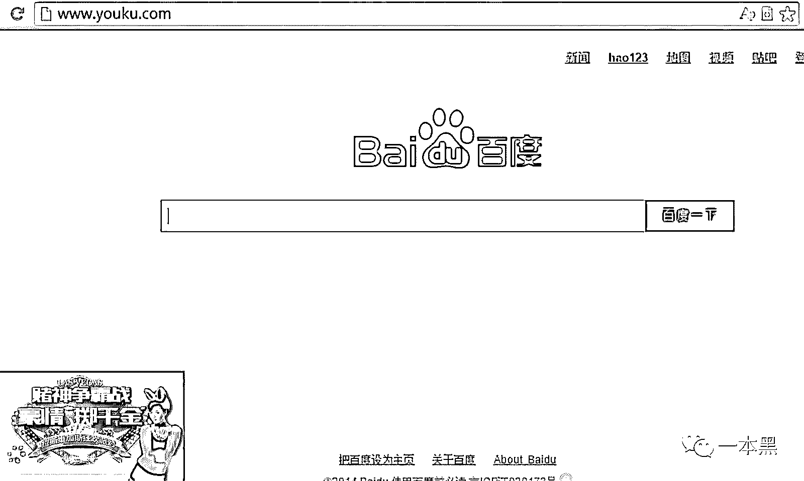

# 百亿劫持黑产，运营商拿了多少蛋糕？

> 原文：[`mp.weixin.qq.com/s?__biz=MzU4ODAwNzUwMQ==&mid=2247483719&idx=1&sn=f850b97f0c3f0c30ef01f3c0bbbaf274&chksm=fde21065ca9599738018f082ec7df5c5aea7387778750d312fb22589c82a4252956f5744e3a8&scene=27#wechat_redirect`](http://mp.weixin.qq.com/s?__biz=MzU4ODAwNzUwMQ==&mid=2247483719&idx=1&sn=f850b97f0c3f0c30ef01f3c0bbbaf274&chksm=fde21065ca9599738018f082ec7df5c5aea7387778750d312fb22589c82a4252956f5744e3a8&scene=27#wechat_redirect)

文/振宇（微信公众号：一本黑）

【一本黑】媒体或商业转载必须获得授权，个人转发朋友圈无需授权。

读完需要

13 分钟

速读仅需 8 分钟

tips：上周讲了下我们的经历，没想到大家反响这么大。我可能会建一个「小密圈」，把对安全知识感兴趣的人汇集起来，我们也过一过引路人的瘾~

* * *

<inherit>打开 A 网站时，展现的是 B 网站。（比如，你输入百度的网址，却得到了新浪的首页）这个叫「域名劫持」</inherit>

<inherit>（随手 P 了一张图，解释下这个意思）</inherit>

<inherit>当你登录一个“正经”网站的时候，边上就是些“不正经”的广告。这个叫「流量劫持」。</inherit>

<inherit></inherit>

<inherit>（示意图）</inherit>

<inherit>「劫持」的意思很简单，就是改变你所浏览网站的内容，可能是跳转到它指定的页面，或者是在网页里插进了它的广告。</inherit>

<inherit>两天前的晚上，我正在一个十八线城市扒着窗台看月亮。</inherit>

<inherit>寥寥无几的电视频道，十点不到就已经安静下来街道，营造着出一份难得的清净，在都市这是极为稀缺的。</inherit>

<inherit>旅店的无线网络就像这个城市的生活步调，每加载一个网页都是一小段沉寂的等待。</inherit>

<inherit>原本平静的夜晚被这个突如其来的页面所打破，在我常用网站的角落里竟然多了一块广告，而且还是一个不正常的广告。</inherit>

<inherit>如此露骨的劫持在这样的夜晚来临，肆无忌惮地破坏了所有的气氛。</inherit>

<inherit>深感现在是应该去实现自己立的 flag 了。</inherit>

<inherit>我在[博彩专题](http://mp.weixin.qq.com/s?__biz=MzU4ODAwNzUwMQ==&mid=2247483698&idx=1&sn=543ed449c27cac78e4ea94a6e8743011&chksm=fde21010ca959906c888ded06af28c075717f6ead94a8cc546f786f3953599be825341411a89&scene=21#wechat_redirect)中提到要做一期 DNS 劫持专题的时候，全然没意识到这是一片多么广阔的领地。考虑到这个题材较偏技术性，所以一直不太敢单独拿出来做文章。</inherit>

<inherit>网络环境中的劫持由来已久，随着互联网环境的不断变化衍而生出了数十种劫持方式，数据从服务器传输到你面前需要走过好几个环节，任何一个环节都能直接决定你会看到什么，所以劫持可能发生在任何一个环节。</inherit>

<inherit>为了弄清楚都有哪些关节可以发生劫持，我们咨询了两个接触过劫持的朋友，其中有个是读者自发来爆料的。</inherit>

<inherit>可劫持的环节</inherit>

<inherit>1.运营商</inherit>

<inherit>2.宽带安装</inherit>

<inherit>3.路由器厂商</inherit>

<inherit>4.电脑里的软件和插件</inherit>

<inherit>用大类来分基本是这几个，其实中间还有许多环节，比如 CDN/IDC/流控设备等，其实都可以对应的放进这些大类里面。</inherit>

<inherit>劫持的出发点就是为了获客引流，或者是投放广告来赚取广告联盟的收益。需求方会从多个渠道联系做劫持的人，业内会称他们是“有量”的人。只要通过搜索，就可以在网上找到多种联系方式。各种论坛、贴吧、QQ 群，随处可见。</inherit>

<inherit>这些“有量的人”大致可分为两种。</inherit>

<inherit>一种是负责和参与宽带业务的企业，例如：三大运营商、类似长城这种转包运营商带宽的民企，各地提供 CDN 或 IDC 服务的公司。只需要有人对这些基础设备动动手脚，就可以实现劫持。这种劫持的特点就是分地区劫持，一般都是在二三线城市 。</inherit>

<inherit>这种人大多数是企业内鬼，而且多为机房管理者或者是能直接接触到设备的人。他们三五成群地形成小团体，有人负责实施、有人找渠道接单、有人收了好处就睁一只眼闭一只眼、有人随时收风，如果客服接到投诉就马上复原设备销毁证据。</inherit>

<inherit>另一种就是通过外部的攻击手段进行劫持，例如：利用浏览器的漏洞劫持、通过恶意软件和插件劫持、入侵路由器劫持、入侵网站进行劫持。</inherit>

<inherit>这种多是骇客（这个词上期科普过）所为，利用黑客的技术入侵用户的路由或电脑。这种方式的成本会更高，完全取决于骇客的能力、手里的漏洞、后门等，想大面积的劫持不太现实。</inherit>

<inherit>来买量的需求方，往往都是博彩公司或者广告公司。博彩倾向于直接劫持对手的域名，或者劫持搜索引擎的关键词，从这些渠道来的用户本身就是精准用户，转化效率会比较高。而新闻类和政府类的网站也是恶意劫持的主要目标，因为新闻和政府网站在搜索引擎里会得到较高的权重排名更靠前，骇客可以在这类网站的里悄悄放入一些代码，从而让你在搜索“博彩”时，这个网站会排在靠前的位置，在你点击之后会发生跳转，跳转到其博彩平台的网站。</inherit>

<inherit>而广告公司更多的是依靠劫持来展示广告，从中赚取 CPC（单次点击付费）、CPM（千次展示付费）的收入。</inherit>

<inherit>劫持的数据一般都是通过 CNZZ 来查看，而劫持方的收费则是按照 CPC、CPM、IP 和 UV（类似访问次数）来计算。通过暗访了几个卖量的群，得到了行业大致的报价。</inherit>

<inherit>一般来说，普通广告的 CPM 是 30 元。博彩的 CPC 在 0.5 到 1 元之间，UV 是 3 元左右，IP 则是 2.5 左右。较大的博彩网站一晚的流量可能达到几十万，所以哪怕只是劫持一个地区的流量也是不小的数字，流量劫持是一门回报十分丰厚的生意。</inherit>

<inherit>市面上喜欢称其为百亿级市场，或许所言非虚。具体的数据无法获悉，联系到了一个机房改 DNS 的小哥询问，对方不愿说得太细，只透露每天到手都是六位数。这个数字从多个方面去考察，去掉各个环节的抽成，目前来看还是比较可信的。</inherit>

<inherit>劫持的实施手段早已经十分成熟，甚至说已经可以对用户进行判断，从而实现“精准而隐蔽的劫持”。这里我尽量通俗的讲讲劫持里面比较常见的手段。</inherit>

<inherit>DNS 劫持：其实我们通过域名来访问网站的时候，域名是通过询问 DNS 服务器来获取到该域名所对应的 IP 地址，从而进行访问。那么如果有人通过修改 DNS 的方式，来改变了该域名所对应的 IP，那么就可以把你引导到一个“假网站”。DNS 的劫持覆盖面积大，但是也容易被发现。</inherit>

<inherit>JS 脚本：我们访问网络的时候，过程中会产生数据的发送和接收，而 JS 脚本就可以混在你接收的数据当中，从而实现在网页里添加一个广告，或者跳转到一个“假网站”。JS 脚本可以根据用户的来源、搜索的关键字、IP 地址、搜索的时间进行判断，这就可以实现在对的时间获取对的人，降低了被发现的可能。</inherit>

<inherit>市面上的劫持里，成本最低，覆盖面积最大的劫持依然是运营商的劫持。</inherit>

<inherit>运营商不光是内鬼会用劫持来获利，有些地方的运营商也会劫持用户的网页来推广自己的业务，这种案例在前些年时有发生。随着这几年社会上痛斥运营商管理不力，甚至自己也授意劫持的呼声越来越大，行为已经大有收敛。</inherit>

<inherit></inherit>

<inherit>对于“量”，其实还有很多种分法，有家庭量、网吧量、暗量等。</inherit>

<inherit>这些指的就是不同的流量来源，家庭量多为小区网路被劫持，网吧量是恶意插件或者网吧系统对流量进行劫持。有些开发给网吧管理系统的人会在系统里设下后门，从而对使用其系统的网吧进行劫持。</inherit>

<inherit>暗量是为刷数据而存在的假量，暗量其实就是流氓软件在后台偷偷刷量，什么都没有展示给用户，只是为了刷数据。这种暗量多是为了刷广告联盟的量，其中不乏有些广告公司与这些暗量合作，从而快速消费掉广告主的广告费。</inherit>

<inherit>同时，这也诞生了介于需求方和流量方的中间人，这些中间人拿了需求方的单子，然后只购买少部分的真量，大部分用暗刷的假量来充数，从而通过黑吃黑获利。如果不是有熟人，在这个圈子里极容易被人忽悠，可能导致拿来买流量的钱被黑掉了大部分。</inherit>

<inherit>整个劫持产业面貌大致如此</inherit>

<inherit>相信不少人会好奇，假如发现自己被劫持，投诉有用吗？</inherit>

<inherit>就连专业的安全工程师也不能准确的判断各种劫持是发生在哪个环节，毕竟涉及的环节太多而且手段也是可以交叉使用。就算能够证明是运营商所为，不明真相的客服也只能给出标准的回答，“您可能中了病毒”或“换个时段再试试”。而在此其实又催生了一个新的灰色产业，是依靠法律的武器来“碰瓷”的「专业投诉」，这些人可以利用法律来让「理亏」的企业给予自己相应的赔偿。</inherit>

<inherit>写的好累，就到这吧，以后可能会做个「专诉」的题材，或许也就不了了之了。。。</inherit>

* * *

* * *

