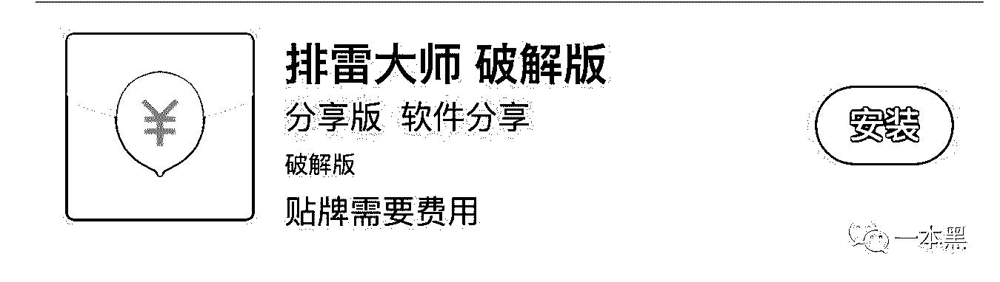

# 探秘微信红包赌博群，新时代赌徒的游乐场！| 宅客频道 × 一本黑

> 原文：[`mp.weixin.qq.com/s?__biz=MzU4ODAwNzUwMQ==&mid=2247483709&idx=1&sn=4f67934925543fc2848b1005baca9241&chksm=fde2101fca9599098a3d49f7dbefc35cdad4fce6f53825b4b5a9034aca846743e15446c74c0e&scene=27#wechat_redirect`](http://mp.weixin.qq.com/s?__biz=MzU4ODAwNzUwMQ==&mid=2247483709&idx=1&sn=4f67934925543fc2848b1005baca9241&chksm=fde2101fca9599098a3d49f7dbefc35cdad4fce6f53825b4b5a9034aca846743e15446c74c0e&scene=27#wechat_redirect)

不好意思因为最近太忙，耽误了这么久，本期专题是我和宅客频道的小伙伴一起做的，我主要是负责数据采集和信息调查，宅客小伙伴妙笔生花。大家看多了我的风格，这次正好换换口味，试试诙谐幽默的文风。

* * *

以下是宅客的正文：

赌场，深藏在闹市中的江湖，每时每刻都有这样的故事上演：穷小子试水走鸿运一夜暴富；万贯家财的富豪输红眼倾家荡产。“芸芸众生，皆为蝼蚁”在这里教人体会个真切，人生的大起大落在这里展现的淋漓尽致。

<inherit></inherit>

<inherit>后来，赌场的概念从澳门、拉斯维加斯转移到了赛博世界。投机主义者将眼光聚焦在微信群上，新的江湖就此滋生暗长。故事的起因是公众号「一本黑」接到粉丝爆料，微信出现红包赌博群，于是联合宅客频道一探究竟。</inherit>

<inherit>素材提供 | 一本黑</inherit>

<inherit>本文作者 | 宅客频道实习小苏</inherit>

<inherit>微信赌场的揽客手段</inherit>

<inherit>想探秘微信赌博群，先要找到一个赌博群。</inherit>

<inherit>本以为这种违法乱纪的地下活动很难寻觅到门路，结果发现只需稍加搜索信息铺天盖地袭来，简直是生长在阳光下的“光明”产业。微信赌博群的获客渠道主要有以下几种：老玩家带新玩家、QQ 群、贴吧发广告、中介介绍客户。</inherit>

<inherit></inherit>

<inherit>▲  粗制滥造的非主流风 QQ 群广告，加群即可上桌</inherit>

<inherit>中介作为赌博群的掮客，一般会收取平均 150 元左右的担保费，防止有些人抢了红包就跑。</inherit>

<inherit></inherit>

<inherit>▲  皮条客的口吻背后，可能是个带把萌妹</inherit>

<inherit></inherit>

<inherit>▲  无处不在的贴吧中介，庄客通吃的求财掮客</inherit>

<inherit>接着，宅客频道又发现了一个搞赌博红包群推广的网站，四通八达的红包群导航。明码标价，玩法多样，广告设计口味向小额信贷公司小卡片看齐，简单粗暴，粗制滥造的气息浓厚。</inherit>

<inherit></inherit>

<inherit>随便扫了一个二维码竟然是服务号，随后根据自己不同的需要选择不同的客户，进入自己想玩的群。</inherit>

<inherit></inherit>

<inherit></inherit>

接着联系到一名客服，光拉群就收 30 元。如果按一天接待 20 人来算，一个月能收一万八，躺着赚钱到手软。

<inherit></inherit>

<inherit>新时代赌博的游戏规则</inherit>

<inherit></inherit>

扫雷？免死？单尾模式？想正式抱着筹码上赌桌，得先看懂游戏规则，而这类规则对于初出茅庐的新手赌徒来说貌似没那么友好。

<inherit>纷乱庞杂的黑话看的人云里雾里，但实际玩法却并不复杂。</inherit>

<inherit>以上图为例，免死指的就是群主免死，也就是说群主就算中了雷也不必赔付。“10-20 七包 1.5 倍扫雷”的意思是 10 元或者 20 元的红包，分七包发出来。雷就是事先约定好的数字，如果发 20 元的红包，把末尾数是 5 的红包设定为雷，那就是 20/5，抢到红包中了雷就按约定好的 1.5 倍给发包的人钱。一句话简明扼要概括大量信息，炼句功力惊人。</inherit>

<inherit>这里面特殊的情况比如说顺子或者说多人中雷，这个高倍数的额外奖励是群主出的。</inherit>

<inherit></inherit>

<inherit>红包群的玩法实在太多，但都大同小异，就不一一介绍了。</inherit>

<inherit>赌徒的小算盘</inherit>

<inherit>在赌徒思维中，追随游戏规则永远不是最好的选择。</inherit>

<inherit>线下赌场出千被逮到可是要剁手剁脚的，而在赌博红包群的世界里，可以花最低的成本“出千”作弊。所以对于高级赌徒来说，“出千”才是稳赚不赔的买卖。红包群作弊的方法很多，某文库里就有详尽的教人只赢不输的法门。</inherit>

<inherit></inherit>

<inherit>▲ 红包群主提着 40 米长刀找上门来</inherit>

<inherit>懒得看教程，网上还有作弊器售卖。</inherit>

<inherit></inherit>

<inherit></inherit>

<inherit>▲ 类似这样的软件还有很多</inherit>

<inherit>外挂作弊器已经形成一套产业链，软件开发者和代理商依靠卖软件的注册码获利，其中有不少人是鱼目混珠，出售假的注册码，注册码的价格动辄几百上千，所以也就衍生出了破解版。有些软件完全是骗人的，因为行业内诸如此类的软件多不胜数，外行很难分辨孰真孰假。各种广告贴下面跟的好评多数是卖家自己刷的，只是为了引诱他人上当。目前可以确定红包外挂可以秒抢，但是是否有躲避某个特定数字从而”壁垒“，现在还很难确定，不过从目前的分析来看红包外挂并没有其介绍的那么强大，而且也很不稳定。我会继续跟进，如果挖掘到有趣的内容，会再开专题单讲。</inherit>

<inherit>当赌性上来，平日里再温润如玉的谦谦君子也会变成红眼的饿狼，不顾一切把全部家当作为筹码，为自己搏个未来。</inherit>

<inherit>而面对出千者，那些相信“搏一搏，单车变摩托”的“老实人”，最终的结局可能是连拖鞋和底裤都没得穿，而没有人会为他们的单纯无畏埋单。</inherit>

<inherit>“日进斗金”的前戏</inherit>

<inherit>开赌场讲究稳赚不赔，毕竟高风险象征着高收益。“群主”作为红包赌博游戏的最终赢家，没两把刷子怎么日进斗金？</inherit>

<inherit>而“群主”手头的作案工具有二：微信群与机器人。</inherit>

<inherit>先说微信群，这里他们需要的是“不卡群”，就是发红包不会卡的群。腾讯为了限制红包群所以设置了规则，有些群发红包多了就卡，而不卡群就是可以无限发包。</inherit>

<inherit>群主会测试，短时间内发很多个包，没问题就是不卡群。这些群他们以 50-150 的价格从线上线下各种渠道入手，一般都是朋友群、同学群那样存在时间长，活跃度高的群。</inherit>

<inherit>宅客频道了解到，红包群的群主因为高频地拉群发红包，大多数已经被微信冻结了拉群功能、更有甚者连抢红包的功能都被冻结了。所以群主需要四处买群，这些群使用时间比较长，微信的检测会松一些。</inherit>

<inherit>交易接头过程为：群主联系到愿意卖群的人，先进入群里发红包测试，检验没问题之后会把群里的人踢掉，拉自己的赌客。这些人手上需要准备大量的群，因为有的时候微信查的严，一晚上可能就会封好几次群，那么他们就要不断地换群。</inherit>

<inherit></inherit>

<inherit></inherit>

<inherit></inherit>

<inherit>光有微信群远远不够，作为开设赌场的庄家，这相当于刚把场子支好，内里空无一物。</inherit>

<inherit>想要做到有规模自动化的运营则还需要另一个工具：红包机器人。所有的红包赌博基本都是靠机器人操作，自动的发包，自动抢包，自动发奖励，极大节省群主人力。</inherit>

<inherit>这种机器人很多，在淘宝上随便一搜都有一堆。</inherit>

<inherit></inherit>

<inherit>赌客中难免有输了钱气不过叫人来砸场子的情况，他们会雇人“炸群”。“炸群”的意思是在微信群中发一些导致微信群崩溃的文字和代码（想了解关于“炸群”的情报可以看宅客频道这篇文章[《别拦着，我要去炸张小龙的微信群》](http://mp.weixin.qq.com/s?__biz=MzA4ODUxNjIwMg==&mid=2654326234&idx=1&sn=bf854669bc91b9f212a37f8fc4583be0&chksm=8be99edfbc9e17c976ac66570edb2a8bd943238e724fe9b1175460dbb5b757ef1c4f28abc7bf&scene=21#wechat_redirect)）。所以红包机器人还有防炸群的功能，种种贴心的服务让赌场庄家爱不释手。</inherit>

<inherit>为了进行深入探索买了一个卡密试用。借此来寻找数据里的线索。</inherit>

<inherit></inherit>

<inherit>通过域名反查加上简单的社工，我们确定出了其开发者的身份，照片我就不放出来了。。。</inherit>

<inherit></inherit>

<inherit></inherit>

还有自己注册做软件开发的公司。

<inherit></inherit>

<inherit>通过抓取数据、检测服务器、数据包解密的过程花了许多时间，我们对收到的数据进行了分析。房间总共有一万多个，因为频繁的换群，很多群已经不再活动。</inherit>

<inherit>5000+注册用户、机器人有一千个，所有这里真实的购买人大约在一千多个，其他的很多是我这种试用的客户。</inherit>

<inherit>使用机器人首先需要购买积分，每次使用都要消耗一定的积分。这是机器人制作者的收入来源。该机器人平台从今年四月开始运作，至今已经盈利近两百万，最近一个月超百万，</inherit>

<inherit>平台能看到玩家在一百万左右。</inherit>

<inherit></inherit>

<inherit> ▲ 玩家数据</inherit>

<inherit></inherit>

<inherit>▲ 注册的用户--群主</inherit>

<inherit>从数据分析的结果看，赌博是 24 小时全天候在进行，无论哪个时段都有数据产生。而赌博的高峰期是每天晚上 8 点到凌晨 2 点，有管理员不到 20 个。</inherit>

<inherit>一个不愿意透露姓名的圈内人透露：</inherit>

<inherit>“一晚上的流水少的也是三四十万，多的可以达到百万级，一个群主控制着多个赌博群。”这意味着一个群主只要够勤奋，一个月的时间即可轻轻松松在北京二环买一套房！</inherit>

<inherit>但是很有可能会印证那件世界上最悲伤的故事：人没了，钱没花完。就像《人民的名义》中的赵德汉，家里放了几个亿的现金，愣是一分都没动，有比这更痛苦的事情吗？</inherit>

<inherit></inherit>

<inherit>▲ 抱着冰箱哭地鼻涕眼泪流</inherit>

<inherit>---</inherit>

<inherit>如果说古典赌徒的浪漫情怀是“自摸对对胡”的酣畅，那么新时代时髦赌徒的游乐场则是微信红包群的扫雷进宝。</inherit>

<inherit>赌徒不会因为赌的形式改变就金盆洗手，他们只会紧跟时代潮流发掘出更新的玩法，微信表示这回不能背锅。</inherit>

<inherit>在周星驰的电影《唐伯虎点秋香》中，风流如唐伯虎，也被秋香的一句：“麻将牌九掷骰子四色牌你总会一样吧？”所打败，当年尚为年幼的我被赌徒的本性所震撼，并将“知人知面不知心”这一至理谨记于心。</inherit>

<inherit></inherit>

<inherit>纵使唐寅拥有“别人笑我太疯癫，我笑他人看不穿。”的豪放洒脱，也难敌一个赌徒的本能质问。到底是谁更疯癫？谁更看不穿？</inherit>

<inherit>西装配墨镜，一局赚几亿的是电影里的赌神。辛辛苦苦数十载，一夜回到解放前才是大多数赌徒的最后归宿。没有人永远是赌神，十赌九输是最大的谎言，有赌必输才才是现实。</inherit>

<inherit>所以，要相信人间正道是沧桑，就像有首歌唱的：爱 pia～jia！会！ya～</inherit>

<inherit></inherit>

<inherit>-The End-</inherit>

